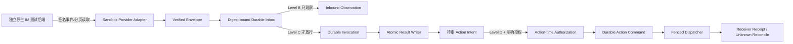

# 原生 IM 提前接入执行计划

> 计划版本：2026-08-28-early-integration-v4
> 基线：`backup_0827_200010` / `pre-native-im-20260827-200010`  
> 当前主线起点：`1d399e555fb0416f9c6225811269b9e5a2407728`  
> 当前执行分支：`mainline_continue_quantum_entanglement`；E2 离线原子页运行节点 `9cf1bfe`
> 当前阶段：E1 / Level A 已完成；E2 / Level B 离线原子 inbox 底座已完成，adapter/lifecycle
> 仍在离线推进，真实 sandbox 尚未连接
> 决策状态：用户已决定提前接入独立原生 IM；先 inbound-only，再 Agent，再受控 outbound  
> 永久限制：不向飞书、企微、任何个人、群聊、bot 或 webhook 发消息

## 1. 目标与“接入完成”的四个层级

提前接入不是把所有安全门禁删掉，而是把真实 sandbox 的 **只读协议验证** 前移，用垂直切片尽早
发现 IM 后端与平台合同的差异。

| 层级 | 可见结果 | 预计累计时间 | 是否真实发送 |
|---|---|---:|---|
| A：CONTRACT_EXECUTABLE（已完成） | V1 模型、codec、golden、fake adapter 全绿 | 已完成 | 否 |
| B：SANDBOX_INBOUND（进行中） | 离线原子 inbox 已建立；adapter/lifecycle 完成并批准后验收 health/read/dedupe/resume | 原估 3–5 天 | 否 |
| C：AGENT_DRAFT | verified inbound 可安全驱动 PURE Agent 并生成待审草稿 | 7–9 天 | 否 |
| D：CONTROLLED_OUTBOUND | 单个 allowlisted 测试 conversation 可受控发送并对账 | 10–14 天 | 仅另行明确授权后 |

用户所说“提前接入 IM”的首个验收点按 **B：SANDBOX_INBOUND** 执行。B 不等待完整 Action Plane，
但入站不得直接触发 Agent、tool、browser、subprocess 或 outbound。

## 2. 不变架构边界



- Provider adapter 只负责边缘协议映射，不拥有任务、权限、Agent 或 Artifact 真相；
- `IMVerifiedInboundEnvelopeV1` 与 digest-bound inbox receipt 是进入平台的唯一可信入口；
- `MentionRouter` 只能读取已验证、已去重的事件，不能直接消费 webhook/stream payload；
- Result Receipt 只证明 Agent 结果被平台接受，不证明 IM 接受消息；
- 通用 `OutboxPublisher` 不直接接 IM，因为其 at-least-once retry 语义不能处理
  `effect_unknown`；
- endpoint、credential、tenant、conversation、capability 不允许由 prompt 或模型选择。

## 3. E0：基线与恢复点

状态：**已完成**。

交付物：

- GitHub 分支 `backup_0827_200010`；
- annotated tag `pre-native-im-20260827-200010`；
- 仓库外完整 Git bundle、SHA-256、`git bundle verify` 与实际 clone smoke；
- `PRE_NATIVE_IM_EARLY_INTEGRATION_CHECKPOINT_2026-08-27.md`；
- 基线、备份分支和标签全部 peel 到 `1d399e555fb0416f9c6225811269b9e5a2407728`。

可停条件：任一 GitHub ref 或离线 bundle 不能精确恢复基线时，不进入 E1。

## 4. E1：把 V1 文档合同变成可执行合同

目标：完成 Level A，整个阶段零网络、零环境 credential、零真实 IM。

状态：**已完成**。`IM-P0 CONTRACT_READY` 仅按 provider-neutral contract/fake 里程碑完成；不代表
真实 IM 已接入。该 E1 证据冻结时 E2 尚未开始；当前 E2 进展见第 5 节，Gate A–E 仍全部关闭。源码证据绑定
`7620200f8e378507b1f592d6d34744080250d2ea`，详见：

- [`../docs/production/NATIVE_IM_P0_CONTRACT_EXECUTABLE.md`](../docs/production/NATIVE_IM_P0_CONTRACT_EXECUTABLE.md)；
- [`research/22_native_im_e1_contract_executable_evidence.md`](./research/22_native_im_e1_contract_executable_evidence.md)。

### 4.1 已交付文件

```text
src/quantum_entanglement/native_im.py
src/quantum_entanglement/_native_im_codec.py
src/quantum_entanglement/native_im_gateway.py
src/quantum_entanglement/native_im_fake.py
tests/fixtures/native_im/v1/*.json
scripts/verify_native_im_v1_golden.py
scripts/verify_native_im_zero_network.py
tests/test_native_im_codec_primitives.py
tests/test_native_im_contract.py
tests/test_native_im_contract_matrix.py
tests/test_native_im_fake.py
tests/test_native_im_gateway.py
tests/test_native_im_golden_vectors.py
tests/test_native_im_zero_network_gate.py
```

V1 值模型保留在单一 `native_im.py` 以避免在冻结期进行无证据目录重构；codec、port 和 fake 已按
信任边界拆开。后续如果按 V2 或独立审查单元拆包，必须保持 V1 import/bytes/digest 兼容并先增加
迁移与跨模块 golden 证据。

### 4.2 已执行的小提交顺序

1. plain scalar、NFC/control、timestamp、signed-64-bit 和 digest primitives；
2. conversation/participant/attachment/message segment/content/ref；
3. reaction、membership、inbound event 与 verified envelope；
4. capability request/snapshot/operation/acceptance lookup；
5. inbound read request/page/cursor pair；
6. Action Intent/Command/Dispatch Request；
7. Action Receipt/Unknown Observation/Acceptance Query；
8. exact `to_dict/from_dict` 与 unknown/missing/type rejection；
9. canonical bytes/digest 和 idempotency key derivation；
10. frozen golden vectors；
11. `IMGatewayPort` 与 fake inbound/capability；
12. fake outbound 的进程本地 permit、receiver idempotency 与 ACK-loss/query；
13. import graph、socket/DNS/HTTP/WebSocket 和 environment credential canary；
14. E1 文档、测试证据、GitHub 回读和阶段末 Notion 同步。

第 1–13 项已按独立提交完成；第 14 项正在本阶段收尾提交中。关键收口提交为：golden
`d97807d`/`b6bd184`、port `fc6fea2`、fake `dfe9a33`、permit `4283e46`、receiver ledger
`c4b376e`、ACK-loss `889c409`、zero-network `72c7ca5`/`7620200`、完整矩阵 `af58352` 和 full
pytest gate `2295d08`。

### 4.3 验收矩阵

- exact plain dict/JSON；unknown、missing、subclass、bool-as-int 全拒绝；
- NFC、surrogate、C0/DEL、LF/HT、byte length、collection/node/depth 上限；
- 所有 scope、identity、revision、segment、attachment、action、receipt 字段参与对应 digest；
- mention segment 顺序、重复 mention、相邻 text 非 canonical；
- page sequence/snapshot/resume pair/duplicate ID/16 MiB 总上限；
- Receipt 六态 required/optional/forbidden 矩阵；
- timeout/crash-after-send 只产生 unknown observation，不能自动 re-dispatch；
- fake outbound 默认 disabled，permit 不能序列化或从配置构造；
- Python 3.9/3.12/3.13 focused tests、仓库全量测试、Ruff、format、strict mypy 全绿。

可停条件：任一模型语义需改变冻结 wire contract 时停止，提出 V2；不能用实现便利悄悄改 V1。

本次没有触发 V2：冻结文档保持不变。23 个 golden vector 是代表性正向 inventory，不单独覆盖
全部 union arm；完整 event/revision/scope/mention/digest 状态由参数化 contract tests 覆盖。专项
共收集 271 tests；全仓在 Python 3.13/3.12 各 1,775 tests 通过，Python 3.9 通过并保留一个既有
platform-capability skip；Ruff、strict mypy、golden、Python 3.9/3.12 zero-network 和 5/5 canonical
local release evidence 均通过。

## 5. E2：提前接入 sandbox inbound-only

目标：完成 Level B，只连接独立 IM 的专用测试后端，不驱动 Agent，不注册 outbound。

状态：**离线原子 inbox 底座已完成；Level B 仍在进行中**。截至运行源码 `9cf1bfe`，exact
provider profile、inbound-only config/secret reference、raw-body verifier、migration 5 六表、durable
nonce、exact-request read preparation，以及 nonce + verified page + event/verification/link rows + read
CAS + checkpoint + 独立 readback 的同事务 admission 均已实现。当前仓库仍没有真实 provider
adapter、credential material、webhook、socket、HTTP/WebSocket client 或 external IM send。下一 P0
是 default-off inbound-only adapter/lifecycle、bounded parser、kill switch、safe logging 和 fake contract
probe；详见
[`research/24_native_im_e2_atomic_page_admission_evidence.md`](./research/24_native_im_e2_atomic_page_admission_evidence.md)。

### 5.1 IM 后端必须提供的输入

- 测试环境 base URL / transport 类型，以及 health/read/stream 路径；
- 测试 tenant、workspace、channel/conversation、账号和稳定 ID 作用域；
- webhook/stream/read 的认证、签名、timestamp、nonce 和 replay 规则；
- event schema/version、排序范围、cursor、snapshot 和断点恢复语义；
- 请求限流、Retry-After、最大 payload、附件引用和错误分类；
- 测试 credential 的 secret reference；完整 secret 不进入文档、日志、Git 或普通回复；
- sandbox 截止时间、维护人、kill switch 和回退联系人。

缺少的能力必须由 provider profile 明确标成 unsupported/unknown；adapter 不猜。

### 5.2 已新增与仍待新增文件

```text
src/quantum_entanglement/native_im_inbox.py
src/quantum_entanglement/native_im_auth.py
src/quantum_entanglement/native_im_nonce_store.py
src/quantum_entanglement/native_im_provider_profile.py
src/quantum_entanglement/service/native_im_config.py
src/quantum_entanglement/service/native_im_secrets.py
src/quantum_entanglement/migrations/0005_native_im_inbox.up.sql
src/quantum_entanglement/migrations/0005_native_im_inbox.down.sql
tests/test_native_im_auth.py
tests/test_native_im_inbox_contract.py
tests/test_native_im_nonce_store.py
tests/test_native_im_prepared_read_store.py
tests/test_native_im_page_admission_store.py
tests/test_native_im_provider_profile.py
tests/test_native_im_sandbox_config.py
tests/test_native_im_inbox_migration.py
```

上列是已交付文件。Page admission 原子边界已完成；`native_im_sandbox.py`、adapter/transport
contract tests、sandbox runbook 和 approval template 现在是下一离线节点。

Provider-specific mapping放在独立 adapter 模块，不写回 provider-neutral value types。

提前接入改变了原 migration 排序：编号现在冻结为 `0005_native_im_inbox`、
`0006_atomic_invocation_results`、`0007_native_im_actions`。ADR 编号
`ADR_0005_ATOMIC_RESULT_AUTHORITY` 是架构决策编号，不随 SQL migration 序号改变；相关计划、
topology、backup/restore inventory 必须在注册 `0005` 前同步更新。

### 5.3 小提交顺序

1. **已完成**：provider profile exact schema 与 unsupported capability 表；
2. **已完成**：sandbox config 的 HTTPS/host/port/path allowlist、no redirect、credential `SecretRef`；
3. **已完成**：signature/timestamp verifier、raw-body digest、deferred nonce verification 与同事务
   nonce claim；
4. **已完成**：`(tenantId, workspaceId, provider, channelId, eventId)` durable inbox 唯一键与事务内
   canonical event 写入；
5. **已完成**：`eventDigest` immutable binding、verification/link rows 与独立 durable readback；
6. **已完成**：verified envelope + nonce + inbox receipt 原子 admission；
7. **已完成**：整页 envelopes、page/snapshot binding、read CAS 与 cursor checkpoint 同事务提交；
8. **已完成**：cursor/snapshot/resume、read preparation、page admission、ACK-loss reopen 和 exact
   reconciliation；
9. **下一 P0**：inbound-only adapter skeleton、feature flag 与默认无 transport composition；
10. **待完成**：bounded page/stream parser、disconnect/resume 和 duplicate/conflict；
11. **已完成**：migration registration、upgrade/downgrade、backup/restore 和 topology inventory；
12. **待完成**：message-body-safe logging、secret canary、metrics/trace；
13. **待完成**：kill switch、startup preflight、health/ready 与 graceful close；
14. **待完成**：fake contract probe；
15. **待完成**：修订 `SERVICE_BOUNDARY.md`，只放行批准记录中的 sandbox read；
16. **待批准后完成**：真实 sandbox health/read/dedupe/resume 验收；
17. **阶段末**：Level B 证据、GitHub 回读和 Notion 同步。

### 5.4 Level B 通过条件

- endpoint/tenant/account/conversation 均为预登记测试对象；
- 数据为非敏感合成数据，outbound allowlist 为空；
- invalid signature、expired timestamp、nonce replay、digest conflict 全部失败关闭；
- 同一完整 scope + `eventId` 只能绑定一个 `eventDigest`；整页 admission 与 cursor checkpoint
  不得出现可观察的半提交；
- page COMMIT ACK 不明时，重开后必须按 `readRequestDigest` 对账整页与 checkpoint，不能直接读取
  下一页；
- duplicate/out-of-order/disconnect/cursor resume 不丢失 accepted event，也不重复 admission；
- 入站只形成可审计 observation，无法调用 `MentionRouter`、Agent、tool 或 connector；
- inbound adapter 的 `dispatch/query_acceptance` 必须在检查业务请求或读取 secret 前稳定失败；读取
  credential 本身只有 inbound read 权限，transport 只允许登记的 health/read 方法与路径且不跟随
  redirect；
- kill switch 关闭后不再 admission，重启仍可从 durable cursor 安全恢复；
- 日志、错误、event、Artifact、trace、测试证据中没有 credential canary 或完整消息正文；
- 精确 commit/tree、配置摘要、回退命令和已验证 endpoint class 已记录。

可停条件：后端不能提供可信事件认证、稳定 event ID/digest 或可恢复 cursor 时，不连接真实事件流；
只保留 fake/fixture 和 contract probe。

## 6. E3：从 verified inbound 到 Agent 待审草稿

目标：完成 Level C。入站可以驱动审核过的 PURE Agent，但只产生 Artifact/草稿，不发送。

### 6.1 实现块

1. private stored-event envelope codec 与 durable raw-row readback；
2. reserved result event fence；
3. Result/Artifact/receipt/attempt/job/task terminal state same-transaction primitives；
4. `0006_atomic_invocation_results` migration、topology、backup/restore 与 rollback evidence；
5. Atomic Result Writer 与 `fresh | observed | unknown` 分类；
6. ACK-loss/reopen/peer-process/conflict/partial-graph recovery；
7. heartbeat-supervised PURE worker，spawn/exec-before-secret-load；
8. verified inbox receipt 到 durable invocation 的独立单向 bridge；
9. bridge 使用 `native-im-event:<eventDigest>` 作为 invocation idempotency，传播 event
   correlation、以 event ID 作为 causation、原样传播 traceparent，并按有序 mention segment 与
   scope-bound roster 解析；
10. Agent 输出只形成 pending Artifact 与 `IMActionIntentV1` 草稿；
11. UI/API 显示来源 event、result receipt、草稿和“未发送”。

### 6.2 硬检查

- 双 worker 竞争只有一个 fresh acceptance；
- stale/expired/fenced worker 无法接受迟到结果；
- heartbeat 首次成功前不调用 handler，COMMIT 前不停止 heartbeat；
- crash/restart/replay/reopen 不重复运行已接受 handler；
- handler 无 connector、browser、subprocess、网络或直接数据库能力；
- Result Receipt 无法被升级为 send authority；
- inbound event 到 Artifact/草稿的 correlation/causation 全链可回读。

可停条件：Atomic Result Writer 未闭合时，Level B observation 不进入 Agent。

## 7. E4：Fake-only Action Plane

目标：完成 outbound 的持久事实层，但仍不连接真实 IM send。

小提交顺序：

1. `0007_native_im_actions` 的 inactive Action Command/Receipt schema 与 migration evidence；
2. action-time authorization exact request/result；
3. Intent -> durable Command 的 scope/capability/policy CAS；
4. transactional outbox identity 与 stable receiver idempotency key；
5. IM 专用 fenced fake dispatcher；
6. `succeeded | rejected | effect_unknown | needs_you` receipt 持久化；
7. acceptance query、authoritative negative evidence 和 reconcile；
8. 429/Retry-After 的 bounded retry；
9. ACK-loss、kill-after-send、stale fence、conflicting receipt、DLQ 故障矩阵；
10. UI/API 状态与人工处置入口；
11. migration/backup/restore/rollback evidence；
12. GitHub 回读和阶段末 Notion 同步。

可停条件：没有 receiver receipt 时只能 `effect_unknown`；任何代码路径尝试盲重发都阻断晋级。

## 8. E5：单会话受控 sandbox outbound

目标：完成 Level D。只有达到 E1–E4，且用户针对具体测试环境再次明确授权后才执行。

放行记录必须写明：

- endpoint class 和证书/服务身份摘要；
- 测试 tenant、账号、单个 conversation allowlist；
- 允许的 operation，初始仅 `send_message`；
- 合成消息正文、次数上限、速率上限和截止时间；
- idempotency retention、acceptance query mode 和 negative finality；
- 操作人、观察人、kill switch、回退和异常联系路径。

固定联调顺序：

```text
outbound dry-run
  -> one authorized command
  -> one fenced dispatch
  -> receiver receipt readback
  -> duplicate replay proves no second effect
  -> simulated ACK-loss query/reconcile
  -> kill switch
```

飞书、企微、生产用户、真实客户、公开群聊和未列入 allowlist 的 conversation 永久不在这次
sandbox 批准范围内。

## 9. 提交、分支、测试与同步纪律

- 本地开发保持 red→green；每个推送到 `main` 的小 commit 都必须 focused tests 通过、功能
  default-off 且可独立回退。测试与最小实现可同一 commit，或先提交不会让门禁变红的 fixture/
  contract inventory；
- 高风险 codec、inbox、Atomic Result Writer、dispatcher 分别做独立 adversarial review；
- 短生命周期 worktree 统一放在
  `/Users/lwblx/huapohen/agent/execute/infinite/worktrees/quantum_entanglement/` 下，合并后推 main
  并删除本地/远端活动分支；
- `backup_0827_200010` 永不追加提交；新阶段需要恢复点时新建 `backup_MMDD_HHMMSS`；
- 每个稳定阶段结束执行当前评审分支 GitHub push、远端 SHA 回读、分支目录刷新、report sync
  checkpoint；用户验收前不自动合并 `main`；
- Notion 按 E1/E2/E3/E4/E5 阶段末批量同步并逐页回读，不再阻塞每个小 commit；
- 任何测试不得连接飞书、企微、真实聊天、未登记 endpoint 或使用真实客户数据。

最小静态/测试门禁：

```bash
python3 scripts/verify_dependency_locks.py --repository-root .
ruff check src tests scripts
ruff format --check src tests scripts
PYTHONPATH=src mypy --strict src/quantum_entanglement
python3 -m pytest
./scripts/update_branch_catalog.sh --check
python3 scripts/report_sync_bundle.py --verify <current-checkpoint.json>
```

## 10. 下一轮开工清单

E1 文档、GitHub 和 Notion 已收口；E2 单事务 page admission 与完整 fault/tamper/replay 矩阵已在
运行源码 `9cf1bfe` 完成。接下来按以下顺序继续：

1. 实现 default-off inbound-only adapter/transport skeleton，默认不能解析 endpoint、credential 或
   打开 socket；
2. 实现 bounded parser、disconnect/resume fixture、kill switch、startup/health/ready/graceful close；
3. 实现 message-body-safe logging、secret canary、metrics/trace allowlist 和 fake contract probe；
4. 只有 sandbox endpoint class、测试 scope、数据等级、read-only credential reference、方法路径和
   截止时间获批后，才执行 health/read/dedupe/resume；
5. Level B 始终只产生 observation，机械阻断 Agent、tool、browser、subprocess 和 outbound。

缺少真实 sandbox 参数不会影响 E1 已完成结论，但会阻止 E2 的实际网络连接。任何 outbound 仍须
等 E3/E4 完成后针对单一测试环境另获明确授权。
