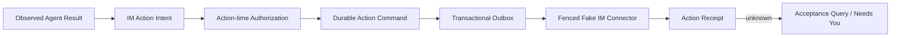

# 原生 IM 接入前必做事项与接入后 TODO 分界

> 决策版本：2026-08-28-native-im-entry-v4
>
> 适用仓库：`quantum_entanglement`
>
> 当前执行分支：`mainline_continue_quantum_entanglement`
>
> E1 源码证据：`7620200f8e378507b1f592d6d34744080250d2ea`
>
> E2 原子页 admission 运行证据：`9cf1bfebe33fd5efae2933bc82027275b3313696`
>
> E2 adapter/lifecycle 离线运行证据：`2bdaea1adddcfb3033b4678766f635d7afc242fc`
>
> E2 provider bundle 离线闭环证据：`ee0666fe3e956234cbd653abd0ea57bdba322cb7`
>
> 决策性质：原生 IM 接入的执行顺序与验收边界；不是生产发布批准
>
> 安全边界：本文不授权向飞书、企微、原生 IM 或任何个人、机器人、群聊、bot、webhook
> 发送消息。真实测试环境写入必须另获用户明确授权。

> **2026-08-27 提前接入调度修订：** 用户已决定把独立 IM 专用沙箱的 inbound-only 合同验证
> 前移。当前执行顺序改由
> [`NATIVE_IM_EARLY_INTEGRATION_PLAN.md`](./NATIVE_IM_EARLY_INTEGRATION_PLAN.md) 定义：完成
> strict codec、verified/digest-bound durable inbox、只读权限机械隔离和 sandbox 批准记录后，可在
> `IM-P1`/`IM-P2` 全部闭合前进行 health/read/dedupe/resume。此修订不允许入站驱动 Agent，也不
> 允许任何 outbound；Agent draft、Action Plane 和受控发送仍分别按后续门禁推进。

> **2026-08-28 E1 收口：** E1 / Level A `CONTRACT_EXECUTABLE` 已完成，内部
> `IM-P0 CONTRACT_READY` 只按 provider-neutral contract/fake 里程碑完成。真实 provider profile、
> adapter、endpoint、credential 和 sandbox inbound 当时均未开始；完整 E1 证据见
> [`research/22_native_im_e1_contract_executable_evidence.md`](./research/22_native_im_e1_contract_executable_evidence.md)。

> **2026-08-28 E2 原子页 admission：** exact profile/config/secret reference、raw-body verifier、
> migration 5 六表、durable nonce/read preparation，以及 nonce + verified page +
> event/verification/link rows + read CAS + checkpoint + 独立 readback 的单事务 admission 已推进到
> `9cf1bfe`。真实 sandbox 参数和网络仍未介入；该节点当时的下一硬门禁是 default-off inbound-only
> adapter/lifecycle、bounded parser、kill switch、safe logging 与 fake contract probe。证据见
> [`research/24_native_im_e2_atomic_page_admission_evidence.md`](./research/24_native_im_e2_atomic_page_admission_evidence.md)。

> **2026-08-28 E2 adapter/lifecycle 离线节点：** default-off composition、显式 inbound-only
> adapter、bounded parser、process-bound lifecycle/kill switch、typed observability、全链 canary、
> recorded disconnect/resume/duplicate/out-of-order/conflict probe、取消/关闭恢复和 zero-network gate
> 已推进到 `2bdaea1`。真实 provider transport/mapper、批准记录和 sandbox 网络仍未介入；证据见
> [`research/25_native_im_e2_adapter_lifecycle_offline_evidence.md`](./research/25_native_im_e2_adapter_lifecycle_offline_evidence.md)。

> **2026-08-28 E2 provider bundle 离线闭环：** approved profile/config/manifest、Mapper TCK、
> Transport TCK、zero-network exchange、稳定 event-source 与 transient read-exchange evidence 分离、
> 增强 admission provenance、migration-v6 durable readback 和 bundle-to-atomic-admission 已推进到
> `ee0666f`。真实 provider contract/scope/production exchange 和 sandbox 网络仍未介入；证据见
> [`research/26_native_im_provider_bundle_offline_evidence.md`](./research/26_native_im_provider_bundle_offline_evidence.md)。

## 1. 最终决策

不采用以下两个极端方案：

1. **不等待当前 `NEXT_STAGE_PLAN.md` 的 Phase 1–8 全部按最高强度完成后才开始 IM。**
   该计划主要闭合 Atomic Result Authority，不能替代 IM 的 Action Receipt、receiver acceptance
   和 provider-specific contract。等待完整 M8 会推迟关键产品反馈，但仍不会自动得到可安全发送
   的 IM 链路。
2. **不把当前代码直接接到真实 IM 并允许 Agent 自动回复。** 当前 worker dispatch 仍默认关闭，
   result writer、durable action receipt、authenticated service composition 和
   `effect_unknown` reconcile 尚未闭合，直接接入会把重复、丢失和未知效果混在一起。

采用下面的垂直切片路线；第一步已经完成：

```text
已完成 provider-neutral IM contract + zero-network fake
    -> 闭合精简 Result Authority
    -> 启用 PURE/fake heartbeat worker
    -> 闭合 Action Command/Receipt
    -> fake IM authenticated E2E
    -> 介入原生 IM 专用沙箱
    -> 联调后再完成私有试点、商用与 GA TODO
```

原路线把 `IM-P3 SANDBOX_READY` 作为所有真实网络介入的唯一前置。提前接入修订后，只有
**sandbox inbound-only observation** 可按新计划的 Level B 前移；让入站驱动 Agent 或开放任一
outbound 仍不得借此绕过 `IM-P1`、`IM-P2` 及对应的 action-time authorization/Receipt 门禁。
无论哪条路线，都不要求先通过 Gate C–E，也不要求先完成 PostgreSQL、HA/Kubernetes、完整商用
容量和供应链晋级。

这里的“介入原生 IM”特指：连接独立 IM 后端的专用测试环境，用测试 tenant、测试账号、测试
conversation 和非敏感合成数据完成真实网络端到端联调。它不等于接入生产数据、开放公网、
邀请真实客户或授权自动对真实用户发言。

## 2. 本次复核依据

### 2.1 已有能力，不应重复建设

当前主线已经具备以下可复用底座：

- provider-neutral `InboundChatMessage`、`MentionRouter` 和 canonical coordination envelope；
- transactional inbox/outbox、outbox lease/fencing、bounded Publisher、retry、DLQ 和 ambiguity
  记录；
- invocation admission，以及 job/attempt/start event 的原子首次 claim；
- 原生 IM nonce、verified page、event/verification/link rows、read CAS 与 checkpoint 的单事务
  admission、ACK-loss 重开对账和 durable graph 独立 readback；
- 原生 IM default-off composition、显式 inbound-only adapter、bounded parser、process-bound
  lifecycle/kill switch、typed observability、全链 canary 与 recorded contract probe；
- durable attempt、heartbeat、lease expiry、epoch fencing 和 stale-owner terminal CAS 原语；
- tenant/workspace-scoped Artifact store；
- Result Acceptance Request、Evidence、Terminal Transition、ReceiptV2 和 capability-free
  ObservedV2 纯值契约；
- authorization、strict config、SecretRef/SecretProvider、redaction 和 backup/migration 基础组件。

因此，IM 接入不应另建第二套任务队列、第二套 outbox、第二套 Agent 协议或让 connector 直接调用
模型。需要做的是组合和补齐，不是推翻内核。

### 2.2 真实阻断

E1 已关闭 provider-neutral wire/port/fake 缺口，E2 又关闭了离线 provider bundle 的组合缺口。
当前阻断要分两组，不能继续全部算成 Level B 前置：

**Level B inbound-only 的直接阻断：**

1. 真实 IM 后端尚未提供并冻结 provider contract：稳定身份、认证、事件 schema、cursor/snapshot、
   限流、错误和维护窗口仍未知；
2. 测试 endpoint class、tenant/workspace/channel/conversation allowlist、合成数据等级、read-only
   `SecretRef`、审批人、截止时间和 kill switch 尚未冻结；
3. 尚无真实 provider profile/mapper golden 和 production exchange 的 DNS/TLS/IP/redirect/timeout/
   body-limit/credential 实现与 TCK 证据。

**只阻断 Level C Agent draft / Level D outbound，不阻断 Level B observation：**

1. result/artifact/attempt/task terminal state 尚未由一个 store-owned transaction 原子接受；
2. heartbeat worker 只有冻结合同，dispatch 明确为 disabled；
3. 没有 durable Action Command/Receipt 及 `effect_unknown` reconcile；
4. 服务级 SIGTERM/drain 与 outbound authenticated composition 尚未闭合。

因此 Level B 可以在前三项 provider-specific 阻断关闭后提前接入；它只形成 durable observation，
不得驱动 Agent 或 outbound。其余工作按 E3/E4 顺序继续，不再混成无限前置清单。

## 3. 四级接入里程碑

| 里程碑 | 允许做什么 | 禁止做什么 |
|---|---|---|
| `IM-P0 CONTRACT_READY`（provider-neutral/fake 已完成） | 冻结接口；实现 fake/fixture；生成契约测试 | 连接真实 endpoint、发送消息 |
| `IM-P1 CORE_READY` | 本地 PURE/fake Agent 经 durable worker 完成任务 | connector 外部副作用 |
| `IM-P2 ACTION_READY` | fake connector 完成 action receipt/unknown/reconcile | 原生 IM 网络写入 |
| `IM-P3 SANDBOX_READY` | 介入原生 IM 专用沙箱，先入站、后受控出站 | 生产 conversation、真实客户、公开发送 |

`IM-P*` 是项目内部集成里程碑，不是 `RELEASE_GATES.md` 的生产 Gate，不得借其名称宣称 Gate
A–E 已通过。

## 4. 接入前必做：IM-P0 CONTRACT_READY

状态：**已完成，但只按 provider-neutral contract/fake 范围。** V1 wire、strict codec、golden、
四方法 port、纯 admission、默认拒绝的 zero-network fake、receiver ledger 和 ACK-loss/query 故障
语义已经执行化。真实 provider profile 和 adapter 仍属于 E2 输入，不得用本节完成状态宣称已接
真实 IM。

### 4.1 冻结 IM 后端合同

IM 后端必须提供或明确拒绝以下能力，未知不能由 connector 自行猜测：

- 稳定的 `tenant_id`、`workspace_id`、`channel_id`、`conversation_id`、`thread_id`、
  `participant_id`、`message_id` 和 `event_id`；
- ID 的作用域、大小写、规范化、长度、字符集、是否可复用及删除后语义；
- 入站事件 schema/version、稳定去重键、顺序范围、cursor 和断点续传方式；
- webhook/stream 的认证、签名算法、timestamp window、nonce 和 replay 防护；
- outbound `action_id` 与 `idempotency_key` 的接收和保留期限；
- receiver 返回的 `operation_id`、`provider_message_id`、ACK/NACK 和终态错误；
- 按 `action_id`、`idempotency_key` 或 `operation_id` 查询 receiver acceptance 的接口；
- 429/5xx/timeout/validation/authorization 的重试分类及 Retry-After 语义；
- edit/delete/reaction/mention/thread/attachment 的能力与版本/CAS 语义；
- 附件 immutable reference、下载授权、MIME、大小、数量、过期和恶意内容处理；
- `request_id`、`correlation_id`、`causation_id`、trace context 的透传；
- 服务身份、scope，以及 connector 执行时重新授权所需的输入。

如果 receiver 不支持幂等接受或 acceptance 查询，该能力不是接入阻断，但必须在 capability 中明确
标为 `at_least_once_only`。该情况下，任何发送超时或 ACK 丢失都必须进入 `effect_unknown`，不能
自动盲重试，也不能宣称 exactly-once。

上述问题已经编码进 provider-neutral capability、request、receipt 和 query 模型，但某个真实
provider 的答案尚未取得。E2 必须形成版本化 provider profile；未知项标成 unsupported/unknown，
不能把 fake capability 当作真实后端保证。

### 4.2 冻结平台侧 provider-neutral contract

至少定义以下 exact/versioned 模型，provider adapter 只能在边缘做映射：

- `InboundIMEventV1`
- `IMConversationRefV1`
- `IMParticipantRefV1`
- `IMMessageRefV1`
- `IMCapabilitySnapshotV1`
- `IMActionIntentV1`
- `IMActionCommandV1`
- `IMActionReceiptV1`
- `IMAcceptanceQueryV1`

统一状态不得退化成一个 `success: bool`：

```text
proposed
  -> authorized
  -> queued
  -> dispatching
  -> succeeded | rejected | effect_unknown
effect_unknown
  -> reconciled_succeeded | reconciled_rejected | needs_you
```

### 4.3 P0 验收条件

- [x] 合同字段、状态机、错误和能力协商形成冻结 V1 文档与 executable model/codec；
- [x] 23 个代表性 positive golden vectors 覆盖主要 inbound/outbound/receipt/query 模型；ACK、NACK、
  unknown、reconcile 和全部 union/state 矩阵由参数化 contract tests 补足；
- [x] provider-neutral `IMGatewayPort` 已冻结为 exact 四方法；fake 和当前 generic inbound-only
  adapter 均实现该 port；真实 provider transport/mapper 尚未开始，E2 不能新建旁路；
- [x] 仓库没有真实 connector 注册或网络配置；普通 fake outbound 在检查请求前默认拒绝，只有
  进程本地、不可序列化 test permit 能产生内存 fake effect；
- [x] 没有真实 credential、endpoint、cookie 或 token 进入源码、测试、报告和 Git；
- [x] 合同评审不依赖向飞书、企微或任何群聊发消息询问。

P0 关闭证据：Python 3.9/3.12 zero-network 通过，专项 271 tests 通过，golden verifier 23/23，
全仓 1,775 tests（Python 3.13/3.12）通过，canonical local release evidence 5/5 且 source
identity stable。生产说明见
[`../docs/production/NATIVE_IM_P0_CONTRACT_EXECUTABLE.md`](../docs/production/NATIVE_IM_P0_CONTRACT_EXECUTABLE.md)。

## 5. 接入前必做：IM-P1 CORE_READY

### 5.1 精简 Result Authority

以下属于硬前置：

- reserved result event fence，generic append 不能伪造 canonical result completion；
- canonical stored-event envelope 和 durable raw-row readback；
- result schema 与 Artifact same-transaction primitives；
- Atomic Result Writer：result、Artifact、receipt、attempt、job、task terminal state 和必要 outbox
  全部同事务；
- exact replay、peer process、reopen 和恢复只观察已有结果，不重复运行 handler；
- COMMIT ACK 丢失时进入 ambiguity/quarantine，重开后完整验证；
- stale/expired/fenced worker 不能接受结果；
- partial graph、scope drift、Artifact head drift 和 conflicting duplicate 全部失败关闭。

接入前不要求完成以下极限加固：

- 把 `AcceptedV2` 设计成可被下游消费的权限令牌；
- 与产品无关的所有 reflective tampering、GC identity reuse 和 pickle protocol 组合；
- 每个支持 Python 版本的完整 hostile mutation 笛卡尔积；
- 正式 fleet floor、历史生产数据库 downgrade 和 GA backup topology。

但必须保留 `fresh | observed | unknown` 的内部结果分类。Action 层不得接受该分类作为授权；Action
必须重新进行 action-time authorization。

### 5.2 PURE/fake heartbeat worker

- worker 必须从 durable scoped claim 启动，而不是从 caller 对象或内存队列启动；
- worker 与 secret/store/connector 使用 spawn/exec-before-secret-load 拓扑；
- 第一次 heartbeat 成功后才能调用 handler；
- heartbeat 持续到 result transaction COMMIT 完成；
- lease lost、timeout、cancellation、shutdown、process mismatch 后禁止接受迟到结果；
- handler 仅允许审核过的 `PURE + retryClass=never` revision；
- handler 不持有 connector、browser、subprocess、任意网络和直接数据库能力；
- crash/restart 后若 result 已接受，不得再次运行 handler。

### 5.3 P1 验收条件

- [ ] atomic result transaction fault matrix 通过；
- [ ] ACK-loss/reopen/peer-process matrix 通过；
- [ ] 双 worker 竞争只有一个能接受结果；
- [ ] heartbeat、lease expiry、timeout、cancellation 和 SIGTERM drain 通过；
- [ ] fake handler 可以形成可回读 Artifact 和 terminal receipt；
- [ ] 默认配置仍无法触达任何外部 connector。

## 6. 接入前必做：IM-P2 ACTION_READY

### 6.1 Action 与 Result 必须分离

Agent Result Receipt 只能证明 Agent 结果被平台接受，不能证明 IM 已接收消息。必须建立独立
Action Plane：



### 6.2 Action Command/Receipt 硬要求

- Command 冻结 tenant/workspace、actor/delegator、conversation、operation、内容摘要、附件引用、
  approval/authorization revision、policy revision、capability snapshot 和 correlation graph；
- action-time authorization 默认拒绝，身份过期、membership/revision 漂移必须拒绝；
- Command、Outbox identity 和初始 Action Receipt 状态持久化；
- connector 只能消费 store-owned command，不接受模型自由生成的 endpoint、credential 或 scope；
- receiver idempotency key 必须从稳定 `action_id` 派生，retry 不能创建新 action；
- ACK 正常返回且 receipt 校验通过才能标记 `succeeded`；
- timeout、连接中断、worker crash-after-send、响应解析失败进入 `effect_unknown`；
- `effect_unknown` 只能查询/对账，不能重新运行 Agent，也不能无界重发；
- reconcile 无法确定时进入 `needs_you`；
- Connector exception、消息正文、credential 和 active lease 不进入普通日志。

### 6.3 Fake Connector 必测故障

- duplicate inbound event；
- out-of-order inbound event；
- cursor reconnect；
- connector 拒绝前未产生 effect；
- receiver 接受后 ACK 丢失；
- send 后 worker 崩溃；
- 429 + Retry-After；
- bounded retry 后 DLQ；
- stale lease ACK/NACK；
- conflicting receipt；
- acceptance query 成功、拒绝、未知和不可用；
- 相同 action 重放不产生第二个 accepted receiver effect。

### 6.4 P2 验收条件

- [ ] Action Command/Receipt schema 和 migration 可在临时测试库启用；
- [ ] result acceptance 与 action creation 的 crash gap 有稳定 idempotency/reconcile；
- [ ] fake connector 全故障矩阵通过；
- [ ] UI/API 明确显示 `succeeded | rejected | effect_unknown | needs_you`；
- [ ] 默认策略为 no-send，测试也无法解析到真实 IM endpoint；
- [ ] action receipt 永不由 Agent narration 或 Result Receipt 伪造。

## 7. 接入前必做：IM-P3 SANDBOX_READY

E2 离线准备状态：default-off adapter、bounded parser、atomic admission、kill switch、typed safe
logging、canary 和 recorded probe 已完成。以下 P3 条目仍按真实 service/provider E2E 口径验收，不能
因为离线测试通过而提前勾选。

### 7.1 最小服务组合

- authenticated loopback 或隔离测试 API；
- 每个请求绑定可信的 sandbox tenant/workspace/channel context；
- inbound payload、深度、附件、并发和 stream buffer 有界；
- resumable event stream，断线后无 gap、无 accepted-event duplicate；
- `/livez`、`/readyz`、startup preflight 和 dependency health；
- SIGTERM：停止 admission、drain worker、释放 lease、保留 unknown；
- connector/worker/store/secret/issuer 进程拓扑明确且不继承 live authority；
- typed safe logging、security audit 与业务 event 分层；
- 全链 `request -> inbound message -> invocation -> result -> action -> provider receipt` 可追踪。

### 7.2 专用沙箱边界

- 只允许预登记的 IM 测试 endpoint、测试 tenant、测试账号和测试 conversation；
- 数据只使用非敏感合成内容；
- outbound allowlist 默认为空；
- 首次原生联调顺序固定为：contract probe -> health -> inbound read -> inbound dedupe/resume ->
  outbound dry-run -> 单个 allowlisted conversation 的受控 send；
- 任何真实 send 仍需用户针对该测试环境的明确授权；
- 不复用飞书、企微或个人聊天凭据，也不向其中任何对象发送测试消息；
- feature flag/kill switch 能即时关闭 admission 和 outbound，不删除 durable evidence。

### 7.3 P3 最终接入前验收

- [ ] P0、P1、P2 所有硬检查项通过；
- [ ] authenticated fake-IM E2E 通过；
- [ ] duplicate、disconnect、ACK-loss、kill-after-send 和 graceful shutdown E2E 通过；
- [ ] secret canary 在源码、日志、事件、Artifact、error、trace 和 release evidence 中为零；
- [ ] 有 clean source commit/tree、精确测试命令、失败边界和回退步骤；
- [ ] 工作区 clean，变更已推送并从远端读回 SHA；
- [ ] readiness 仍诚实显示 Gate A–E 的实际状态；
- [ ] 在真正连接原生 IM endpoint 前，单独修订 `docs/production/SERVICE_BOUNDARY.md`，只放行
  本次批准记录中的 sandbox endpoint、数据等级、tenant 和操作范围；当前 blanket
  `fake/no-op/read-only fixture only` 边界在修订前继续生效；
- [ ] 已生成“原生 IM 沙箱介入批准记录”，写明 endpoint class、tenant、conversation allowlist、
  数据等级、操作人、截止时间、kill switch 和回退触发条件；
- [ ] 在用户另行明确授权前，真实 outbound 仍保持关闭。

满足以上条件，开始原生 IM 专用沙箱的 Agent/action 端到端接入。提前调度只允许在新计划 Level B
门禁通过后先做 inbound-only observation；未满足本节条件时，原生 IM 事件仍不能驱动实际 Agent
执行或发送。

## 8. 接入后再做的 TODO

以下事项仍然必要，但不阻塞 `IM-P3` 后的专用沙箱介入。

### 8.1 接入后第一阶段：Provider 语义补齐

- 真实 webhook/stream SDK、签名、nonce、cursor 和版本兼容；
- room/thread/member/message 映射的历史回填与冲突处理；
- mention、富文本、附件、reaction、edit/delete 的 capability negotiation；
- provider 限流、退避、配额、维护窗口和状态页联动；
- acceptance query、unknown reconcile 和 provider-specific dead-letter runbook；
- connector 合同测试、record/replay fixture 和 SDK 升级策略。

### 8.2 接入后第二阶段：受控私有试点

- Gate A：可信 RequestContext、全 repository tenant/workspace scope、legacy rehearsal、全路径
  redaction；
- Gate B：正式 command/action receipt、fenced connector、resumable stream 和生命周期证据；
- Gate C：least-privilege 单节点部署、完整 backup/restore、upgrade/rollback、实测 RPO/RTO；
- OIDC/SSO、成员和权限变更实时刷新；
- Connector 独立 threat model、安全审计、渗透/SSRF/replay/confused-deputy 测试；
- 只对批准的内部测试用户和 conversation 开放；
- 无 unresolved P0/P1，保留人工 promotion 决定。

### 8.3 接入后第三阶段：有限商用

- quota/capacity、OTel、alerts、cost、queue age、DLQ、projection lag；
- worker/executor/connector 进程与网络隔离；
- load、chaos、soak、故障演练和 on-call runbook；
- retention、legal hold、DLP、审计导出和 incident response；
- 模型、工具、MCP、附件和 IM 数据流的部署/出境事实表；
- 实测 SLO 与 error budget。

### 8.4 接入后第四阶段：多实例 GA

- PostgreSQL 与多实例 scheduler/worker；
- HA/Kubernetes、滚动升级和兼容窗口；
- continuous immutable DR 和重复恢复演练；
- 可信构建、签名 provenance、artifact signature、批准的漏洞/许可证策略；
- 多地域/多活仅在产品和 SLO 真正需要时推进。

## 9. 当前 `NEXT_STAGE_PLAN` 的重新分流

| 原计划内容 | IM-P3 前 | IM 接入后 |
|---|---|---|
| Phase 0 reference review | 只做会改变协议/事务边界的增量复评，限时 | 完整评分与长期采用决策 |
| Phase 1 canonical codec | 核心 codec/golden/readback | 全版本、全 mutation 扩展 |
| Phase 2 reserved fence | 全部完成 | — |
| Phase 3 dual verifier | 权威字段和 raw-row readback | 极端 caller/SQLite hostile matrix |
| Phase 4 schema/artifact | 临时库 schema、same-transaction、基本恢复 | fleet floor、完整 downgrade/production snapshot |
| Phase 5 atomic writer | 全部完成 | 性能和更大规模并发加固 |
| Phase 6 recovery | 全部完成 | 长时间 chaos/soak |
| Phase 7 AcceptedV2 | 只保留非授权的 fresh/observed/unknown 分类 | 只有出现真实消费方时再评估 opaque authority |
| Phase 8 integration | PURE/fake worker、必要 migration、调试可见性 | 完整 product/release promotion |
| Gate C–E | 不阻塞专用沙箱 | 私有试点、商用、GA 逐级完成 |

## 10. NO-GO 条件

出现任一项，不得开始或必须立即停止原生 IM 沙箱介入：

- IM 后端无法提供稳定 event/message identity，且没有可替代的 durable dedupe 方案；
- outbound 既无 receiver idempotency，也无 acceptance 查询，而平台仍配置自动重试 unknown；
- Agent/handler/connector 可以绕过 Action Command/Receipt 直接发送；
- result、action 或 connector 的 partial graph 被当作成功；
- worker lease 丢失后仍能接受结果或 ACK action；
- action-time authorization 缺失，或调用者自报 tenant/role 被当作可信；
- connector endpoint、credential、conversation scope 可由 prompt/Agent 输出决定；
- 测试 endpoint 与生产 endpoint 无法机械区分；
- outbound allowlist 或 kill switch 失效；
- 日志、事件、错误、Artifact、WAL/backup 出现完整 credential；
- 未经用户明确授权执行真实 outbound；
- 把 IM-P3、fake E2E 或测试数量描述为 Gate C、商用或 GA 通过。

## 11. 决策摘要

1. **已完成** IM contract、provider-neutral port、atomic inbox、default-off adapter/lifecycle 和
   provider bundle 离线 TCK/持久 provenance 闭环；
2. **下一步只补真实 provider-specific 三类阻断**：后端合同、测试 scope/批准输入、production
   exchange + provider profile/mapper/TCK；
3. **上述阻断关闭后介入 Level B 只读 sandbox**，按 health → read → dedupe → resume 验收并停在
   durable inbox；
4. **接入后再完成 E3/E4**：Result Writer/Recovery、PURE Worker、Action Receipt 和 authenticated
   fake E2E，之后才允许 Agent draft/action E2E；
5. **后续继续** provider 语义、全租户安全、部署恢复、容量可观测和 HA；
6. **真实发送永远单独授权**，Result Receipt、测试通过或用户给予的电脑控制权限都不能替代
   connector-specific send authorization。

这条路线同时控制两类风险：既不在底层证明上无限等待产品反馈，也不把不完整的执行和副作用
状态机带进真实 IM。
