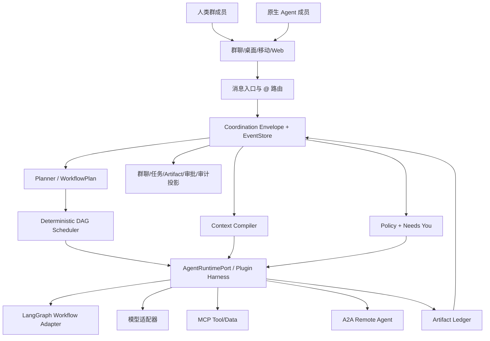

# 人与多 Agent 群聊协同产品：调研、架构与实现报告

> 项目代号：Quantum Entanglement  
> 面向方向：WanWork 人与 Agent 协同办公  
> 报告日期：2026-08-19  
> 本地单一真相源：`analysis_report/`  
> 安全边界：飞书/企微全程只读，未发送、回复、评论、@ 或上传任何内容

## 0. 执行摘要

我们要做的不是“把多个机器人拉进群”，也不是“一个主 Agent 用不同名字发言”。真正的产品是一个人与 Agent 的协作操作系统：

- 每个 Agent 是有稳定身份、能力、权限、状态和责任的群成员；
- 模糊目标可以被规划成显式任务图，但依赖、并行、失败和版本由确定性系统计算；
- Agent 之间通过带验收、输入、产出、预算和授权的 handoff 协作；
- 正式结果进入 append-only artifact，而不是埋在聊天消息里；
- 群聊、任务图、artifact、`Needs You` 和审计时间线是同一事件流的不同投影；
- 外部 Agent 用 A2A，工具/数据用 MCP，内部组织语义用 WanWork Coordination Envelope；
- LangGraph 负责需要 checkpoint/interrupt 的长期流程，插件式 Harness 负责单个 Agent run，平台领域内核位于二者之上；
- 人工不是异常分支，而是授权与责任体系中的正式参与者。

本轮研究的最重要决策：

1. **自研内部协作领域协议，但不自创公网 Agent 协议。**
2. **平台持有状态，Agent 可做可替换的无状态 worker。**
3. **Agent 必须独立发言，主 Agent 只协调和综合。**
4. **`@Agent` 绕过 LLM 规划，但绝不绕过日志、政策、上下文和版本。**
5. **LangGraph + DeepSeek Harness 不是二选一；二者都不应成为全部业务真相源。**
6. **先做一个结果可见、验收清晰的高价值业务 Agent 团队，再抽象平台。**

本仓库已经用可运行代码验证核心不变量：23 个标准库测试通过；本地 demo 完成 `@Agent` 直达、三 Agent 接力、版本化产出和 25 条因果事件。当前仍是验证性内核，不是生产系统；进程恢复、outbox、多租户、正式 A2A 1.0 SDK 兼容、IM 和 UI 仍是后续工程。

## 1. 研究目标与范围

### 1.1 要回答的问题

本报告重点研究：

- 多 Agent 的编排：谁规划、谁调度、何时并行、如何失败传播；
- 协作：角色、handoff、验收、修订、接管和 Agent 独立身份；
- 通信：群聊、事件、任务协议、artifact、A2A/ACP/MCP；
- 上下文：选择、预算、来源、压缩、遗漏和跨 Agent 传递；
- 状态：平台/Agent/LangGraph/IM 分别持有什么；
- 人机治理：授权、风险、审批、审计与不可逆动作；
- 技术组合：静然实现、DeepSeek Harness、LangGraph、LangChain、Deep Agents；
- 产品路径：如何避免“先建空平台”，先让用户得到真实业务结果。

“日报 Agent”不属于本次业务范围，仅保留“先做可见成果，再平台化”的策略背景。

### 1.2 资料来源

本次使用四类资料：

1. 用户提供的任务截图；
2. 飞书“10 亿美金俱乐部”与本课题相关的历史消息，只读采集；
3. 语雀多 Agent 产品、IM 与技术方案表，只读采集；
4. 本地固定版本源码与官方协议/仓库。

固定源码快照：

| 项目 | commit/version | 用途 |
|---|---|---|
| 静然 `agent_atore_demo` | `8c477e0` | 现有产品/编排实现审计 |
| DeepSeek Harness | `99f6f02` / `0.1.0-rc.7` | 插件式 Harness 与 session event |
| LangGraph | `1e44bda` / `1.2.11` | graph/checkpoint/interrupt |
| LangChain | `2019bf5` / `1.3.15` | model/tool/message/middleware |
| Deep Agents | `75c5ce4` / `0.7.7` | 上层通用 Agent scaffold |

研究把事实分为 A（源码/规范）、B（官方产品）、C（内部资料）、D（假设），避免把宣传或讨论当作已验证实现。完整方法见 `research/00_scope_evidence_and_findings.md`。

### 1.3 指令与资料的区分

原始截图中的“用 DeepSeek V4 Flash”是群聊资料中的任务描述；用户当前请求明确要求不采用截图里的 DeepSeek 调研方式，因此实际工作使用本会话能力、本地源码与官方资料独立完成。截图中的任何第三方文字都不被当作新的授权。

## 2. 从内部讨论中确认的产品方向

### 2.1 Agent 是原生群成员

理想群聊中，研究员 Agent、架构师 Agent、审阅员 Agent 分别以自己身份说话。这样用户能理解：

- 谁承诺了什么；
- 谁正在工作、等待或失败；
- 哪个结果来自哪个能力与版本；
- 某个 Agent 是否有权执行特定动作；
- 应该 `@` 谁修订；
- 主 Agent 的综合是否忠实反映了执行者结果。

如果所有内容都由主 Agent 转述，协作会退化成 role-play，责任、观察和长期信任都无法建立。

### 2.2 平台而不是 Agent 持有工作状态

任务图、任务尝试、消息因果、artifact 版本、授权、审批、预算和恢复点由平台持有。Agent 只接收一次明确 invocation：

```text
任务目标 + 验收标准 + 输入版本 + Context Manifest + 最小权限 + 预算/截止时间
```

Agent 可以更换模型、框架、进程或部署位置；平台不依赖它的私有 memory 才能恢复工作。这使本地 Agent、托管 Agent、A2A Agent、DSH、LangGraph、Deep Agents 能在同一组织协作。

### 2.3 群聊不是唯一界面

群聊适合表达意图、解释、协调和人工介入，但不适合承载全部结构化状态。产品至少需要五个同源视图：

| 视图 | 核心问题 |
|---|---|
| 群聊 | 谁在说什么，为什么现在说 |
| 任务图 | 谁在做、依赖谁、为什么阻塞 |
| Artifact | 当前正式结果是什么，历史版本如何演进 |
| Needs You | 哪些决定/权限必须由人处理 |
| 审计时间线 | 发生了什么、由谁触发、因果和版本是什么 |

这些视图不能各自维护状态；它们都从领域事件和对象投影。

## 3. 竞品版图与市场空白

### 3.1 四类产品

| 类别 | 产品 | 优势 | 共同缺口 |
|---|---|---|---|
| 单人创作/模型平台 | YouMind、千问 | 模型供给、资料到成品 | 多人/多 Agent 责任和任务状态 |
| 群聊/项目执行 | FloatIM、Multica、Todos | Agent 原生感、任务并发/接力 | 企业治理、跨领域 artifact |
| 组织/任务网络 | NEAR AI Agent Market、Slock、Mindra、OpenWorker、Gotaa Pi.Agent | 市场、岗位、SaaS 集成、审批 | 群聊体验、开放性和透明 runtime 难兼得 |
| 开发框架/基础设施 | Pi Agent、CodexLoom、Coze 3.0、OpenAgents | runtime、Agent Team、网络 | 完整企业协作产品闭环 |

### 3.2 14 个产品的关键启示

| 产品 | 最值得借鉴 | 不应直接复制 |
|---|---|---|
| YouMind | 资料到成品的 artifact 工作区 | 单人创作状态不足以表达 Agent 团队 |
| 千问 | 丰富模型/API 供应 | 把协作护城河建立在某个模型平台 |
| FloatIM | Agent 作为群成员 | 只有头像/发言，没有任务与治理 |
| Multica | 多 Coding Agent 并行、隔离工作区 | 用 branch/worktree 代替通用 artifact |
| Todos | 自然语言目标到任务图 | 让模型同时负责依赖和一致性 |
| NEAR Market | 可发现、执行、验证、争议闭环 | MVP 引入代币/TEE/市场复杂度 |
| Slock | Agent 作为组织岗位 | 用一个角色 prompt 混合能力/权限/责任 |
| Mindra | 企业集成、RBAC、审计 | 退化为全确定性的传统自动化 |
| OpenWorker | 本地执行、BYOM、批准 | 给 Agent 模糊的永久信任 |
| Pi Agent | MCP、subagent、权限、plan | 把开发者 runtime 当完整协作产品 |
| Gotaa Pi.Agent | SOP/知识/岗位能力包 | 私有平台锁定与不透明状态 |
| CodexLoom | 多 thread Owner/worker 实验 | 把终端线程/共享目录当稳定业务模型 |
| Coze 3.0 | Agent Team 产品化体验 | 依赖封闭云 runtime |
| OpenAgents | Agent 网络发现与互操作 | 用外部网络取代企业内部真相源 |

详细逐项分析和待核验项见 `research/04_competitor_landscape.md`。

### 3.3 市场空白

目前没有一个候选同时做到：

- 群聊原生的独立 Agent 身份；
- 语义规划 + 确定性任务图；
- 显式 handoff 与验收；
- artifact 版本、影响和回滚；
- 有来源/预算/遗漏说明的上下文；
- 组织授权与人类待办；
- 本地/企业部署；
- A2A/MCP 等开放互操作；
- 故障恢复、幂等与审计。

建议定位：

> 面向真实业务产出的人与 Agent 协作操作系统：每个 Agent 是可治理的群成员，每项工作是可恢复的任务图，每个结果是可追溯的版本化 artifact。

## 4. 产品体验设计

### 4.1 从一句话目标到完成

用户说“比较三套 IM 方案，给出建议并准备评审稿”：

1. 原消息先进入事件日志；
2. planner 生成候选任务和 handoff；
3. 平台校验循环、依赖、能力、数据权限和预算；
4. UI 展示计划、预计产出和高风险点；
5. 研究任务并行，Agent 以自己身份更新关键进度；
6. 产出先进入 artifact，再在群聊中引用；
7. 依赖任务拿到具体 artifact version，而不是复制聊天历史；
8. reviewer 按验收标准返回通过/修订；
9. 高风险动作进入 Needs You；
10. 最终结果包含版本、来源、决策和未解决问题。

### 4.2 `@Agent` 直达

`@Agent` 的正确语义是跳过“让 planner 决定由谁处理”，而不是直接把文本发送给模型。入口仍需：

```text
IM 去重 → 成员/mention 解析 → ChatMessageReceived → Policy → ContextCompiler
→ AgentInvocation → Runtime → Artifact/Event → 群聊投影
```

本仓库 `MentionRouter` 已用测试证明：有 Agent mention 时 planner handler 调用数为 0；但 envelope 仍保留 provider、external message id、causation 与 idempotency。

### 4.3 Needs You

每个请求至少展示：

- 任务/Agent/动作和目标系统；
- 为什么不能自动继续；
- 风险、数据范围、是否外部副作用、是否可逆；
- 当前证据和已尝试路径；
- 候选选项、推荐和影响；
- 批准、拒绝、修订、补充输入、人工接管；
- 超时策略与恢复入口。

批准应生成绑定 `session + task + action digest + policy version` 的短期 capability，而不是永久提高 Agent 权限。

### 4.4 降噪

Agent 原生发言不等于让所有内部 token 都刷群。建议：

- 必显：接单、关键阻塞、重要发现、正式结果、请求人；
- 可折叠：工具细节、子步骤、重试；
- 仅时间线：heartbeat、低层 trace；
- 多个并行进度合并为结构化卡片；
- 主 Agent 不重复子 Agent 已经清楚表达的内容。

## 5. 目标架构



### 5.1 领域层

领域层拥有：Actor、Session、Thread、Envelope、WorkflowPlan、Task/Attempt、Handoff、Context Manifest、Artifact、Approval、Authority、Action Intent、外部 Action Receipt。

它不 import 具体模型、LangGraph、LangChain、IM SDK 或 A2A SDK。所有外部依赖通过 ports/adapters。

### 5.2 事件与投影

事件流至少提供：

- 单调 stream revision 和全局 position；
- expected version 乐观并发；
- correlation/causation/idempotency；
- 原子批量追加；
- snapshot 与 projector offset；
- outbox；
- schema version/upcaster；
- tamper-evident 审计策略。

模型看到的 ContextBundle 必须先写 `context.compiled`，调用 Agent 再写 `task.invocation.started`。当前测试逐 task 比较 sequence，确保前者严格小于后者。

### 5.3 规划与 DAG

LLM 可以生成/修订计划，但平台执行：

- task id 与依赖校验；
- 循环检测；
- ready set 和优先级；
- 并发上限；
- 状态迁移；
- 失败下游 blocked；
- 取消、重试、supersede；
- 图版本和重规划 diff。

任务状态：

```text
pending → ready → running → completed
                    ├→ failed
                    ├→ waiting_input → ready
                    └→ waiting_approval → ready/canceled/waiting_input
completed → superseded
```

每次迁移有 revision；幂等键不能只用目标状态，因为 approval/resume 等合法流程会再次进入 ready。

### 5.4 Handoff

handoff 不是一句“你接着做”，而是生产者—消费者契约：

```text
goal
acceptance_criteria[]
deliverables[]
input_artifact_refs[]
context_refs[]
constraints[]
authority
parent_task_id
token/cost/deadline
```

接收方可以 accept/reject/ask-revision；未来需要显式 `HandoffAccepted`，避免 scheduler 把“成功发送”误当成“对方承诺交付”。

### 5.5 Context Compiler

上下文优先级：

| 层 | 内容 | 策略 |
|---|---|---|
| P0 | policy、goal、handoff、验收 | required，放不下就失败 |
| P1 | 依赖 artifact、关键决策、附件 | 具体版本，优先原文/结构化摘要 |
| P2 | 相关聊天、记忆、组织知识 | 检索、排序、来源 |
| P3 | 工具历史、低相关细节 | spill、摘要或 omission |

ContextBundle 记录：selected item、omitted id、token budget、estimated tokens、digest、provenance、compiler version。required context 不能被静默截断。

### 5.6 Artifact

Artifact 是正式交付和 Agent 接力的中心：

- append-only 版本；
- content digest；
- parent version 和 trigger（create/revise/rollback）；
- task/agent/时间/来源；
- head 是投影；
- 回滚生成新版本；
- 下游绑定具体版本；
- 变更通过依赖图计算影响。

当前 `ArtifactLedger` 已实现版本、同任务幂等和回滚新 head；生产版需数据库唯一约束、blob store、事务 outbox 和大文件 URI。

### 5.7 Policy

PolicyEngine 输入：

```text
action + target + risk + external_side_effect + irreversible
+ data_classes + delegated authority + workspace policy + actor/session
```

输出 allow/deny/needs-approval。安全读取和草稿默认低摩擦；高风险、不可逆或超出授权的动作请求人。凭据不进入 Envelope，Connector 使用 vault 中的 credential。

## 6. 协议决策

### 6.1 分层

| 层 | 选择 | 原因 |
|---|---|---|
| 产品交互 | WanWork | 群聊、人、Agent、审批和成果体验 |
| 内部协调 | Coordination Envelope + event state machine | 组织授权、任务、artifact、因果和审计 |
| 外部 Agent | A2A 1.x | Agent Card、长任务、stream/push、跨框架 |
| 工具与数据 | MCP | tools/resources/prompts 与能力协商 |
| Coding editor | Agent Client Protocol v1 | editor ↔ coding agent，不是 agent ↔ agent |
| 能力目录 | Agent Card，可映射 OASF | 生态发现与企业分类 |
| 网络/联邦 | 观察 ANP/AGNTCY SLIM | Phase 3/4，MVP 不先背复杂度 |
| 事件外壳/追踪 | CloudEvents 思路 + W3C Trace Context/OTel | 通用基础设施兼容 |

### 6.2 为什么内部 Envelope 必须自研

A2A/MCP 故意不覆盖：群成员、组织授权、内部 DAG、artifact 业务版本、人类审批和企业审计。如果没有 canonical envelope，这些字段会散落在 prompt、IM metadata、LangGraph state 和数据库列，无法统一恢复和升级。

自研的是领域语义，不是传输：复用 HTTP/SSE/queue、JSON、OAuth/OIDC/mTLS/JWS、CloudEvents 和 OTel。

### 6.3 ACP 消歧

- 旧 Agent Communication Protocol 仓库已归档并明确并入 A2A，仅做存量迁移；
- Agent Client Protocol 当前稳定 wire v1，用于编辑器与 Coding Agent，可做桌面 Coding 插件；
- 不应在架构文档中只写“ACP”而不展开全名。

完整协议、版本、映射与一手来源见 `research/03_protocol_landscape.md`。

## 7. 框架组合决策

### 7.1 DeepSeek Harness / Cordis

适合：单 Agent 的 turn/step、session event、模型上下文、tool pipeline、sandbox/approval、compaction、插件服务与 effect 生命周期。

不拥有：跨 Agent 组织任务图、群聊 membership、artifact 业务版本、组织 RBAC。

风险：`0.1.0-rc.7` 仍是 developer preview，官方明确会 breaking change。必须用 `AgentRuntimePort` 和契约测试隔离，不大规模 fork。

### 7.2 LangGraph

适合：复杂长期 workflow、checkpoint、StateGraph/Pregel、parallel superstep、interrupt/Command、子图和 time-travel。

注意：interrupt 恢复会从节点开头重执行，所以 interrupt 前不能放无幂等外部副作用。checkpoint 保存控制流位置，不是不可变业务事实。

### 7.3 LangChain

使用其 model/tool/message/structured output 和 middleware 生态，但不让 LangChain message state 渗透领域层。middleware 通常在 create_agent 时编译进图，动态服务生命周期不如 Cordis。

### 7.4 Deep Agents

适合参考 filesystem/backend、skills、memory、summarization、subagent 和 HITL 产品装配。它默认的 subagent 是 stateless，父 Agent 只拿最终消息并代为转述，与“群聊原生 Agent + 平台 handoff/artifact”不一致，因此不作为平台 scheduler。

### 7.5 推荐 ports

```text
WorkflowEnginePort
  - BuiltinDeterministicDAG
  - LangGraphAdapter

AgentRuntimePort
  - InProcessAdapter（测试）
  - DSHAdapter（目标默认）
  - DeepAgentsAdapter（生态/快速验证）

RemoteAgentPort
  - A2AAdapter
  - LegacyACPAdapter（仅迁移）

ToolPort
  - MCPAdapter
  - NativeToolAdapter
```

源码级比较见 `research/02_framework_deepdive.md`。

## 8. 静然实现审计

### 8.1 已经做对的部分

静然仓库不是空壳，包含：

- LangGraph 显式图、意图路由、DAG 派发、inspect gate 和验收；
- A2A 风格 JSON-RPC/SSE 远程 Agent；
- blackboard、主 Agent 压缩上下文、子 Agent 精确上下文的分层；
- Agent 以自己身份发言；
- append-only artifact 版本和修订；
- `@Agent` 旁路 planner；
- FastAPI/PostgreSQL/SSE/React demo 链路。

这些概念应迁移，不应丢弃。

### 8.2 不能直接生产化延长的原因

当前快照仍是单用户、单进程、内存实时总线和弱安全边界 demo：

- 没有可随仓库运行的测试；
- Python 版本和依赖锁不完整；
- create_all 不是正式迁移；
- A2A 是自实现子集，未过官方 SDK/TCK；
- 多人群聊、租户隔离、鉴权、审计、计费是占位；
- 进程锁/队列/总线不提供分布式可靠性；
- 外部注册入口要重点检查 SSRF 和 URL 安全；
- checkpoint、数据库副作用和 IM 投递不是原子；
- 需要显式 task attempt、outbox、幂等和凭据边界。

建议复用纯逻辑和节点思想，以新领域内核为主干逐个迁移。阶段审计见 `research/01_jingran_implementation_audit.md`。

## 9. 当前代码实现

### 9.1 已完成模块

| 模块 | 能力 |
|---|---|
| `protocol.py` | Envelope、Actor、Authority、Handoff、Context/Artifact refs、状态/风险 |
| `events.py` | immutable DomainEvent/StoredEvent |
| `store.py` | SQLite append-only、revision、全局 position、幂等、乐观并发、batch、snapshot |
| `artifacts.py` | append-only artifact、revision chain、rollback 新版本 |
| `scheduler.py` | DAG 校验、循环检测、ready、失败传播、状态 revision |
| `context.py` | token 预算、provenance、required、omission、digest |
| `policy.py` | allow/deny/needs approval、Needs You queue |
| `plugins.py` | 有序、可卸载 hook manager |
| `runtime.py` | 并行执行、context-before-invoke、artifact commit、审批 resume |
| `chat.py` | provider-neutral ingress、`@Agent` deterministic route |
| `adapters/a2a.py` | Agent Card 与 JSON-RPC 边界映射、未知扩展保留 |
| `langgraph_bridge.py` | 可选 graph start/interrupt/resume，不强依赖 LangGraph |
| `cli.py` / example | 无外部服务的三 Agent 群聊 demo |

### 9.2 已修复的关键问题

1. TaskGraph 构造阶段不再提前吞掉初始 `pending→ready`，因此 ready 事件会落盘。
2. 批准后生成 task-scoped grant，复跑不会再次请求同一审批。
3. 状态幂等键使用 transition revision，不会把第二次合法 ready 当成初始 ready 重试。
4. policy deny 也经过 running→failed 的合法状态路径。
5. `@Agent` route 不调用 planner，但保留入口 envelope。

### 9.3 验证

当前 23 个测试覆盖：

- Envelope round-trip 和授权；
- handoff 必填与优先级；
- event append、幂等、乐观并发、原子 batch；
- artifact 修订、同任务幂等和 rollback；
- DAG 初始 ready、cycle/missing dependency、失败传播；
- required context 不静默截断；
- 并行执行；
- 依赖 artifact 进入下游 context；
- `context.compiled` 先于 `task.invocation.started`；
- approval pause/resume exactly once；
- policy deny；
- A2A Agent Card extension 和 Envelope 映射；
- `@Agent` direct/planner 路由；
- LangGraph interrupt/resume bridge config。

本地 demo 输出：3 个任务全部 completed，3 个 artifact，25 条事件；无模型和外部服务依赖。

## 10. 生产化差距

### P0：可靠性与一致性

- 从 event log 恢复 WorkflowPlan/TaskGraph/Approval/Agent invocation；
- task attempt 与 lease/heartbeat；
- transactional outbox/inbox；
- 外部 action receipt 和 compensation；
- artifact blob/metadata 事务；
- worker 崩溃、超时、重试和 exactly-once effect 语义；
- projector checkpoint、dead letter 和 schema upcast。

### P0：安全

- tenant/workspace/member/RBAC/ABAC；
- credential vault 与 connector token scope；
- Agent Card URL/SSRF/signature 验证；
- prompt/tool/resource 不可信输入边界；
- data classification、DLP、审计保留；
- sandbox 与 network/file policy；
- 所有外部发送/不可逆动作的 action-time gate。

### P1：协议与运行时

- A2A 1.0 官方 SDK contract tests；
- MCP client/tool/resource adapter；
- DSH AgentRuntimePort；
- LangGraph Postgres checkpointer 集成；
- stream/cancel/backpressure；
- remote Agent status reconciliation。

### P1：产品

- 群聊/任务图/artifact/Needs You UI；
- Agent roster、能力卡、版本和状态；
- 计划确认与重规划 diff；
- artifact review/compare/impact；
- IM webhook、独立 Agent 身份和多端同步。

## 11. 路线图

### Phase 0：内核不变量（当前）

目标：所有模型可见上下文可重建；任务、artifact、审批和因果由平台持有；本地 demo 可验证。

完成标准：

- 单机 crash/restart 不重复 artifact 或副作用；
- 计划、审批和任务可从事件恢复；
- adapter contract suite；
- 文档、测试、示例同步。

### Phase 1：一个高价值业务闭环

选择条件：输入可获取、产出可视、验收明确、频率高、人工成本高、风险可控。首发只做 3–5 个稳定 Agent，不做无限商店。

交付：

- 原生群聊与四个核心视图；
- 固定业务 task templates + 动态规划；
- 可见 artifact 和 review；
- Needs You；
- 真实用户连续使用。

### Phase 2：团队与企业

- 组织/岗位/授权/审批链；
- 多租户、合规、审计、成本/SLA；
- Agent 版本、灰度和评测；
- IM 正式接入与移动/桌面。

### Phase 3：开放生态

- A2A/MCP/Agent Card/OASF；
- 外部 Agent SDK 和兼容认证；
- registry、审核、能力评价；
- 插件市场和 sandbox provider。

### Phase 4：跨组织 Agent 网络

- 联邦、DID/E2EE、ANP/SLIM 试验；
- 可验证声明、任务市场、计费结算；
- 只有真实跨组织需求出现后进入。

## 12. 指标体系

北极星指标：**每周被人接受的业务 artifact 数 / 活跃协作空间**。

结果指标：

- 端到端完成率；
- artifact 一次验收通过率；
- 从目标到首个可见成果的时间；
- 结果采纳率和人工重做率；
- 每个被接受 artifact 的成本。

协作指标：

- handoff 接受/退回率；
- 阻塞原因和等待人时长；
- 计划漂移、重规划和重复执行率；
- 人类主动输入与被动审批占比；
- Agent 替换后恢复成功率。

技术/安全指标：

- 上下文 token、omission、溢出和缓存命中；
- event/projector lag；
- worker crash/retry、外部 action receipt；
- artifact 冲突；
- 未授权外部副作用必须为 0；
- 敏感数据越界必须为 0。

## 13. 风险登记

| 风险 | 早期信号 | 缓解 |
|---|---|---|
| 过度平台化 | 数月只有框架没有真实用户产出 | 绑定 Phase 1 场景和 artifact 指标 |
| Agent 自主性幻觉 | 自报完成但无验收证据 | handoff criteria + reviewer + artifact |
| 群聊噪音 | 用户静音或忽略 Agent | 分级发言、合并进度、结构化卡片 |
| 上下文污染 | 成本飙升、互相引用错误 | Context Manifest、来源、版本、omission |
| 重复外部副作用 | 重试后重复发送/写入 | inbox/outbox、idempotency、receipt |
| 并发冲突 | 多 Agent 覆盖 artifact | append-only、expected version、影响图 |
| 权限扩散 | Agent 持有用户全量 token | vault、最小 scope、task capability |
| 框架锁定 | 业务层出现大量上游类型 | ports、contract tests、领域层零依赖 |
| 标准追新 | 协议升级打断核心开发 | canonical envelope + versioned adapter |
| IM 锁定 | task state 依赖厂商消息 | transport 抽象、平台事件真相源 |

## 14. 决策清单

| 决策 | 选择 | 状态 |
|---|---|---|
| 产品中心 | artifact + 协作状态，不是聊天次数 | 采用 |
| Agent 表达 | 原生成员独立发言 | 采用 |
| 状态所有权 | 平台 | 采用 |
| 编排 | LLM planner + deterministic scheduler | 采用 |
| 简单/复杂流程 | 内置 DAG / LangGraph adapter | 采用 |
| 单 Agent runtime | 插件 Harness，目标 DSH adapter | 采用，待集成 |
| 外部 Agent | A2A 1.x | 采用，待官方 SDK 验证 |
| 工具/数据 | MCP | 采用，待实现 |
| 内部协议 | Coordination Envelope | 已实现 v0.1 子集 |
| 人工介入 | Needs You + scoped capability | 已实现内核，待 UI/持久化 |
| Artifact | append-only | 已实现内核 |
| 旧 ACP | 不新增，只迁移 | 采用 |
| ANP/SLIM | 观察/预留 adapter | 后期 |

## 15. 证据与附录

专题研究：

- `research/00_scope_evidence_and_findings.md`
- `research/01_jingran_implementation_audit.md`
- `research/02_framework_deepdive.md`
- `research/03_protocol_landscape.md`
- `research/04_competitor_landscape.md`
- `research/05_target_product_and_architecture.md`

截图证据：

- `screenshots/00_request_feishu.png`
- `screenshots/01_feishu_current_context.jpeg`
- `screenshots/02_feishu_history_aug16_19.jpeg`
- `screenshots/03_feishu_dph_direction_aug15.jpeg`
- `screenshots/04_yuque_multi_agent_overview.jpeg`
- `screenshots/05_yuque_products_rows_3_8.jpeg`
- `screenshots/06_yuque_products_rows_7_11.jpeg`
- `screenshots/07_yuque_products_rows_12_16.jpeg`
- `screenshots/08_yuque_im_provider_comparison.jpeg`
- `screenshots/09_yuque_technical_options.jpeg`

一手外部协议来源见 `research/03_protocol_landscape.md` 第 12 节；框架源码路径和固定 commit 见 `research/02_framework_deepdive.md`。

## 16. 最终建议

应继续投入，但产品和技术必须同时收敛：

1. 用当前内核先完成 crash recovery/outbox/A2A contract/MCP/DSH adapter；
2. 与此同时确定一个首发业务闭环，限定 Agent 团队、输入、产出和验收；
3. UI 先做群聊、任务、artifact、Needs You 四个同源视图；
4. 把“每个被接受 artifact 的时间、质量和成本”作为评估中心；
5. 对外兼容标准，对内牢牢掌握组织协作状态与治理。

如果只做群聊外壳，竞争会落到模型和 UI；如果只做通用框架，用户看不到价值。真正有机会形成世界级产品的中间层，是把开放 Agent runtime 与真实组织工作连接起来，并让协作过程像数据库事务一样可靠、像群聊一样自然、像优秀团队一样可理解和可接管。
