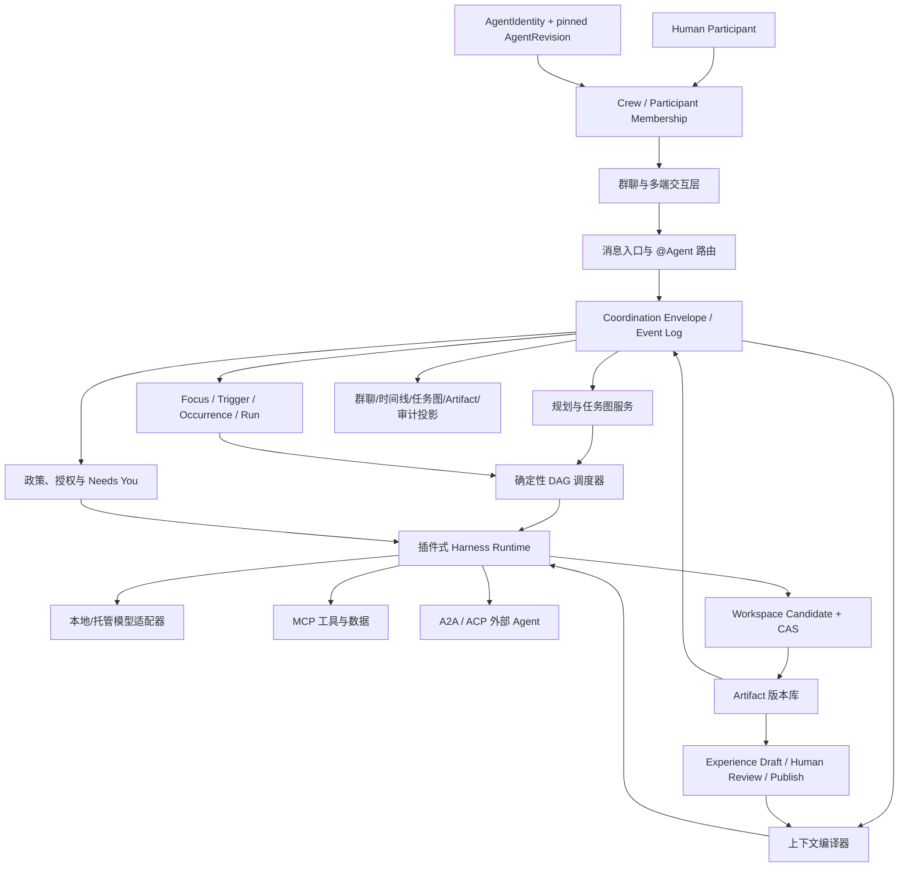

# WanWork 人与多 Agent 协同产品与技术架构建议

## 1. 产品定义

WanWork 的核心对象不是“聊天机器人”，而是一个由人、Agent、工具、任务与产出物组成的协作空间。群聊是最自然的入口，但不是唯一真相源。

一句话定义：

> 每个 Agent 都是有身份、有能力、有边界、有责任的群成员；平台把模糊目标转成可恢复任务图，并让所有人清楚谁在做、依据什么、产出了什么、何时需要人。

Clawith 固定源码进一步证明了“稳定 Agent + 原生群聊 + 主动工作 + 组织经验”可以组成普通团队能理解的产品形态；这里借鉴的是产品机制和经源码定位的局部实现，不代表这些能力已在 Quantum Entanglement 当前验收切片中完成。详细证据和限制见 [`20_clawith_competitive_analysis.md`](20_clawith_competitive_analysis.md)。

## 2. 产品不变量

1. **模型可见即已记录**：任何发给 Agent 的上下文必须先形成可重建事件。
2. **平台持有协作状态**：Agent 可无状态，任务、artifact、审批和因果链归平台。
3. **可计算的事不用模型猜**：依赖、版本、就绪、权限、失败传播由确定性逻辑处理。
4. **身份稳定、执行版本冻结**：AgentIdentity 长期稳定，配置变更形成不可变 AgentRevision；每个 Run 固定引用实际 revision，执行者不能被主 Agent 冒充。
5. **正式结果不是聊天文本**：结果进入 append-only artifact，聊天只引用版本。
6. **授权不从身份推断**：每次 handoff 显式携带 action/data/risk 范围。
7. **回滚也不改历史**：回滚创建新版本，保留完整因果和决策记录。
8. **内外协议分层**：外部互操作与内部组织治理不能混成一个协议。

## 3. 关键用户旅程

### 3.1 模糊目标自动组队

用户在群里说“比较三家方案，形成推荐并准备评审材料”。系统：

1. 记录原始消息；
2. 规划候选任务图和需要的 Agent；
3. 展示计划、预算、风险和缺失输入；
4. 低风险任务直接并行，高风险动作进入 Needs You；
5. Agent 独立发布进度，正式结果进入 artifact；
6. 审阅 Agent 按验收标准检查，不通过则生成修订任务；
7. 主 Agent 只做跨结果综合，不冒充子 Agent。

### 3.2 `@Agent` 直达与多 Agent 规划

用户 `@数据分析师 检查 v3 表格异常`。路由器不再调用 LLM 选择 Agent，但仍执行身份解析、授权、上下文编译、事件落盘和结果版本化。若该任务影响其他 artifact，平台用依赖图提示影响范围。

用户同时 `@` 多个 Agent 或只给出模糊目标时，模型只能生成候选分工与任务图；平台仍需校验成员身份、AgentRevision、依赖、预算、权限和验收标准后再调度。单 Agent mention 的确定性与多 Agent planning 的开放性不能混成同一路由。

### 3.3 Agent 主动请求人

Agent 遇到模糊验收、权限超界、外部发送、不可逆动作、信息矛盾或预算不足时，不应继续猜。它创建 Needs You：

- 问题与阻塞任务；
- 已尝试路径和证据；
- 候选选择及影响；
- 推荐项与置信度；
- 超时策略；
- 批准、拒绝、要求修订、补充输入、人工接管。

### 3.4 失败与恢复

Agent 或模型故障时，平台保留最后已提交事件、上下文摘要、工具结果和 artifact。可替换 Agent、切模型、重新执行当前 task 或从某 artifact 版本分叉；不需要重放整段聊天。

## 4. 逻辑架构

上图是目标架构，不是当前实现清单；当前真实能力与缺口仍以主报告和更新日期更晚、绑定 source commit/tree 的工程证据为准。

## 5. 分层职责

### 5.1 交互与 IM 层

负责消息展示、群成员、@、已读、附件、实时流与多端体验。它不是任务真相源。IM webhook 可能重复、乱序或延迟，因此入口必须按平台 idempotency key 去重并保留外部 message id 映射。

人和 Agent 应统一引用 Participant；Crew 是 tenant/workspace 内长期存在的会话与协作空间，而不是一次 Run 的临时 recipient 列表。Participant 同时被消息、Task、Approval、Artifact 和 Audit 引用，并显式保留 `on_behalf_of`。AgentIdentity 保持稳定，persona、模型、工具、政策等配置变更生成不可变 AgentRevision，历史 Run 不随最新配置漂移。

Agent 独立身份至少包含：

- 稳定 actor/identity id、当前 revision 与 Run 固定 revision；
- 名称、头像、角色和提供方；
- 能力卡与可调用协议；
- 当前状态（空闲/工作/等待/失败/离线）；
- 权限范围和部署位置；
- 产出质量、延迟、成本等可观测指标。

### 5.2 消息入口与路由

路由分三条：

- `@单 Agent`：确定性直达，不让模型重新选人；
- `@多个 Agent` 或模糊目标：planner 生成候选计划，平台验证后调度；
- 命令/按钮：确定性 action；

三条路由最终都生成相同的 Coordination Envelope，避免直达消息成为审计和恢复的旁路。

### 5.3 协作事件与 Envelope

内部 Envelope 建议保留：

- schema/message/session/thread；
- sender/recipients/kind；
- correlation/causation/idempotency/traceparent；
- payload 与版本化 context refs；
- authority、risk、TTL、priority；
- reply-to、handoff contract、artifact refs。

它是内部治理契约，不宣称替代 A2A/ACP/MCP。所有外部协议适配器必须把可保留字段映射进来，无法映射的治理元数据留在平台侧。

### 5.4 规划与确定性调度

LLM planner 输出候选任务、依赖、Agent 能力要求、handoff 和验收标准。平台负责：

- schema 校验；
- DAG 循环和缺失依赖检测；
- 权限与预算预检；
- ready set 和并发度计算；
- 失败传播、重试、取消与 supersede；
- 图版本与重规划 diff。

一个 task 应有 `pending → ready → running → completed/failed/waiting_*` 的显式状态机。合法重入通过 transition revision 区分，不能用“目标状态”单独做幂等键。

### 5.5 插件式 Harness Runtime

Harness 负责执行一次受治理的 Agent invocation：

1. before-dispatch 插件；
2. 政策评估；
3. 上下文编译并落事件；
4. 模型/远程 Agent 调用；
5. 工具循环；
6. 结果校验；
7. artifact 提交；
8. after-dispatch、指标与错误归一化。

插件点要稳定、顺序确定、可观测、可超时且有隔离策略。不要让插件直接修改数据库隐式状态；它应产生命令或事件。

借鉴 Clawith 固定控制图与 DeepSeek Harness 的共同纪律，模型只提出下一步意图；Harness/executor 拥有 tool schema 校验、policy、sandbox、effect lifecycle、receipt、verification、停止条件和按副作用分类的 retry。未知外部结果必须进入 reconcile，不能被统一当作失败后自动重放。

### 5.6 上下文编译

上下文不是 `messages[-N:]`。建议分层：

| 优先级 | 内容 | 默认策略 |
|---|---|---|
| P0 | 政策、安全、目标、handoff、验收标准 | required，放不下则失败，不静默截断 |
| P1 | 依赖 artifact、关键决策、用户显式附件 | 版本引用，优先原文/结构化摘要 |
| P2 | 相关聊天、长期记忆、组织知识 | 检索 + 相关性排序 + 来源 |
| P3 | 工具历史、调试细节、低相关消息 | 摘要、spill 或 omission |

每个 ContextBundle 记录 token 预算、估算、选择项、遗漏项、digest、来源和编译策略版本。Agent 输出应能引用 context ref，而不是复制大段历史。

### 5.7 Artifact 版本库

Artifact 是跨 Agent 交接的正式媒介，支持文档、表格、代码、图像、查询结果、决策记录和结构化数据。关键规则：

- append-only；
- task + name + digest 幂等；
- parent version 与变更原因；
- 当前 head 是投影，不覆盖历史；
- 回滚创建新 head；
- artifact 与任务结果事件同一事务或通过 outbox 保证最终一致；
- 下游任务绑定具体版本，版本变化触发影响分析而非盲目重跑。

对共享 workspace 的写入也不应由多个 Agent 直接覆盖：每次 Run 先提交带 `base_version + scope + author_run + content_digest` 的 candidate，平台经过 policy 与 CAS 后产生 `applied / conflict / unknown` 等显式结果；跨多个对象使用 durable saga/outbox/reconciliation，不把逐文件 CAS 误写成跨存储原子事务。

### 5.8 政策与 Needs You

政策输入包括 action、target、risk、external side effect、irreversible、data classes、authority。输出为 allow/deny/needs-approval，并记录规则版本和原因。

批准不是给 Agent 永久提权，而是面向 session/task/action digest 的短期 capability。任务重规划或 action 变化后必须重新评估。

### 5.9 外部协议层

- **A2A/ACP**：远程 Agent 发现、调用、流式更新和任务状态。
- **MCP**：工具、数据和资源连接。
- **内部 Envelope**：组织成员、因果、幂等、授权、审批、artifact、群聊投影。
- **LangGraph bridge**：需要 checkpoint、interrupt/time-travel 的上层流程；不让 LangGraph state 取代领域事件。

Clawith 源码中的 `notify/consult/task_delegate` 是有价值的内部协作机制，但不是标准 A2A 兼容证明。WanWork 只吸收其等待、恢复和公开身份思想，内部仍称 coordination/handoff，对外 A2A 必须走标准 adapter、官方 SDK/TCK 与版本协商。

### 5.10 主动工作与组织经验

主动工作采用 `Focus → Trigger → Occurrence → Run → Result/Needs You`：Focus 是结构化长期关注点；Trigger 只决定何时重新评估；Occurrence 有稳定幂等身份；Run 仍走同一 admission、policy、Harness 和 Artifact 链路。定时、消息、事件或 webhook 都不能绕过 action-time 授权。

组织经验采用 `Artifact → Experience draft → human review → published/retired`。AI 可以提炼草稿，但只有人或明确治理角色审核发布的 Experience 才进入权威检索；条目必须保留来源、适用条件、失效信号、数据分类和引用。Experience 是跨任务知识，不替代一次任务的正式 Artifact。

### 5.11 Skill 渐进披露与模型能力事实

Skill 不应把所有说明、代码和权限一次灌入上下文。平台先向模型暴露有界 catalog，需要时只读
package metadata/说明，再由平台根据 policy、批准状态和 Run scope 激活，最后在隔离执行域中
materialize 固定 digest 的不可变快照。`catalog → read → activate → materialize` 四步必须分别
可审计；来源、签名/扫描、SBOM、credential、egress 和撤销状态不满足时，不得仅凭 prompt 自安装。

模型能力也不能从名字、价格页或历史经验猜测。每个 `ModelConnection` 应持有配置指纹；tool
calling、vision、structured output、streaming、上下文/输出限制和速率限制等探测结果形成带
provider/model revision、`observed_at`、有效期和原始证据摘要的 `CapabilityObservation`。planner
只能依据未过期事实选候选模型，Harness 在调用时仍做 action-time 校验；缺失、过期或冲突必须
显式降级或 Needs You，不能静默假定支持。

## 6. LangGraph + DeepSeek Harness 的组合边界

建议不是修改其中一个去吞掉另一个，而是定义 ports：

- `WorkflowEnginePort`：start/resume/interrupt/checkpoint；LangGraph 是一个实现。
- `AgentRuntimePort`：invoke/stream/cancel；插件 Harness 是默认实现。
- `RemoteAgentPort`：discover/send/subscribe/cancel；A2A/ACP adapter 实现。
- `ToolPort`：list/call/read-resource；MCP adapter 实现。
- `EventStorePort` 与 `ArtifactStorePort`：平台真相源。

LangGraph checkpoint 保存流程执行位置；领域事件保存业务事实。恢复时 checkpoint 可以重建或替换，已发生的审批和 artifact 不能被 checkpoint 覆盖。

组合原则是“LangGraph 管确定性控制流，Harness 管每个执行节点的真实执行纪律”：前者负责 route/checkpoint/interrupt/resume，后者负责模型与工具边界、隔离、effect/receipt、verification 和失败分类。不要把 Harness 简化成一个不透明 LangGraph node，也不要让 LangGraph 私有 state 成为权限、Artifact 或审计真相源。

## 7. IM 选型解读

语雀初筛认为腾讯 IM、网易云信和声网对移动/桌面/Web 支持较完整；融云在桌面/Web SDK 上存在不同限制；环信缺桌面/Web；各家 AI 能力和收费模式不同。

正式选型不要只看 UI SDK，应实测：

1. 每个 Agent 是否可拥有独立可审计身份；
2. 服务端代发、webhook 顺序、重试和签名；
3. 历史消息、附件、引用回复与 thread；
4. 流式 token/增量消息是否可控；
5. 群成员数量、并发、离线推送和多端同步；
6. 数据驻留、敏感词、审计导出和删除政策；
7. 客户端包体、Tauri/Flutter/RN 兼容性；
8. 价格不是只看 DAU，还要算 Agent 服务端消息量。

MVP 可优先腾讯 IM + Flutter/Tauri 组合，但 transport 必须抽象，避免平台状态和厂商消息模型绑定。

## 8. 分阶段路线图

### Phase 0：不变量与可运行内核（当前）

- Envelope、事件存储、DAG、context、artifact、policy、Needs You；
- 端到端测试和本地 demo；
- A2A adapter、`@Agent` router、LangGraph bridge。

退出标准：单机可重放、审批恢复不重复、失败传播正确、全部模型上下文可从事件重建。

### Phase 1：一个高价值场景

选择验收标准清晰、输入可获取、结果可见的业务场景。先做 3–5 个版本化 AgentIdentity/Revision、Human/Agent Participant 与长期 Crew，并交付群聊/任务/artifact/Needs You 四视图，不做无限 Agent 商店。

退出标准：真实用户连续使用；任务完成率、人工干预成本和结果采纳率优于单 Agent。

### Phase 2：团队与企业治理

- 组织、角色、data scope、审批链；
- 多租户、审计、成本、SLA、Agent 版本；
- IM 厂商接入和移动/桌面客户端。

### Phase 3：开放生态

- A2A/ACP/MCP 兼容性测试套件；
- Agent Card 注册、审核和能力评价；
- 外部开发者 SDK；
- marketplace，但先不引入复杂经济协议。

### Phase 4：协作网络

在内部状态、治理与验证成熟后，再探索跨组织 Agent 网络、可信执行、任务市场和结算。

## 9. 北极星指标与运行指标

北极星不是消息数或 Agent 调用数，而是“被用户接受的业务 artifact 数/活跃协作空间”。配套指标：

- 端到端任务完成率；
- artifact 一次验收通过率和修订次数；
- 从目标到首个可见成果的时间；
- 人类主动输入与被动审批时间；
- 阻塞原因分布；
- 上下文命中/遗漏与 token 成本；
- Agent 失败、重试、替换成功率；
- 计划漂移和重复执行率；
- 外部副作用误执行为零；
- 每个被接受 artifact 的综合成本。

## 10. 风险与缓解

| 风险 | 表现 | 缓解 |
|---|---|---|
| 自主性幻觉 | Agent 自己宣布完成但结果不可验证 | handoff 验收 + 独立 reviewer + artifact 证据 |
| 群聊噪音 | 多 Agent 同时刷屏 | 结构化进度、合并通知、仅关键节点发言 |
| 上下文污染 | 全量聊天导致冲突和成本膨胀 | ContextBundle、来源、预算、omission、版本 |
| 重复副作用 | 重试导致重复发送/写入 | idempotency、outbox、外部 action receipt |
| 共享状态竞争 | 并行 Agent 覆盖文件/结果 | artifact 事务、工作区隔离、乐观并发 |
| 过度平台化 | 长期做基础设施而无用户结果 | 先固定场景和可见 artifact，再抽象复用 |
| 协议追新 | 被快速变化的标准绑架 | 内部稳定领域模型 + 版本化适配器 |
| 供应商锁定 | 模型/IM/harness 状态渗透核心 | ports、契约测试、平台真相源 |
| 权限扩散 | Agent 继承用户全部能力 | 最小 authority、任务级批准、过期 capability |

明确不进入生产基线的 Clawith 机制：把内部协作命名成标准 A2A；backend/worker 使用 privileged Compose 或挂宿主 Docker socket；把 pip 安装转交宿主执行；允许 Agent/普通用户仅凭 prompt 自安装 Skill/MCP；用可静默失败的 best-effort 业务表支撑“不可篡改审计”宣称。能力扩展必须经过版本 pin、审批、隔离、出网与供应链门禁；高风险动作在审计事实无法原子记录时应 fail closed。

## 11. 接下来应实现的最小闭环

1. 先闭合原子 Result/Artifact/attempt/task-terminal 验收、receipt-bound recovery 和 action receipt；在此之前 heartbeat worker、主动调度和真实 connector 保持关闭。
2. 建立 `AgentIdentity + immutable AgentRevision + Human/Agent Participant + Crew` 的持久对象，并让 Run 固定 revision。
3. 完成单 Agent `@` 确定性路由和多 Agent mention planning，证明两者都不绕过事件/政策/上下文。
4. 建立绑定配置指纹与时间的模型 `CapabilityObservation`，以及 `catalog → read → activate → materialize` 的不可变 Skill package 链；activation 继续受供应链与执行隔离门禁约束。
5. 完成 LangGraph 可选 bridge，展示 interrupt→Needs You→resume；节点执行统一经过 Harness 纪律。
6. 增加 SQLite 重启恢复与 outbox，验证进程崩溃后不重复 artifact/副作用；共享写入使用 candidate + CAS。
7. 提供本地群聊 demo：两个并行 Agent、一个依赖 Agent、一次人工审批、一个版本化报告。
8. 在交付闭环稳定后增加 Focus→Trigger→Occurrence→Run 和人审 Experience Library；未发布经验不得进入权威检索。
9. 完成 A2A Agent Card 与标准映射，保留内部 correlation/causation，不沿用非标准 A2A 命名。
