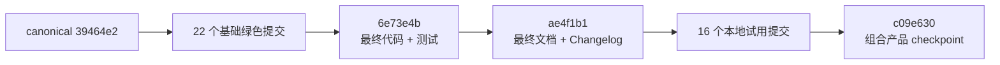

# 当前阶段组合、产品试用与门禁证据

## 0. 结论

截至 2026-08-21，本阶段已经形成一个可由用户在本机直接启动、观察和停止的
“人 + Agent 原生群聊协同”产品切片：一句群聊式指令会被编译为三节点 DAG，三个合成 Agent
依赖执行，平台返回 3 个版本化 Artifact、25 个有序事件和 0 个 Needs You blocker。启动脚本、
中文入手教程、完整 HTML 产品页、三张内联 SVG 系统图、桌面与移动端浏览器证据均已进入仓库。

本阶段结论分成两层，不能混用：

| 层级 | 结论 | 证据边界 |
|---|---|---|
| 本地产品核验 | **READY FOR USER TRIAL** | 已落地实际 main；loopback-only、合成数据、内存 SQLite、无外部模型、无真实 connector |
| 生产、私有试点、商用或 GA | **NO-GO** | Gate A–E 全部关闭；本报告不构成 promotion、发布批准或生产安全背书 |

没有向飞书、企微的任何人、群、机器人或 webhook 发送消息；没有执行询问、回复、评论、@、
上传或其他写操作。本轮也没有恢复 Notion/语雀同步，没有 push。

## 1. 固定源码身份

### 1.1 已独立复核的输入候选

| 输入 | commit | tree | 独立结论 |
|---|---|---|---|
| Backup-v2 | `0b044d0dd63af9a9f6f981dc329b06f141558c27` | `4abe18c1d4c3dc81aece06be1be92751d59edf04` | ACCEPT；focused 66/66，P0–P3 无阻断 |
| Event-store process binding | `80dad143e7d5bf801566c45c1b0966be5186bba5` | `56bb4b7687232988ba476ad4dbcdba27c8fa3d11` | ACCEPT；focused 37/37，P0–P3 全 0 |
| Authorization 最终候选 | `1dd4247b0a1b9b6171a9a7c4512e891dbe463578` | `0eb648fe674828f8232186531ed6557477ffd245` | ACCEPT；P0/P1/P2/P3 = 0 |
| Authorization 冻结代码点 | `a60245a358465d3990cef69f8ef39290df527fdd` | `b75cbd5cc0526ff5fbd691dea63b24a99bc6b1a1` | 96 operation tests；后两提交仅修证据文档 |
| 本地产品试用 | `8dfff5e99cf86b94e2993be0934cfed064275180` | `9011f2d1be856b6210afb72f099ec8ca1ca552cf` | ACCEPT；P0/P1/P2/P3 = 0 |

上表的最终 ACCEPT 中，Event-store 已在既有 Git 文档中记录；Backup-v2、Authorization 和本地
产品试用的最终结论来自本任务内未参与对应实现的只读 reviewer，本报告是三条结论第一次进入
tracked Git 文档：

| reviewer 记录 | 固定对象 | 结论 |
|---|---|---|
| `backup_v2_lifecycle_review_v2` | `0b044d0` / `4abe18c` | ACCEPT；三版本 focused 66/66、full 971/971 |
| `concurrency_release_review` | `1dd4247` / `0eb648f` | ACCEPT；P0/P1/P2/P3 = 0；Gate A 保持关闭 |
| `local_trial_independent_review` | `8dfff5e` / `9011f2d` | ACCEPT；P0/P1/P2/P3 = 0；仅本地产品试用 |

这些 task-local review 记录不是签名、不可篡改 attestation、CI artifact 或组织发布批准。既有候选
文档中“需要 fresh independent review”或记录较早 REJECT 的段落绑定各自更早的 checkpoint；本报告
保留后续结果及其固定 commit/tree，但不删除历史。当前阶段组合仍需对本报告和组合 tree 再做一次
独立只读复核。

这些都是组件或本地产品候选的质量结论，不是 Gate A–E 晋级。组件 ACCEPT 不能自动推出组合系统
具备真实认证、外部 connector、持久部署、容量、HA 或灾备能力。

### 1.2 组合工作树

本轮从 clean canonical checkpoint：

```text
commit 39464e27a8e7ca6f7a30ede1a928359ff6fa0a96
tree   f12eff3fd7cfb5ad8ae4c1857e26002ef26f085f
```

线性集成到本报告写入前的 clean 产品 checkpoint：

```text
commit c09e630773b9908e881d608fedf9507a21ba0279
tree   018b4c81180999551c752e8194dc35d627e8f5c3
```

## 2. 绿色历史集成方法

Authorization 候选包含用于暴露缺陷的红色 reproducer，以及后来被替换的整数线程 ID、
`Thread`/`_DummyThread` wrapper 所有权语义。为了不让默认主线历史短暂落入已知错误状态，
本轮没有 merge 整条候选分支，也没有逐笔搬入这些红色或过时 checkpoint。



具体规则：

1. Authorization 前 22 个始终可运行的基础提交逐笔保留，集成后止于 `e3bf9af`。
2. 7 个 context-exit 代码/测试输入合成一个绿色提交
   `6e73e4b65e91644358b9c3faa9e1f37226c95858`：
   - 保留最终 `threading.local()` library token；
   - 覆盖普通线程、raw alien thread、真实 ident 复用和 `_DummyThread` wrapper 复用；
   - 不把 `20b24ec`、`092a68e` 的先红测试或中间错误实现单独放进主线。
3. 13 个 context-exit 文档输入合成一个最终准确提交
   `ae4f1b114555a92a34bb992a3522a1ec150a62a5`：
   - 删除把可回收整数 ID 或 wrapper identity 当作所有权凭据的过时说法；
   - 记录当前 96/181/920 候选证据与独立审查结论；
   - 保留 Gate A 关闭和本地证据限制。
4. 本地试用的 16 个提交从服务、HTML、脚本、教程到截图刷新逐笔保留。

组合结果相对 `39464e2` 恰好新增 40 个线性提交、无 merge commit。没有 reset、rebase、
force-push 或普通 push。

## 3. Tree 与补丁等值证据

集成后执行了四类独立等值核对：

| 核对 | 结果 |
|---|---|
| Authorization 6 个专属实现/测试/文档文件 vs `1dd4247` | byte/tree diff 为空 |
| 本地试用 14 个路径组 vs `8dfff5e` | diff 为空，包含 4 个 PNG blob |
| candidate + local trial 变更路径并集 vs canonical→组合 | 21/21 路径完全相等 |
| Authorization CHANGELOG 净载荷 vs canonical→组合 | 两侧均使用 `--unified=0`，去除 diff header/hunk 行后完全相等 |

`docs/production/PROTECTED_OPERATION_COMPOSITION.md` 的最终 blob 为
`b1226744985089ccf3b888a9fe7159adc3376ea1`，与独立 ACCEPT 候选一致。

## 4. 三版本完整门禁

所有 full/focused unittest 命令均从当前仓库 `src` 导入并使用 `-S -W error`，避免用户
site-package 污染并把普通 warning 升格为失败；compileall 与 compact demo 使用同一 `-S`
隔离边界，不把 demo 输出混作 warning gate。

| Gate | CPython 3.9.6 | CPython 3.12.12 | CPython 3.13.9 |
|---|---:|---:|---:|
| full unittest discovery | 1106/1106，1 expected skip | 1106/1106 | 1106/1106 |
| Backup topology + manifest-v2 + snapshot-v2 | 66/66 | 66/66 | 66/66 |
| Event-store process identity + binding | 37/37 | 37/37 | 37/37 |
| Authorization + request context + tenancy | 181/181 | 181/181 | 181/181 |
| 本地产品 server + launcher | 12/12 | 12/12 | 12/12 |
| compileall：src/tests/scripts/examples | pass | pass | pass |
| compact 3-Agent demo | pass | pass | pass |

Python 3.9 的唯一 skip 是
`InvocationAttemptStoreTests.test_base_exception_group_is_not_a_trusted_control_signal`；
理由是 `BaseExceptionGroup` 需要 Python 3.11+。它不是线程 ident 复用、fork、备份、event-store、
Authorization 或本地试用用例的 skip。三个 Authorization ident/alien-thread 复用回归均真实执行，
没有把“无法观察到复用”计作通过。

三版 compact demo 的随机 plan/Artifact ID 不同，但稳定业务结果一致：

```text
chatRoute=direct
tasks completed=3/3
artifacts=3
events=25
needsYou=0
errors=0
completed=true
```

## 5. 静态、依赖与仓库门禁

| Gate | 结果 |
|---|---|
| Ruff 0.16.3 lint | pass |
| Ruff 0.16.3 format | 105 files already formatted |
| mypy 1.19.1 `--strict --python-version 3.9` | 39 source files，0 issues |
| dependency-lock verifier | 4 targets / 74 package records，verified=true |
| `sh -n scripts/start_local_trial.sh` | pass |
| `git diff --check` | pass |
| screenshot manifest | 14 items；hash、byteSize、dimensions 0 mismatch |
| high-confidence credential-shape scan：canonical→组合新增内容 | 0 match |
| high-confidence credential-shape scan：完整 tracked tree | 2 个既有 synthetic redaction canary，集中在 1 个测试文件 |
| `git fsck --no-reflogs --strict` | exit 0；仅共享对象库既有 dangling objects，无 missing/corrupt/fatal |

扫描只记录计数和已知 synthetic fixture 边界，不输出任何匹配值。报告、日志、提交和回复均不
保存或复述完整 API Key。

## 6. 本地产品运行证据

本地体验的源代码与浏览器截图绑定 Git commit
`8e4d8d7990d536ce78c1e65c5a3eb77bafc54c24`。最终截图归档分支为 `8dfff5e`；可由 tracked
图片、manifest 和 Git blob 复核的结论是：

- 14/14 图片的 SHA-256、字节数、像素尺寸与 manifest 相等；
- 4/4 本地产品截图与对应 Playwright 源 PNG 逐字节相等；
- 桌面初始态、桌面完成态、390×844 移动态、系统图均无异常裁切或横向溢出；
- 完成态为 3 completed tasks、3 Artifacts、25 events、0 blockers；
- 页面无外部资源，动态值使用 `textContent`；
- 新截图、文档和 snapshot 未发现模型凭据或临时页面令牌标记。

同一固定代码点的 task-local Playwright 运行还观察到控制台 0 error/0 warning、所有页面/API
请求均为 loopback，且 cookie、localStorage、sessionStorage 全空。工具列表明确显示页面与
`/api/demo`；服务也实现了可能由浏览器访问的 loopback `/favicon.ico` 204 路由，因此这里不把
请求集合缩写成只有两个 path。这些项目没有单独 tracked console/network/storage log，不能由
PNG 像素证明；它们是本任务 reviewer 的运行观察，不是 retained browser attestation。实际 main
落地后已按第 9.3 节重新执行启动和协议探针；该探针仍不等于 retained browser attestation。

截图证据见：

- [`10_local_trial_desktop_idle.png`](../screenshots/10_local_trial_desktop_idle.png)
- [`11_local_trial_desktop_complete.png`](../screenshots/11_local_trial_desktop_complete.png)
- [`12_local_trial_mobile_complete.png`](../screenshots/12_local_trial_mobile_complete.png)
- [`13_local_trial_architecture_diagrams.png`](../screenshots/13_local_trial_architecture_diagrams.png)
- [`screenshots/manifest.json`](../screenshots/manifest.json)

## 7. 用户入手入口

完整中文教程：[`docs/LOCAL_PRODUCT_TRIAL.md`](../../docs/LOCAL_PRODUCT_TRIAL.md)。

本报告初稿写入时，实际 `main` 仍是 `ced85607f551b7951b9113c39e377389176fc5f2`；随后第 9 节
记录的无损 merge 和实际路径探针已经完成。下列命令现在是已验证入口：

```bash
cd /Users/lwblx/huapohen/agent/execute/infinite/quantum_entanglement
./scripts/start_local_trial.sh
```

脚本要求 Python 3.9+，不安装第三方依赖，默认只监听 `127.0.0.1:8765`，并自动打开本地页面。
页面首次读取本次服务专属 fragment 后会立即清除地址栏中的 fragment。停止时回到启动终端按
`Ctrl-C`。

可选模式：

```bash
./scripts/start_local_trial.sh --no-open
./scripts/start_local_trial.sh --port 8877
./scripts/start_local_trial.sh --cli
./scripts/start_local_trial.sh --help
```

不要双击 `index.html`，也不要把启动 URL 或临时页面令牌保存进报告、截图、Git 或聊天消息。

## 8. 仍然关闭的生产边界

| Gate | 当前状态 | 关键未完成项 |
|---|---|---|
| A：离线可信内核 | closed | 全仓 composition、真实认证/成员目录、完整 scope 与 retained release decision 未闭环 |
| B：隔离 E2E | closed | 真实 receipt/stream/lifecycle、connector sandbox 与隔离环境端到端证据不足 |
| C：私有试点 | closed | 部署、真实备份恢复演练、RTO/RPO、值班与回滚批准未完成 |
| D：有限商用 | closed | 容量、可观测性、租户隔离、长时 soak、成本与故障预算未完成 |
| E：多实例 GA | closed | PostgreSQL、HA、Kubernetes、多实例一致性与持续 DR 未完成 |

本地 HTML 中的 Gate A–E 阶梯、`productionApproved=false` 和 `A-E closed` 是产品事实，
不是占位文案。任何外部消息发送、真实 connector、客户数据、模型凭据、不可逆副作用或公网监听
都需要新的明确授权、设计、测试、独立审查和阶段晋级；本阶段一律不执行。

## 9. 实际 main 落地与本阶段停点

### 9.1 无损合并

实际主仓原 HEAD `ced85607f551b7951b9113c39e377389176fc5f2` 上有 41 个本地
Yuque-sync 提交。只读三方预演确认两侧变更路径交集为 0，随后使用普通 `--no-ff` merge 生成：

```text
merge commit ce28d30ed62b8278324725688b50c7409bddbd7f
merge tree   dcd02aa0ab7cf100849696d48524193ed2f9e213
parent 1     ced85607f551b7951b9113c39e377389176fc5f2
parent 2     e21654a0666331c28739a76ef142df3b78f82184
```

merge tree 与预演 tree 精确相同；两个 parent 都是新 main 的 ancestor。原 41 个 Yuque-sync
提交完整保留在第一父历史中，组合侧没有改写 `analysis_report/yuque_sync/` 路径。没有 reset、
rebase、force-push 或 push。

### 9.2 实际 main 三版本复验

合并后的实际 main tree 再次执行完整 `-S -W error` discovery：

| CPython | 结果 |
|---|---:|
| 3.9.6 | 1106/1106，1 个 Python 版本能力预期 skip |
| 3.12.12 | 1106/1106 |
| 3.13.9 | 1106/1106 |

同一实际 tree 的 Ruff lint、105-file format、strict mypy 39 files、dependency locks 4/74、
shell syntax、14-item screenshot manifest 和 `git diff --check` 也全部通过。

### 9.3 启动脚本与 HTTP 产品探针

实际主仓路径使用 `./scripts/start_local_trial.sh --no-open` 启动。server 按设计把一次性启动 URL
写入自己的 stdout；校验进程把 stdout 捕获在内存管道中，只解析令牌但不向工具输出或用户界面
回显，并仅通过 loopback `X-QE-Trial-Token` 请求头回送同一服务。令牌没有写入文件、报告、Git、
聊天或外部网络；`--no-open` 避免抢占用户浏览器。观测结果：

```text
GET /                         -> 200
POST /api/demo without token -> 403
POST /api/demo valid token   -> 200
task statuses                -> research/design/review completed
artifacts                    -> 3
events                       -> 25
needsYou                     -> 0
errors                       -> 0
completed                    -> true
externalMessaging            -> false
persistentStorage            -> false
productionApproved           -> false
gateStatus                   -> A-E closed
server exit code             -> 0
loopback port after stop     -> closed
```

返回页包含 CSP，HTML 不引用 `https://` 外部页面资源。该探针验证启动脚本、loopback HTTP 边界和
真实本地 demo 投影；最终视觉布局仍由第 6 节绑定的桌面/移动端 Playwright 证据承担。

### 9.4 停点

本阶段代码、报告、HTML、系统图、启动脚本、教程、截图、组合门禁和实际 main 启动复验均已完成。
服务已经停止，监听端口已关闭。现在停止继续开发，等待用户核验；不继续开启新的生产化模块，
不 push，不恢复 Notion/语雀同步，也不向飞书或企微发送任何消息。
