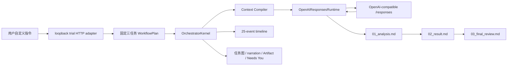

# 自定义指令与真实模型三 Agent 验收证据

更新日期：2026-08-26（Asia/Shanghai）

实现基线：`886aedc097e8ad371eea89ca0fa568bcc58ac9a0`

截图归档提交：`b9c6c4df69522f8ca190692545c79bf3dfd5da41`

证据等级：本地 runtime 产品证据；非生产晋级证据

## 1. 结论

当前产品试用已经支持用户在页面中输入任意自定义指令，并把该指令交给一个真实配置的
OpenAI-compatible GPT 模型，依次执行 `researcher → architect → reviewer` 三个 Agent 任务。
一次已归档验收产生：

- 3 个完成的 Agent task；
- 3 段由模型返回的独立 narration；
- 3 个可预览、下载并校验 digest 的 Markdown Artifact；
- 25 个平台事件；
- 1 张 1280×7338 的完整页面截图；
- 严格 JSON API、loopback-only listener、临时访问 token、Host/Origin/Fetch Metadata 防护；
- provider 失败时显式失败，不把 partial SSE 或 synthetic fallback 冒充成功。

这关闭了“页面只能运行固定示例、不能输入自定义指令”和“产品只有合成 Agent、没有真实模型”
两个体验缺口。它没有关闭 durable invocation、认证、多租户、Harness、部署或生产 Gate。

## 2. 用户可见执行路径



页面允许改变的是业务指令。当前团队拓扑仍固定为三个 Agent 串行 DAG，不是模型动态规划团队，
也没有让模型自行扩大权限、添加工具或发送外部消息。

## 3. 实现提交链

| Commit | 行为 | 验证边界 |
|---|---|---|
| `e0088ec` | dependency-free OpenAI Responses 流式 runtime | SSE 解析、超时、响应上限、错误消毒、断流失败、close/drain |
| `369cca0` | 自定义指令进入三 Agent DAG | 分析、生成、复核依赖；三段 narration；三个 Artifact |
| `47f5c9b` | 页面和 HTTP adapter 暴露模型试用 | 自定义输入、严格 JSON、Artifact 预览/下载、digest 回读 |
| `8bea6f0` | 启动脚本接入 GPT 配置 | 默认模型模式；缺配置/调用失败显式报错；synthetic 必须显式选择 |
| `886aedc` | 补齐验收与故障排查教程 | 启动、指令、API key 配置位置、模型/Harness 边界 |

五个提交都已推送到私人 GitHub `main`。实现之后的生产文档校准与截图归档使用独立提交，避免
把“真实模型页面可运行”与“生产批准”混成一个结论。

## 4. 真实验收输入与结果

归档验收使用的测试指令为：

> 验收指令 2026-08-26：请设计一个人与三个智能体协同完成周报的最小工作流，列出三项可验证的验收标准。

本轮执行记录：

| 项目 | 结果 |
|---|---|
| runtime mode | `model` |
| runtime adapter | `openai-responses` |
| model alias | `gpt-5.6-sol` |
| task statuses | `research=completed`、`design=completed`、`review=completed` |
| events | 25 |
| Artifacts | 3 |
| Needs You | 0 |
| task errors | 0 |
| input tokens | 3,251 |
| output tokens | 2,114 |
| total tokens | 5,365 |
| reasoning tokens | 449 |

Token 数来自三个 provider 响应 metadata 的本地快照求和。它可用于复核本次页面投影，不是计费
账单，也不证明 provider 未来会返回相同文本。

### Artifact 完整性

| Artifact | Task | SHA-256 |
|---|---|---|
| `01_analysis.md` | `research` | `c216f4a136d11d922429028f1d9b0c3d67f4183072bae3fcf440e6b40f100aa5` |
| `02_result.md` | `design` | `785f168b1535c27756a5b72997d2f28f5818fc583db6eb445668e2745f604393` |
| `03_final_review.md` | `review` | `72ee22b14071f56ae989825a43c799502b1f1c4422fa700495ef196036a6c48d` |

页面显示的 digest、原始 JSON 中的 Artifact digest 和下载内容计算值在验收时一致。Artifact ID、
session ID、plan ID 和 provider response ID 是该轮临时标识，不在本报告中作为稳定身份传播。

## 5. 事件链证据

每个任务都遵循当前非 durable 的标准事件顺序：

```text
task.status.changed → RUNNING
context.compiled
task.invocation.started
artifact.versioned
task.result.received
task.status.changed → COMPLETED
```

第一项任务在 plan/task creation 和 initial-ready 之后执行；第二、三项由依赖刷新进入 READY。
完整一轮共 25 个事件。这证明页面投影来自 `OrchestratorKernel` 的真实事件流，而不是浏览器前端
硬编码三个成功卡片。

但该顺序仍不是 crash-safe transaction：`RUNNING`、attempt ownership、模型调用、Artifact、
result acceptance 和 terminal status 尚未由 durable receipt 串联。进程在不同边界崩溃时，现有
runtime 会保留或拒绝 unreconciled `RUNNING`，不能自动证明是否应重试。

## 6. 截图证据

归档文件：

```text
analysis_report/screenshots/14_model_backed_custom_instruction_gpt.png
```

证据属性：

| 字段 | 值 |
|---|---|
| 尺寸 | 1280×7338 |
| 字节数 | 1,914,763 |
| SHA-256 | `018edf7c3728530f4cb03b7a115dfc4e46bf53963c1efb06fbfb1638f9f492b8` |
| 实现 commit | `886aedc097e8ad371eea89ca0fa568bcc58ac9a0` |
| 首次 Git 归档 | `b9c6c4df69522f8ca190692545c79bf3dfd5da41` |
| 分类 | `restricted-internal` |

截图包含测试指令、模型产出、任务图、Artifact、事件和架构图。归档前对源 snapshot 扫描了常见
credential 字段和 `sk-...` 形态，未发现 API key；截图仍包含生成文本和 opaque run identifiers，
因此保留内部受限分类，不能公开分发。

截图能证明的只有该 commit 上一次本地运行的可见像素。它不能证明 provider 身份、远端服务
可用率、重复运行一致性、完整浏览器矩阵、生产部署或安全晋级。

## 7. HTTP 与浏览器安全边界

当前示例 server 已实现：

- 只绑定 loopback；
- 每次启动生成高熵临时访问 token；
- 拒绝不受信任 Host、Origin 和 Fetch Metadata；
- 限制请求体字节数；
- 只接受严格 JSON object 和固定 schema；
- 串行限制本地模型运行，避免无界并发消费；
- 页面和 API 都明确返回 `productionApproved=false`、`gateStatus=A-E closed`；
- 缺失模型配置或 provider 调用失败时返回明确错误；
- 只有显式 `--synthetic` 才使用离线 fixture。

当前仍缺：

- 真实用户认证与 tenant/workspace identity；
- `/api/v1`、OpenAPI、command receipt、persistent audit；
- rate/tenant/provider quota；
- `/livez`、`/readyz` 和依赖 preflight；
- SIGTERM admission stop、bounded drain 和 lease relinquish；
- resumable event stream；
- production `SecretRef → SecretProvider` composition；
- provider URL allowlist、DNS/IP revalidation 和统一出网策略。

因此临时 token 只是一道本机访问门，不是用户身份认证。

## 8. 模型凭据证据边界

本地 `.env` 被 Git 忽略，验收机器上的文件权限为 `0600`。代码、提交、截图索引和本报告没有
记录完整 API key。调试与报告只允许使用 key 前缀、长度和 SHA-256 短指纹识别凭据；key、base
URL 和 model 必须成套匹配，修改 `.env` 后必须彻底重启进程。

当前试用 server 仍把 `.env` 中的 key 读成同进程 Python 字符串，再构造 runtime。这是开发适配
路径，不满足生产 secret contract。正式 composition 必须接入已有 `SecretRef`、受控 provider、
进程边界、最小环境和 secret-canary 验证。

## 9. DeepSeek Harness 的准确状态

本轮验收没有通过官方 DeepSeek Harness 执行。当前真实路径是：

```text
OrchestratorKernel
  → AgentRuntimePort
  → OpenAIResponsesRuntime
  → OpenAI-compatible /responses
```

已吸收的 Harness 思想：

- 确定性协作/治理层在外，模型 runtime 可替换；
- 模型可见上下文先由平台编译并记录；
- session、task、Artifact、approval、event 由平台持有；
- `DeepSeekHarnessRuntime` 已有显式 factory port、session gate、并发和 lifecycle 骨架。

尚未实现的真实 Harness 能力：

- 官方 runtime/sidecar 进入制品；
- 固定源码和 binary/config digest；
- 最小权限 Cordis composition；
- Harness session JSONL、tool/model loop 和 event span；
- attempt ID、prompt message ID、session ID 和 durable receipt 绑定；
- spawn/exec 最小环境、进程隔离、超时终止和 stderr 消毒；
- RuntimeEvent 增量映射到平台事件和 UI；
- shell/filesystem/MCP/connector 工具默认空集合的可验证证明。

因此当前产品应把运行模式命名为 `direct-responses`，把未来真实 Harness 模式命名为
`harness`，并保留 `synthetic` 作为显式离线 fixture。三者不得隐式互相回退。

## 10. 自动化门禁证据

实现基线的本地门禁结果：

- 1,147 项全仓测试通过；
- Ruff lint 通过；
- strict mypy 通过；
- compileall 通过；
- 浏览器 Playwright 自定义指令验收通过；
- Artifact preview/download/digest 回读通过；
- 工作树在验收提交时干净。

GitHub `main` 上对应 CI 和 Package workflow 均成功。该结果证明已提交功能在记录矩阵中可运行，
不能替代 crash kill、security、capacity、soak、restore 或 promotion evidence。

## 11. 下一里程碑

按安全依赖顺序推进：

1. 建立同一 SQLite 事务的 `RUNNING task + durable queued invocation` admission UoW；
2. 建立原子 claim/start evidence，接入 heartbeat、lease loss 和 shutdown drain；
3. 首先只允许 `pure/no_external_effect` 模型 Agent；
4. 持久化 attempt-bound result manifest/receipt，再投影 Artifact 与 terminal task state；
5. 在每个 durable 边界执行 kill/restart、重复、stale lease 和 tamper 测试；
6. 接入 `ServiceConfig + SecretProvider` 和可信 process composition；
7. 构建 source-pinned、最小权限、model-only DeepSeek Harness sidecar；
8. 最后再为真实 connector 设计 receiver action receipt；飞书/企微发送仍然禁止。

完成上述切片后，只能称为“单节点 crash-safe 模型调用候选”。可信认证、全仓 tenant scope、正式
API、部署、容量、OTel、soak、PostgreSQL/HA/DR 仍需按 Gate A–E 独立关闭。

## 12. 复核入口

```bash
cd /Users/lwblx/huapohen/agent/execute/infinite/quantum_entanglement
./scripts/start_local_trial.sh
```

浏览器提交任意指令后，应看到三个 task 完成、三段 narration、三个 Markdown Artifact 和 25
个事件。离线 fixture 必须显式运行：

```bash
./scripts/start_local_trial.sh --synthetic
```

完整操作与故障排查见 `docs/LOCAL_PRODUCT_TRIAL.md`；生产边界见
`docs/production/SERVICE_BOUNDARY.md`、`CURRENT_READINESS.md` 与 `THREAT_MODEL.md`。

