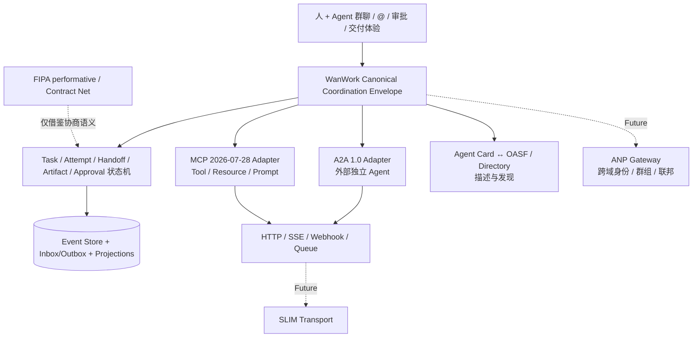

# 六种 Agent 协作协议的边界与 WanWork 底层协议建议

> 调研截止：2026-08-26（Asia/Shanghai）。协议事实以官方规范、官方仓库和正式发布页为准；架构判断与产品建议单独标注。

## 0. 结论

六项方案不是六个可以互相替换的“Agent TCP”。它们分别占据任务互操作、工具接入、网络身份、目录、传输和协商语义等不同层级：

- **A2A 1.0** 是当前对接外部独立 Agent 应用的首选协议；
- **MCP 2026-07-28** 负责 Agent/模型应用到 Tool、Resource、Prompt Server 的接入，不承担组织协作；
- **BeeAI Agent Communication Protocol（ACP）** 已并入 A2A，只保留存量迁移价值；
- **ANP 1.1** 面向 Agentic Web 的身份、命名、发现、安全消息与联邦，长期价值高，但现阶段不应成为产品内核依赖；
- **AGNTCY** 是 OASF、Directory、SLIM 等发现和安全传输基础设施的组合，不定义完整的任务协作语义；
- **FIPA ACL / Contract Net** 的 performative 与招投标状态机仍值得借鉴，但不适合整体复活为现代云端 wire stack。

WanWork 的推荐形态是：

> **内部 Canonical Coordination Envelope + 持久化状态机是领域真相；边缘使用 A2A、MCP、OASF/Directory 等版本化适配器；HTTP/SSE/Queue 是近期传输，SLIM/ANP 只在跨组织、E2EE 或联邦需求成立后引入。**

这不是自创另一套公网协议。自研边界仅限于 WanWork 必须拥有的组织语义：人和 Agent 的身份归属、群聊与 @、Task/Attempt、Handoff 验收、Artifact 版本、上下文清单、审批、预算、权限、幂等、因果、审计和恢复。

## 1. 调研口径与名词消歧

本文选择的六项，刻意覆盖六个不同协议层，以回答“能否替代”和“如何组合”，而不是简单罗列热度。

“ACP”必须展开全名：

1. 本文六项之一是 IBM/BeeAI 发起的 **Agent Communication Protocol**，其官方仓库已归档并宣布并入 A2A；
2. 另一个 **Agent Client Protocol** 用于代码编辑器与 Coding Agent 通信，当前稳定 wire protocol 为 1。它是 `Editor/Client ↔ Coding Agent` 边界，不是业务 `Agent ↔ Agent` 协议，因此不计入六项，也不应与旧 BeeAI ACP 共用 adapter 名称。

LangGraph `Command/Send`、OpenAI Agents SDK handoff、AutoGen topic/team、CrewAI Crew/Flow、Deep Agents subagent task 都是框架内 API 或运行时抽象，不天然构成跨厂商 wire protocol，也不计入六项。

## 2. 六项协议边界总表

| 项目 | 所处主层 | 核心协作对象 | 主要覆盖 | 明确不覆盖 | 当前判断 | WanWork 决策 |
|---|---|---|---|---|---|---|
| A2A 1.0 | Agent 应用互操作 | Client Agent ↔ opaque Remote Agent | Agent Card、Message、Task、Artifact、进度、取消、流式/推送、多种 binding | 内部 DAG、租户/组织授权、Artifact 业务版本、审批与全局审计 | 成熟度和生态最强的对外 Agent 协议 | **采用，MVP/P1** |
| MCP 2026-07-28 | 能力与上下文接入 | Host/Client ↔ Tool/Resource/Prompt Server | stateless per-request capability、tools、resources、prompts、MRTR、可选 Tasks extension | Agent 团队责任、handoff 验收、跨 Agent 组织治理、业务状态真相 | 与 A2A 互补，不是竞品；Roots/Sampling/Logging 已 deprecated | **采用，MVP/P1** |
| BeeAI ACP | 旧 Agent 互操作 | Client ↔ Agent Run/Session | Manifest、Run、MessagePart、Await、同步/流式/后台运行 | 新生态演进；也不拥有 WanWork 内部治理 | 仓库已归档，官方已并入 A2A | **只做存量迁移** |
| ANP 1.1 | Agent 网络协议族 | 跨域 Agent/群组/服务 | DID/WNS、描述、发现、协议协商、安全消息、群组/联邦、支付协议 | 平台内部任务图、业务事务与组织审计；部分规范仍为 draft | 更接近“Agent 互联网”，复杂度和生态仍在演进 | **观察并预留 adapter** |
| AGNTCY | 发现和传输基础设施 | Record/Directory/Message Transport | OASF 能力描述、分布式目录、可验证声明、SLIM 可靠会话/E2EE/组通信 | A2A Task/Artifact 语义、WanWork Handoff/Approval 状态机 | 不是单一协议；适合补充 A2A/MCP | **OASF 可映射；SLIM 后置** |
| FIPA ACL / Contract Net | 通信行为与协商语义 | Initiator ↔ Participants | request/inform/propose/accept-proposal/reject-proposal/failure、conversation、招标/投标/授予 | 现代 Web 认证、流式多模态、云部署、事件恢复和主流 SDK 生态 | 语义模型仍有价值，完整栈已不合时宜 | **借语义，不复活 wire stack** |

最关键的组合/替代关系：

- **A2A 与旧 ACP 是替代/迁移关系**；新系统不应双主线建设；
- **A2A 与 MCP 是互补关系**；前者把对方视为自主 Agent，后者把对方视为被调用能力；
- **A2A 可以运行在 SLIM 一类传输之上**；SLIM 不替代 A2A application semantics；
- **A2A Agent Card 可以映射为 OASF Record 并发布到 Directory**；OASF/Directory 不执行任务；
- **ANP 与 A2A 在发现和消息上部分重叠**，但 ANP 的目标范围更大，包含身份、联邦、E2EE 和支付；
- **FIPA performative 可成为内部 payload 语义**，不应要求所有外部参与方部署 FIPA 平台。

## 3. 六项协议逐项分析

### 3.1 A2A 1.0：外部独立 Agent 的主协议

截至核验日，A2A 官方最新 release 为 `v1.0.1`，wire compatibility 使用 `Major.Minor`，因此线上协商值是 `1.0`。A2A 1.0 把协议分为抽象数据模型、抽象操作、protocol binding 三层；官方规范提供 JSON-RPC、gRPC、HTTP+JSON/REST binding，并支持自定义 binding。

其核心对象是：

- Agent Card：身份、能力、skills、接口和安全方案；
- Message/Part：输入与多轮交流；
- Task：服务端生成、可长期运行的远端工作单元；
- Artifact：Task 的结果；
- 状态更新、Artifact 更新、轮询、SSE 订阅和 webhook push；
- Task 查询、分页、取消和 extended Agent Card。

边界判断：A2A 的“Task”是远端 Agent 对一次交互的执行状态，不是 WanWork 的内部责任单元。WanWork `WorkflowTask`、`TaskAttempt` 与 A2A `taskId/contextId` 必须分开建模，通过 `RemoteTaskBinding` 关联。远端返回 completed 也只能成为本地验收事件的输入，不能直接越过 Artifact 校验、权限、审批和本地状态机。

### 3.2 MCP 2026-07-28：工具/数据协议，不是团队编排协议

MCP 当前稳定规范版本为 `2026-07-28`。它以 Host、Client、Server 为基本关系，并把核心改为 stateless request/response：`initialize/initialized` 握手、协议 session 和 `Mcp-Session-Id` 已退出；每个请求的 `_meta` 中 `protocolVersion` 与 `clientCapabilities` 必填，`clientInfo` 可选但客户端 SHOULD 在每次请求中携带。Client 可选调用 `server/discover` 预取 Server 能力。Server 主要暴露 tools、resources、prompts；需要中途输入时使用 Multi Round-Trip Requests（MRTR）。Roots、Sampling、Logging 已 deprecated，只为兼容存量保留，新实现不应依赖它们。

合适边界：文件、数据库、搜索、SaaS API、知识资源、模板和受控工具。每个租户、workspace 或 Agent 可绑定不同 MCP Server 与权限策略。

不合适边界：团队成员关系、DAG、任务责任、handoff 接受/拒绝、Artifact 业务版本、全局预算和业务审计。把自主 Agent 包成 MCP tool 时，若只实现基础 `tools/call`，会压扁长任务、进度、取消和中途输入；2026-07-28 的 Tasks extension 与 MRTR 能补足其中一部分运行语义，但仍不提供 A2A Agent Card、Remote Agent identity、Task/Artifact 互操作与责任承诺。简单能力或明确采用 Tasks/MRTR 的受控场景可以走 MCP；真正远程 Agent 应用仍应优先 A2A。

### 3.3 BeeAI Agent Communication Protocol：仅保留迁移价值

旧 ACP 最新 release 为 `v1.0.3`，仓库已归档，官方 README 明确写明“ACP is now part of A2A under the Linux Foundation”。它曾提供 Agent Manifest、Run、Message/MessagePart、Await 和 Session，支持同步、流式、后台执行与分布式 session。

可继承的设计思想是多模态 Part、显式 Await、session continuity 和 citation/trajectory metadata。不可接受的做法是继续把 ACP 作为与 A2A 平行的新功能主线。WanWork 仅在存在存量 ACP Agent 时提供 `LegacyAcpMigrationAdapter`，将 Run/Session 映射到内部 Attempt/Context 和 A2A 1.0；新增能力只进入 A2A adapter。

### 3.4 ANP 1.1：面向跨域 Agent 网络，暂不进入 MVP 内核

ANP 官方把自身定位为 Agentic Web 时代的协议族。已发布的 1.1 范围包括 `did:wba`、WNS handle、Agent Description、Discovery、端到端即时通信 profiles 和 AP2 payment；meta-protocol 仍是 draft，Messaging 1.2 multi-device 也仍是 draft。

ANP 的长期价值在于跨组织身份、Agent 可解析命名、主动/被动发现、直接/群组安全消息、mention、附件、联邦和支付。它与 WanWork 的远期“跨企业 Agent 群聊网络”高度相关。

现阶段不应让 DID、MLS、多设备 E2EE、跨域联邦或支付成为内部 Task/EventStore 的前提。内部身份先对接企业 IAM/OIDC；Actor、Group、Mention、Attachment、Receipt 设计为可映射 ANP 即可。只有在跨组织协作、端到端加密或联邦成为已确认需求时，才建设 ANP gateway。

### 3.5 AGNTCY：描述、目录和安全传输的组合

AGNTCY 至少要拆成三块理解：

- **OASF**：用 skills、domains、modules 和 extensible record 描述 Agent 能力；适合能力目录，不执行任务；
- **Directory**：发布、发现和匹配 OASF record，并提供 content addressing、签名、可验证声明、版本/关系和分布式同步；
- **SLIM**：面向 A2A/MCP 等上层协议的安全低延迟传输，分为 data plane、可靠 session/MLS E2EE/group membership 和 control plane。

截至核验日，OASF 最新 release 为 `v1.1.0`，Directory 为 `v1.7.0`；SLIM 项目仍活跃并提供 A2A、MCP 和 OpenTelemetry integration。

WanWork 近期只需保存 Agent Card 原文、digest、验证结果，并建立 Agent Card ↔ OASF 的可逆映射。单组织 MVP 用数据库/搜索服务作为 registry、HTTP/SSE/Queue 作为 transport 足够。SLIM 的价值应由跨域规模、严格 E2EE、group membership 或低延迟 SLO 触发，而不是由“协议先进”触发。

### 3.6 FIPA ACL / Contract Net：把协商语义带回来，不把旧平台带回来

FIPA ACL message 以 performative 为必填字段，并定义 sender、receiver、content、language、ontology、protocol、conversation-id、reply-with、in-reply-to 和 reply-by 等字段。Contract Net 规定了 `cfp → propose/refuse → accept-proposal/reject-proposal → inform-done/inform-result/failure` 的任务招投标过程，并通过 `reply-by` 表达 reply deadline。

这些语义非常适合未来的 Agent 市场、动态组队、竞价和多候选分派。尤其值得吸收：

- Command 不等于承诺，`request/cfp` 之后需要 `agree/propose/refuse`；
- Handoff 发送成功不等于接收方接受责任；
- proposal 要绑定范围、价格/预算、交付和截止时间；
- `accept-proposal/reject-proposal` 形成可审计的承诺状态；内部事件若使用 `accepted/rejected` 简写，必须明确它不是 FIPA performative 原名；
- failure 与 transport error 必须分开。

但 FIPA 的形式语言/ontology 前提、旧 transport/platform 体系以及有限的现代 Web 生态，不适合作为 WanWork 对外主协议。建议只吸收一个受控 performative 子集和 Contract Net 状态机。

## 4. 推荐的底层协议分层



四层职责应保持稳定：

1. **产品交互层**：群聊、@、参与者、Needs You、未读和交付体验；
2. **内部协调层**：Canonical Envelope、Command/Event/Query/Signal、领域状态机；
3. **外部互操作层**：A2A、MCP、Agent Card/OASF、未来 ANP gateway；
4. **传输与安全绑定层**：HTTP/SSE/Webhook/Queue、未来 SLIM，以及 OIDC/OAuth/mTLS/JWS/Trace Context。

## 5. Canonical Coordination Envelope vNext

### 5.1 Envelope 只承载协调事实，不承载凭据

推荐 header：

```text
specVersion
messageId
messageClass              # command | event | query | signal
messageType               # task.assign / handoff.accepted / artifact.versioned ...
payloadSchema             # 独立 schema id + major/minor

tenantId / workspaceId
sessionId / threadId
senderRef / onBehalfOf
recipientRefs / audience

occurredAt / expiresAt / priority
correlationId / causationId / idempotencyKey
traceparent

policyVersion / dataClassification
capabilityRef             # 只引用已验证能力；不放 bearer token
contextManifestRef / artifactRefs / replyTo
extensions                # 命名空间化、受大小限制、未知项可保留
```

`senderRef`、`onBehalfOf`、`capabilityRef` 和从外部收到的所有 header 都是声明，不是认证证据。Ingress 必须从可信 OIDC/mTLS/service context 绑定真实 principal；每次受保护操作在 action time 重新校验 membership、tenant/workspace、action、resource、expiry 和 revocation。Credential 只存在 vault/connector，不进入 Envelope、Event、Prompt 或 Artifact。

现有 `Authority` 可以保留为“请求的委托意图”，但应改名或在 schema 中明确为 untrusted `delegationIntent`；真正授权只接受 verifier 产生的可信类型或 opaque `capabilityRef`。

### 5.2 Command、Event、Query、Signal 必须分开

| 类别 | 含义 | 持久化/交付规则 | 示例 |
|---|---|---|---|
| Command | 请求某 actor 执行动作，可拒绝 | admission、授权、幂等、持久化 inbox | `task.assign`、`handoff.offer`、`task.cancel` |
| Event | 已发生事实，不可原地撤销 | append-only、单 stream revision、可重放 | `task.accepted`、`artifact.versioned`、`approval.decided` |
| Query | 无副作用读取 | 可缓存，不改变领域状态 | `task.get`、`artifact.list` |
| Signal | 可丢失瞬时信号 | bounded、可采样、不必进入主事件流 | typing、heartbeat、非关键 token delta |

不要继续用单个 `kind=handoff` 同时表达 offer、accept 和 result。最小协商事件应包括：

```text
handoff.offered
handoff.accepted | handoff.rejected | handoff.revision_requested | handoff.expired
task.started | task.waiting_input | task.completed | task.failed | task.canceled
artifact.versioned | artifact.accepted | artifact.rejected
```

`HandoffContract` 至少绑定 goal、acceptance criteria、deliverables、inputs/context refs、constraints、authority intent、预算、deadline、producer、consumer 和 contract digest。任何实质修改生成新 revision/digest，不能静默改写已接受合同。

### 5.3 本地 Task、Attempt 与远端 Task 分离

建议增加：

```text
WorkflowTask       # 组织责任与依赖
TaskAttempt        # 一次可租约、可 fencing 的实际执行
RemoteTaskBinding  # protocol, adapterVersion, remoteAgentId,
                   # remoteTaskId, remoteContextId, lastRemoteRevision/status
```

一个本地 Task 可以因 retry 对应多个 Attempt；一个 Attempt 可以绑定一个远端 A2A Task。远端状态只能通过归一化事件推进本地 projection，不能复用同一个主键，也不能覆盖本地状态。`transport accepted`、`remote working`、`remote completed`、`artifact verified`、`local accepted` 是不同状态。

### 5.4 可靠性语义

- 承诺 **at-least-once delivery + idempotent effect**，不要宣称网络 exactly-once；
- ingress 使用 transactional inbox 和 `(tenant, operation, idempotencyKey)` 唯一约束；
- Event 与 Outbox 在同一事务提交；publisher 使用 lease epoch/fencing token；
- 只保证单 aggregate/stream 顺序，不承诺无必要的全局顺序；
- 每个 stream 使用单调 revision/CAS，事件历史通过 upcaster 演进，不原地改写；
- SSE/Webhook 断线不等于任务失败；通过 cursor、remote task 查询和 reconciliation 恢复；
- 大 Artifact 只传 URI、media type、size、digest、producer、version 和 provenance；
- 重放只重建状态，不自动重放外部副作用；
- 外部 effect 状态至少区分 `proposed → authorized/approved → dispatched → accepted_confirmed | accepted_unconfirmed | failed → compensated`。

### 5.5 外部适配器只做边界翻译

| Adapter | 责任 | 禁止事项 |
|---|---|---|
| A2A 1.0 | Agent Card 校验、版本/binding 协商、Message/Task/Artifact 映射、stream/push reconcile | 用 remote Task 代替本地 Task；把完整内部 Envelope/权限策略无筛选发送给外部 |
| MCP 2026-07-28 | per-request capability、可选 `server/discover`、tool/resource/prompt、MRTR、consent、数据分级、action-time policy；Tasks extension 按需启用 | 让 MCP tool 获得 ambient credential；把 tool/Task success 当业务验收；新建 Roots/Sampling/Logging 依赖 |
| Legacy ACP | 存量 Manifest/Run/Session 到内部模型/A2A 的迁移 | 新增主线能力或与 A2A 双写为长期架构 |
| OASF/Directory | Agent Card/内部能力记录的映射、签名和目录发布/查询 | 承担 Task 执行状态 |
| ANP/SLIM | 未来跨域 identity/messaging/transport binding | 反向污染内部领域模型，或让 DID/MLS 成为 MVP 必选依赖 |

## 6. 对当前 `quantum_entanglement` 实现的具体判断

当前代码已经具备正确方向上的骨架：`CoordinationEnvelope`、causation、idempotency、trace、`HandoffContract`、`ArtifactRef`、Task DAG、事件存储与 A2A 数据映射。当前仍是 pre-production 内核，不能描述为已经完成 A2A/MCP 互操作。

| 优先级 | 当前差距 | 建议 |
|---|---|---|
| P0 | `A2AJsonRpcAdapter` 仍发 `message/send`、`tasks/get`、`tasks/cancel`，测试卡片声明 `0.3.0`；A2A 1.0 JSON-RPC 使用 `SendMessage`、`GetTask`、`CancelTask`，且要求 `A2A-Version: 1.0` | 不在旧 adapter 上打零散补丁；按 version codec 重建 1.0 adapter，并用官方 SDK/TCK/golden fixtures 做合同测试 |
| P0 | adapter 把完整 `wanworkEnvelope` 放入 data part，可能泄露内部 authority、上下文和组织元数据 | 建立明确 allowlist 的 `A2APublicTaskExtension`；只发送完成远端任务所需的最小字段，内部 Envelope 留在本地 mapping table |
| P0 | `Authority` 位于可反序列化 Envelope 内，虽已有注释说明不可信，但容易被下游误用 | 分离 `delegationIntent`、`capabilityRef` 与服务端 verifier 产生的 `VerifiedCapability`；protected operation API 禁止接收裸 `Authority` |
| P1 | `EnvelopeKind` 仅有笼统的 `HANDOFF`；`TaskGraph` 没有 offer/accept/reject/revise 协商状态，`OrchestratorKernel` 则在调用前置为 `RUNNING`、收到 `AgentResult` 后置为 `COMPLETED` | 增加显式 Handoff 协商状态机与 contract revision/digest，避免把一次调用生命周期等同于责任承诺 |
| P1 | Envelope 缺 tenant/workspace、message class、payload schema、on-behalf-of、policy version 和 data classification | 发布 `qe.agent-envelope/0.2`，payload 独立版本；用 upcaster 兼容 0.1，不改写历史 |
| P1 | 尚无 `RemoteTaskBinding` 和远端状态 reconciliation | 单独持久化 A2A task/context/binding/version/cursor；stream 断开后回查再推进本地状态 |
| P1 | MCP adapter 尚未实现 | 先做 stateless per-request metadata、可选 `server/discover`、read-only Resource 与低风险 Tool slice，再接 MRTR consent/input flow、可选 Tasks extension 和副作用 receipt；Roots/Sampling/Logging 只做存量兼容 |
| P2 | Agent Card 是早期稳定子集，尚无正式签名/缓存/SSRF/版本验证闭环 | 保存原文、ETag、fetch time、digest、验证结果；限制 URL、redirect、DNS/IP 与大小；支持 1.0 多 binding |
| P2 | 事件模型仍以自由字符串 event type/payload 为主 | 引入 payload registry、严格 schema、未知字段策略、upcaster 和 replay contract suite |

特别要修正现有研究材料中的旧叫法：A2A 1.0 的方法名是 PascalCase 操作名；MCP 不仅从 `2025-11-25` 升至 `2026-07-28`，还移除了初始化/session 核心并转为 stateless per-request capability 模型，不能只替换版本字符串。上线前必须以锁定的官方 spec/SDK 重新生成 fixtures，不能依赖“latest”。

## 7. 推荐落地顺序

### 阶段 A：冻结内部语义

1. 写 ADR：内部 Envelope 是 canonical domain contract；A2A/MCP 仅为 adapter；
2. 定义 0.2 header、Command/Event/Query/Signal 与 payload registry；
3. 落地 Handoff offer/accept/reject/revise 和 RemoteTaskBinding；
4. 为 event/outbox/inbox/attempt/effect receipt 定义原子性与恢复不变量；
5. 建立 0.1 → 0.2 upcaster 和 replay fixtures。

### 阶段 B：完成两条 MVP 外部边界

1. A2A 1.0：Agent Card、安全抓取、版本协商、三种 binding 至少选择一种完整实现、SSE/push/reconcile、取消和 Artifact；
2. MCP 2026-07-28：stateless per-request metadata/capability、可选 `server/discover`、tools/resources/prompts、MRTR consent/input flow、data classification、action-time policy；Tasks extension 按需实现，Roots/Sampling/Logging 只做存量兼容；
3. 两者均使用版本锁定的官方 SDK/TCK 或双实现合同测试；
4. malformed/fuzz、重放、乱序、断流、超时、取消竞态、SSRF 和跨租户测试必须 fail closed。

### 阶段 C：发现与市场语义

1. Agent Card ↔ OASF 映射；
2. 内部 registry 先实现检索、版本、签名验证和组织授权；
3. 引入 FIPA 子集：`request/cfp/propose/agree/refuse/accept-proposal/reject-proposal/inform/inform-done/inform-result/failure/cancel`；内部 event name 可用 `accepted/rejected`，但不冒充 FIPA performative；
4. 有 ACP 存量时才开发迁移 adapter。

### 阶段 D：按真实需求引入网络层

只有出现以下任一门槛，才启动 ANP/SLIM PoC：跨组织联邦、严格 E2EE 群组、多设备 Agent identity、跨域可验证发现、现有 HTTP/Queue 无法满足的规模或延迟 SLO。PoC 必须通过 adapter/transport port 接入，不改变内部 Task/Event/Artifact 主模型。

## 8. 最终 ADR 建议

建议正式记录以下决策：

1. **采用 A2A 1.0 作为外部自主 Agent 互操作协议。**
2. **采用 MCP 2026-07-28 作为 Tool/Resource/Prompt 接入协议。**
3. **BeeAI ACP 只迁移，不建设新能力。**
4. **内部 Canonical Envelope 与持久化状态机是唯一组织协作真相源。**
5. **Agent Card 为基础发现格式，允许映射 OASF/Directory。**
6. **FIPA 只吸收 performative/Contract Net 语义。**
7. **ANP/SLIM 延后到跨域/E2EE/联邦需求成立时，以 adapter/transport port 接入。**
8. **身份、安全、事件和追踪复用 OIDC/OAuth/mTLS/JWS、CloudEvents 属性思想、W3C Trace Context/OpenTelemetry，不在 Agent 协议中自造密码学或 bearer 凭据格式。**

## 9. 一手来源

- A2A `v1.0.1` 规范快照：<https://github.com/a2aproject/A2A/blob/v1.0.1/docs/specification.md>；release：<https://github.com/a2aproject/A2A/releases/tag/v1.0.1>
- MCP `2026-07-28` 规范：<https://modelcontextprotocol.io/specification/2026-07-28>；GA 变更说明：<https://github.com/modelcontextprotocol/modelcontextprotocol/blob/main/blog/content/posts/2026-07-28-spec-ga/index.md>
- BeeAI Agent Communication Protocol：<https://github.com/i-am-bee/acp>；最后 release：<https://github.com/i-am-bee/acp/releases/tag/v1.0.3>
- Agent Client Protocol（同名消歧）：<https://agentclientprotocol.com/>；仓库：<https://github.com/agentclientprotocol/agent-client-protocol>
- ANP `v1.1`：<https://github.com/agent-network-protocol/AgentNetworkProtocol/tree/v1.1>
- AGNTCY OASF `v1.1.0`：<https://github.com/agntcy/oasf/releases/tag/v1.1.0>
- AGNTCY Directory `v1.7.0`：<https://github.com/agntcy/dir/releases/tag/v1.7.0>
- AGNTCY SLIM：<https://github.com/agntcy/slim>
- FIPA ACL Message Structure：<https://www.fipa.org/specs/fipa00061/SC00061G.html>
- FIPA Contract Net：<https://www.fipa.org/specs/fipa00029/SC00029H.html>

协议仍在快速演进。生产发布不能只引用本报告的版本快照，必须重新执行 version-pinned adapter contract suite，并保存官方规范/SDK commit、fixture、测试结果和已知差异。
