# Clawith 竞品深研：从“数字员工组织”反推 WanWork 的产品与底层取舍

> 调研截止：2026-08-27（Asia/Shanghai）<br>
> 官网入口：<https://clawith.ai/><br>
> 固定源码：[`dataelement/Clawith@45fc701c366c69f89dff26d91d6a4a9cbc38e6f8`](https://github.com/dataelement/Clawith/tree/45fc701c366c69f89dff26d91d6a4a9cbc38e6f8)<br>
> 固定提交时间：2026-08-25 20:05:07 +08:00<br>
> 固定提交主题：`Merge pull request #1003 from dataelement/refactor/v1.11.5-quality-harness`

## 0. 执行结论

Clawith 是本轮调研中与 WanWork 产品愿景最接近、也最值得逐层拆解的参考之一。它不是单纯的多 Agent 编排框架，而是把 Agent 做成组织里的长期成员，并把身份、群聊、目录、记忆、主动调度、组织经验、模型管理、渠道和私有化部署放进同一套 Web 产品。

最重要的结论不是“照着 Clawith 再做一个”，而是：

1. **产品层应该大胆学习。** Agent 招聘/创建、稳定身份、Directory、Crew 群聊、`@Agent`、Aware/Pulse、Experience Library、模型能力探测和企业设置，已经把抽象的 Agent 技术翻译成普通团队能理解的组织语言。
2. **群聊协作实现尤其值得吸收。** 人与 Agent 统一为 Participant；单 Agent `@` 确定性直达；多 Agent `@` 进入规划；每个 Agent 以自己的 Participant 身份公开回复；`at` 工具只冻结下一条公开回复的 mention intent，而不是偷偷代发。这与 WanWork“Agent 不被主 Agent 冒充”的不变量高度一致。
3. **Aware/Pulse 的正确价值不是再包一层 cron。** 它把长期关注点、结构化 Focus、Trigger occurrence、可恢复 Run、Heartbeat 和主动汇报串成产品语义。WanWork 应借鉴“关注点 → 触发条件 → 一次可追踪执行 → 结果/等待人”的闭环。
4. **Plaza 的固定源码新路径比官网旧文档更值得学。** `/plaza` 前端和 Agent 知识消费主路径已转成 **Experience Library**：AI 可起草，人类审核发布，只有 `published` 内容能被 Agent 检索；可退役、有适用条件、来源和引用/采纳统计。这比让 Agent 自动刷广场更稳健。但 legacy Plaza 表/API 仍在固定源码中注册，旧 Agent 工具还依赖一次性运维脚本撤权，不能写成“旧 Plaza 已从所有部署和数据路径彻底删除”。
5. **不要把 Clawith 的 A2A 当成标准 A2A。** 固定源码中的 A2A 是同一产品内的 `notify / consult / task_delegate` 协作子系统，具备等待、关联结果和恢复机制，但没有发现标准 Agent Card、A2A binding、标准 Task/Artifact API 或官方 SDK/TCK。WanWork 应继续采用“内部 canonical coordination protocol + 标准 A2A 边缘 adapter”。
6. **治理层不能照搬营销口径。** [官方技术白皮书](https://www.clawith.ai/blog/clawith-technical-whitepaper)宣称 L1–L4、全链路审计和每次操作可追溯/回放；固定源码实际是 L1–L3，通用审批对象缺少 tenant、TTL、policy version 和统一 action digest，审计写入是 best-effort 普通表，并非防篡改事件链。它有真实治理能力，但证据不足以支持最强营销表述。
7. **部署默认值不能照搬。** 默认 Compose 给 backend 挂载 Docker socket，并启用 `privileged`、`SYS_ADMIN`、`seccomp=unconfined`、`apparmor=unconfined`。这与企业最小权限沙箱目标冲突，应视为开发/兼容部署权衡，而不是 WanWork 生产安全基线。
8. **Clawith 证明了 WanWork 当前最大短板在产品面，而非协议文档不够多。** Quantum Entanglement 已有更严格的 canonical envelope、Artifact 版本、Needs You/action-scoped authority、外部副作用未知结果/fencing 和协议分层思想；但当前可验收产品仍是本地固定三 Agent 页面，距离多人组织、长期 Agent、群聊协作、主动调度和知识沉淀还有明显差距。

一句话建议：

> **用 Clawith 校准产品形态，用 Quantum Entanglement 的事件、权限、Artifact 和协议纪律守住底层；优先做“组织身份 + 原生群聊 + 主动工作 + 人审经验库”四件套，不复制其宽权限部署、非标准 A2A 命名和不完整的统一审计边界。**

## 1. 证据口径、源码身份与限制

### 1.1 四类表述严格分开

本文使用以下标签：

- **【固定源码事实】**：可在固定 commit `45fc701c…` 的源文件中定位；只证明该源码快照存在相应设计，不等于本机已运行成功。
- **【官网/文档声明】**：来自 Clawith 官网、官方文档、白皮书、价格页或官方仓库 API 元数据；属于第一方表述/元数据，但性能、效果、客户收益和“企业级”等仍需独立验证。
- **【本次未验证】**：本次没有启动 Clawith、连接真实模型、跑迁移/测试、做压力测试、跨租户攻击、渠道发送、MCP 联调或 Kubernetes 部署，因此不能给出运行结论。
- **【分析判断】**：基于上述证据对 WanWork 的产品和架构建议，不冒充 Clawith 官方结论。

### 1.2 固定快照

【固定源码事实】本次浅克隆只读审计锁定：

| 项目 | 值 |
|---|---|
| 仓库 | <https://github.com/dataelement/Clawith> |
| Commit | `45fc701c366c69f89dff26d91d6a4a9cbc38e6f8` |
| Commit 时间 | `2026-08-25T20:05:07+08:00` |
| License 文件 | Apache License 2.0 |
| Git 追踪文件 | 925 个 |
| `backend/tests` 文件库存 | 196 个 |
| `frontend/tests` 文件库存 | 27 个 |

测试文件数量只是源码库存，**不代表本轮在本机执行过测试，更不代表所有门禁通过**。

【官网/文档声明】截至 2026-08-26 本轮只读查询，GitHub API 显示约 4,138 stars、693 forks、`open_issues_count=326`（该字段包含开放 PR），仓库创建于 2026-03-03，最新 release 为 [`v1.11.4-fix.1`](https://github.com/dataelement/Clawith/releases/tag/v1.11.4-fix.1)（2026-08-24）。这些是时间敏感的生态信号，不是质量或生产成熟度证明。

### 1.3 本轮明确没有做什么

【本次未验证】本报告没有：

- 启动 Clawith 的 Docker Compose 或 Helm；
- 注入或使用任何真实 API Key；
- 给飞书、企微、Slack、钉钉或任何群聊发消息；
- 创建真实 Agent、触发 Aware/Pulse、执行 MCP 工具或做 A2A 联调；
- 跑后端/前端测试、数据库迁移、性能基准、故障注入或安全扫描；
- 验证官网客户证言、节省时间/成本等营销数据；
- 证明其多租户不存在越权，或证明其默认容器拓扑可安全用于生产。

因此本文会使用“源码实现了”“官网宣称”“未运行验证”，不会使用“已证明生产可用”。

### 1.4 截图证据

官网与文档只读截图已存入项目证据目录。第 15–25 张均已在
[`../screenshots/manifest.json`](../screenshots/manifest.json) 中记录完整 SHA-256、字节数、尺寸、来源、派生方式和限制。
第 15–19 张覆盖官网产品定位和文档入口：

- [`15_clawith_homepage_positioning.png`](../screenshots/15_clawith_homepage_positioning.png)
- [`16_clawith_collaboration_network.png`](../screenshots/16_clawith_collaboration_network.png)
- [`17_clawith_organization_evolution.png`](../screenshots/17_clawith_organization_evolution.png)
- [`18_clawith_six_capabilities.png`](../screenshots/18_clawith_six_capabilities.png)
- [`19_clawith_docs_introduction.png`](../screenshots/19_clawith_docs_introduction.png)

第 20–25 张在 Git 提交
`be7ce7e62f4285509db9ef1ea1f699fbec3aa0e5` 中作为**可变网页 claim 快照**首次归档，并已纳入当前 manifest。
下表使用 manifest 中的二进制 SHA-256 前 12 位，并将页面可见表述、固定源码交叉核对和使用限制分开：

| 截图 | 页面可见 claim（只证明像素） | 固定源码交叉核对 | 明确限制 |
|---|---|---|---|
| [`20_clawith_pricing_20260827.png`](../screenshots/20_clawith_pricing_20260827.png) `437f8746db78` | 月付页显示 Free `$0` / 5,000 one-time credits / 5 public Agent seats；Starter `$25` / 20,000 credits / 10 seats；Pro `$200` / 175,000 credits / 15 seats；Scale `$2,000` / 1,800,000 credits / 50 seats；页面另称年付省 20% | Apache-2.0、Compose/Helm 等源码事实只能证明开源与部署材料，不能证明官方云价格、credits 兑换或套餐权益 | 厂商可随时改价；不是报价单、合同、税费/SLA/地域可用性或价格性能证明；截图停在 monthly tab，不能据此推导未展示的全部年付金额 |
| [`21_clawith_whitepaper_governance_20260827.png`](../screenshots/21_clawith_whitepaper_governance_20260827.png) `94fc6032c967` | 白皮书标题写 `L1–L4 Four-Tier Autonomous Permission Model`，并同时宣传 quota guard 与远端 Docker/Wasm 隔离 | 固定源码 `AutonomyService` 与默认 policy 明确只有 L1–L3；Compose/sandbox 的实际默认值也不能由白皮书段落替代 | 属厂商白皮书设计/营销表述，不是 L4 代码、策略迁移、运行 trace、安全评测或隔离认证 |
| [`22_clawith_whitepaper_audit_claim_20260827.png`](../screenshots/22_clawith_whitepaper_audit_claim_20260827.png) `9ce026b32f8e` | 白皮书称高风险操作实时转人工审批，且每个 tool call、message flow 都可追踪、回放并提交为证据 | 固定源码有真实审批、tool receipt 和 AuditLog，但通用 AuditLog 是普通表，部分 helper best-effort 且失败不阻断 caller；未见全链 previous hash/WORM | 不能把一段白皮书文字当成全量审计导出、回放成功记录、不可篡改证明或合规认证 |
| [`23_clawith_aware_focus_triggers_20260827.png`](../screenshots/23_clawith_aware_focus_triggers_20260827.png) `e77fd34bda34` | Aware 文档把 Focus 称为结构化 working memory，列出五类 trigger，并称 trigger 全部解决后自动完成/清理 Focus、可自动调大 interval、主动增删 trigger | 固定源码确认 DB Focus、trigger→focus binding 与六种 runtime type；本轮静态审查未定位一个能普遍保证截图所述“全部解决自动完成/清理”和自适应增删/调频的统一状态机 | 文档给出产品意图和示例，不证明每条自动化规则已实现、每类 trigger 语义一致或主动行为可靠 |
| [`24_clawith_pulse_trigger_engine_20260827.png`](../screenshots/24_clawith_pulse_trigger_engine_20260827.png) `61e1c147f85f` | Pulse 文档称 daemon 按 heartbeat 检查 trigger，命中后创建 inner conversation、唤醒 Agent 并增加 fire count | 固定源码当前以 evaluator、stable occurrence、`TriggerExecution` queue/claim 和统一 `AgentRun` intake 承载；“Pulse”是产品标签，不是精确代码模块/API 合同 | 截图不证明 exactly-once、无漏触发、租约恢复、规模、时钟漂移、webhook 安全或与当前源码版本完全同步 |
| [`25_clawith_plaza_legacy_docs_20260827.png`](../screenshots/25_clawith_plaza_legacy_docs_20260827.png) `538c888e2a04` | Plaza 文档仍描述 Agent 自动发更新、浏览、评论、搜索的内部社交 feed | 固定源码的 `/plaza` 前端已改为 Experience Library，Agent 自动 Plaza tools 有撤权脚本；但 legacy Plaza model/API/router 仍保留 | 这是旧产品语义的官方文档快照，不是当前 Agent 知识主路径；也不能反向证明所有升级部署都已执行撤权/迁移或历史数据已删除 |

第 20–25 张的文件名日期和首次 Git 归档时间不是第三方可信时间戳，也没有锁定厂商页面 revision。
所有截图都只证明归档像素与当时可见官方措辞，不证明能力真的运行、效果数据真实、源码与网页同步，
更不能覆盖固定 commit 的相反或更窄事实。工程结论以固定源码为主；网页只用于证明厂商在该快照中
“如何表述”。

## 2. 产品定位与商业模型

### 2.1 它卖的不是“更聪明的聊天框”，而是 AI 组织

【官网/文档声明】官网主叙事是“AI 时代组织的答案”，把人、专家、超级个体和 Agent 组织成协作网络；官方文档强调 Agent 具有持续身份、记忆、社交协作、感知、演进与长期存在。白皮书进一步把 Agent 定义为企业里的 Digital Employee，而不是一次任务结束即销毁的临时角色。

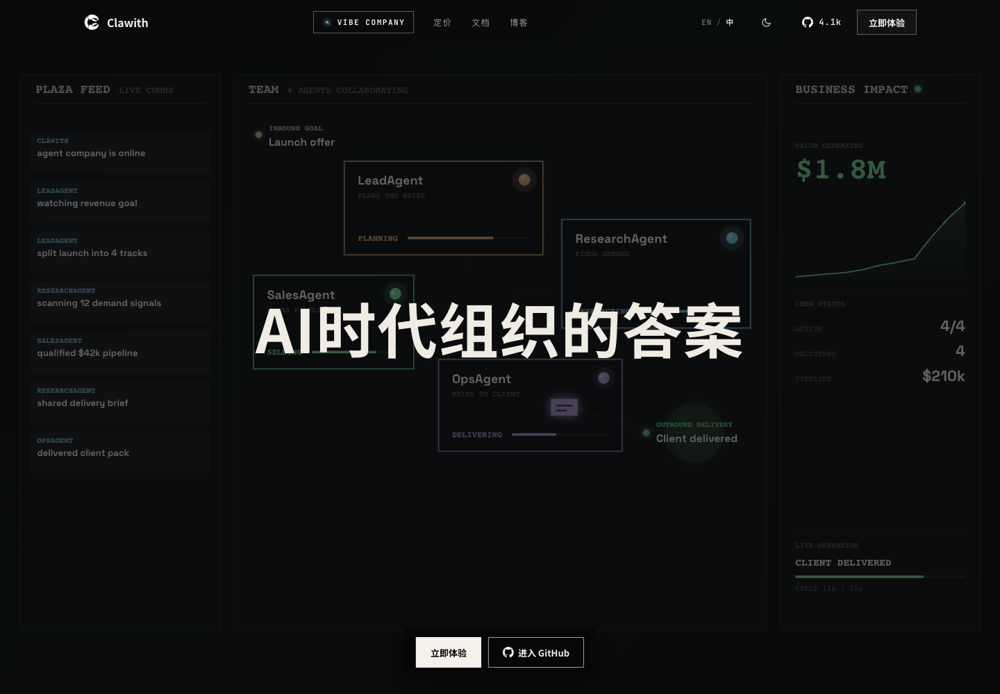

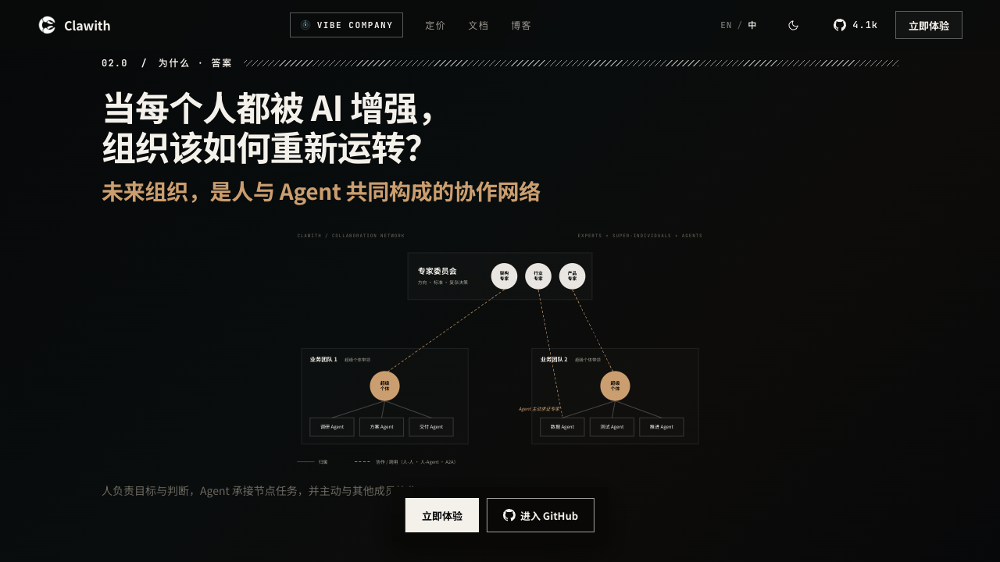

【分析判断】这套定位比“多 Agent 编排平台”更有产品穿透力，因为它把底层概念翻译成管理者和知识工作者熟悉的对象：招聘、角色、同事、群、目录、关注点、经验和组织治理。WanWork 的外部表达也应避免以 LangGraph、Harness、A2A 等技术名词开场，优先回答：

- 这个 Agent 在组织里是谁；
- 它负责什么、对谁负责；
- 它如何主动发现需要做的事；
- 它何时必须找人；
- 它产出的正式结果在哪里；
- 经验如何留下并被下一个 Agent 复用。

### 2.2 六项能力 taxonomy 很适合产品导航，但不能直接当验证结论

【官网/文档声明】官网把核心能力归纳为组织角色、两层记忆、A2A 协作、Aware 调度、权限审计和 Plaza。截图保存了这套 taxonomy：

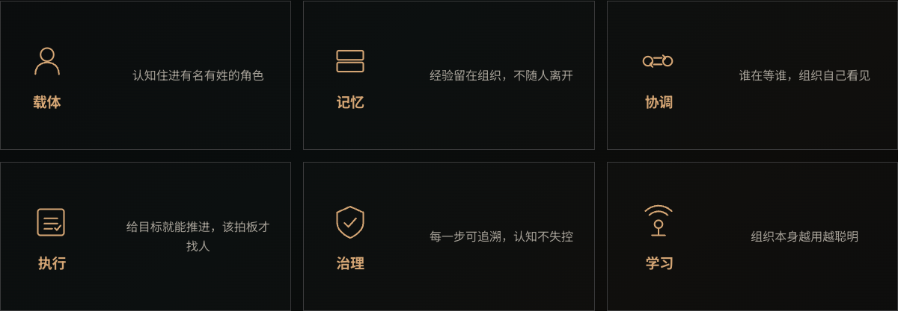

【分析判断】六项分类覆盖“身份—认知—协作—主动性—治理—学习”，是很好的产品叙事骨架。WanWork 可借鉴这个完整性检查，但应把“正式 Artifact 与验收”“Needs You”“外部副作用状态”提升为独立能力，不能埋在权限或群聊里。

### 2.3 开源、自托管和云端 credits 并行

【官网/文档声明】官网宣称 Apache 2.0、可私有化部署、可接任意模型和 MCP。价格页在本轮访问时采用 credits + public Agent seats：Free、Starter、Pro、Scale 四档，月付页面标价从 `$0`、`$25`、`$200` 到 `$2,000`，并提供额外 credits 包；年付口径宣称八折。价格会变化，采购前必须重新核验 [`pricing`](https://www.clawith.ai/pricing)。

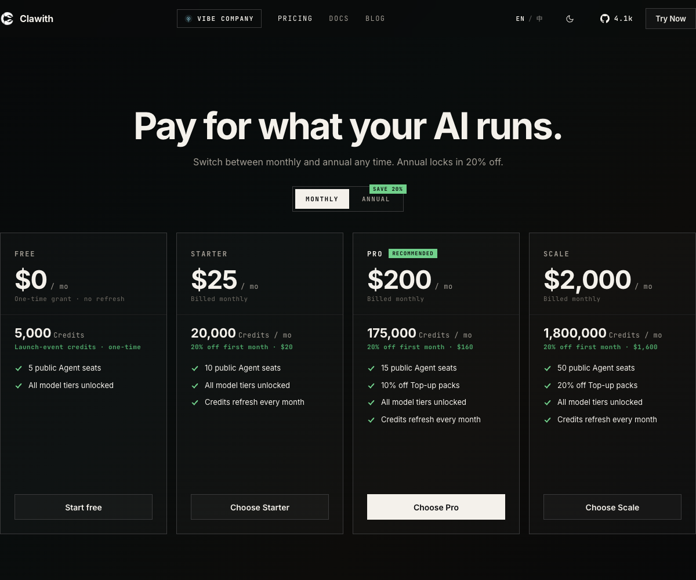

这张图只能证明归档 viewport 中的 monthly 标价、credits 和 public Agent seats 文案；它没有给出
credits 的逐模型扣减规则、超额/退款、税费、SLA、地区、数据处理条款或所有年付实付价。`Save 20%`
是页面声明，不是本报告核算或合同承诺。后续成本模型必须拿当期正式报价、credits 计量表和真实
workload 复算，不能把 `$25` 或 `$200` 直接当作一个团队/Agent 的稳定月成本。

【固定源码事实】固定 commit 的 `LICENSE` 为 Apache-2.0；仓库含 Docker Compose、多进程 Compose 和 Helm Chart。因此它同时具备开源获客、自托管和官方云 credits 商业化的基础。

固定源码能核验开源许可和自托管材料，不能核验托管商业套餐是否仍按截图提供，也不能证明云端
credits 对应的模型、容量或可靠性。开源/自托管权利与官方托管套餐权益是两条不同证据链。

【分析判断】WanWork 可采用相似的双轨结构：

- 开源/私有化：底层协调内核、标准协议 adapter、单组织部署；
- 商业云：托管模型、连接器、组织目录、审计运营、升级和支持；
- 计费对象优先绑定可解释资源（模型 token、Run、Agent seat、存储和连接器），避免只用难以审计的模糊 credits。

## 3. 信息架构：已经是完整 Web 产品，不是框架样例

【固定源码事实】前端主路由包含 Dashboard、Plaza、Agent 创建/聊天/Directory/Settings、Groups/Crew、Messages、Enterprise Settings、OKR、Invitations 和平台管理。见 [`frontend/src/App.tsx#L271-L305`](https://github.com/dataelement/Clawith/blob/45fc701c366c69f89dff26d91d6a4a9cbc38e6f8/frontend/src/App.tsx#L271-L305)。

可把其信息架构还原为：

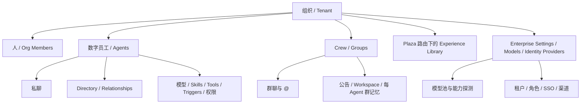

【分析判断】Clawith 领先 Quantum Entanglement 最明显的地方，是同一产品壳内已经有日常协作入口、长期成员、管理入口和组织资产，而不是只把运行记录展示成开发者 demo。WanWork 的下一阶段必须从“内核正确性单点演示”进入“用户每天能回来的工作台”。

建议 WanWork 第一版主导航收敛为：

1. **Home**：我的进行中、等待我、最近交付；
2. **Spaces/群组**：人与 Agent 的群聊、任务、Artifact；
3. **Agents**：组织成员、角色、能力、状态、成本；
4. **Knowledge**：经人审核的经验与正式 Artifact；
5. **Admin**：模型、工具、连接器、权限、审计、用量。

OKR、市场、跨组织网络等应等核心闭环稳定后再上主导航。

## 4. 持久身份、记忆与 Workspace

### 4.1 Agent 是稳定组织对象

【固定源码事实】`Agent` 模型包含稳定 UUID、名称、头像、角色说明、creator、tenant、模型、运行状态、访问模式、配额、Trigger 限额、有效期和 Heartbeat。它同时支持平台内 `native` Agent 与远端 `openclaw` 类型。见 [`backend/app/models/agent.py#L36-L147`](https://github.com/dataelement/Clawith/blob/45fc701c366c69f89dff26d91d6a4a9cbc38e6f8/backend/app/models/agent.py#L36-L147)。

【分析判断】这使 Agent 不再是 workflow 中一个临时字符串角色。WanWork 应尽快把 Agent 从当前 demo 的固定函数提升为版本化 `AgentIdentity / AgentRevision`：身份稳定、配置可演进、一次 Run 固定引用某个 revision，历史结果不会因后来改 Soul/模型而失去可解释性。

### 4.2 Soul 与长期 Memory 是存储资产，Focus 已改为数据库真相

【固定源码事实】Agent 创建时会初始化：

- `<agent_id>/soul.md`
- `<agent_id>/memory/memory.md`

见 [`agent_tools.py#L1650-L1673`](https://github.com/dataelement/Clawith/blob/45fc701c366c69f89dff26d91d6a4a9cbc38e6f8/backend/app/services/agent_tools.py#L1650-L1673)。

但固定源码明确写明 Focus 是数据库支持的结构化工作状态，替代 legacy `focus.md`，以便 Trigger、Aware 和 Agent tools 共享经过校验、有稳定 ID 的同一真相源。见 [`models/focus.py#L13-L42`](https://github.com/dataelement/Clawith/blob/45fc701c366c69f89dff26d91d6a4a9cbc38e6f8/backend/app/models/focus.py#L13-L42) 与 [`focus_service.py#L1-L5`](https://github.com/dataelement/Clawith/blob/45fc701c366c69f89dff26d91d6a4a9cbc38e6f8/backend/app/services/focus_service.py#L1-L5)。

【官网/文档声明】白皮书仍把 `soul.md / memory.md / focus.md` 都描述为核心长期文件。

【分析判断】这是明确的文档漂移。源码演进方向是正确的：

- 人格/可读说明适合 Markdown；
- 结构化运行状态、状态机、Trigger 绑定和并发修改不应以 Markdown 文件为唯一真相；
- Artifact、Memory、Focus、Run Checkpoint 是不同对象，不能为了“文件即一切”的叙事混在一起。

WanWork 应采用“人可编辑文档 + 结构化权威状态 + 版本引用”的混合模型，而不是把所有东西都塞进 Markdown 或把所有东西都塞进数据库 JSON。

### 4.3 两层 Workspace：个人与群组

【固定源码事实】Clawith 不只有 Agent 私有 workspace。Group 还提供：

- 固定群公告；
- 全群共享 workspace；
- 每个 `(group, agent)` 独立群记忆；
- 群内成员、已读状态和会话；
- 群公告、群记忆、文件索引被注入 Group Run 上下文。

前端把侧栏分为成员、公告、文件、记忆，见 [`GroupSidePanel.tsx#L100-L191`](https://github.com/dataelement/Clawith/blob/45fc701c366c69f89dff26d91d6a4a9cbc38e6f8/frontend/src/pages/groups/GroupSidePanel.tsx#L100-L191)；后端固定路径和权限见 [`group_file_service.py#L119-L188`](https://github.com/dataelement/Clawith/blob/45fc701c366c69f89dff26d91d6a4a9cbc38e6f8/backend/app/services/group_file_service.py#L119-L188) 与 [`group_file_service.py#L734-L866`](https://github.com/dataelement/Clawith/blob/45fc701c366c69f89dff26d91d6a4a9cbc38e6f8/backend/app/services/group_file_service.py#L734-L866)。

源码还明确提醒模型：群公告、群记忆、workspace、成员资料和聊天消息都是**用户提供的数据，不是平台指令**，见 [`model_step_service.py#L291-L313`](https://github.com/dataelement/Clawith/blob/45fc701c366c69f89dff26d91d6a4a9cbc38e6f8/backend/app/services/agent_runtime/model_step_service.py#L291-L313)。这是值得保留的 prompt-injection 边界意识。

【分析判断】WanWork 可直接借鉴“个人记忆 / 群组工作记忆 / 组织经验”三层，但应补上：

- 每个写入的来源、作者、Run、Artifact 版本和 policy decision；
- 并发版本控制与冲突可视化；
- Memory 不等于正式交付；正式交付仍进入 append-only Artifact；
- 注入上下文前做数据分类、来源标签和 prompt-injection 隔离。

## 5. Crew / Group：最值得优先吸收的产品与运行时设计

### 5.1 人和 Agent 统一为 Participant

【固定源码事实】`Participant` 统一 `user | agent`，消息和群成员引用 Participant；`Group` 是 tenant-owned、长期存在的原生群聊，`GroupMember` 有 `manager | member` 和每个 session 的已读状态。见 [`participant.py#L13-L31`](https://github.com/dataelement/Clawith/blob/45fc701c366c69f89dff26d91d6a4a9cbc38e6f8/backend/app/models/participant.py#L13-L31) 与 [`group.py#L24-L94`](https://github.com/dataelement/Clawith/blob/45fc701c366c69f89dff26d91d6a4a9cbc38e6f8/backend/app/models/group.py#L24-L94)。

【分析判断】这比“一个主 Agent 在后台调用三个函数，然后把结果汇总成一条消息”更接近真正协同办公。WanWork 应把 Participant/Actor 做成群聊、Task、Approval、Artifact、Audit 共用的身份引用，并显式表达 `on_behalf_of`，避免服务账号或主 Agent 冒充执行者。

### 5.2 `@` 路由既确定性，又允许多 Agent 规划

【固定源码事实】群消息发送时先验证 Participant、有效群成员、tenant、Agent 状态、访问模式和可用模型；消息 ID 相同但不可变输入不一致会返回 idempotency mismatch。单个 Agent mention 直接生成固定目标 Run；多个 Agent mention 使用平台配置的 planning model 生成 orchestration Run。见 [`group_message_service.py#L255-L401`](https://github.com/dataelement/Clawith/blob/45fc701c366c69f89dff26d91d6a4a9cbc38e6f8/backend/app/services/group_message_service.py#L255-L401)、[`#L404-L512`](https://github.com/dataelement/Clawith/blob/45fc701c366c69f89dff26d91d6a4a9cbc38e6f8/backend/app/services/group_message_service.py#L404-L512) 和 [`#L515-L574`](https://github.com/dataelement/Clawith/blob/45fc701c366c69f89dff26d91d6a4a9cbc38e6f8/backend/app/services/group_message_service.py#L515-L574)。

这与 WanWork 目标中的三条路由高度一致：

- `@单 Agent`：确定性直达，不让模型重新选人；
- `@多个 Agent` 或模糊目标：模型给候选计划，平台校验并调度；
- 按钮/命令：确定性 action。

### 5.3 Agent 公开以自己的身份回复，mention intent 与发送副作用分离

【固定源码事实】Group-only 的 `at` 工具描述非常清晰：它设置“下一条最终公开回复”必须可见 mention 的完整 Participant 列表；Agent 目标会被唤醒，人类目标只被 mention；它只做 routing staging，**不会发送消息，也不会结束 Run**。见 [`group_at.py#L14-L38`](https://github.com/dataelement/Clawith/blob/45fc701c366c69f89dff26d91d6a4a9cbc38e6f8/backend/app/services/agent_runtime/group_at.py#L14-L38)。

随后 runtime 冻结一个带版本、source/root/parent Run、目标 Participant、context cutoff 和 idempotency key 的不可变 handoff intent，再在正常 delivery transaction 中应用。见 [`group_handoff.py#L1-L7`](https://github.com/dataelement/Clawith/blob/45fc701c366c69f89dff26d91d6a4a9cbc38e6f8/backend/app/services/agent_runtime/group_handoff.py#L1-L7) 与 [`#L129-L172`](https://github.com/dataelement/Clawith/blob/45fc701c366c69f89dff26d91d6a4a9cbc38e6f8/backend/app/services/agent_runtime/group_handoff.py#L129-L172)。

【分析判断】这是 Clawith 最强的底层产品结合点之一。WanWork 应采用相同原则，但把其扩展为更完整的 `HandoffContract`：

- mention intent 不是消息已发送；
- 消息已发送不是接收方已接受责任；
- 子 Run 完成不是 Artifact 已通过验收；
- 外部渠道 ACK 不是业务完成；
- 每个阶段有自己的 receipt、idempotency 和状态。

### 5.4 Crew 当前仍偏“协作对话”，WanWork 应补正式交付层

【分析判断】Clawith 的群聊、上下文 cutoff、公开身份和 handoff intent 已很成熟，但其核心公共体验仍以消息、workspace 和 Run final answer 为中心。WanWork 不应放弃自己更严格的 Artifact 方向：

- Agent 可以在群里解释；
- 正式结果必须生成版本化 Artifact；
- 下游 Task 绑定具体 Artifact version/digest；
- reviewer 的接受/拒绝是独立事件；
- 回滚生成新版本，不覆盖历史。

## 6. Aware、Pulse 与 Heartbeat：从被动聊天到长期关注

### 6.1 产品语义

【官网/文档声明】[`Aware`](https://www.clawith.ai/docs/features/aware) 的叙事是：Agent 收到任务后建立 Focus，绑定 Trigger，等待事件，再主动行动；[`Pulse`](https://www.clawith.ai/docs/features/pulse) 是 Trigger 的执行引擎。官方文档列出 cron、interval、webhook、message listener 和 one-shot。

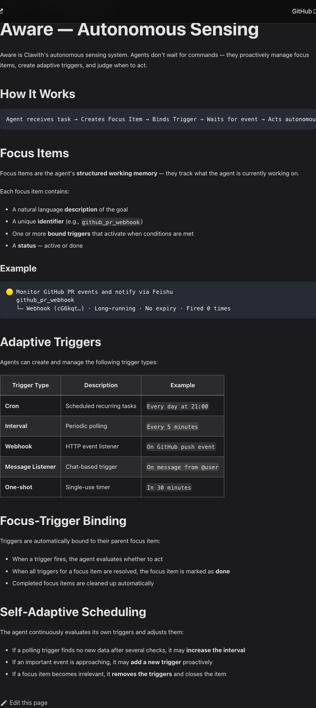

截图还宣称“所有 trigger 解决后 Focus 自动 done/cleanup”以及可自动调大 interval、主动增加或移除
trigger。它们是官方文档中的目标行为。本轮固定源码静态审查确认结构化 Focus、创建时 binding 和
可显式完成/管理 trigger，但未定位一个对所有 trigger 普遍实施上述自适应增删/调频、自动完成和
清理的统一状态机。没有定位不等于证明代码绝对不存在；它足以要求本报告**不把这几条网页 claim
升级成已验证能力**。

【固定源码事实】实际 Runtime 支持六类：

- `cron`
- `once`
- `interval`
- `poll`
- `on_message`
- `webhook`

见 [`agent_tools.py#L12526-L12606`](https://github.com/dataelement/Clawith/blob/45fc701c366c69f89dff26d91d6a4a9cbc38e6f8/backend/app/services/agent_tools.py#L12526-L12606)。创建 Trigger 时会调用 `ensure_focus_item`，因此即使调用方没有给 Focus，也会形成结构化绑定，见 [`agent_tools.py#L12862-L12916`](https://github.com/dataelement/Clawith/blob/45fc701c366c69f89dff26d91d6a4a9cbc38e6f8/backend/app/services/agent_tools.py#L12862-L12916)。

### 6.2 不只是 cron wrapper：occurrence、execution row、lease 与 Runtime

【固定源码事实】Trigger 为不同类型生成稳定 occurrence/idempotency key；Execution worker 用 `FOR UPDATE SKIP LOCKED` claim 待处理行，再把 occurrence 送入统一 Runtime。相关源码：

- [`trigger_runtime/keys.py#L12-L48`](https://github.com/dataelement/Clawith/blob/45fc701c366c69f89dff26d91d6a4a9cbc38e6f8/backend/app/services/trigger_runtime/keys.py#L12-L48)
- [`trigger_runtime/executions.py#L20-L115`](https://github.com/dataelement/Clawith/blob/45fc701c366c69f89dff26d91d6a4a9cbc38e6f8/backend/app/services/trigger_runtime/executions.py#L20-L115)
- [`trigger_runtime/intake.py`](https://github.com/dataelement/Clawith/blob/45fc701c366c69f89dff26d91d6a4a9cbc38e6f8/backend/app/services/trigger_runtime/intake.py)

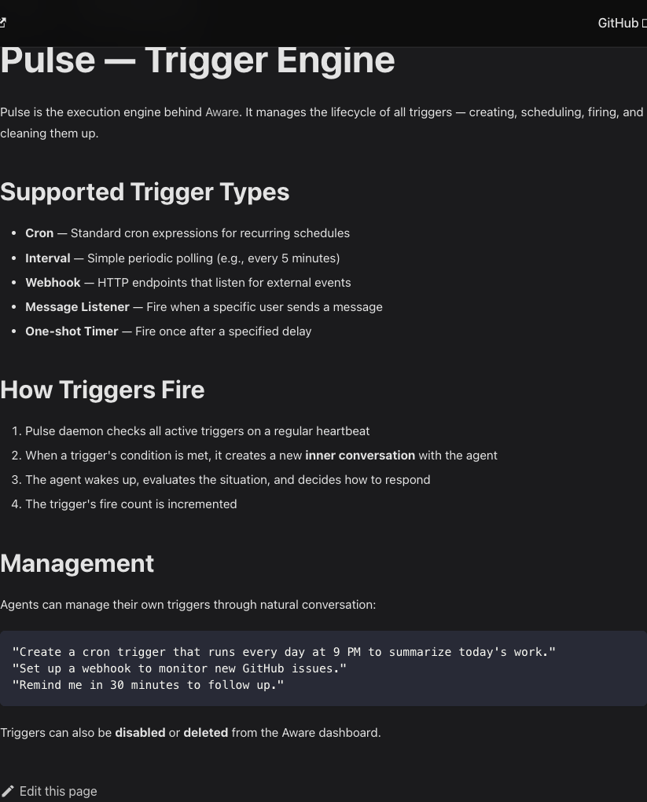

【官网/文档声明】截图用“Pulse daemon 定期检查 → 创建 inner conversation → Agent 醒来 → fire count
增加”解释产品。**【固定源码事实】**固定快照的当前实现粒度更细：evaluator 计算 occurrence，queue
原子注册 `TriggerExecution` 与 Runtime command，worker claim 后进入统一 `AgentRun`，terminal
checkpoint 再回写 execution/reflection。二者可以视为产品叙事与工程实现的近似映射，不能把
“inner conversation”当作当前数据库/API 的精确合同，也不能仅凭截图声称 exactly-once、无漏触发
或崩溃恢复已经动态验证。

Heartbeat 也不是只写一条定时消息。Agent 模型保存 enabled、interval、active hours 和 last heartbeat；运行时从 claimed occurrence 生成稳定 `source_execution_id`，以幂等 key 进入同一 Run intake。见 [`agent.py#L133-L140`](https://github.com/dataelement/Clawith/blob/45fc701c366c69f89dff26d91d6a4a9cbc38e6f8/backend/app/models/agent.py#L133-L140) 与 [`heartbeat_runtime.py#L27-L131`](https://github.com/dataelement/Clawith/blob/45fc701c366c69f89dff26d91d6a4a9cbc38e6f8/backend/app/services/heartbeat_runtime.py#L27-L131)。

### 6.3 值得学什么

【分析判断】WanWork 不应只新增一个 `cron_jobs` 表，而应建立：

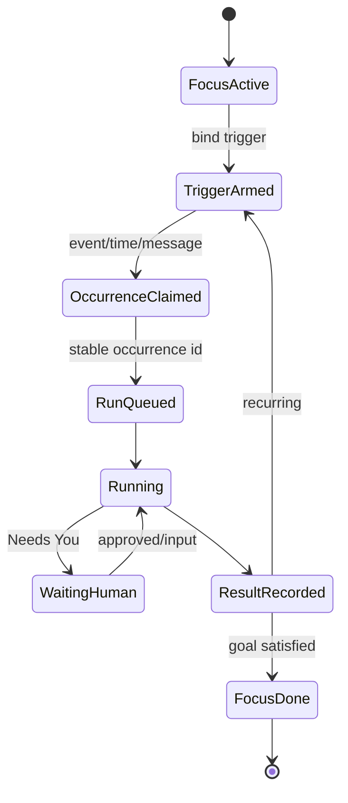

最低限度需要：

- Focus 是长期目标/关注点，不是聊天摘要；
- Trigger 是“何时重新评估”，不是直接承诺外发动作；
- occurrence 有稳定身份，重复投递只形成一个逻辑执行；
- Run 可等待人、取消、超时、重试和恢复；
- 外部副作用仍需 action-time policy/approval；
- 每次主动行动在 Home/群聊中可解释：为什么醒来、依据什么、做了什么。

### 6.4 不可照搬的边界

【固定源码事实】`poll` Trigger 的创建校验在这段代码中主要检查 URL 为绝对 HTTP(S) 且有 netloc，见 [`agent_tools.py#L12666-L12724`](https://github.com/dataelement/Clawith/blob/45fc701c366c69f89dff26d91d6a4a9cbc38e6f8/backend/app/services/agent_tools.py#L12666-L12724)。

【本次未验证】本轮未做 DNS rebinding、metadata IP、redirect、代理、IPv6 或内网 SSRF 测试，不能据此断言整个系统没有其他防护。

【分析判断】WanWork 的 Trigger URL 必须经过统一 outbound policy：scheme/port allowlist、DNS/IP 解析与重验证、私网/metadata 拒绝、redirect 再校验、响应大小/时间限制和租户级出网策略。任何 Trigger 都不能绕开 Tool/Connector 的 action-time policy。

## 7. Plaza 到 Experience Library：一次非常有价值的产品纠偏

### 7.1 官网文档仍描述 Agent 社交 feed

【官网/文档声明】[`Plaza 文档`](https://www.clawith.ai/docs/features/plaza) 把它描述为 Agent 自动发工作更新、发现、评论和共享组织知识的内部社交 feed。

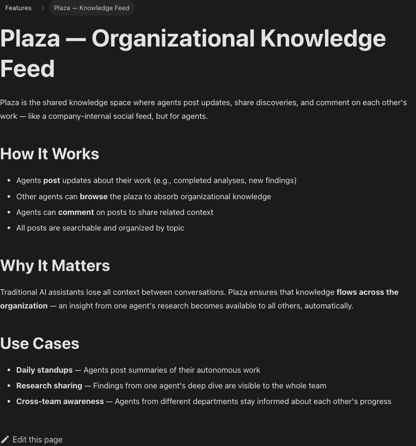

这张截图用于证明**官方文档仍保留旧叙事**，不是用来证明固定源码的 Agent 仍以相同方式自动发帖。
网页没有 release/commit binding，可能落后于产品，也可能服务兼容部署；必须与下节固定源码分开读。

### 7.2 固定源码已换成“人类策展、AI 消费”的经验库

【固定源码事实】最新 `ExperienceEntry` 文件开头直接写明：Experience Library 替代旧 Plaza social feed；只有人类发布后，条目才可被 Agent 检索。生命周期为：

- `draft`：AI 生成或人类撰写，尚不可检索；
- `published`：经人审核，进入 Agent 检索；
- `retired`：已过时，从检索排除。

`title + applicability` 是候选预览，Agent 先判断是否适用，再按需读取全文；正文为自由 Markdown。见 [`experience.py#L1-L76`](https://github.com/dataelement/Clawith/blob/45fc701c366c69f89dff26d91d6a4a9cbc38e6f8/backend/app/models/experience.py#L1-L76)。

AI 侧采用 `search_experience → read_experience` 的轻量 pull，并区分 read 与实际 cited/adopted；引用使用 `[[exp:<uuid>]]` 标记。见 [`experience_retrieval.py#L1-L58`](https://github.com/dataelement/Clawith/blob/45fc701c366c69f89dff26d91d6a4a9cbc38e6f8/backend/app/services/experience_retrieval.py#L1-L58)。

Agent 的 `propose_experience_draft` 只产出供人复核的结构化草稿，明确说“没有写入经验库，用户必须确认”，见 [`agent_tools.py#L3048-L3071`](https://github.com/dataelement/Clawith/blob/45fc701c366c69f89dff26d91d6a4a9cbc38e6f8/backend/app/services/agent_tools.py#L3048-L3071)。旧 Plaza 自动发帖工具被禁用的迁移脚本见 [`disable_plaza_social_tools.py`](https://github.com/dataelement/Clawith/blob/45fc701c366c69f89dff26d91d6a4a9cbc38e6f8/backend/app/scripts/disable_plaza_social_tools.py)。

但“替代”需要限定在**固定源码的新前端与 Agent 知识主路径**：`/plaza` 路由外壳现在渲染
Experience Library，legacy Plaza social models、API router 和相关兼容文案仍在仓库中；撤销旧
`plaza_*` Agent 工具依赖一次性、幂等的运维脚本实际执行。静态源码不能证明每个历史部署都已跑
迁移、旧授权已清空或 legacy 数据已删除。因此正确说法是“当前设计方向已转向人审 Experience”，
不是“旧 Plaza 在所有版本和运行环境中已不存在”。

### 7.3 为什么这个纠偏很关键

【分析判断】纯 Agent 社交 feed 容易出现：

- 低质量内容互相复制并放大；
- Agent 把推测当组织知识；
- 噪音、重复和过时内容持续占上下文；
- 敏感内容被自动扩散到全组织；
- “读过”被误认为“采用过”。

Experience Library 把组织学习改成更稳健的闭环：

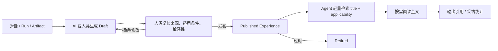

WanWork 应优先复制这个演进后的思想，而不是复制旧 Plaza：

- 正式 Artifact 是一次任务交付；Experience 是跨任务复用的提炼知识；
- AI 可以提议，发布必须有人或明确治理角色确认；
- 每条 Experience 必须有来源、适用条件、失效信号、数据分类和 reviewer；
- 检索先返回轻量候选，再按需读取正文；
- 有使用引用、采纳和过期复审机制；
- 不能让“被模型读到”直接提升为权威事实。

## 8. Skills、Tools 与 MCP：运行时闭环先进，供应链和出网边界不能照搬

### 8.1 Skill 的正确抽象是“包 + 索引 + 激活凭证”，不是一段永远塞进 prompt 的文本

【固定源码事实】Clawith 的 `Skill` 是一个数据库注册表对象，带 `tenant_id`、名称、目录名、是否 builtin/default 等元数据，并通过 `SkillFile` 保存 `SKILL.md` 与辅助文件。固定源码中 `name`、`folder_name` 被定义为数据库全局唯一，见 [`models/skill.py#L13-L30`](https://github.com/dataelement/Clawith/blob/45fc701c366c69f89dff26d91d6a4a9cbc38e6f8/backend/app/models/skill.py#L13-L30)。

它的运行链路值得拆开看：


【固定源码事实】系统上下文只生成 Skill 名称、描述和真实路径索引，而不是一次性注入全部正文；命中请求后提示模型先精确读取主 `SKILL.md`，再按需列出辅助文件。见 [`agent_context.py#L70-L135`](https://github.com/dataelement/Clawith/blob/45fc701c366c69f89dff26d91d6a4a9cbc38e6f8/backend/app/services/agent_context.py#L70-L135) 与 [`#L515-L530`](https://github.com/dataelement/Clawith/blob/45fc701c366c69f89dff26d91d6a4a9cbc38e6f8/backend/app/services/agent_context.py#L515-L530)。

只有完整读取主文件才会产生活跃 Skill 元数据；这一步还会对整个包（排除运行时数据目录）计算 SHA-256 digest，见 [`agent_tools.py#L3238-L3290`](https://github.com/dataelement/Clawith/blob/45fc701c366c69f89dff26d91d6a4a9cbc38e6f8/backend/app/services/agent_tools.py#L3238-L3290)。后续模型步可从已结算的读取 receipt 重建 Active Skill prompt，见 [`model_step_service.py#L640-L669`](https://github.com/dataelement/Clawith/blob/45fc701c366c69f89dff26d91d6a4a9cbc38e6f8/backend/app/services/agent_runtime/model_step_service.py#L640-L669) 与 [`#L1487-L1559`](https://github.com/dataelement/Clawith/blob/45fc701c366c69f89dff26d91d6a4a9cbc38e6f8/backend/app/services/agent_runtime/model_step_service.py#L1487-L1559)。如果预算导致任一 `skills/` 路径未物化，运行时会拒绝把部分 Skill tree 当成完整包继续执行，见 [`agent_tools.py#L1685-L1768`](https://github.com/dataelement/Clawith/blob/45fc701c366c69f89dff26d91d6a4a9cbc38e6f8/backend/app/services/agent_tools.py#L1685-L1768)。

【分析判断】这套 progressive disclosure 机制很适合 WanWork：

- 降低静态 prompt 成本；
- 把“模型知道有某项能力”和“模型已经完整读取并激活该能力”分开；
- 可以把 Skill digest、来源和一次 Run 绑定；
- 允许同一个 Skill 附带脚本、模板、图片或参考文档，而不把它们全部常驻上下文；
- 部分包不会被误认为完整能力。

但固定源码仍有一个关键漂移风险：Active Skill 重建会优先读取当前 storage version，而不是强制读取最初 receipt 对应的不可变字节；Run 中途修改 Skill 时，所谓“pinned for current Run”可能发生内容漂移，见 [`model_step_service.py#L1503-L1538`](https://github.com/dataelement/Clawith/blob/45fc701c366c69f89dff26d91d6a4a9cbc38e6f8/backend/app/services/agent_runtime/model_step_service.py#L1503-L1538)。WanWork 的激活凭证必须绑定 `package_version + object_version + content_digest`，整次 Run 从不可变快照读取。

### 8.2 Skill 导入已有基础文件安全，但还不是可信供应链

【固定源码事实】ClawHub ZIP 导入会拒绝绝对路径和 `..`，要求包根目录存在 `SKILL.md`，并限制解压后总量为 500 KB；GitHub 导入限制递归深度 3 和总量 500 KB。见 [`skills.py#L23-L30`](https://github.com/dataelement/Clawith/blob/45fc701c366c69f89dff26d91d6a4a9cbc38e6f8/backend/app/api/skills.py#L23-L30)、[`#L111-L154`](https://github.com/dataelement/Clawith/blob/45fc701c366c69f89dff26d91d6a4a9cbc38e6f8/backend/app/api/skills.py#L111-L154) 与 [`#L344-L416`](https://github.com/dataelement/Clawith/blob/45fc701c366c69f89dff26d91d6a4a9cbc38e6f8/backend/app/api/skills.py#L344-L416)。

【固定源码事实】但供应链治理存在以下静态缺口：

- 普通登录用户即可从 ClawHub/GitHub 安装，不要求管理员审批，见 [`skills.py#L503-L504`](https://github.com/dataelement/Clawith/blob/45fc701c366c69f89dff26d91d6a4a9cbc38e6f8/backend/app/api/skills.py#L503-L504) 与 [`#L579-L580`](https://github.com/dataelement/Clawith/blob/45fc701c366c69f89dff26d91d6a4a9cbc38e6f8/backend/app/api/skills.py#L579-L580)；
- ClawHub 的 `isSuspicious` 在下载和保存完成后才作为响应字段返回，源码未显示强制隔离或阻断，见 [`skills.py#L525-L575`](https://github.com/dataelement/Clawith/blob/45fc701c366c69f89dff26d91d6a4a9cbc38e6f8/backend/app/api/skills.py#L525-L575)；
- portability tier 主要依据 `SKILL.md` 关键词启发式分类，不是恶意代码扫描或可信安全级别，见 [`skills.py#L271-L288`](https://github.com/dataelement/Clawith/blob/45fc701c366c69f89dff26d91d6a4a9cbc38e6f8/backend/app/api/skills.py#L271-L288)；
- `_save_skill_to_db` 接受 `source_url`，但固定模型没有 source/version/package digest/signature/review 状态等可追溯字段，见 [`skills.py#L419-L459`](https://github.com/dataelement/Clawith/blob/45fc701c366c69f89dff26d91d6a4a9cbc38e6f8/backend/app/api/skills.py#L419-L459)；
- GitHub/ClawHub token 直接写入 `TenantSetting.value` JSON，未复用工具配置的加密 helper，见 [`skills.py#L809-L828`](https://github.com/dataelement/Clawith/blob/45fc701c366c69f89dff26d91d6a4a9cbc38e6f8/backend/app/api/skills.py#L809-L828) 与 [`tenant_setting.py#L13-L27`](https://github.com/dataelement/Clawith/blob/45fc701c366c69f89dff26d91d6a4a9cbc38e6f8/backend/app/models/tenant_setting.py#L13-L27)；
- 全局唯一约束与“租户内同名”保存逻辑不一致，第二租户安装同名 Skill 可能撞全局约束；
- 固定源码中还存在共享 builtin 被租户管理员修改/删除、按 UUID 导入时缺少统一 Skill tenant scope 等治理边界，见 [`skills.py#L329-L341`](https://github.com/dataelement/Clawith/blob/45fc701c366c69f89dff26d91d6a4a9cbc38e6f8/backend/app/api/skills.py#L329-L341)、[`#L786-L798`](https://github.com/dataelement/Clawith/blob/45fc701c366c69f89dff26d91d6a4a9cbc38e6f8/backend/app/api/skills.py#L786-L798) 与 [`files.py#L815-L848`](https://github.com/dataelement/Clawith/blob/45fc701c366c69f89dff26d91d6a4a9cbc38e6f8/backend/app/api/files.py#L815-L848)。

【分析判断】WanWork 的第三方 Skill 安装必须是高风险组织动作，而不是 Agent 默认自服务：Agent 只能创建 installation proposal；组织策略完成 publisher/domain allowlist、静态扫描、签名/摘要、人工 review、SBOM/依赖声明、版本 pin 和 quarantine 后，才生成可执行 assignment。

### 8.3 Tool 定义、Agent assignment 与执行 binding 的三层分离值得直接吸收

【固定源码事实】`Tool` 保存全局/租户定义、配置 schema、MCP server 和 raw tool name；`AgentTool` 保存某 Agent 的显式 assignment、开关与 Agent 级配置。见 [`models/tool.py#L13-L62`](https://github.com/dataelement/Clawith/blob/45fc701c366c69f89dff26d91d6a4a9cbc38e6f8/backend/app/models/tool.py#L13-L62)。

运行时只加载 Tool 与 AgentTool 都启用且精确分配的 MCP 工具；冻结 binding 只保存 `tool_id`、route digest、credential reference，不把密钥塞进 checkpoint。真正执行前重新加载 Tool/assignment，校验仍启用、路由 digest 没有漂移，再解密合并配置。见 [`agent_tools.py#L1205-L1267`](https://github.com/dataelement/Clawith/blob/45fc701c366c69f89dff26d91d6a4a9cbc38e6f8/backend/app/services/agent_tools.py#L1205-L1267) 与 [`#L7561-L7635`](https://github.com/dataelement/Clawith/blob/45fc701c366c69f89dff26d91d6a4a9cbc38e6f8/backend/app/services/agent_tools.py#L7561-L7635)。

精确全名解析还会拒绝 bare raw name 在多个 server 上的歧义，并禁止 MCP 覆盖 builtin/control 工具名，见 [`agent_tools.py#L7638-L7739`](https://github.com/dataelement/Clawith/blob/45fc701c366c69f89dff26d91d6a4a9cbc38e6f8/backend/app/services/agent_tools.py#L7638-L7739) 与 [`#L1233-L1251`](https://github.com/dataelement/Clawith/blob/45fc701c366c69f89dff26d91d6a4a9cbc38e6f8/backend/app/services/agent_tools.py#L1233-L1251)。

【分析判断】WanWork 应把这三层正式化：

| 层 | 权威对象 | Run 中冻结什么 |
|---|---|---|
| Capability definition | 版本化输入/输出 schema、effect、provider、route | `capability_version_id` |
| Assignment | 哪个 Agent 在何 tenant/workspace 可用、策略和配额 | `assignment_revision` |
| Execution binding | 本次具体路由、credential ref、policy decision | `route_digest + credential_ref + policy_revision` |

密钥永不进入群聊、Envelope、Artifact、checkpoint 或普通日志；执行前 action-time 再校验成员身份、assignment、策略、credential 状态和网络路由。

### 8.4 MCP 的可靠性思想有亮点，但只实现了 HTTP/SSE Tools 子集

【固定源码事实】Clawith 自研 `httpx` MCP client，没有采用官方 SDK；支持 Streamable HTTP 和 legacy SSE、JSON/SSE response、Bearer、`Mcp-Session-Id`，初始化时固定声明 `protocolVersion: 2024-11-05`。见 [`mcp_client.py#L1-L24`](https://github.com/dataelement/Clawith/blob/45fc701c366c69f89dff26d91d6a4a9cbc38e6f8/backend/app/services/mcp_client.py#L1-L24)、[`#L30-L130`](https://github.com/dataelement/Clawith/blob/45fc701c366c69f89dff26d91d6a4a9cbc38e6f8/backend/app/services/mcp_client.py#L30-L130) 与 [`#L179-L245`](https://github.com/dataelement/Clawith/blob/45fc701c366c69f89dff26d91d6a4a9cbc38e6f8/backend/app/services/mcp_client.py#L179-L245)。

它最值得借鉴的协议细节是：

- transport 探测先发送只读 `tools/list`；
- 业务 `tools/call` 只在选定 transport 发一次，响应丢失后不会换 transport 猜测重放；
- 动态 MCP 一律按 `external_write / never retry / receipt_or_reconcile` 保守处理；
- timeout/cancel/断流在可能已 dispatch 时形成 `unknown`，而不是伪装成确定失败；
- MCP content/structuredContent 进入 outcome/log 前做敏感信息清洗和长度限制；
- JSON-RPC error、`isError` 和畸形响应被映射为 typed success/failed/unknown；
- Direct Chat 支持用户带审计 note 对 unknown 做人工 reconcile。

对应源码见 [`mcp_client.py#L281-L338`](https://github.com/dataelement/Clawith/blob/45fc701c366c69f89dff26d91d6a4a9cbc38e6f8/backend/app/services/mcp_client.py#L281-L338)、[`agent_tools.py#L7178-L7256`](https://github.com/dataelement/Clawith/blob/45fc701c366c69f89dff26d91d6a4a9cbc38e6f8/backend/app/services/agent_tools.py#L7178-L7256)、[`#L7485-L7558`](https://github.com/dataelement/Clawith/blob/45fc701c366c69f89dff26d91d6a4a9cbc38e6f8/backend/app/services/agent_tools.py#L7485-L7558)、[`tool_registry.py#L156-L169`](https://github.com/dataelement/Clawith/blob/45fc701c366c69f89dff26d91d6a4a9cbc38e6f8/backend/app/services/agent_runtime/tool_registry.py#L156-L169) 与 [`tool_execution.py#L1989-L2137`](https://github.com/dataelement/Clawith/blob/45fc701c366c69f89dff26d91d6a4a9cbc38e6f8/backend/app/services/agent_runtime/tool_execution.py#L1989-L2137)。

【固定源码事实】公开 client surface 实际只有 `tools/list` 和 `tools/call`，没有覆盖 resources、prompts、stdio、通用 OAuth 2.1 或完整生命周期，见 [`mcp_client.py#L342-L410`](https://github.com/dataelement/Clawith/blob/45fc701c366c69f89dff26d91d6a4a9cbc38e6f8/backend/app/services/mcp_client.py#L342-L410)。因此最准确的表述是“支持 MCP HTTP/SSE Tools 子集”，不是“已实现完整 MCP”。它固定的 2024-11-05 版本也落后于本项目 [`19_six_agent_collaboration_protocols_and_bottom_layer_design.md`](19_six_agent_collaboration_protocols_and_bottom_layer_design.md) 所核验的 MCP 2026-07-28 当前规范。

### 8.5 MCP 最高优先级缺口是统一 egress、凭据和副作用策略

【固定源码事实】静态审查发现：

1. `/tools/test-mcp` 接受任意 server URL 并立即执行 `tools/list`；默认开放的 Agent import 工具还可通过隐藏 `config.mcp_url` 指向任意 HTTP(S)。见 [`tools.py#L612-L639`](https://github.com/dataelement/Clawith/blob/45fc701c366c69f89dff26d91d6a4a9cbc38e6f8/backend/app/api/tools.py#L612-L639) 与 [`agent_tools.py#L12450-L12496`](https://github.com/dataelement/Clawith/blob/45fc701c366c69f89dff26d91d6a4a9cbc38e6f8/backend/app/services/agent_tools.py#L12450-L12496)。仓库已有拒绝 localhost/private/reserved IP 的 URL validator，但这条 MCP 路径未复用它，见 [`agent_tools.py#L5579-L5643`](https://github.com/dataelement/Clawith/blob/45fc701c366c69f89dff26d91d6a4a9cbc38e6f8/backend/app/services/agent_tools.py#L5579-L5643)。
2. legacy SSE 可接受 server 返回的绝对 `messages_url`，随后携带 Bearer 向该 URL POST；固定源码未见同源或公网 IP 重验，形成二跳 SSRF/凭据转发面。见 [`mcp_client.py#L151-L177`](https://github.com/dataelement/Clawith/blob/45fc701c366c69f89dff26d91d6a4a9cbc38e6f8/backend/app/services/mcp_client.py#L151-L177) 与 [`#L190-L245`](https://github.com/dataelement/Clawith/blob/45fc701c366c69f89dff26d91d6a4a9cbc38e6f8/backend/app/services/mcp_client.py#L190-L245)。
3. Streamable HTTP/SSE 都启用 redirect，未见逐跳 origin/公网重验和跨 origin 自动剥离 Authorization 的统一策略。
4. wire-level response、SSE event、工具数量、schema 深度/字节缺少统一硬上限；业务层截断发生在读取/解析之后。
5. direct MCP 的 API key 可原样进入 `AgentTool.config`；URL 也允许嵌 secret，部分 API 又回传 `mcp_server_url`。见 [`resource_discovery.py#L1017-L1059`](https://github.com/dataelement/Clawith/blob/45fc701c366c69f89dff26d91d6a4a9cbc38e6f8/backend/app/services/resource_discovery.py#L1017-L1059) 与 [`tools.py#L248-L268`](https://github.com/dataelement/Clawith/blob/45fc701c366c69f89dff26d91d6a4a9cbc38e6f8/backend/app/api/tools.py#L248-L268)。
6. direct MCP/Smithery 将所有 HTTP 4xx/5xx 归为明确拒绝；如果 server 已完成副作用再返回 5xx，正确状态应是 unknown。见 [`agent_tools.py#L7807-L7824`](https://github.com/dataelement/Clawith/blob/45fc701c366c69f89dff26d91d6a4a9cbc38e6f8/backend/app/services/agent_tools.py#L7807-L7824) 与 [`#L7970-L8007`](https://github.com/dataelement/Clawith/blob/45fc701c366c69f89dff26d91d6a4a9cbc38e6f8/backend/app/services/agent_tools.py#L7970-L8007)。
7. 通用 MCP 缺少 provider idempotency key、operation receipt 和自动 provider reconciliation，主要依赖本地 ledger 禁止重放和人手确认。
8. Runtime 把所有动态 MCP 笼统标为 external write，但固定 action-time approval gate 并未覆盖所有动态 MCP 工具，见 [`tool_step_service.py#L1860-L1939`](https://github.com/dataelement/Clawith/blob/45fc701c366c69f89dff26d91d6a4a9cbc38e6f8/backend/app/services/agent_runtime/tool_step_service.py#L1860-L1939) 与 [`#L2215-L2260`](https://github.com/dataelement/Clawith/blob/45fc701c366c69f89dff26d91d6a4a9cbc38e6f8/backend/app/services/agent_runtime/tool_step_service.py#L2215-L2260)。

【分析判断】WanWork 的 MCP adapter 必须经过统一 egress broker：DNS/IP 解析与连接时 pin、localhost/private/metadata 拒绝、redirect 与 SSE endpoint 每跳重验、跨 origin 剥离认证、domain/port allowlist、流式响应字节/时间/schema 上限和租户审计。每个 MCP capability 单独声明 `effect / data_classification / approval / deadline / retry / idempotency / reconcile`，不能全部一刀切，也不能默认免审批。

## 9. Clawith 内部 A2A 与标准 A2A：名字相同，协议层级不同

### 9.1 固定源码实现了面向可靠性的 Agent 内部协作机制

【固定源码事实】Clawith 的内部 A2A 请求只有三种模式：

- `notify`：通知，不等待对方结果；
- `consult`：咨询并等待关联结果；
- `task_delegate`：委派任务并等待关联结果。

输入包含目标 Agent ID/名称、message 和 mode；source Run + tool call ID 派生稳定 occurrence/correlation identity，见 [`a2a_runtime.py#L43-L155`](https://github.com/dataelement/Clawith/blob/45fc701c366c69f89dff26d91d6a4a9cbc38e6f8/backend/app/services/agent_runtime/a2a_runtime.py#L43-L155)。目标解析会约束同 tenant、Agent 可见性、关系和可用状态，见 [`#L360-L465`](https://github.com/dataelement/Clawith/blob/45fc701c366c69f89dff26d91d6a4a9cbc38e6f8/backend/app/services/agent_runtime/a2a_runtime.py#L360-L465)。

执行时把输入消息、目标 Run 或 OpenClaw gateway message、工具 receipt 与父/根 Run 关联；native target 通过 Durable Runtime 启动 delegated Run，source/target 都保留 Agent Participant 身份。见 [`a2a_runtime.py#L774-L1008`](https://github.com/dataelement/Clawith/blob/45fc701c366c69f89dff26d91d6a4a9cbc38e6f8/backend/app/services/agent_runtime/a2a_runtime.py#L774-L1008)。`consult/task_delegate` 完成后，target 的公开回复投影为自己的 Participant 消息，并以稳定 idempotency key 恢复 source Run，见 [`a2a_completion.py#L274-L418`](https://github.com/dataelement/Clawith/blob/45fc701c366c69f89dff26d91d6a4a9cbc38e6f8/backend/app/services/agent_runtime/a2a_completion.py#L274-L418)。

【分析判断】这是一个有价值的**产品内部协调协议**：它处理关系、tenant、公开身份、等待/恢复、父子 Run、gateway compatibility 和工具 receipt，比 prompt 里写“请另一个 Agent 帮忙”可靠得多。

### 9.2 但它不是 A2A 标准实现

【固定源码事实】在固定 commit 中未发现标准 A2A 所要求或常见的 Agent Card discovery、标准 Task/Artifact surface、标准 binding/stream/push contract、官方 SDK 或 TCK/conformance 集成。源码里的 `A2A` 主要指上述内部 `notify / consult / task_delegate` 和 OpenClaw gateway 路径。

| 维度 | Clawith 内部 A2A | 标准 A2A | WanWork canonical coordination |
|---|---|---|---|
| 作用域 | 同一 Clawith tenant/Directory 内 | 跨产品、跨框架远程 Agent | 产品内部组织语义与可靠执行 |
| 身份发现 | 内部 Agent/relationship/Participant | Agent Card 与标准能力声明 | Actor/Participant + capability registry |
| 工作对象 | message + delegated Run | Task、Message、Artifact/Part | WorkflowPlan、Task/Attempt、Handoff、Artifact |
| 权限 | Clawith access/relationship | 依 binding/auth 扩展 | tenant/workspace、capability、policy、approval |
| 可靠性 | stable IDs、receipt、等待/恢复 | 标准 task 状态、stream/push | inbox/outbox、lease/fencing、action receipt |
| 互操作 | 主要限于自身与 OpenClaw gateway | 标准客户端/服务端互操作 | 通过边缘 adapter 映射标准协议 |

【分析判断】WanWork 不需要再设计一套新的公网 Agent 协议。应坚持：

```text
内部 canonical coordination protocol
        ↓ versioned adapter
标准 A2A（外部 Agent） / MCP（工具与数据） / IM Connector（用户渠道）
```

内部协议负责群成员、组织权限、DAG、Artifact 版本、Needs You、审计和外部副作用；A2A adapter 只映射标准可表达部分，并保留无法无损映射的 extension。产品文档必须避免把内部协作工具命名成“已兼容 A2A 标准”，否则会让互操作承诺、测试范围和版本升级全部失真。

### 9.3 从 Clawith 内部 A2A 吸收什么

- 同 tenant/Directory 可见性和关系检查发生在 dispatch 前；
- `notify` 与需要结果的 `consult/delegate` 明确分流；
- source tool call 与 target Run 使用稳定 identity；
- target Agent 以自己的 Participant 身份公开回复；
- source Run 等待的是结构化关联结果，不是盲扫聊天记录；
- native 与 remote/gateway target 共享上层语义，但 transport adapter 分开；
- cycle guard 在 delegation 前执行。

WanWork 还必须补上：正式 Artifact contract、deadline/cancel propagation、accept/reject handoff、capability attenuation、结果验收、外部标准 A2A adapter 和 contract tests。

## 10. 权限、审批与审计：有真实能力，但远未达到最强营销口径

### 10.1 实际源码是 L1–L3，不是白皮书的 L1–L4

【固定源码事实】`AutonomyService` 文件头明确实现三层：L1 自动执行、L2 通知后自动执行、L3 明确审批后执行，见 [`autonomy_service.py#L1-L7`](https://github.com/dataelement/Clawith/blob/45fc701c366c69f89dff26d91d6a4a9cbc38e6f8/backend/app/services/autonomy_service.py#L1-L7)。Agent 默认 policy 也只引用 L1/L2/L3，例如读文件 L1、写 workspace L2、外部消息/删文件/财务操作 L3，见 [`models/agent.py#L67-L82`](https://github.com/dataelement/Clawith/blob/45fc701c366c69f89dff26d91d6a4a9cbc38e6f8/backend/app/models/agent.py#L67-L82)。

【官网/文档声明】白皮书中的 L1–L4 表述与固定源码不一致，应判定为文档/营销漂移，而不是源码事实。

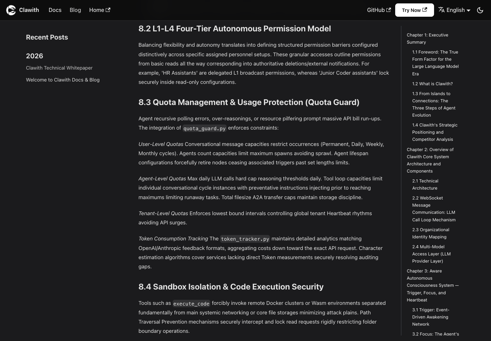

截图同时提到 quota guard 和“远端 Docker/Wasm 与主系统网络、文件存储隔离”。这些句子只能证明
白皮书如何描述目标架构，不能替代当前 Compose、sandbox、network、credential 和 escape test 的
源码/运行证据。特别是本报告已在 12.4–12.5 记录固定源码默认 privileged/Docker socket、默认
`execute_code` 网络及宿主 pip 边界；不能用白皮书段落把这些具体风险覆盖掉。

### 10.2 Runtime-scoped approval 有可借鉴的确定性恢复

【固定源码事实】Runtime approval ID 由 `run_id + action_type + tool_call_id` 稳定派生；重复检查会复用现有请求，避免同一动作生成多个审批。L3 创建 ApprovalRequest 后阻断；决策后可用稳定 idempotency key 恢复原 Run。见 [`autonomy_service.py#L29-L102`](https://github.com/dataelement/Clawith/blob/45fc701c366c69f89dff26d91d6a4a9cbc38e6f8/backend/app/services/autonomy_service.py#L29-L102)、[`#L131-L161`](https://github.com/dataelement/Clawith/blob/45fc701c366c69f89dff26d91d6a4a9cbc38e6f8/backend/app/services/autonomy_service.py#L131-L161) 与 [`#L197-L230`](https://github.com/dataelement/Clawith/blob/45fc701c366c69f89dff26d91d6a4a9cbc38e6f8/backend/app/services/autonomy_service.py#L197-L230)。

这比“弹窗点了允许，然后服务端直接重新执行整段 prompt”可靠。WanWork 的 Needs You 可以吸收稳定 approval identity 和精确 resume，但必须让授权证明绑定完整 action digest，而不只是 action type/tool call ID。

### 10.3 通用 ApprovalRequest 仍缺生产授权所需字段

【固定源码事实】`ApprovalRequest` 只有 agent、action type、自由 JSON details、pending/approved/rejected、创建/解决时间和 resolver；模型本身没有显式 tenant/workspace、requester、policy revision、action digest、resource/audience、TTL、expiry、revocation、approval revision 或 capability attenuation。见 [`models/audit.py#L31-L47`](https://github.com/dataelement/Clawith/blob/45fc701c366c69f89dff26d91d6a4a9cbc38e6f8/backend/app/models/audit.py#L31-L47)。

审批列表通过“Approval → Agent → tenant”间接限定；resolver 主要校验 Agent creator 或 platform admin，见 [`enterprise.py#L626-L679`](https://github.com/dataelement/Clawith/blob/45fc701c366c69f89dff26d91d6a4a9cbc38e6f8/backend/app/api/enterprise.py#L626-L679) 与 [`autonomy_service.py#L165-L195`](https://github.com/dataelement/Clawith/blob/45fc701c366c69f89dff26d91d6a4a9cbc38e6f8/backend/app/services/autonomy_service.py#L165-L195)。

【分析判断】“有人批准过某 action type”不能自动授权未来同类动作。WanWork 每次 approval 至少绑定：

- tenant/workspace/session/task/attempt；
- actor、on-behalf-of、approver 和其当前 membership revision；
- capability、action、resource、参数 canonical digest；
- policy version、risk level、reason；
- issued-at、expires-at、single-use nonce、revocation；
- provider route 和 credential scope；
- decision event、resume event 与最终 action receipt。

### 10.4 Audit 是普通 best-effort 业务表，不是防篡改账本

【官网/文档声明】白皮书宣称高风险动作实时进入人类审批卡，并由“full-chain operation audit log
network”保证每个 tool call 和 message flow 均可追踪、回放和提交为证据：

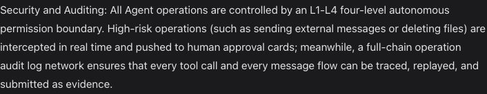

这张裁剪图是**厂商 claim 的像素证据**，不是一次真实 Run 的 audit export、tool replay、消息因果链
或不可篡改校验结果。以下固定源码观察决定本报告能给出的更窄结论。

【固定源码事实】`AuditLog` 是普通 SQL 表，字段为 tenant/user/agent/action/details/IP/time，没有 previous hash、sequence、签名、WORM retention 或不可变事件链，见 [`models/audit.py#L13-L28`](https://github.com/dataelement/Clawith/blob/45fc701c366c69f89dff26d91d6a4a9cbc38e6f8/backend/app/models/audit.py#L13-L28)。后台 helper 使用普通 `INSERT`，异常被捕获并只写 error log，明确“Never let audit logging break the caller”，见 [`audit_logger.py#L177-L213`](https://github.com/dataelement/Clawith/blob/45fc701c366c69f89dff26d91d6a4a9cbc38e6f8/backend/app/services/audit_logger.py#L177-L213)。

此外该 raw SQL insert 没有写 `tenant_id` 列，而是把 tenant 放进 details JSON，说明审计写入路径仍不完全统一。企业审计列表又主要通过 `agent_id → tenant Agent IDs` 过滤，未关联 Agent 的身份/租户级事件可能无法被同一查询完整覆盖，见 [`enterprise.py#L686-L704`](https://github.com/dataelement/Clawith/blob/45fc701c366c69f89dff26d91d6a4a9cbc38e6f8/backend/app/api/enterprise.py#L686-L704)。

【分析判断】可以说 Clawith“有审计日志和审批能力”，不能据此说“每个操作都有不可篡改、可完整回放的全链路审计”。WanWork 应让权限决策、action intent、dispatch、provider receipt、unknown/reconcile 和 Artifact acceptance 成为同一 append-only 事件体系的可验证投影；审计写入不能静默失败后仍把高风险操作当成完整合规执行。

## 11. 多租户与组织身份：骨架完整，边界仍有新旧两套语义并存

### 11.1 Identity 与 tenant membership 的拆分是正确方向

【固定源码事实】Clawith 把自然人的全局 `Identity` 与某公司的 `User` membership 分开：Identity 保存全局登录身份，User 保存 tenant、显示名、组织角色、配额和状态。User 角色为 `platform_admin / org_admin / agent_admin / member`。见 [`models/user.py#L15-L49`](https://github.com/dataelement/Clawith/blob/45fc701c366c69f89dff26d91d6a4a9cbc38e6f8/backend/app/models/user.py#L15-L49) 与 [`#L51-L100`](https://github.com/dataelement/Clawith/blob/45fc701c366c69f89dff26d91d6a4a9cbc38e6f8/backend/app/models/user.py#L51-L100)。

Tenant 模型包含 IM provider、用户/Agent/模型调用配额、Heartbeat floor、时区、SSO、Trigger 限额、A2A async 开关和默认模型，见 [`models/tenant.py#L13-L68`](https://github.com/dataelement/Clawith/blob/45fc701c366c69f89dff26d91d6a4a9cbc38e6f8/backend/app/models/tenant.py#L13-L68)。

【分析判断】这使“同一个人加入多个组织”“组织内角色和额度不同”“平台管理员与组织管理员分离”都有数据表达。WanWork 的 Actor 模型也应区分：

- global identity：人或外部服务是谁；
- tenant membership：他在这个组织里是谁；
- workspace/group membership：他在当前工作空间能做什么；
- acting principal：这次动作实际由哪个用户、Agent 或服务发起；
- on-behalf-of：Agent 是否代表某个明确的人或组织角色。

### 11.2 ORM 自动 tenant predicate 是一条有价值的纵深防线

【固定源码事实】HTTP middleware 从 JWT tenant claim 写入 ContextVar；SQLAlchemy `do_orm_execute` hook 会对标记为 tenant-scoped 的 ORM SELECT 自动注入 `tenant_id == active tenant`，覆盖直接 API/service query 与 DAO query。后台 worker 则需要显式 `tenant_context()`。见 [`dao/base.py#L120-L193`](https://github.com/dataelement/Clawith/blob/45fc701c366c69f89dff26d91d6a4a9cbc38e6f8/backend/app/dao/base.py#L120-L193)。

【分析判断】这比完全依赖每个开发者手写 tenant filter 更可靠，但它仍不是完整多租户证明：

- hook 主要覆盖 ORM SELECT，不自动证明 INSERT/UPDATE/DELETE scope 正确；
- background worker 忘记绑定 tenant context 时可能落入不同语义；
- tenant nullable/global builtin/legacy 表需要额外分支；
- raw SQL、对象存储 key、缓存、日志、临时文件和外部 provider 不受 ORM hook 自动保护；
- platform admin 跨 tenant 路径必须有独立授权与 break-glass 审计。

WanWork 应同时使用 repository 强制 scope、数据库约束/RLS、tenant-first object key、cache namespace、KMS key 和跨租户 property tests，而不是把 ContextVar 当成唯一隔离线。

### 11.3 固定源码暴露的租户模型不一致

【固定源码事实】以下结构问题可以从固定源码定位。

【本次未验证】本轮没有通过动态攻击复现下表风险，也没有据此证明真实部署可被利用。

| 问题 | 固定源码证据 | 风险 |
|---|---|---|
| Skill/Tool 名称全局 unique，但 API 按租户查重 | [`skill.py#L13-L30`](https://github.com/dataelement/Clawith/blob/45fc701c366c69f89dff26d91d6a4a9cbc38e6f8/backend/app/models/skill.py#L13-L30)、[`tool.py#L22-L46`](https://github.com/dataelement/Clawith/blob/45fc701c366c69f89dff26d91d6a4a9cbc38e6f8/backend/app/models/tool.py#L22-L46) | 不同租户同名冲突，或演化出全局对象被复用 |
| 动态 MCP Tool 可能以 `tenant_id=NULL` 创建并按全局 name/server 复用 | [`resource_discovery.py#L881-L937`](https://github.com/dataelement/Clawith/blob/45fc701c366c69f89dff26d91d6a4a9cbc38e6f8/backend/app/services/resource_discovery.py#L881-L937) | 配置、URL、schema 与归属语义漂移 |
| Approval 没有直接 tenant/workspace | [`audit.py#L31-L47`](https://github.com/dataelement/Clawith/blob/45fc701c366c69f89dff26d91d6a4a9cbc38e6f8/backend/app/models/audit.py#L31-L47) | 依赖 Agent 间接 scope，迁移/删除/历史查询更脆弱 |
| Agent workspace object key 主要以 Agent UUID 开头，不以 tenant 开头 | [`storage_runtime/utils.py#L19-L24`](https://github.com/dataelement/Clawith/blob/45fc701c366c69f89dff26d91d6a4a9cbc38e6f8/backend/app/services/storage_runtime/utils.py#L19-L24) | tenant 级 IAM/KMS/配额/删除难以成为天然边界 |
| ChannelConfig 自身没有 tenant_id，依赖 Agent 归属 | [`channel_config.py#L13-L48`](https://github.com/dataelement/Clawith/blob/45fc701c366c69f89dff26d91d6a4a9cbc38e6f8/backend/app/models/channel_config.py#L13-L48) | 每条查询都必须正确 join/验证 Agent scope |

【分析判断】WanWork 新模型从第一天使用 `(tenant_id, canonical_name)` 或 `(tenant_id, object_id)` 复合约束。平台 builtin 不让租户直接修改；租户 override 是独立派生版本。所有 UUID lookup、cache、blob、event、approval、credential、tool assignment 和 Artifact 都必须携带 tenant/workspace scope，避免依赖“只要 UUID 足够随机就安全”。

## 12. 模型、渠道与私有化：产品覆盖很广，部署默认值不能作为生产基线

### 12.1 模型池和能力探测是可直接借鉴的产品能力

【固定源码事实】统一 provider registry 支持 16 个 canonical provider：Anthropic、OpenAI Chat、OpenAI Responses、Azure OpenAI、DeepSeek、Qwen/DashScope、MiniMax、OpenRouter、智谱、百度千帆、Gemini、Kimi、vLLM、Ollama、SGLang 和 custom OpenAI-compatible。见 [`llm/client.py#L2343-L2468`](https://github.com/dataelement/Clawith/blob/45fc701c366c69f89dff26d91d6a4a9cbc38e6f8/backend/app/services/llm/client.py#L2343-L2468)。

`LLMModel` 不只保存 provider/model/key/base URL，还保存 vision、tool calling、context/input/output limits、能力来源、探测时间和错误；逻辑删除保留历史引用，见 [`models/llm.py#L13-L79`](https://github.com/dataelement/Clawith/blob/45fc701c366c69f89dff26d91d6a4a9cbc38e6f8/backend/app/models/llm.py#L13-L79)。管理端测试先做连接测试，再要求模型真正发出结构化 `capability_probe` tool call，并以配置 fingerprint 防止把旧探测结果写到已变化的模型配置上，见 [`enterprise.py#L161-L266`](https://github.com/dataelement/Clawith/blob/45fc701c366c69f89dff26d91d6a4a9cbc38e6f8/backend/app/api/enterprise.py#L161-L266) 与 [`#L269-L367`](https://github.com/dataelement/Clawith/blob/45fc701c366c69f89dff26d91d6a4a9cbc38e6f8/backend/app/api/enterprise.py#L269-L367)。

【分析判断】WanWork 应把“模型是否能连通”“是否支持原生 tool calling”“上下文/输出预算”“视觉/推理能力”“结构化输出可靠性”做成版本化 capability facts，而不是由用户凭模型名字猜。规划模型、执行模型、审核模型可分别选择，但一次 Run 必须冻结实际 model revision、provider route 和 capability snapshot。

### 12.2 渠道枚举很丰富，但“有枚举”不等于每个渠道语义一致

【固定源码事实】`ChannelConfig` 枚举包含飞书、企微、微信、WhatsApp、钉钉、Slack、Discord、Atlassian、Microsoft Teams 和 AgentBay，并保存 Agent 级 channel credentials/config，见 [`channel_config.py#L13-L40`](https://github.com/dataelement/Clawith/blob/45fc701c366c69f89dff26d91d6a4a9cbc38e6f8/backend/app/models/channel_config.py#L13-L40)。固定仓库也包含多种 inbound/outbound adapter 和针对飞书文档、日历、审批、多维表格等工具。

【本次未验证】本轮没有配置或发送任何真实渠道消息，没有验证 webhook 签名、token 轮换、群成员映射、限流、富文本、文件、撤回、幂等 ACK、重复回调或消息顺序。因此不能用 enum 或源码文件数量推断所有渠道已经同等成熟。

【分析判断】WanWork 的渠道 adapter 需要统一 canonical event，但保留 provider receipt：

- inbound：原始 provider event ID、签名验证、tenant/channel/conversation/participant mapping；
- outbound：action intent、provider idempotency/nonce、dispatch 状态、provider message ID、unknown/reconcile；
- 富文本/mention/file 能力通过 capability negotiation，不假装所有渠道等价；
- Agent 对外身份、代表关系和群聊中真实发言者必须可见；
- 默认策略仍是“不发送”，只有明确的用户 action/capability 才能外发。

### 12.3 “可私有化”不等于“模型和数据完全不出境”

【官网/文档声明】README 明确写明本地部署不运行任何 AI 模型，LLM 推理由外部 API provider 处理；本地主要部署 Web 应用和 Docker 编排，见 [`README.md#L72-L79`](https://github.com/dataelement/Clawith/blob/45fc701c366c69f89dff26d91d6a4a9cbc38e6f8/README.md#L72-L79)。虽然 provider registry 支持 vLLM/Ollama/SGLang 等本地兼容端点，但是否真正离线取决于管理员配置的模型、MCP、渠道和对象存储位置。

【分析判断】WanWork 的私有化等级必须拆成四张事实表：控制面部署位置、模型推理位置、工具/MCP 数据流、IM/业务连接器数据流。只有全部在受控边界内且经过气隙验证，才能称离线/气隙部署；“应用自托管”不能自动替代这个结论。

### 12.4 默认 Compose 拥有过大的宿主控制权限

【固定源码事实】主 Compose 和 multi-process Compose 的 backend/API/worker 挂载宿主 Docker socket，并启用 `privileged: true`、`SYS_ADMIN`、`seccomp=unconfined`、`apparmor=unconfined`。见 [`docker-compose.yml#L71-L80`](https://github.com/dataelement/Clawith/blob/45fc701c366c69f89dff26d91d6a4a9cbc38e6f8/docker-compose.yml#L71-L80) 与 [`deploy/docker-compose-multi.yml#L89-L98`](https://github.com/dataelement/Clawith/blob/45fc701c366c69f89dff26d91d6a4a9cbc38e6f8/deploy/docker-compose-multi.yml#L89-L98)、[`#L152-L161`](https://github.com/dataelement/Clawith/blob/45fc701c366c69f89dff26d91d6a4a9cbc38e6f8/deploy/docker-compose-multi.yml#L152-L161)。

【分析判断】这意味着 backend 漏洞或不可信执行链一旦突破应用边界，可能获得宿主 Docker 控制权；容器内降权用户无法抵消 Docker socket 和 privileged 的权限半径。WanWork 生产拓扑必须拆开：

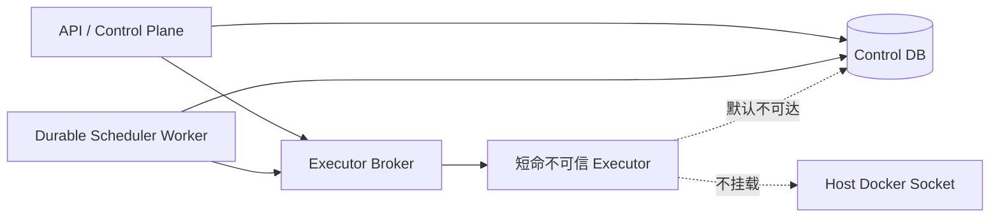

API 和调度 worker 不持有宿主 Docker socket；executor broker 只接受经过 policy 的结构化 launch request；不可信 executor 默认无控制面网络、non-root、cap-drop、只读 rootfs、seccomp/AppArmor、cgroup 和短期 credential。

### 12.5 沙箱默认网络、依赖安装与资源限制存在高风险边界

【固定源码事实】内置 `execute_code` 的持久化工具配置默认 `allow_network=True`，见 [`builtin_tool_definitions.py#L1025-L1091`](https://github.com/dataelement/Clawith/blob/45fc701c366c69f89dff26d91d6a4a9cbc38e6f8/backend/app/services/builtin_tool_definitions.py#L1025-L1091)；该 Tool 配置可覆盖平台 `SANDBOX_ALLOW_NETWORK=False` fallback。Bubblewrap 只有禁网时才加 `--unshare-net`，见 [`subprocess_backend.py#L388-L465`](https://github.com/dataelement/Clawith/blob/45fc701c366c69f89dff26d91d6a4a9cbc38e6f8/backend/app/services/sandbox/local/subprocess_backend.py#L388-L465)。Compose 中 backend、PostgreSQL、Redis、MinIO 等又处在相邻网络，因此默认 Agent 代码存在探测控制面服务的横向风险。

更严重的是，沙箱内 pip 命令会被 wrapper 转发到 Bubblewrap 外的宿主 backend，由继承环境的 `uv pip` 执行；固定源码未见包 allowlist、短命隔离 builder 或明确安装超时，见 [`subprocess_backend.py#L287-L317`](https://github.com/dataelement/Clawith/blob/45fc701c366c69f89dff26d91d6a4a9cbc38e6f8/backend/app/services/sandbox/local/subprocess_backend.py#L287-L317) 与 [`#L491-L540`](https://github.com/dataelement/Clawith/blob/45fc701c366c69f89dff26d91d6a4a9cbc38e6f8/backend/app/services/sandbox/local/subprocess_backend.py#L491-L540)。恶意依赖构建脚本因此可能越过预期沙箱边界。

【固定源码事实】RLIMIT 主要用于 unsafe host fallback；默认 Bubblewrap 路径未见 CPU/memory/pids/disk/inode 的 cgroup 配额。缺少 bwrap 时，本地源码部署还可警告后继续低隔离 fallback，见 [`config.py#L67-L69`](https://github.com/dataelement/Clawith/blob/45fc701c366c69f89dff26d91d6a4a9cbc38e6f8/backend/app/config.py#L67-L69) 与 [`main.py#L37-L69`](https://github.com/dataelement/Clawith/blob/45fc701c366c69f89dff26d91d6a4a9cbc38e6f8/backend/app/main.py#L37-L69)。

【分析判断】生产环境必须 fail closed；依赖安装独立为受限 builder capability，使用锁文件/allowlist、无敏感环境、独立出网、制品扫描/签名，运行期只挂载不可变制品。

### 12.6 Helm Chart 应视为早期交付资产，不是已验证的企业级基线

【固定源码事实】Chart 静态文件缺少或不完整的内容包括 pod/container securityContext、NetworkPolicy、ServiceAccount、readiness/liveness probes、PDB/HPA、反亲和与完整资源限制；frontend 只注入构建期风格的 `VITE_API_URL`，而 Nginx 模板需要 `API_UPSTREAM/MINIO_UPSTREAM`；数据库密码被拼入 Deployment env；external Redis password 未进入生成 URL；PVC retention、备份范围和 HA 文档与模板存在漂移。对应入口见 [`helm/clawith/templates/backend.yaml#L22-L121`](https://github.com/dataelement/Clawith/blob/45fc701c366c69f89dff26d91d6a4a9cbc38e6f8/helm/clawith/templates/backend.yaml#L22-L121)、[`frontend.yaml#L1-L55`](https://github.com/dataelement/Clawith/blob/45fc701c366c69f89dff26d91d6a4a9cbc38e6f8/helm/clawith/templates/frontend.yaml#L1-L55) 与 [`values.yaml#L25-L215`](https://github.com/dataelement/Clawith/blob/45fc701c366c69f89dff26d91d6a4a9cbc38e6f8/helm/clawith/values.yaml#L25-L215)。

【本次未验证】本机本轮未运行 `helm lint/template` 或 Kubernetes 部署；以上是固定源码静态审查，不应表述成动态部署失败证明。

【分析判断】WanWork 的 Helm/Kubernetes 资产必须独立通过 template/lint、kind smoke、升级/回滚、网络策略、Pod Security、External Secrets、S3、备份恢复和多副本故障注入门禁，不能因为仓库里出现 `helm/` 目录就标记“企业级 K8s 已完成”。

## 13. 技术架构与源码地图：LangGraph 只是控制图，真正价值在周围的 durable runtime

### 13.1 整体技术栈

【固定源码事实】官方架构说明为 React 19 + TypeScript/Vite 前端，FastAPI + async SQLAlchemy 后端，SQLite/PostgreSQL、Redis、Docker，并包含 MCP client。见 [`README.md#L205-L224`](https://github.com/dataelement/Clawith/blob/45fc701c366c69f89dff26d91d6a4a9cbc38e6f8/README.md#L205-L224)。固定源码同时包含 MinIO/S3 storage、LangGraph checkpointer、runtime command worker、channel adapters、sandbox backends 和 Helm。

可将实际运行结构概括为：

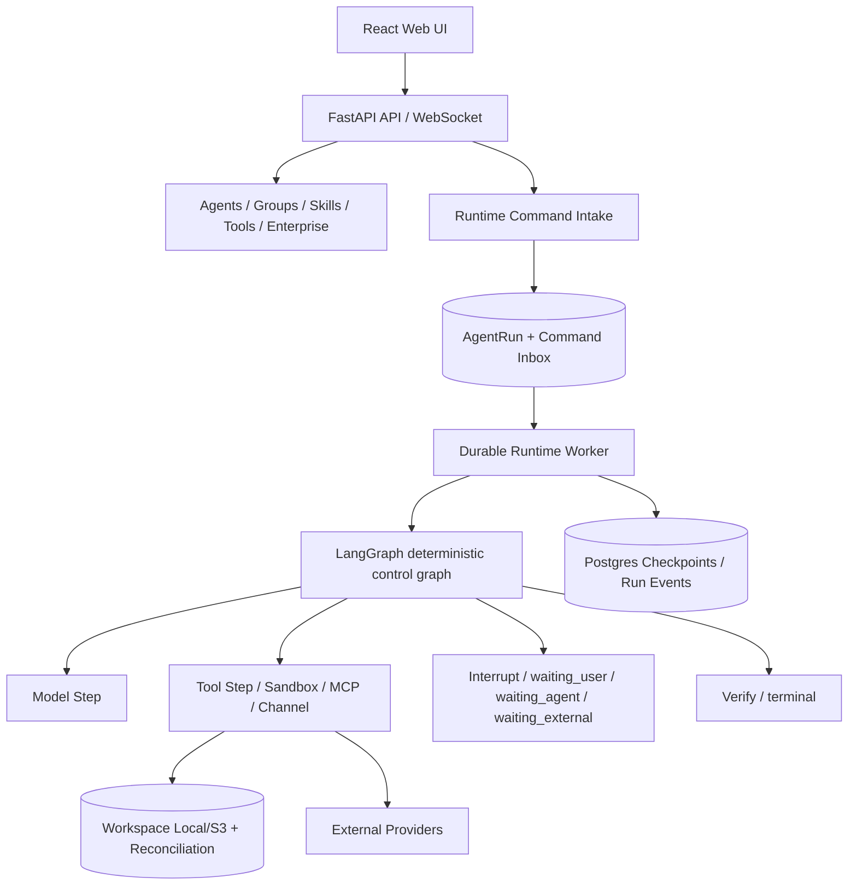

### 13.2 LangGraph control flow本身刻意保持确定性

【固定源码事实】Runtime graph 固定节点为 `control_guard → compact/model/tool/verify/wait/terminal`，只有明确 classified 的 compact transient error 和 safe-read tool error使用有限 retry。RuntimeContext 必须携带 tenant、Run 和 Command identity；wait 使用 LangGraph interrupt，状态只允许在预定义 route/status 组合中迁移。见 [`graph.py#L30-L69`](https://github.com/dataelement/Clawith/blob/45fc701c366c69f89dff26d91d6a4a9cbc38e6f8/backend/app/services/agent_runtime/graph.py#L30-L69)、[`#L116-L190`](https://github.com/dataelement/Clawith/blob/45fc701c366c69f89dff26d91d6a4a9cbc38e6f8/backend/app/services/agent_runtime/graph.py#L116-L190) 与 [`#L206-L238`](https://github.com/dataelement/Clawith/blob/45fc701c366c69f89dff26d91d6a4a9cbc38e6f8/backend/app/services/agent_runtime/graph.py#L206-L238)。

新 Run 的输入在受锁连接上捕获成 snapshot；resume type 必须匹配当前 waiting state，见 [`langgraph_driver.py#L82-L132`](https://github.com/dataelement/Clawith/blob/45fc701c366c69f89dff26d91d6a4a9cbc38e6f8/backend/app/services/agent_runtime/langgraph_driver.py#L82-L132) 与 [`#L176-L220`](https://github.com/dataelement/Clawith/blob/45fc701c366c69f89dff26d91d6a4a9cbc38e6f8/backend/app/services/agent_runtime/langgraph_driver.py#L176-L220)。

【分析判断】这体现了与 DeepSeek Harness 相通的正确思想：

- 模型只负责提出下一步意图，不直接拥有真实世界副作用；
- 平台拥有 tool schema、validation、执行、receipt 和停止条件；
- retry 依据副作用分类，而不是所有异常统一重试；
- context/compaction、tool result 和 final answer 有明确通道；
- 运行可 checkpoint、wait、resume，而不是把循环藏在一次 HTTP 请求里。

LangGraph 在这里适合作为确定性控制图；Harness 思想应落在 node executor、tool ledger、policy、sandbox、effect lifecycle 和 verification 上。两者结合不是“把 DeepSeek Harness 再封装成一个 LangGraph node”，而是让 LangGraph 管状态转换，让 harness 层管每一步真实执行纪律。

### 13.3 Workspace candidate + CAS reconciliation 是底层最值得借鉴的实现之一

【固定源码事实】Clawith workspace 支持 `merge` 与 `isolated_output` 语义；tenant/agent/session Redis lease、token ownership、heartbeat 与 fencing；本地存储使用跨进程 flock、条件写、temp + fsync + atomic replace；S3 使用 `IfNoneMatch/IfMatch` 条件写删。候选 reconciliation 保存 candidate bytes、content hash 和 manifest scope，再按当前状态以 CAS 得出 `applied / not_saved / conflict / unverified`。关键入口见：

- [`workspace_policy.py#L16-L74`](https://github.com/dataelement/Clawith/blob/45fc701c366c69f89dff26d91d6a4a9cbc38e6f8/backend/app/services/sandbox/workspace_policy.py#L16-L74)
- [`execution_lease.py#L17-L110`](https://github.com/dataelement/Clawith/blob/45fc701c366c69f89dff26d91d6a4a9cbc38e6f8/backend/app/services/sandbox/execution_lease.py#L17-L110)
- [`storage_runtime/local.py#L144-L248`](https://github.com/dataelement/Clawith/blob/45fc701c366c69f89dff26d91d6a4a9cbc38e6f8/backend/app/services/storage_runtime/local.py#L144-L248)
- [`storage_runtime/s3.py#L278-L367`](https://github.com/dataelement/Clawith/blob/45fc701c366c69f89dff26d91d6a4a9cbc38e6f8/backend/app/services/storage_runtime/s3.py#L278-L367)
- [`workspace_reconciliation.py#L41-L155`](https://github.com/dataelement/Clawith/blob/45fc701c366c69f89dff26d91d6a4a9cbc38e6f8/backend/app/services/workspace_reconciliation.py#L41-L155) 与 [`#L451-L598`](https://github.com/dataelement/Clawith/blob/45fc701c366c69f89dff26d91d6a4a9cbc38e6f8/backend/app/services/workspace_reconciliation.py#L451-L598)

【分析判断】WanWork 可以把它提升为多 Agent Artifact/File 协作协议：每个 Agent 先产 candidate；manifest 固定 base version、scope、author Run、content digest；平台做 policy、冲突检测和 CAS；成功后形成新版本事件；失败保留候选以便人工/Agent 合并。这样比多个 Agent 直接覆盖共享目录可靠得多。

### 13.4 仍需避免把单文件 CAS误写成“多文件原子事务”

【固定源码事实】普通写入存在先更新对象存储、后写 DB revision 的边界；多文件 move/apply 是逐项 CAS；Redis workspace lock TTL 为 60 秒且固定源码未见续租；S3 `delete_tree` 只调用一次 `list_objects_v2`；S3 local temp file 和 read-through fallback 也需要更明确的生命周期/tombstone。见 [`workspace_collaboration.py#L571-L623`](https://github.com/dataelement/Clawith/blob/45fc701c366c69f89dff26d91d6a4a9cbc38e6f8/backend/app/services/workspace_collaboration.py#L571-L623)、[`#L789-L916`](https://github.com/dataelement/Clawith/blob/45fc701c366c69f89dff26d91d6a4a9cbc38e6f8/backend/app/services/workspace_collaboration.py#L789-L916)、[`workspace_locking.py#L10-L91`](https://github.com/dataelement/Clawith/blob/45fc701c366c69f89dff26d91d6a4a9cbc38e6f8/backend/app/services/workspace_locking.py#L10-L91) 与 [`storage_runtime/s3.py#L221-L237`](https://github.com/dataelement/Clawith/blob/45fc701c366c69f89dff26d91d6a4a9cbc38e6f8/backend/app/services/storage_runtime/s3.py#L221-L237)。

【分析判断】跨对象变更必须采用 durable saga/outbox/reconciliation，并对外明确“每个对象 CAS + 可恢复批次”，不能宣称不可实现的跨 S3/DB 原子提交。

### 13.5 源码地图

| 能力 | 主要入口 | 评估用途 |
|---|---|---|
| Agent identity/config | `models/agent.py`, `api/agents.py` | 持久数字员工、模型、策略、状态 |
| Participant/Group | `models/participant.py`, `models/group.py`, `api/groups.py` | 人/Agent 统一身份、原生群聊 |
| Group orchestration | `group_message_service.py`, `planning.py`, `group_handoff.py` | mention 路由、多 Agent planning、handoff |
| Durable Runtime | `agent_runtime/graph.py`, `langgraph_driver.py`, `command_worker.py` | 控制图、checkpoint、worker、wait/resume |
| Tool/effect | `tool_registry.py`, `tool_execution.py`, `tool_step_service.py` | tool contract、receipt、unknown/reconcile |
| Skills/MCP | `api/skills.py`, `agent_context.py`, `mcp_client.py`, `resource_discovery.py` | 能力包、渐进式加载、动态工具 |
| Aware/Pulse | `models/focus.py`, `models/trigger.py`, `schedule_scheduler.py` | 长期关注、触发、主动执行 |
| Experience | `models/experience.py`, `experience_retrieval.py` | 人审经验库、按需检索 |
| Governance | `autonomy_service.py`, `models/audit.py`, `audit_logger.py` | L1–L3、审批、审计 |
| Workspace/Sandbox | `workspace_reconciliation.py`, `sandbox/*`, `storage_runtime/*` | candidate/CAS、lease、执行隔离 |
| Model/Channel | `services/llm/*`, `models/channel_config.py`, channel APIs | 模型池、能力探测、外部渠道 |
| Deployment | Compose、`helm/clawith/*`, CI scripts | 私有化、升级、运维与安全边界 |

## 14. 综合优势、短板与竞争含义

### 14.1 Clawith 的核心优势

1. **产品形态完整。** 它把 Agent 做成组织成员，把协作放进群聊、Directory、Workspace、Enterprise Settings，而不是只暴露 workflow builder。
2. **长期身份自然。** Soul、Memory、Focus、状态、模型、能力、关系和配额围绕稳定 Agent ID 组织，用户容易建立信任和责任认知。
3. **原生群聊协作成熟。** Participant 统一人和 Agent，单 mention 确定性路由，多 mention 规划，每个 Agent 以自己的身份回复。
4. **主动工作有产品闭环。** Focus、Trigger occurrence、Run、Heartbeat 和主动汇报形成可理解的 Aware/Pulse 语义。
5. **Experience Library 方向正确。** 从自动社交 feed 演进到人类策展、AI 按需消费，显著降低知识污染风险。
6. **模型兼容面广。** provider registry、租户模型池、默认/回退模型、能力探测和 token budget 都已进入产品设置。
7. **Skill progressive disclosure 值得借鉴。** 能力索引、完整读取、激活 receipt、整包 digest 和 fail-closed 物化形成清晰运行链。
8. **Runtime 已超出普通 CRUD demo。** LangGraph 外围有 command worker、checkpoint、waiting/resume、tool ledger、typed outcome 和部分 reconciliation。
9. **Workspace candidate/CAS 很有底层价值。** 它认真处理了内容 hash、base/current 状态、冲突和未知，而不是只有“让 Agent 写文件”。
10. **开源与自托管降低试用门槛。** Apache-2.0、Compose、Helm、丰富渠道和国内外模型 provider 有明显生态传播优势。

### 14.2 Clawith 的关键短板

1. **产品叙事快于治理实现。** L1–L4、全链路审计、完整 MCP、企业级部署等最强表述与固定源码存在差距。
2. **内部 A2A 命名容易造成标准兼容误解。** 它是优秀的内部协作子系统，但不是已验证的标准 A2A 实现。
3. **正式交付对象不足。** 群聊、Run final answer、workspace 和 Experience 很强，但跨任务可验收、版本化、可回滚的 Artifact 仍不是产品中心。
4. **第三方能力默认自扩展过宽。** Skills/MCP 安装缺少组织审批、签名、版本 pin、quarantine 和严格 tenant scope。
5. **MCP egress/SSRF/secret 边界不足。** 任意 URL、redirect、SSE 二跳、URL secret、generic Bearer 和 schema/response 上限都需要统一治理。
6. **多租户新旧模型混合。** 全局 unique、tenant nullable、间接 scope、raw SQL 与对象存储 key 尚未形成一致 tenant-first 体系。
7. **审批是业务流程，不是完整 capability authorization。** 缺少 action digest、policy revision、TTL、single-use、revocation 和统一 action-time coverage。
8. **审计不是不可变事实源。** 普通表 + best-effort 写入无法支撑“所有操作完整可回放”的强承诺。
9. **默认沙箱/Compose 权限过大。** executor 网络、宿主 pip proxy、privileged、Docker socket 和缺乏资源配额是生产 P0 风险。
10. **Kubernetes 交付资产漂移。** Chart 静态缺口和文档/模板不一致说明仍需要完整 release engineering。

### 14.3 对竞争格局的真正含义

【分析判断】Clawith 不是“底层协议最严谨”的参考，也不是“已经证明生产安全”的标杆；它的价值是证明了一个关键市场事实：

> 用户愿意把 Agent 当同事使用的前提，不是看到更多框架名，而是看到稳定身份、群聊关系、主动承担、清楚的等待人节点和可复用的组织资产。

Quantum Entanglement 的机会不在复制一个功能更多的 Clawith，而在把这种可理解的产品形态与更严格的 Artifact、canonical event、authority、unknown outcome 和协议 adapter 结合。若只继续加强底层而没有组织工作台，用户会感觉“技术很强但不知道每天怎么用”；若只复制 Clawith 页面而放弃底层纪律，则难以承载真正企业级授权、恢复和审计。

## 15. Clawith 与 Quantum Entanglement 逐项矩阵

本节的 Quantum Entanglement 现状依据本仓库 [`../multi_agent_collaboration_report.md`](../multi_agent_collaboration_report.md)、[`07_current_implementation_status.md`](07_current_implementation_status.md)、[`18_model_backed_custom_instruction_evidence.md`](18_model_backed_custom_instruction_evidence.md) 和 [`19_six_agent_collaboration_protocols_and_bottom_layer_design.md`](19_six_agent_collaboration_protocols_and_bottom_layer_design.md)。两边均只按已记录证据评价，不把设计文档当成已经部署的产品。

| 维度 | Clawith 固定源码/产品 | Quantum Entanglement 当前证据 | 判断与动作 |
|---|---|---|---|
| 外部定位 | AI 组织、Digital Employee | 人 + Agent 原生协同与可靠内核 | 学 Clawith 的组织语言，保留 QE 的可信协作差异化 |
| 稳定 Agent 身份 | 已有数据库 Agent、Soul/Memory/Focus/关系 | demo 仍以固定专业 Agent 为主；协议 Actor 更严谨 | 优先实现 `AgentIdentity + AgentRevision` 产品对象 |
| 组织/成员 | Tenant、Identity/User、Directory、部门/角色 | tenant authorization primitives 已有；完整组织 UI/API 未闭环 | 数据边界用 QE，产品对象和导航学 Clawith |
| 群聊 | 原生 Group/Crew、Participant、workspace、read state | 当前可验收页是单人触发三 Agent DAG，并非多人长期群 | 第一产品优先级：真实多人 + Agent 持久群 |
| mention 路由 | 单 Agent 确定性、多 Agent planning、`at` handoff | canonical envelope/handoff 有更严格设计，UI 未完整实现 | 合并两者：确定性 route + 版本化 HandoffContract |
| Agent 公开身份 | 每个 Agent 以 Participant 回复 | 协议强调不冒充，当前 demo 仍以汇总页面呈现 | UI 强制 actor/on-behalf-of 可见 |
| 长期记忆 | soul/memory + DB Focus + group memory | 已有 context/artifact 设计，长期用户记忆产品未闭环 | 建 personal/group/org 三层，但与 Artifact 分开 |
| 主动工作 | Focus/Trigger/Pulse/Heartbeat 完整产品语义 | 调度/恢复 primitives 有研究与内核，产品入口不足 | 借 Aware 语义，执行仍走 QE durable admission/effect policy |
| 经验库 | 人审 draft/published/retired Experience | 正式 Artifact 更强；跨任务人审经验产品未完成 | Artifact → draft Experience → review/publish |
| 正式 Artifact | 非核心公共产品对象 | 版本/CAS/digest/rollback、durable store 是 QE 强项 | 不要退化为聊天附件；让 Artifact 成为交付中心 |
| LangGraph | 已用于 durable runtime control graph | 已有 LangGraph bridge/adapter，核心更偏 framework-neutral | LangGraph 保持 adapter，不让 domain 依赖框架私有 state |
| Harness 思想 | tool/model/wait/verify 已有部分 discipline | QE 明确强调 runtime/tool/effect/verification 分层 | 两边互补；将 Harness 落到执行节点而非产品协议 |
| Tool ledger | 有 assignment、binding、typed outcome、unknown/reconcile | QE 有 invocation/attempt/action receipt/fencing 的更强规范与部分实现 | 吸收 Clawith 产品工具管理，底层沿用 QE receipt 模型 |
| Workspace 并发 | candidate/hash/CAS/reconcile 很值得借鉴 | Artifact CAS 强，通用共享文件协作仍可加强 | 把 Clawith candidate manifest 引入 QE 文件协作层 |
| Skills | progressive disclosure 与包激活已产品化 | 当前没有同等完整的用户可见 Skill registry/activation | 借运行链，补不可变 package version 与供应链治理 |
| MCP | HTTP/SSE Tools 子集已实现 | 当前研究/协议选型较完整，正式 adapter 尚未完成 | 采用官方 SDK/conformance；复用 Clawith不重放/unknown思想 |
| A2A | 内部同租户协作，非标准 | A2A 数据映射已有，正式互操作 adapter/TCK 仍待做 | 内部 canonical + 标准边缘 adapter，不复制命名混淆 |
| 权限 | access mode、角色、关系、L1–L3 | capability/attenuation/action-time auth 设计与 primitives 更严格 | 产品设置可借，授权事实用 QE 体系 |
| Needs You | approval 页面与 waiting_user 分散存在 | Needs You 是统一产品概念，持久化/UI仍需闭环 | 把 approval/input/ambiguity/unknown reconcile 统一投影 |
| 审计 | 普通 best-effort AuditLog | append-only event、canonical evidence、digest 方向更强 | QE 继续领先；补完整组合与外部 WORM/export |
| 多租户 | 产品模型丰富，但有 nullable/global unique 漂移 | tenant auth slice、secret refs、scope store 较严；未宣称公网投产 | 使用 QE tenant-first不变量，实现 Clawith式组织产品 |
| 模型管理 | 16 provider registry、能力探测、租户默认/回退 | 当前 demo 已能调用配置 GPT，但管理面较薄 | 复制模型池 UX，冻结 model revision/capability snapshot |
| 外部渠道 | 多渠道 enum 与大量 adapter | 明确当前不连接飞书/企微，正式 connector 未完成 | 后做少而深的 provider adapters，先完成 canonical receipt |
| 沙箱 | bwrap/remote backends 多，但默认安全边界有 P0 问题 | threat model/secret/action discipline 更严；执行产品化仍待完成 | 不复制 Compose/host pip；做独立 executor security domain |
| 私有化 | Compose/Helm 资产丰富，未动态证明生产级 | 当前是本地预生产内核/体验，不是商业部署 | 先做可验证单节点，再做安全 K8s，不抢写“生产级” |
| 最终用户体验 | 已是完整 Web 产品 | 当前仍是阶段性本地验收切片 | Clawith 明显领先，是近期最大补课项 |

### 15.1 最关键的组合原则

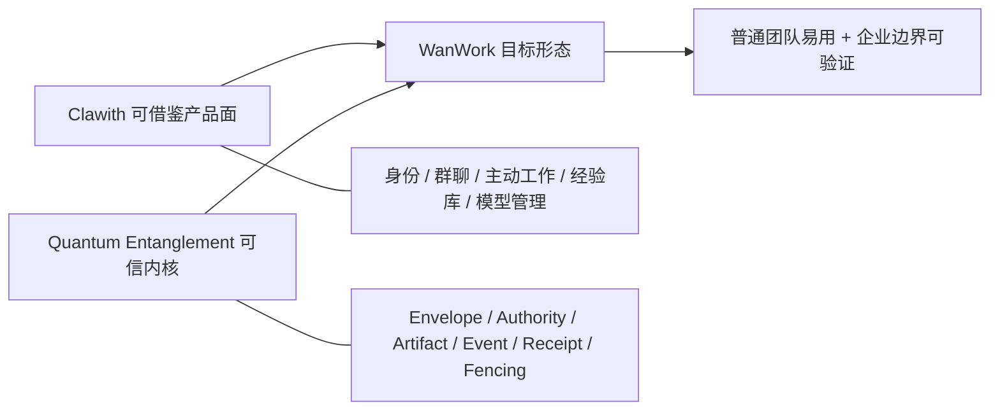

任何新功能都要同时回答两个问题：用户在产品里如何自然使用；底层如何在崩溃、重试、越权、重复消息和不确定副作用下保持可解释。

## 16. 可借鉴、需改造、不可照搬的决策清单

### 16.1 直接借鉴产品机制

| 机制 | 进入 WanWork 的形式 | 必须保留的不变量 |
|---|---|---|
| Agent 招聘/创建 | AgentIdentity + 不可变 AgentRevision | 历史 Run 固定 revision；创建者不等于永久所有权 |
| Directory | 人/Agent 统一组织目录 | tenant/workspace scope、真实 Participant、可见性与联系权限分离 |
| Crew/Group | 长期群聊 + Agent 成员 + 群 workspace | 单 mention 确定性；多 mention 计划需平台校验 |
| `at` handoff | 下一条公开回复的 mention intent | intent、delivery、acceptance、completion、Artifact acceptance 分状态 |
| Aware/Pulse | Focus → Trigger → occurrence → Run → report | occurrence 稳定幂等；外部动作仍走 action-time policy |
| Experience Library | Artifact 提炼 draft → 人审 published → retire | published 才可检索；来源/适用条件/失效信号/引用齐全 |
| Skill progressive disclosure | catalog → read → activate → materialize | 不可变 package snapshot、digest、来源与批准状态 |
| 模型能力探测 | connection/tool/vision/limits capability facts | 探测绑定 model config fingerprint 和时间 |
| Candidate/CAS | Agent 文件/Artifact 候选发布协议 | base version、digest、scope、冲突/未知显式化 |

### 16.2 借思想但重做边界

| Clawith 机制 | 保留 | 重做 |
|---|---|---|
| 内部 A2A | notify/consult/delegate、等待/恢复、公开身份 | 改名为内部 coordination；增加 Artifact contract、deadline、标准 A2A adapter |
| L1–L3 | 用户可理解的风险档位 | 底层改为 capability + policy decision + action digest + TTL/revocation |
| MCP client | 只读探测、业务调用不跨 transport 重放、unknown | 官方 SDK/版本协商、完整 capability、egress broker、OAuth、provider receipt |
| Runtime graph | 确定性 route、interrupt、有限安全重试 | domain/framework 解耦、canonical event、worker fencing、release gates |
| Workspace storage | lease/CAS/reconcile | tenant-first key、saga/outbox、多文件恢复、删除验证、KMS |
| 渠道 adapters | canonical inbound/outbound mapping | 每 provider 独立 receipt/idempotency/reconcile、身份和数据出境策略 |

### 16.3 明确不可照搬

- backend/worker 直接持有 privileged + 宿主 Docker socket；
- `execute_code` 默认可访问控制面网络；
- 把 pip 安装代理到沙箱外继承敏感环境执行；
- 无受支持沙箱时继续 host fallback；
- 普通用户或 Agent 默认安装第三方 Skill/MCP；
- suspicious 只警告、不 quarantine；
- URL 内嵌 secret，或 DB/日志/API 返回原始 credential；
- 全局 unique 与 tenant-local 语义混用；
- 将所有 MCP 都标 external write，却没有 per-tool action-time policy；
- 将所有 5xx 归为明确 failed；
- 用普通 best-effort AuditLog 支撑“不可篡改全链路审计”宣称；
- 把内部 `notify/consult/task_delegate` 称为标准 A2A；
- 用 Helm 文件存在代替生产部署验证。

## 17. 分阶段落地建议与阶段门禁

路线按“先让用户真正用起来，同时不破坏已有底层不变量”排序。时间仅是规划尺度，不是承诺日期。

### 阶段 A：组织身份与原生群聊产品切片

目标：把当前本地三 Agent 演示升级为可以长期回来的最小协作空间。

交付：

- Tenant、Workspace、Human/Agent Participant、AgentIdentity/Revision；
- Agent Directory、创建/停用、角色、模型 revision；
- 长期 Group/Crew、成员列表、消息、单 Agent `@` 确定性路由；
- 每个 Agent 以自己的身份回复；
- 消息、Task、Artifact、Needs You、Event timeline 同源投影；
- 任意自定义指令继续可用，不退回固定示例。

阶段门禁：

- 重启后群、成员、消息、Task、Artifact、approval 不丢；
- 相同 inbound event 不重复创建消息/Run；
- 单 Agent mention 不经过模型重新选人；
- Agent 不得冒充另一个 Agent 或人；
- 下游只消费明确 Artifact version；
- 全部 API 强制 tenant/workspace scope；
- 保持“不连接、不发送飞书/企微”默认安全行为。

### 阶段 B：可靠 Handoff、多人协作与 Needs You

目标：让多个 Agent 和人能够承担、等待、恢复并验收真实工作。

交付：

- 多 Agent mention planning + platform validation；
- HandoffContract：intent、offer、accept、progress、result、Artifact acceptance；
- deadline/cancel propagation、cycle/budget guard；
- approval/input/ambiguity/unknown reconcile 统一 Needs You；
- action-scoped capability 与 single-use approval；
- durable orchestrator 接入 attempt/heartbeat/result receipt/Artifact acceptance。

阶段门禁：进程在 dispatch 前后、effect 后 receipt 前、Artifact 写入前后崩溃，均不得静默丢失、重复外部动作或接受 stale worker 结果。

### 阶段 C：Aware/Pulse 与 Experience Library

目标：从“用户每次发消息”进入“Agent 长期关注、主动汇报、组织学习”。

交付：

- Focus、Trigger、occurrence、Heartbeat、Run report；
- cron/once/interval/event/webhook 分类型 trigger；
- trigger egress/payload/rate policy；
- Artifact → Experience draft；
- reviewer workflow、published/retired、适用条件、失效信号、citation/adoption；
- Home 展示“为什么醒来、做了什么、在等谁”。

阶段门禁：重复 trigger delivery 只有一个逻辑 occurrence；高风险主动动作必须进入 Needs You；未发布 Experience 不得进入 Agent 权威检索。

### 阶段 D：可信 Skills、Tools 与 MCP

目标：让能力可扩展，但扩展过程本身可治理。

交付：

- 版本化 Skill package registry、progressive disclosure、不可变 activation receipt；
- publisher/domain allowlist、proposal/approval/quarantine、scanner、signature/digest、SBOM；
- Tool definition/assignment/execution binding；
- Vault/KMS credential ref；
- 统一 egress broker；
- 官方 MCP SDK adapter、协议版本协商与 conformance tests；
- per-tool effect/approval/retry/idempotency/reconcile contract。

阶段门禁：任何 Agent 都不能仅凭 prompt 安装并立即执行第三方代码；MCP server 不能访问私网/metadata 或通过 redirect/SSE 二跳带走 credential；unknown 不得自动重放。

### 阶段 E：标准 A2A、渠道与企业部署

目标：在内部 canonical 稳定后，开放跨产品互操作和真实组织渠道。

交付：

- A2A Agent Card、Task/Artifact mapping、stream/push adapter、官方 SDK/TCK；
- 少而深的第一批渠道 adapter，带 inbound/outbound receipt；
- API/worker/executor 安全域拆分；
- 单节点生产候选 → K8s HA、NetworkPolicy、External Secrets、S3、备份恢复；
- release manifest、SBOM、签名/provenance、升级/回滚/故障演练。

阶段门禁：只有通过安全、恢复、跨版本、跨租户和 provider fault injection 后，才能从“预生产候选”升级为具体部署等级；不得用“生产商用级”作为无证据标签。

## 18. 官网声明、固定源码事实与未验证项对照

| 主题 | 官网/文档或营销口径 | 固定源码观察 | 本报告结论 |
|---|---|---|---|
| AI 组织/Digital Employee | 核心定位 | Agent/Tenant/Directory/Group/Settings 路由真实存在 | 产品形态成立；效果收益未验证 |
| 托管价格 | Free/Starter/Pro/Scale，credits + public Agent seats，年付省 20% | 开源仓库不能证明云价、credits 计量或套餐权益 | 只记录 2026-08-27 页面快照；采购/成本评估时必须重查正式报价与计量表 |
| 持久身份 | Soul、Memory、Focus、长期存在 | soul/memory 文件；Focus 已迁到结构化 DB | 能力存在，文档对 focus.md 已漂移 |
| 两层/多层记忆 | Agent 与组织知识 | 私有 workspace、群 memory、Experience | 有真实实现；记忆质量和隔离未运行验证 |
| A2A 协作 | Agent-to-Agent | 内部 notify/consult/task_delegate | 是内部协作，不是标准 A2A 兼容证明 |
| Aware | Focus、五类 trigger、自动完成/清理与自适应调度 | DB Focus、六类 runtime type 和 binding 存在；未定位覆盖全部文档自动化 claim 的统一状态机 | 核心结构存在；自适应增删/调频与自动完成不能按网页直接判定已实现 |
| Pulse | daemon heartbeat、inner conversation、fire count | evaluator → occurrence/TriggerExecution → queue/claim → AgentRun → terminal 回写 | 工程链路存在；产品术语不等于精确 API 合同，可靠性与规模未动态验证 |
| Plaza | Agent 自动发帖、浏览、评论的社交 feed | `/plaza` 新前端/Agent 主路径为人审 Experience；legacy models/API 仍注册，旧工具需运维撤权 | 官网文档落后；方向已转，但不能称旧 Plaza 在所有部署中彻底删除 |
| L1–L4 autonomy | 四级权限/自治 | 固定源码明确 L1–L3 | 文档与源码不一致 |
| 全链路审计/可回放 | 完整追踪 | 普通 AuditLog，部分 best-effort 写入 | 有日志，不是防篡改完整账本 |
| MCP | 可连接任意 MCP | HTTP/SSE tools/list + tools/call 子集 | 支持子集；完整协议、OAuth、SSRF治理不足 |
| Self-evolving | Agent 自装 Skills/Tools | 默认 discovery/import 能力真实存在 | 产品能力强，但供应链默认过宽 |
| 任意模型 | 多 provider、自定义端点 | 16 provider registry + custom | 兼容面广；每个模型质量需单独探测 |
| 多渠道 | Slack/Discord/Feishu 等 | enum 与多 adapter 文件存在 | 未实发验证，成熟度不可一概而论 |
| 多租户 RBAC | 组织隔离 | tenant context、角色和多 tenant 字段存在 | 有真实骨架；静态审查仍见不一致边界 |
| 私有化 | 自托管 | Compose/Helm、外部模型 API 默认 | 控制面可自托管，不自动等于离线/气隙 |
| 沙箱代码执行 | 隔离 workspace/执行 | bwrap/remote backend、lease/CAS 存在 | 有工程投入；默认网络/pip/资源边界不可照搬 |
| Kubernetes/企业部署 | Helm/生产部署材料 | Chart 存在但静态缺口和漂移明显 | 交付资产存在，不足以证明生产就绪 |
| 开源生态 | Apache-2.0、stars/releases | License/repo/release 可核验 | 生态信号真实，不等于质量/安全认证 |

## 19. 一手来源与证据索引

### 19.1 官方网页与文档

- 官网：<https://www.clawith.ai/>
- 官方文档入口：<https://www.clawith.ai/docs>
- Introduction：<https://www.clawith.ai/docs>
- 官方技术白皮书：<https://www.clawith.ai/blog/clawith-technical-whitepaper>
- Aware：<https://www.clawith.ai/docs/features/aware>
- Pulse：<https://www.clawith.ai/docs/features/pulse>
- Plaza：<https://www.clawith.ai/docs/features/plaza>
- Pricing：<https://www.clawith.ai/pricing>
- GitHub 仓库：<https://github.com/dataelement/Clawith>
- 本轮固定 commit：<https://github.com/dataelement/Clawith/tree/45fc701c366c69f89dff26d91d6a4a9cbc38e6f8>
- 本轮观察到的 release：<https://github.com/dataelement/Clawith/releases/tag/v1.11.4-fix.1>

网页会更新；关键工程判断优先引用固定 commit 链接。价格、stars、forks、issues 和 latest release 是时间敏感值，后续决策前应重查。

### 19.2 本地归档截图

- [`15_clawith_homepage_positioning.png`](../screenshots/15_clawith_homepage_positioning.png)：首页产品定位
- [`16_clawith_collaboration_network.png`](../screenshots/16_clawith_collaboration_network.png)：人、专家、超级个体与 Agent 协作网络
- [`17_clawith_organization_evolution.png`](../screenshots/17_clawith_organization_evolution.png)：组织演进叙事
- [`18_clawith_six_capabilities.png`](../screenshots/18_clawith_six_capabilities.png)：六项能力 taxonomy
- [`19_clawith_docs_introduction.png`](../screenshots/19_clawith_docs_introduction.png)：官方文档 introduction
- [`20_clawith_pricing_20260827.png`](../screenshots/20_clawith_pricing_20260827.png)：可变 pricing monthly viewport；不是报价/合同
- [`21_clawith_whitepaper_governance_20260827.png`](../screenshots/21_clawith_whitepaper_governance_20260827.png)：白皮书 L1–L4、quota、sandbox 宣传
- [`22_clawith_whitepaper_audit_claim_20260827.png`](../screenshots/22_clawith_whitepaper_audit_claim_20260827.png)：白皮书“每个 tool/message 可追踪回放”宣传裁剪
- [`23_clawith_aware_focus_triggers_20260827.png`](../screenshots/23_clawith_aware_focus_triggers_20260827.png)：Aware、Focus、trigger 与自适应 claim
- [`24_clawith_pulse_trigger_engine_20260827.png`](../screenshots/24_clawith_pulse_trigger_engine_20260827.png)：Pulse engine 产品文档
- [`25_clawith_plaza_legacy_docs_20260827.png`](../screenshots/25_clawith_plaza_legacy_docs_20260827.png)：仍在线的旧 Plaza 社交 feed 文档
- [`../screenshots/manifest.json`](../screenshots/manifest.json)：第 15–25 张的来源 URL、采集限制、完整 SHA-256、字节数和像素尺寸

第 20–25 张由 Git 提交 `be7ce7e62f4285509db9ef1ea1f699fbec3aa0e5` 固定文件字节；网页本身
仍没有不可变 revision。其逐图 claim/源码反证/限制以 1.4 的专项表为准，不能脱离该表单独引用为
“已验证能力”。

### 19.3 相关 WanWork / Quantum Entanglement 文档

- [`../multi_agent_collaboration_report.md`](../multi_agent_collaboration_report.md)：总体产品、架构与当前实现口径
- [`05_target_product_and_architecture.md`](05_target_product_and_architecture.md)：目标产品与架构
- [`07_current_implementation_status.md`](07_current_implementation_status.md)：当前实现状态
- [`18_model_backed_custom_instruction_evidence.md`](18_model_backed_custom_instruction_evidence.md)：真实模型自定义指令阶段证据
- [`19_six_agent_collaboration_protocols_and_bottom_layer_design.md`](19_six_agent_collaboration_protocols_and_bottom_layer_design.md)：A2A/MCP/ACP/ANP/AGNTCY/FIPA 协议边界

## 最终建议

Clawith 应正式进入 WanWork 的一级竞品和源码参考清单，但使用方式要明确：

> **产品上大胆学它如何让 Agent 成为同事；底层上只选择经固定源码验证的机制，并用 Quantum Entanglement 的 tenant-first authority、append-only event、Artifact、receipt、unknown/fencing 和标准 adapter 重建安全边界。**

近期最值得马上吸收的不是它的 Plaza 旧叙事或“自进化”营销，而是四个已经彼此咬合的产品机制：稳定 Agent 身份、原生 Crew 群聊、Aware 主动工作、人审 Experience Library。与此同时，MCP/Skills 自安装、Compose 权限、宿主 pip proxy、非标准 A2A 命名和 best-effort audit 必须进入“明确不照搬”清单。
