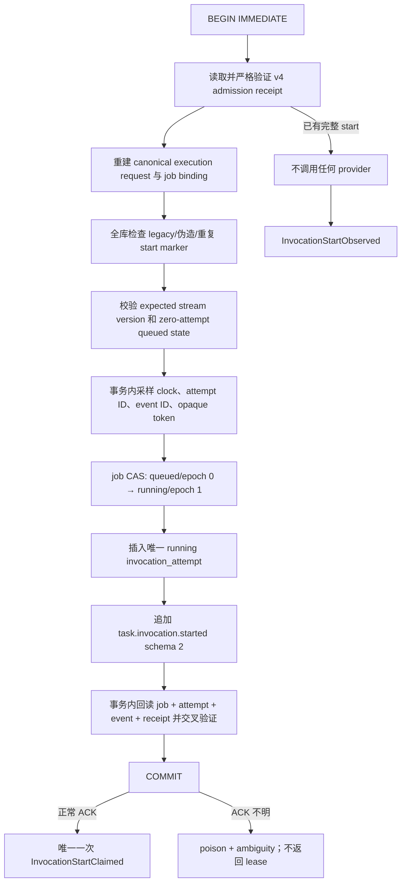

# Atomic invocation first-claim/start 发布证据

- 证据日期：2026-08-27（Asia/Shanghai）
- 证据对象：`SQLiteEventStore.claim_invocation_start(...)` 与只读
  `read_invocation_start(...)` 边界
- 远端 clean-runner source candidate：
  `a1fd35569fd093c93956294a644eb416a15e2c06`
- 本机复核 checkout：`58ad59143bee3df971721f69678d0fa752a78df1`
- 结论：**atomic first-claim/start 组件边界已经实现并通过记录矩阵；worker、Agent dispatch、
  heartbeat supervision、result/Artifact/terminal acceptance 和 action receipt 尚未实现，Gate A–E
  仍全部关闭。**

本文是组件级发布证据，不是“产品已可生产商用”的声明。它回答的是：一个已由 canonical v4
admission 证明的 invocation，能否在同一个 SQLite 事务中只产生一个 running attempt、一条
schema-2 start event 和一份不含明文 lease 的 durable receipt，并且只在正常 COMMIT ACK 后向唯一
caller 返回一次明文 lease authority。记录范围之外的系统能力一律不外推。

## 1. 证据快照与可追溯性

GitHub 两个成功 run 都精确绑定 clean commit
`a1fd35569fd093c93956294a644eb416a15e2c06`：

| 证据 | 精确结果 | 链接 |
|---|---|---|
| CI | `success`；Python 3.9.25 与 3.12.14 各运行 1,320 tests；canonical release evidence job 成功 | [run 33009646365](https://github.com/huapohen/quantum-entanglement/actions/runs/33009646365) |
| package | `success`；两次独立构建 byte-reproducible，distribution manifest、CycloneDX 1.6 双 SBOM、wheel 安装与 smoke test 成功 | [run 33009646336](https://github.com/huapohen/quantum-entanglement/actions/runs/33009646336) |

本机复核时 HEAD 已前进到 docs-only successor
`58ad59143bee3df971721f69678d0fa752a78df1`。该提交相对远端证据 commit 只修改
`docs/production/CURRENT_READINESS.md`；可执行源、测试和门禁输入的 Git object identity 完全一致：

| 路径 | `a1fd355…` 与 `58ad591…` 共用的 Git object |
|---|---|
| `src/` | `fb96629deffe8fda12cca578a1f369e1f584d9d4` |
| `tests/` | `6b577cfdac3b115a645a69e31524af5fb6e2bd53` |
| `scripts/` | `4897a4ea27309d599fd1cedbd85c94b79ad52abf` |
| `.github/` | `cc4c635b65e9edf3ccb3ac8923d5b0690c6aa133` |
| `pyproject.toml` | `c551f6bee8babedfa1bb57e028c2acd6c3f6c6d4` |
| `requirements/` | `0fb1d6f0be65d44f97cd7e21bfe129ed43384187` |

因此远端 clean-runner 结果可以用于说明 `58ad591…` 的同一 source/test/gate 输入；它不能为之后
发生变化的代码自动背书。合并本文或后续修改后仍必须重新跑当前 HEAD 的 CI。

核对命令：

```bash
git diff --name-status \
  a1fd35569fd093c93956294a644eb416a15e2c06..\
58ad59143bee3df971721f69678d0fa752a78df1

git diff --quiet \
  a1fd35569fd093c93956294a644eb416a15e2c06..\
58ad59143bee3df971721f69678d0fa752a78df1 \
  -- src tests scripts pyproject.toml requirements .github
```

## 2. 已实现边界

### 2.1 公开合同

[invocation_execution.py](../../src/quantum_entanglement/invocation_execution.py) 已定义：

- `InvocationStartEvidenceV2`：严格 schema-2 durable evidence；绑定 invocation、session、plan、task、
  Agent、job idempotency、attempt number、lease epoch、worker、lease digest、时间、manifest/context/
  authorization/runtime 与因果链；
- `InvocationStartReceipt`：绑定 start event 的 `event_id`、stream、sequence、global position 与
  schema-2 evidence；
- `InvocationStartClaimed`：`receipt + lease`，lease 从 `repr` 隐藏，且该类型故意没有
  `to_dict()`；
- `InvocationStartObserved`：只有 receipt，可序列化为 capability-free observation；
- exact-type、exact-field、schema version、canonical timestamp、lowercase SHA-256、NFC/text budget、
  attempt/lease 正整数和 causation binding 的严格校验。

[store.py](../../src/quantum_entanglement/store.py) 已公开：

```python
SQLiteEventStore.claim_invocation_start(
    invocation_id: str,
    worker_id: str,
    *,
    lease_seconds: float,
    expected_version: int,
) -> InvocationStartClaimed | InvocationStartObserved

SQLiteEventStore.read_invocation_start(
    invocation_id: str,
) -> InvocationStartObserved | None
```

合同及固定错误已经从包根
[__init__.py](../../src/quantum_entanglement/__init__.py) 导出。固定错误码为：

| 类型 | code | 含义 |
|---|---|---|
| `InvocationStartConflictError` | `invocation_start_conflict` | admission/job/attempt/event/receipt 缺失、部分或互相矛盾 |
| `InvocationStartTransactionError` | `invocation_start_transaction_failed` | 事务失败且 rollback 已确认 |
| `InvocationStartCommitAmbiguityError` | `invocation_start_commit_ambiguous` | COMMIT 或清理 ACK 不可确认；必须关闭并重开观察 |
| `EventStorePoisonedError` | `event_store_poisoned` | 当前 store graph 已不可继续信任 |
| `EventStoreLifecycleError` | `event_store_process_mismatch` | fork child 触碰 inherited store，fail closed |

### 2.2 同一事务内的真实状态变化

关键调用链位于 [store.py](../../src/quantum_entanglement/store.py) 的
`_claim_invocation_start_in_transaction`，复用
[attempts.py](../../src/quantum_entanglement/attempts.py) 的 caller-owned
`_claim_first_invocation_in_transaction`。实际顺序如下：



这里不是把三次写操作顺序拼接，而是由同一 `SQLiteEventStore`、同一 connection、同一
`BEGIN IMMEDIATE` transaction 持有下列原子单元：

1. `invocation_jobs` 的 zero-attempt CAS；
2. `invocation_attempts` 的 first running attempt insert；
3. `events` 的 `task.invocation.started` schema-2 append；
4. transaction 内对 admission/job/attempt/start 的完整 readback。

任一步失败，只要 rollback 被确认，job 回到 queued/epoch 0、attempt 为零、stream 仍停在 start
之前；不存在只写 attempt 或只写 start event 的正常返回路径。

### 2.3 authority 不可 replay

边界把“事实”与“权限”分开：

- 只有首次创建事务收到正常 COMMIT ACK，才返回 exact `InvocationStartClaimed`；
- 同 worker 重试、另一 worker 重试、另一 SQLite connection、store reopen、backup restore 后重试，
  都只返回 `InvocationStartObserved`；
- observation 路径不会调用 clock、ID provider 或 token provider；
- replay 的 `expected_version` 锚定在 start event 之前的 stream version，不会把之后无关事件造成的
  stream head 当成新的 start 边界；
- store 从不从 digest 恢复、重新生成或重新签发明文 lease。

这关闭的是“first start authority 被 replay API 再发一次”的组件风险，不表示已经有 worker 能安全
消费该 authority。

### 2.4 明文 lease 的持久化边界

`InvocationLease.lease_token` 是首次成功 caller 必须持有的内存 capability，所以它并非从 Python
对象中不可访问；当前保证是：

- `InvocationLease` 的 `repr` 隐藏 token；
- `InvocationStartClaimed` 没有 wire serializer；
- receipt、observed wire object 和 start event 只保存 SHA-256 digest；
- job 与 attempt row 只保存 digest；
- canary 测试扫描 SQLite `iterdump()`、主文件、WAL、SHM、backup DB、backup manifest 和 restored
  DB，均不存在明文 token；
- fault/control exception 的 message、cause/context 和 traceback locals 不保留 canary。

这不是“整个未来 runtime 的全输出 secret-canary 已完成”。worker、日志、metrics、trace 和
connector 尚未接入，因此它们仍需各自的 capability handling 与 canary gate。

## 3. 事务与 ACK-loss 矩阵

专项证据集中在
[test_invocation_start_store.py](../../tests/test_invocation_start_store.py) 和
[test_invocation_start_controls.py](../../tests/test_invocation_start_controls.py)。

| 边界/故障 | 已验证结果 | 精确测试 |
|---|---|---|
| 正常 first claim | job、attempt、start event、receipt 同时可见；返回 `Claimed` | `test_first_claim_commits_attempt_and_start_event_as_one_unit` |
| CAS 后故障 | 全部 rollback；unstarted；store 不 poison | `test_every_post_mutation_failure_rolls_back_job_attempt_and_start_together` 的 `after-cas` |
| start append 后故障 | 全部 rollback；无孤立 start event | 同一测试的 `after-start-append` |
| fresh readback 后故障 | 全部 rollback；不把未 ACK authority 交给 caller | 同一测试的 `after-fresh-readback` |
| BEGIN 实际成功但 ACK 丢失 | 检查 transaction state 并确认 rollback；无 provider 调用；固定 transaction error | `test_begin_ack_loss_confirms_rollback_before_any_start_provider` |
| COMMIT 被 authorizer 拒绝 | rollback 已确认；无持久 token；store 不 poison | `test_denied_commit_rolls_back_start_without_poison_or_token_persistence` |
| COMMIT 已落盘但 ACK 丢失 | 不返回 lease；固定 ambiguity error；当前 store poison；reopen 只能观察原 receipt | `test_commit_ack_loss_poisons_and_reopens_as_receipt_only_observation` |
| ROLLBACK 已完成但 ACK 丢失 | 当前 store 仍 poison；reopen 为 unstarted，不能猜测结果 | `test_rollback_ack_loss_poisons_but_reopens_as_unstarted` |
| rollback failure | sanitized ambiguity、quarantine；close/reopen 后按 durable state 恢复 | `test_rollback_failure_is_sanitized_quarantined_and_recoverable_after_close` |
| provider 抛 exact control | rollback 确认后重新创建干净 control，不泄漏 start frame/token | `test_provider_controls_are_reissued_clean_after_confirmed_rollback` |
| COMMIT/ROLLBACK 抛 exact control | 重新创建 `KeyboardInterrupt` / `SystemExit` / `GeneratorExit` / `CancelledError`；直接固定 ambiguity cause；poison | `test_commit_controls_are_reissued_with_direct_start_ambiguity_cause`、`test_rollback_controls_are_reissued_with_ambiguity_and_reopen_unstarted` |
| hostile `BaseException` | 固定 transaction error；cause/context/traceback locals 与 SQLite 均无 token canary | `test_nonstandard_base_exception_cannot_escape_with_plaintext_lease_authority` |
| 已 poison store + hostile caller input | poison 检查先于 caller input 访问 | `test_identity_inputs_are_exact_canonical_and_poison_precedes_input_access` |

关键语义是：poison 表示当前 connection/store graph 的 transaction outcome 不再可信，不等于数据库
损坏。poison 后只允许 best-effort close；reopen 必须重新验证 durable state。即使 reopen 证明 COMMIT
已成功，也只能返回 observation，不能补发已经丢失的 plaintext capability。

## 4. 并发与进程边界矩阵

| 场景 | 记录结果 | 证明范围 |
|---|---|---|
| 同一 SQLite 文件、两个 fresh connection、两个线程同时 claim | 恰好一个 `Claimed`、一个 `Observed`；token provider 仅调用一次；一个 attempt、一条 start event | SQLite `BEGIN IMMEDIATE` + durable replay exclusion |
| 两个 `multiprocessing` `spawn` worker，各自在 child 内 fresh construct store | 恰好一个 `claimed`、一个 `observed`；两个进程 exit 0；token call 只有一次 | 真实进程竞争，不是 mock connection |
| provider 内真实 POSIX fork：clock / attempt ID / event ID / token 四个阶段 | child 均得到固定 `EventStoreLifecycleError`；parent 仍只成功 claim 一次 | provider 返回后的立即 PID/epoch guard |
| fork child 调用 inherited `claim_invocation_start` / `read_invocation_start` | public entry 在 caller input、lock、SQLite 或 provider 前拒绝 | `test_all_ordinary_and_lifecycle_entry_points_reject_inherited_store` |
| same worker / other worker / peer connection / reopen replay | 全部同一 receipt-only observation；无 provider 调用 | authority 不随 worker identity 或 connection 重发 |

精确测试：

- `test_two_connections_issue_exactly_one_plaintext_start_lease`；
- `test_two_spawn_processes_issue_one_claim_and_one_observation`；
- `test_every_start_provider_fork_rejects_child_and_allows_one_parent_claim`；
- [test_event_store_process_binding.py](../../tests/test_event_store_process_binding.py) 的
  `test_all_ordinary_and_lifecycle_entry_points_reject_inherited_store`；
- `test_every_retry_peer_and_reopen_returns_receipt_only_without_providers`。

尚未由 start-specific E2E 证明的范围：多主机/共享网络文件系统、PostgreSQL、Kubernetes、多实例
leader election、worker `kill -9`、长时间 heartbeat、graceful drain、start worker 的 forkserver
competition，以及 secret-before-fork 的完整 service composition。通用 EventStore 有更多
fork/spawn/forkserver 证据，但不能替代未来 worker 组合测试。

## 5. durable state、伪造与 secret-canary 矩阵

`_load_invocation_start_in_transaction` 不会把“看起来像 started”的孤立数据升级为 authority。下列
状态均 fail closed：

| 状态 | 预期/实测行为 | 测试 |
|---|---|---|
| 未知 invocation | `read` 返回 `None`；claim 为 conflict | `test_unknown_and_canonically_admitted_unstarted_invocations_return_none` |
| canonical admission、尚未 start | `read` 返回 `None` | 同上 |
| standalone attempt-store job、无 v4 receipt | conflict | `test_standalone_job_without_v4_receipt_is_rejected` |
| generic admission 或 actor/semantic binding 伪造 | conflict | `test_generic_or_semantically_forged_admission_is_rejected` |
| 错 stream 上的 payload match、canonical key 或 legacy key marker | 阻止 authority minting | `test_database_wide_wrong_stream_start_markers_block_authority_minting` |
| legacy/schema-1 `task.invocation.started` | 永不升级为 schema 2 | `test_legacy_runtime_start_is_never_upgraded_to_schema_two` |
| attempt without start / start without attempt | conflict | `test_attempt_without_start_and_start_without_attempt_are_rejected` |
| event envelope、job、attempt、admission receipt 任一被改 | conflict | `test_event_job_attempt_and_receipt_tampering_each_fail_closed` |
| start payload 被改或 start row 被删 | conflict | `test_start_payload_and_partial_row_deletion_fail_closed` |
| attempt ID / event ID collision | token provider 前拒绝，全部 rollback | `test_identifier_collisions_are_rejected_before_lease_token_generation` |
| 非 canonical 数字、bool-as-int、future/legacy schema、unknown/missing fields | codec/API 前置拒绝 | `test_claim_rejects_noncanonical_lease_numbers_before_any_provider` 与 [test_invocation_execution.py](../../tests/test_invocation_execution.py) |
| backup/restore | receipt 可观察，token 不在 DB/WAL/SHM/backup/manifest/restore | `test_plaintext_start_lease_never_enters_sqlite_backup_or_restore` |

readback 同时重验 admission event range/checksum、canonical two-event request、job binding、start
event envelope、schema-2 payload、exactly-one attempt、attempt/job recovery invariants，以及所有 digest/
identity/time/epoch binding。它不是只按 `invocation_id` 查到一行就返回成功。

## 6. Python、CI 与本机验证矩阵

### 6.1 记录结果

| 环境 | 范围 | 结果 | 证据等级 |
|---|---|---|---|
| GitHub Ubuntu, CPython 3.9.25 | full `unittest discover` | 1,320 tests，run success | clean runner，绑定 `a1fd355…` |
| GitHub Ubuntu, CPython 3.12.14 | full `unittest discover` | 1,320 tests，`OK` | clean runner，绑定 `a1fd355…` |
| GitHub Ubuntu, CPython 3.12.14 | canonical release evidence | unit tests、deterministic demo、compileall、Ruff check、diff-check 全部 success | clean、source-bound evidence |
| GitHub Ubuntu, CPython 3.12 | package | reproducible wheel/sdist、manifest、CycloneDX 1.6 SBOM、wheel smoke 全部 success | clean package runner |
| 本机 macOS arm64, CPython 3.13.9, SQLite 3.51.0 | full `unittest discover` | 1,320 tests / 32.632s / `OK` | 本机复核；source/test object 与远端 candidate 相同 |
| 本机 macOS arm64, CPython 3.13.9 | 4 个 atomic start/admission 模块 | 85 tests / 1.558s / `OK` | start 专项复核 |
| 本机 macOS arm64, CPython 3.9.6, SQLite 3.51.0 | 同 4 个专项模块 | 85 tests / 1.819s / `OK` | start 专项与 Python 3.9 authorizer 回归复核 |
| 本机 CPython 3.13.9 | strict mypy | 42 source files，无 issue | 本机静态门禁；当前远端 workflow 尚未单列 mypy job |
| 本机 CPython 3.13.9 | Ruff + compileall | Ruff check 通过；121 files format-clean；compileall 通过 | 本机门禁 |

Python 3.9 COMMIT-denial fixture 曾暴露 CPython 3.9 的 SQLite authorizer 行为：
`set_authorizer(None)` 不能可靠清除 callback。提交
`9bb2cc7fee8598c83c9002c4b70e535837bb455d` 把测试 cleanup 改成显式 allow-all callback；它没有
放宽生产事务合同。修复后的 GitHub Python 3.9.25 全仓 1,320 tests 已通过。

### 6.2 精确复现命令

仓库根目录：

```bash
cd /Users/lwblx/huapohen/agent/execute/infinite/quantum_entanglement

PYTHONPATH=src .venv/bin/python \
  -m unittest discover -s tests -v

PYTHONPATH=src .venv/bin/mypy --strict src/quantum_entanglement
.venv/bin/ruff check src tests scripts
.venv/bin/ruff format --check src tests scripts
PYTHONPATH=src .venv/bin/python -m compileall -q src tests scripts
```

本机 Python 3.9 专项矩阵：

```bash
cd /Users/lwblx/huapohen/agent/execute/infinite/quantum_entanglement/tests

PYTHONPATH=../src \
  /Applications/Xcode.app/Contents/Developer/usr/bin/python3 \
  -m unittest -v \
  test_invocation_execution \
  test_invocation_start_controls \
  test_task_invocation_admission \
  test_invocation_start_store
```

远端只读核对：

```bash
gh run view 33009646365 \
  --repo huapohen/quantum-entanglement \
  --json databaseId,headSha,status,conclusion,url,jobs

gh run view 33009646336 \
  --repo huapohen/quantum-entanglement \
  --json databaseId,headSha,status,conclusion,url,jobs
```

## 7. 实现提交账本

下列短 SHA 在当前仓库内唯一；可用 `git show --stat <sha>` 核对。最终 clean-runner candidate 使用
上文完整 40 位 SHA 绑定。

| 阶段 | 提交 |
|---|---|
| non-replayable model 与固定边界错误 | `1bfab1b` `feat: model non-replayable invocation starts`；`9ae2430` `feat: isolate invocation start boundary errors` |
| durable observation/readback | `031754f` `feat: observe canonical invocation starts`；`b840b04` `feat: validate durable invocation start readbacks`；`2af126c` `test: prove durable invocation start observations` |
| 原子 mutation/public API | `ffc368c` `feat: assemble atomic invocation start transaction`；`70a59ba` `feat: expose atomic invocation start claims`；`5f36448` `test: prove atomic invocation start happy path` |
| replay/forgery/provider 前置约束 | `5f5b11e` `test: prove invocation start replay authority boundaries`；`f4a09f0` `test: reject database-wide invocation start forgeries`；`f83de73` `test: lock invocation start provider ordering`；`957a860` `test: reject invocation start identifier collisions early` |
| body/hostile failure rollback | `1fad819` `test: prove invocation start body rollback boundaries`；`1ec90ee` `test: contain hostile invocation start failures` |
| BEGIN/COMMIT/ROLLBACK 与 control | `cd3c9d9` `test: prove invocation start begin ack recovery`；`2230bba` `test: prove invocation start denied commit rollback`；`f9d7698` `test: prove invocation start commit ambiguity fencing`；`d983cc5` `test: prove invocation start rollback ack quarantine`；`6a30c5b` `test: prove invocation start rollback failure isolation`；`e3814cb` `test: prove clean invocation start provider controls`；`613bf50` `test: prove invocation start commit control fencing`；`4ff05fe` `test: prove invocation start rollback control isolation` |
| connection/process/fork | `8c4d080` `test: prove two-connection invocation start exclusion`；`f655f83` `test: prove spawned invocation start single issuance`；`a6f7fb9` `fix: reclean inherited invocation start lifecycle errors`；`b2d0f16` `test: bind invocation start APIs to creator process`；`c6928f9` `test: fence every invocation start provider fork` |
| backup、public export | `4439630` `test: prove invocation start backup capability safety`；`a2fc9d6` `feat: export atomic invocation start contracts`；`3642178` `test: prove invocation start package exports` |
| Python 3.9 clean-runner 修复 | `9bb2cc7` `test: restore Python 3.9 SQLite authorizer` |

这些提交在代码层完成了 frozen contract 所要求的 atomic start primitive。它们没有实现下节的
worker 或 terminal/action state machine。

## 8. 明确未实现、不得误报的范围

| 能力 | 当前状态 | 为什么仍关闭 |
|---|---|---|
| `OrchestratorKernel` 接入 durable admission/start | 未实现 | 现有 runtime/demo 仍不是该 primitive 的 production composition root |
| heartbeat-supervised pure/fake worker | 未实现 | 没有只接受 exact `InvocationStartClaimed`、持续验证 lease/attempt/receipt 并处理 cancel/timeout/drain 的 worker loop |
| stale/observed worker dispatch fence | 只有 primitive 语义，尚无 worker E2E | `Observed` 无 lease，但未来 dispatch API 尚未实现强制 exact-type gate |
| Artifact/result/attempt/task terminal atomic acceptance | 未实现 | Agent 返回后尚无一个 transaction 把 immutable result receipt、Artifact、attempt terminal 与 task terminal 同时接受 |
| crash/kill/recovery coordinator | 未实现 | 无 crash-at-every-boundary、`kill -9`、heartbeat expiry、graceful drain 和 receipt-bound resume E2E |
| durable action receipt / `effect_unknown` reconcile | 未实现 | 外部 effect 尚不能证明 succeeded/rejected/unknown，不能安全自动重试 |
| 真实 connector | 禁止 | Feishu/WeCom person、group、bot、webhook 均不得作为测试目标；本证据未调用任何 connector |
| trusted auth + tenant scope + sandbox/redaction 全闭环 | 未实现 | Gate A 的可信 context、全 repository scope、runtime isolation 与全输出 canary 尚未完成 |
| authenticated API/stream/lifecycle | 未实现 | Gate B 所需 command receipt、SSE/reconnect、health、SIGTERM lifecycle 尚未完成 |
| deployment/DR/capacity/HA | 未实现 | Gate C–E 的 upgrade/rollback、RPO/RTO、quota/OTel/soak、PostgreSQL/HA/Kubernetes 均无发布证据 |

尤其不能把旧 demo 中同名 `task.invocation.started` 事件视为 schema-2 authority：legacy event
可供历史审计读取，但 atomic start readback 会拒绝其升级。也不能绕过本 API 直接调用 standalone
attempt-store `claim()`；没有 canonical v4 admission receipt 的 job 不具备 dispatch authority。

## 9. 发布判断与下一顺序

### 组件判断

在下列严格范围内，atomic first-claim/start 可以标记为 **Implemented / Verified**：

```text
canonical v4 admission already committed
  + single SQLite database/connection transaction
  + first attempt only (attempt 1 / lease epoch 1 / max_attempts 1)
  + one schema-2 start receipt
  + plaintext lease returned once, only after normal COMMIT ACK
  + replay/reopen/peer receives observation only
```

它是下一阶段 worker 的必要前置条件，不是一个可单独对用户提供服务的 worker。

### 后续依赖顺序

```text
atomic first-claim/start（本组件已完成）
  → heartbeat-supervised pure/fake worker
  → atomic Artifact/result/attempt/task terminal acceptance
  → receipt-bound crash/kill recovery
  → durable action receipt + effect_unknown reconcile
  → Gate A tenant/auth/redaction/sandbox
  → Gate B authenticated API/stream/lifecycle/fake E2E
  → Gate C deployment/upgrade/rollback/DR
  → Gate D quota/OTel/isolation/security/capacity/soak
  → Gate E PostgreSQL/HA/Kubernetes/continuous DR
```

只有每一阶段的新 source candidate 重新通过对应 Python/OS/SQLite、fault/process、package 和
source-bound evidence 后，才能提升该阶段状态。当前 Gate A–E 全部保持关闭。
