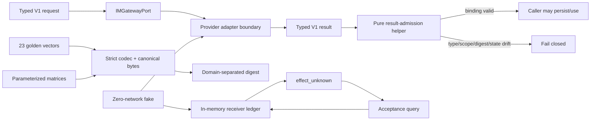
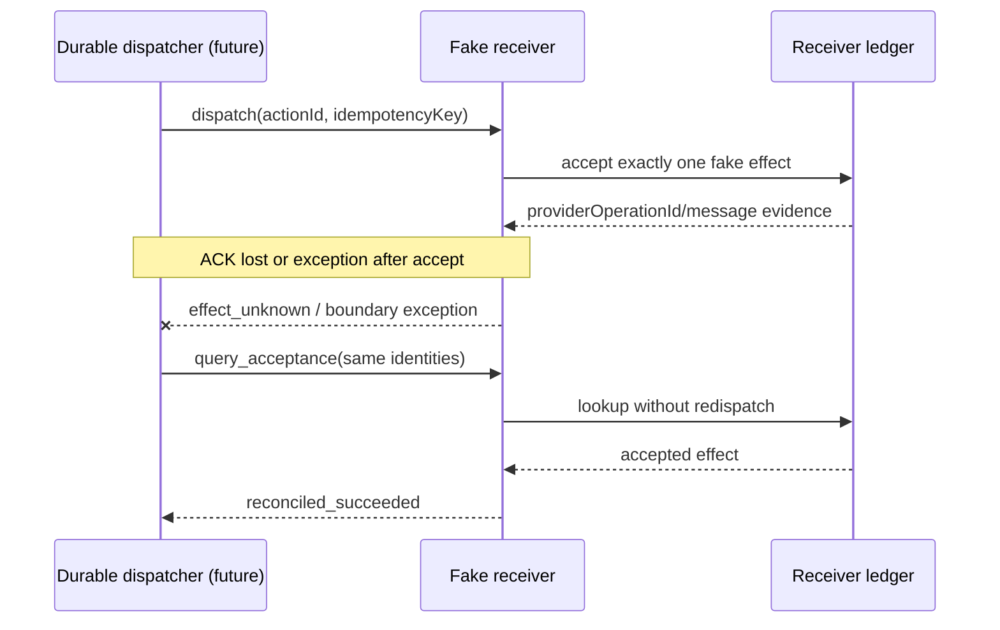

# 原生 IM E1 可执行合同：实现、故障语义与证据复核

> 复核日期：2026-08-28（Asia/Shanghai）  
> E1 源码候选：`7620200f8e378507b1f592d6d34744080250d2ea`  
> 阶段结论：Level A `CONTRACT_EXECUTABLE` 完成  
> 安全边界：零网络 fake；不连接真实 endpoint，不读取真实 credential，不接收 webhook，不发送外部消息

## 0. 执行结论

本阶段已经把原生 IM V1 文档合同变成可运行、可拒绝、可复现和可故障注入的
provider-neutral 合同。`IM-P0 CONTRACT_READY` 可以标记完成，但这个“完成”只属于**合同与 fake
里程碑**，不代表已经接上原生 IM，更不代表生产可发消息。

最重要的结果有六点：

1. **V1 wire 已形成唯一表示。** 21 个公共 wire model、strict codec、canonical JSON、独立 digest
   domain 和 idempotency domain 已实现；未知字段、重复 JSON key、错误类型、非法状态组合、scope
   漂移和 digest 漂移均失败关闭。
2. **Adapter 边界缩成四个方法。** capability、inbound page、dispatch 和 acceptance query 共用一个
   `IMGatewayPort`；每种返回值都要经过独立纯 admission helper，不能因为对象来自 adapter 就默认
   可信。
3. **默认 fake 真正 no-send。** 普通构造的 fake 在查看请求内容前拒绝两个 outbound 方法；启用
   fake effect 必须显式提供进程本地、不可变、不可序列化的测试 permit，且效果只存在内存账本。
4. **ACK 丢失不会退化为盲重发。** fake receiver 按完整 scope + action/key 幂等，能够模拟
   accept 后 ACK 丢失、accept 后异常、unknown、终态拒绝、临时 NACK 和 429；unknown 只能 query，
   不能从本地超时猜成功或直接再发。
5. **正向样例和全矩阵分工明确。** 23 个 golden vector 冻结代表性正向模型；它们没有假装覆盖
   所有 union arm。event/revision/scope/mention/digest/receipt 的完整状态矩阵由参数化测试覆盖。
6. **零网络是可执行门禁，不是口头约定。** fresh-process verifier 拦截 socket、DNS、常见网络
   import 和 credential 环境变量访问，并通过真实包导入路径运行 capability/read/deny/dispatch/query。

一句话判断：

> **现在有的是“任何 provider 都必须服从的可执行边界”和一个能证明副作用不确定性语义的
> 内存接收端；还没有任何真实 provider、真实网络、durable inbox 或 durable Action Plane。下一步
> 可进入 E2 inbound-only，但不能把 fake 通过解释成可开放 outbound。**

## 1. 证据口径

本文区分三种结论：

- **【实现事实】**：固定 Git 提交中存在相应源码、fixture、测试或脚本；
- **【本机运行证据】**：本轮在固定提交、指定解释器上实际执行并得到成功退出；
- **【明确未证明】**：E1 结构上不包含或本轮没有执行的能力，不从测试数量或代码意图外推。

完整生产说明见
[`NATIVE_IM_P0_CONTRACT_EXECUTABLE.md`](../../docs/production/NATIVE_IM_P0_CONTRACT_EXECUTABLE.md)，
冻结 wire 规范见
[`NATIVE_IM_CONTRACT_V1.md`](../../docs/architecture/NATIVE_IM_CONTRACT_V1.md)。

## 2. 固定源码与提交链

E1 从隔离主线起点 `b26dca6` 后按可回退小步完成。关键提交如下：

| Commit | 变化 | 独立价值 |
|---|---|---|
| `3d55e2b` | scalar codec primitives | 冻结 plain/type/text/time/size 基础边界 |
| `235d7de`–`e59356f` | conversation、participant、message、verified inbound、capability | 逐组落地 provider-neutral inbound 值 |
| `a61e782`–`f917a3c` | page、intent、command、dispatch | 冻结 read 与 Action request 身份 |
| `23df231`–`a886563` | receipt、unknown observation、acceptance query | 冻结外部副作用不确定性和对账语义 |
| `d97807d` | V1 golden vectors | 建立跨实现可复现正向 oracle |
| `d747cc0` | query source causation fix | 修正 query receipt 的直接前驱绑定 |
| `b6bd184` | golden oracle hardening | 让 manifest/bytes/digest/idempotency 独立校验 |
| `fc6fea2` | `IMGatewayPort` | 收敛为 exact 四方法边界与纯 admission |
| `dfe9a33` | zero-network fake | capability/read/default deny 的最小 adapter |
| `4283e46` | process-local permit | fake outbound 不可由配置或序列化值开启 |
| `c4b376e` | receiver ledger | action/key 双索引幂等和碰撞拒绝 |
| `889c409` | ACK-loss reconcile | accepted effect 与丢 ACK 分离，query 可恢复真相 |
| `72c7ca5` | zero-network release gate | socket/DNS/import/env credential 门禁 |
| `fe5e8cb` | post-accept exception | 模拟 effect 已发生但调用栈未返回 receipt |
| `af58352` | P0 matrices | event/revision/scope/mention/digest 全矩阵补齐 |
| `2295d08` | full pytest evidence | CI/发布脚本不再使用不完整的 `unittest discover` |
| `7620200` | real package import path | 零网络脚本实际 exercise 安装边界内的包路径 |

这组提交只增加模型、fake、fixture、门禁和测试，没有增加数据库 migration、服务配置、网络库、
endpoint 或 credential。

## 3. 可执行合同结构



### 3.1 Codec 不变量

【实现事实】[`_native_im_codec.py`](../../src/quantum_entanglement/_native_im_codec.py) 与
[`native_im.py`](../../src/quantum_entanglement/native_im.py) 共同强制：

- 只接受 exact plain dict/list/bool/int/string/null，不接受 Mapping/list subclass、tuple、float、
  `bool-as-int` 或对象钩子；
- raw JSON 必须 bounded、strict UTF-8、无重复 key；
- Unicode 必须 NFC，surrogate 和不允许的 C0/DEL 失败；消息文本仅按合同允许 HT/LF；
- timestamp、traceparent、media type、digest、ID、revision、collection size 和 total bytes 都有精确
  语法/上限；
- nested scope、event field matrix、message revision、mention/attachment、page cursor/snapshot、
  receipt state 与 lookup capability 做交叉绑定；
- `canonical_bytes()` 只产生一个稳定 JSON 表示，model digest 与 idempotency key 使用不同固定
  domain，避免把“内容相同”误当成“副作用身份相同”。

### 3.2 Port 与 admission

【实现事实】[`native_im_gateway.py`](../../src/quantum_entanglement/native_im_gateway.py) 的公开 port
只有：

| 方法 | 输入 | 输出 | admission 重点 |
|---|---|---|---|
| `capability_snapshot` | exact capability request | capability snapshot | 完整 scope |
| `read_inbound` | exact read request | verified envelope page | request digest、resume pair、snapshot、capability revision/digest |
| `dispatch` | exact dispatch request | action receipt | action/command/attempt/digest、dispatch-only state |
| `query_acceptance` | exact query | action receipt | 原 request/query/capability、lookup mode、negative finality |

接口不暴露 `base_url`、header、token、SDK client、自由 JSON 或模型选择的 conversation。后续真实
adapter 只能在这个边缘做 provider mapping，不能扩张核心信任边界。

## 4. Fake receiver 的不确定性模型

### 4.1 默认拒绝发生在请求检查之前

【实现事实】普通 `FakeIMAdapter` 的 `dispatch`/`query_acceptance` 先检查私有 permit；缺失或进程
不匹配立即抛 `FakeIMOutboundDisabledError`，随后才会检查 exact request。这一顺序避免默认关闭路径
因解析 hostile outbound request 而泄漏内容、触发昂贵逻辑或意外读取依赖。

`FakeIMTestOutboundPermit` 只能在当前进程创建：对象引用模块私有 sentinel 和创建 PID，重写属性会
失败，pickle/reduce 会失败，fork 后 `_is_current()` 为 false。它不携带 endpoint 或权限文本，不能
从 `.env`、YAML 或模型输出恢复。

### 4.2 action 和 idempotency 双账本

【实现事实】receiver 同时以：

```text
(tenantId, workspaceId, provider, channelId, actionId)
(tenantId, workspaceId, provider, channelId, idempotencyKey)
```

索引一个 `_FakeAcceptedEffect`。两个索引必须指向同一 effect，且 action、key、intent digest 全部
一致。任一身份被不同效果复用就报 collision；一致重放不会增加 `accepted_effect_count`。

### 4.3 ACK-loss 与 post-accept exception



【分析判断】这是 E1 最关键的工程取舍：transport 调用失败不等于 receiver 没执行。把异常直接
归类为 retry 会制造重复消息；把异常直接归类为 succeeded 会掩盖丢失。唯一诚实状态是
`effect_unknown`，然后用 receiver acceptance query 对账。

对“未找到”的处理同样严格：只有 exact lookup capability 宣告
`authoritative_terminal`，且仍处在 retention 保证内，负查询才能形成
`reconciled_rejected`。`unavailable`、not-final 或 retention-expired 都保持 unknown。

## 5. Golden 与矩阵覆盖复核

### 5.1 Golden vector 的边界

【实现事实】`tests/fixtures/native_im/v1/` 有 23 个模型 JSON 与一个 manifest。独立 verifier 会：

- 拒绝 manifest 未登记或多出的 JSON；
- 逐文件 strict decode；
- 逐字节比较 canonical JSON；
- 独立按 domain 计算模型 SHA-256；
- 对 Action Intent 独立计算 idempotency key；
- 拒绝路径逃逸、重复 model/filename、错误 byte count 或 digest。

【明确未证明】一个 positive fixture 只能证明一个代表性合法状态。比如 message segment 有 text 与
mention 两个 union arm，fixture 可以分别冻结；event 六态、receipt 多态、cross-scope 和 tamper 的
笛卡尔积不应靠复制大量 golden 文件伪装覆盖。

### 5.2 参数化 contract matrix

【本机运行证据】七个 native-IM 测试文件共收集 271 个 case 并通过。矩阵重点包括：

- 六种 inbound event type 的 required/optional/forbidden field 组合；
- create/edit/delete 的 message revision 和 content 关系；
- event、conversation、sender、attachment、reaction、membership、command、receipt 的完整 scope；
- mention 顺序、重复 mention、相邻 text canonical 约束；
- event、page、intent、command、dispatch、receipt、unknown/query 的 digest tamper；
- receipt 六态与 dispatch/query 来源限制；
- lookup mode、negative finality、retention expiry；
- duplicate action/key、collision、ACK-loss、post-accept exception、临时 NACK 和 rate limit；
- 默认 outbound 请求前拒绝、permit copy/serialization/fork 边界；
- zero-network fresh-process 成功与 argv 绕过拒绝。

## 6. 运行证据

### 6.1 全仓门禁

【本机运行证据】在 E1 source candidate 上保留的结果：

| 环境/门禁 | 结果 |
|---|---|
| 本机 Python 3.13 full pytest | 1,775 passed |
| CPython 3.12.12 full pytest | 1,775 passed |
| CPython 3.9.6 full pytest | passed；一个既有 platform-capability skip |
| locked Ruff lint/format | 152 files passed |
| strict mypy | 49 source files passed |
| golden verifier | 23 vectors passed |
| focused native IM tests | 271 collected and passed |

`2295d08` 修正了一个重要证据问题：CI/release gate 改用 full pytest，不再把不完整的
`unittest discover` 当成全仓测试。因而 1,775 是 pytest 实际收集数，而不是旧 runner 的子集。

### 6.2 `7620200` 补跑证据

【本机运行证据】在本轮开始时重新确认本地/远端都为 `7620200`，工作树干净；随后执行：

- Python 3.9.6 `scripts/verify_native_im_zero_network.py`：通过；
- Python 3.12.12 同一 verifier：通过；
- canonical release evidence generator + independent verifier：通过。

canonical evidence 记录：

| 字段 | 值 |
|---|---|
| `commitSha` / `commitShaAfterGates` | `7620200f8e378507b1f592d6d34744080250d2ea` |
| `treeSha` / `treeShaAfterGates` | `b1c9b4ed103d6b9327551bce88ee16f61b21dfb2` |
| dirty before/after | `false` / `false` |
| identity stable | `true` |
| gates | 5 passed / 5 total |
| error/failed/timeout | 0 / 0 / 0 |

evidence JSON 位于仓库外临时目录，避免“证据文件本身把被证明的 checkout 弄脏”。其中
`releasable=true` 只表示固定 local baseline predicate 成立，不是生产发布批准。

## 7. 威胁与失败模式复核

| 风险 | E1 防线 | 仍待后续完成 |
|---|---|---|
| provider 返回跨租户/跨 channel 数据 | exact scope + digest admission 拒绝 | authenticated provider mapping、trusted RequestContext、durable inbox |
| 重复 event 触发两次 Agent | event identity/digest contract 已冻结 | scope+eventId+digest 原子 inbox admission |
| 发送超时后盲重试 | effect_unknown + acceptance query 模型与 fake 故障证据 | durable action state、fenced dispatcher、retry budget、DLQ |
| action/key 被复用为不同效果 | fake 双账本 collision fail-closed | 真实 receiver idempotency guarantee 与持久对账 |
| 配置意外打开发送 | fake 无配置开关；进程本地 test permit | 真实 composition default-off、outbound allowlist、kill switch |
| 网络库或 credential 偷渡 P0 | static import/env scan + runtime socket/DNS blockers | E2 独立 transport threat model、secret provider、egress policy |
| positive golden 被误称全覆盖 | 报告显式分离 golden 与 parameterized matrix | 跨语言 TCK、provider fixture 和版本兼容矩阵 |

## 8. 明确没有完成

【明确未证明】截至本报告：

- E2 / Level B `SANDBOX_INBOUND` 尚未开始；
- 没有真实 provider adapter、provider profile 或 SDK；
- 没有 base URL、credential、webhook、HTTP/WebSocket client 或 socket connection；
- 没有 signature/timestamp/nonce/replay verifier；
- 没有 digest-bound durable inbox、page+cursor 原子 admission、migration 或 backup/restore；
- 没有从 inbound observation 到 `MentionRouter`/Agent 的 bridge；
- 没有 durable Action Command/Receipt store、dispatcher、retry budget、DLQ 或 operator reconcile UI；
- 没有真实外部读取，更没有任何外部 IM send；
- 没有关闭 production Gate A、B、C、D 或 E。

E1 的 in-memory fake accepted effect 不能冒充 durable receiver receipt，也不能证明进程崩溃后的
恢复。它的用途是冻结语义，让 E2–E5 的实现和 provider 都有同一套可测试合同。

## 9. 对产品与原生 IM 接入的直接影响

现在可以更舒服地和独立 IM 后端对接 schema，而不需要让后端实现细节渗入 Agent 内核。对方只需
把 provider-specific 身份、事件、capability 和 receiver evidence 映射到冻结 V1；平台则通过
admission helper 和后续 durable store 判断是否接受。

推荐下一验收点仍是 E2 / Level B inbound-only：

1. 冻结 sandbox provider profile 和 unsupported capability；
2. 配置只允许审批过的 HTTPS host/port/path、禁止 redirect，credential 仅用 `SecretRef`；
3. 验证 raw body、signature、timestamp、nonce、replay window 和 tenant mapping；
4. 原子持久化 `(scope, eventId, eventDigest, verificationId)`；
5. 整页 envelopes 与 cursor checkpoint 同事务；
6. kill switch、redaction、health/read-only preflight、disconnect/resume；
7. 只生成 observation，机械阻断 Agent/tool/browser/subprocess/outbound。

开始 E2 不需要先完成 Gate C–E，但需要真实 sandbox 合同材料和 inbound-only 批准边界。缺材料时可
继续用 fixture/fake 做 adapter contract probe；不能通过聊天群询问，也不能自行猜 endpoint、签名
或 cursor 语义。

## 10. 阶段判定

| 判定项 | 结果 |
|---|---|
| E1 / Level A `CONTRACT_EXECUTABLE` | **完成** |
| `IM-P0 CONTRACT_READY`（provider-neutral contract/fake） | **完成** |
| E2 / Level B `SANDBOX_INBOUND` | **未开始** |
| 真实 provider/endpoint/credential | **不存在** |
| 真实 IM outbound | **未实现、未授权** |
| Gate A–E | **全部关闭** |

因此，当前最诚实且可验收的阶段描述是：

> **原生 IM V1 provider-neutral 合同已经可执行，零网络 fake 和完整 contract matrix 已通过；
> 项目停在真实 sandbox 接入之前，不具备也不授权任何外部消息发送能力。**
