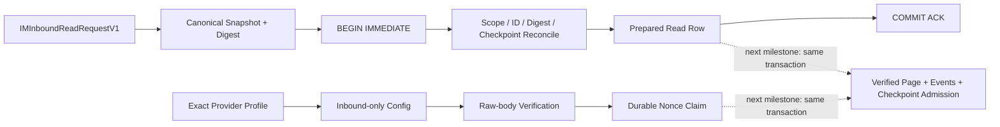

# 原生 IM E2 离线 Inbox 底座：阶段证据与下一原子边界

> 证据日期：2026-08-28（Asia/Shanghai）
> 评审分支：`mainline_continue_quantum_entanglement`
> 本节点源码：`4ab745b1a83e3a840fe503fefc0bae58b112c95b`
> 阶段判定：E2 / Level B 的离线底座进行中；真实 sandbox 网络仍未接入
> 永久限制：不向飞书、企微、个人、群聊、bot 或 webhook 发消息

## 1. 结论

E2 已不再是“尚未开始”。从 E1 的 provider-neutral 可执行合同继续推进后，当前分支已经形成
一条完全离线、默认关闭、可迁移和可故障注入的原生 IM 入站持久化底座：

1. 冻结 exact provider profile、能力支持表和 readiness 判定；
2. 冻结 inbound-only endpoint/config/`SecretRef` 边界；
3. 实现 raw-body digest、key identity、signature/timestamp 验证模型；
4. 注册 migration 5 的 durable native-IM inbox 六表，并进入备份、恢复和 topology inventory；
5. 在独立 `SQLiteNativeIMInboxStore` 内持久化 profile-bound nonce claim；
6. 持久化 capability-free、checkpoint-bound、可幂等恢复的 inbound read preparation。

这仍不等于 Level B 已完成。仓库没有真实 provider adapter、HTTP/WebSocket client、sandbox
credential material、真实 health/read 调用或 outbound composition。更重要的是，nonce、verified
page、event rows 和 checkpoint 尚未在同一个事务内原子 admission；因此当前节点明确禁止连接真实
IM 网络，也不能驱动 Agent、tool、browser、subprocess 或任何 outbound。

## 2. 本阶段提交账本

| 提交 | 能力 | 仍然没有做什么 |
|---|---|---|
| `5e9eeec` | exact provider profile | 不读取 endpoint/secret |
| `bea4bff` | provider readiness gate | 不发起网络探测 |
| `13612b1` | inbound-only capability projection | 不授予 outbound |
| `a7b27f8` | endpoint value constraints | 不打开 socket |
| `f145a2a` | sandbox config parser | 不加载真实 credential material |
| `156a2b8` | config preflight binding | 不连接 sandbox |
| `30378de` | inbound-purpose `SecretRef` binding | 不把 secret 写入对象、日志或 Git |
| `439d536` | verification key identity | 不选择或轮换真实 provider key |
| `520ebc5` | bounded signature/replay window | 不持久化整页 admission |
| `f65f184` | signed raw inbound body verifier | 不创建 Agent invocation |
| `cfd97c3` | durable inbox receipt/value contracts | 不写通用 `inbox_receipts` |
| `79e1f60` | migration 5、六表、backup/restore/topology | 不接真实 connector |
| `2cd9b19` | profile-bound durable nonce claim | 不独立调用 provider |
| `4ab745b` | exact-request replayable inbound read preparation | 不读取 provider、不 admission page |

每个节点均独立提交并已推送到私有 GitHub 评审分支；没有合并 `main`，也没有删除 worktree。

## 3. 当前持久化边界



`prepare_native_im_inbound_read(...)` 只记录“准备读取哪一页”的能力无关事实。它不会调用
`IMGatewayPort.read_inbound`，不会创建 `DomainEvent`，不会写 legacy `events`、`inbox_receipts`、
`outbox` 或 `invocation_jobs`。调用方保留 exact request 时，重开 store 后可以 replay 并与已有
checkpoint 对账；prepare 本身不会创建/推进 checkpoint，也没有按 scope 恢复或 abandon API，更不会
把“已准备”误写成“已读取”“已接受”或“已处理”。

### 3.1 Read preparation 不变量

- 只接受 exact `IMInboundReadRequestV1`；先生成 canonical bytes，再从 bytes 重建内部快照；
- 四维 scope 为 `(tenantId, workspaceId, provider, channelId)`；
- `readRequestId` 与 canonical digest 双轴查询，任一 identity 重绑定都失败关闭；
- 每个 scope 同时最多一个 `prepared` read；同请求 exact retry 返回 `observed_replay`；
- 新请求必须精确匹配 durable checkpoint 的
  `(afterCursor, afterSequence, continuationSnapshotToken)` 和 revision；
- 历史 `admitted` request 可以 exact replay，但不能冒充当前 checkpoint 的 parent；
- 25 个 read columns 全量严格解码；prepared row 的 admission 字段必须全为 `NULL`；
- checkpoint 必须绑定 admitted parent read 的 digest、page digest、revision、next cursor pair、
  continuation token 和 timestamp；
- admitted revision 必须从 1 连续增长，checkpoint 必须等于最大 admitted revision；
- fresh insert 后检查 exact `rowcount == 1` 并执行 durable readback；
- 事务使用 `BEGIN IMMEDIATE`，避免两个连接同时准备不同请求时产生双赢家。

### 3.2 事务与故障语义

| 故障 | 公共结果 | Store 后续状态 |
|---|---|---|
| BEGIN/事务体运行错误，已确认 rollback | `NativeIMInboundTransactionError` | 可继续使用 |
| SQLite constraint/integrity 故障 | `NativeIMInboxStoreIntegrityError` | fail closed；可由调用方决定重开/审计 |
| COMMIT 被拒且确认事务仍打开、rollback 成功 | `NativeIMInboundTransactionError` | 可继续使用 |
| COMMIT ACK 丢失或 rollback 无法确认 | `NativeIMInboundCommitAmbiguityError` | 当前 store epoch poison，必须重开对账 |
| 持久化 row/checkpoint 图残缺或矛盾 | `NativeIMInboxStoreIntegrityError` | fail closed |
| 合法但不同请求占用同一 scope | `NativeIMInboundConflictError` | 不覆盖既有 row |
| 请求 resume 三元组与 checkpoint 不同 | `NativeIMInboundCheckpointConflictError` | 不写入 |

底层 SQLite marker 和 traceback context 不进入公共异常图。一次 prepare 的 ambiguous COMMIT 会
阻断同一 store 上的 nonce claim；一次 nonce claim 的 ambiguous COMMIT 也会阻断 prepare，直到
关闭并重开 store 完成 durable reconciliation。

## 4. Schema、备份与恢复证据

Migration 5 注册以下六张原生 IM 专用表：

```text
native_im_auth_nonces
native_im_inbox_events
native_im_inbox_verifications
native_im_inbound_reads
native_im_inbound_read_events
native_im_inbound_checkpoints
```

其中 profile 由冻结的 exact value/registry 表达；nonce/inbox/read/checkpoint 数据不会复用通用
domain inbox。Migration registry、
rollback、backup manifest、restore-forward 和 topology inventory 已同步；当前 backup topology
registry 为 10 个 profile，迁移后 SQLite catalog 为 85 个 objects。这个数字是 schema inventory
证据，不代表
真实 sandbox 或生产数据已经进入数据库。

## 5. 测试与门禁

本节点在本机 Python 3.13 环境完成：

| 验证 | 结果 |
|---|---:|
| nonce + prepared-read 专项 | 46 / 46 passed |
| 完整 pytest | 2,031 / 2,031 passed |
| dependency lock verifier | 4 targets / 74 package records verified |
| Ruff check | passed |
| Ruff format check | 168 files formatted |
| strict mypy | 55 source files, 0 issues |
| compileall | passed |
| deterministic group-chat demo | completed |
| `git diff --check` | passed |

Prepared-read 专项覆盖 fresh/replay、continuation、historical admitted replay、25 列逐项 tamper、
checkpoint missing/stale/cross-parent、ID/digest collision、双连接竞态、clock、零 gateway/legacy
side effect、BEGIN/COMMIT/rollback/ACK-loss、跨操作 poison、blocked waiter、close/reopen 和真实 POSIX
fork。完整 suite 只有 CPython 3.13 对多线程进程调用 `fork()` 的既有弃用警告，没有失败。

## 6. 当前唯一下一 P0：把 nonce 与整页 admission 合成一个事务

当前 verifier 如果先通过 public `claim()` 独立提交 nonce，而进程在 page admission 前崩溃，重试
会看到 nonce replay，却找不到已 admission 的 page/checkpoint。这是系统级 crash gap，不能靠调用
顺序或内存补偿修复。

下一节点必须使用同一个 `SQLiteNativeIMInboxStore` transaction：

```python
with store._write_transaction() as connection:
    store._claim_nonce_in_transaction(connection, ...)
    store._admit_native_im_inbound_page_in_transaction(connection, ...)
```

Page admission 不得调用 public `claim()`，否则会形成嵌套 transaction。一个事务内必须同时完成：

1. nonce identity/binding 校验或首次 claim；
2. verified envelope 与 raw-body/authentication evidence binding；
3. page digest、snapshot 和 read request binding；
4. page 内 event identity/digest 去重与 immutable binding；
5. read row 从 `prepared` CAS 为 `admitted`；
6. checkpoint revision + cursor + snapshot 更新；
7. 全图 durable readback；
8. COMMIT ACK-loss 后按 request/page/checkpoint exact reconciliation。

在此能力和对应 crash/fault matrix 全绿以前，真实 IM endpoint 仍是 NO-GO。

## 7. 后续执行顺序

1. 实现 verified page + nonce + event rows + checkpoint 的单事务 admission；
2. 补双连接、逐边界 rollback、COMMIT ACK-loss、reopen、tamper、backup/restore 测试；
3. 实现 inbound-only adapter skeleton 和 feature flag，outbound 方法在读取 secret 前拒绝；
4. 补 bounded page parser、disconnect/resume、message-body-safe logging 和 secret canary；
5. 补 kill switch、startup preflight、health/ready、graceful close 和 fake contract probe；
6. 冻结真实 sandbox 参数与批准记录后，才允许 health/read/dedupe/resume 验收；
7. Level B 始终只生成 observation，Level C 之前不能触发 Agent 或工具。

## 8. 回退与验收

- 当前能力的最小代码回退点是 `2cd9b19`；可通过 `git revert 4ab745b` 删除 read preparation
  API/实现/测试，同时保留 migration 5 和 durable nonce 能力；
- 整个 E2 离线持久化底座的前置稳定点是 E1 审阅基线；不得重写历史或 reset 共享分支；
- 用户验收本分支时使用 `mainline_continue_quantum_entanglement`，不要误用 `main`；
- 当前节点可用于继续离线开发和故障测试，不可作为真实 sandbox 或生产发布批准。
