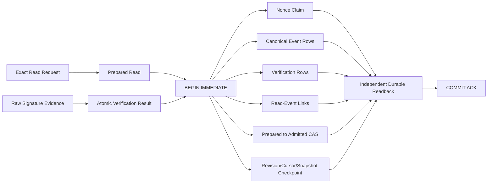

# 原生 IM E2 原子页 Admission：阶段证据与下一接入边界

> 证据日期：2026-08-28（Asia/Shanghai）
> 评审分支：`mainline_continue_quantum_entanglement`
> 运行源码：`9cf1bfebe33fd5efae2933bc82027275b3313696`
> 运行源码树：`cab127587c65600dac9fefd97c4010afa7d08e39`
> 阶段判定：E2 / Level B 的离线原子 inbox 底座已完成；真实 sandbox 网络仍未接入
> 永久限制：不向飞书、企微、个人、群聊、bot 或 webhook 发消息

## 1. 结论

上一节点指出的系统级 crash gap 已经关闭：raw verification、nonce claim、verified envelopes、
event/verification/link rows、prepared-read CAS 和 cursor/snapshot checkpoint 现在由同一个
`BEGIN IMMEDIATE` 事务提交。不存在“nonce 已独立提交，但整页和 checkpoint 尚未 admission”
这一正常 API 调用路径。

这次完成的是 **完全离线的持久化原子边界**，不是原生 IM 已接入，也不是生产批准。仓库仍然没有
真实 provider adapter、webhook、HTTP/WebSocket client、sandbox credential material、真实 health/read
调用或 external IM send composition。Level B 的下一 P0 已从“原子页 admission”前移为
“default-off inbound-only adapter/lifecycle + sandbox 批准输入”。在这些边界闭合并另行批准前，真实
IM endpoint 仍是 NO-GO。

## 2. 本阶段提交账本

| 提交 | 能力 | 关键保证 |
|---|---|---|
| `9333912` | 延迟 nonce claim 的 raw verification | `verify_for_atomic_admission(...)` 只验证证据；不提前消费 nonce |
| `9bc0101` | 单事务整页 admission | nonce、events、verifications、links、read CAS、checkpoint 和 readback 同一事务 |
| `b680b92` | 原子 admission 恢复矩阵 | body/constraint/COMMIT/ACK-loss/preclaim/replay/双连接/历史页均有回归测试 |
| `77609ef` | 从 durable graph 独立重建 page | 先证明数据库图自洽，再区分 caller conflict 与 store integrity failure |
| `c1aca49` | 持久化图篡改矩阵 | event、verification、link、page/checkpoint cross-binding 篡改全部失败关闭 |
| `57bd98d` | 空页、多页与冲突竞态 | terminal empty page、连续 revision/cursor、不同页输家 nonce rollback |
| `33b667f` | poison 信号精确传播 | blocked waiter 在锁内复核 poison；rollback/COMMIT 不明必须重开 |
| `9cf1bfe` | exact-type、快照和零副作用围栏 | caller 突变不穿透；admission 不调用 gateway、Agent、plugin、browser、network 或 outbound |

以上提交均已分别推送到私有 GitHub 分支。远端
`refs/heads/mainline_continue_quantum_entanglement` 已精确回读为
`9cf1bfebe33fd5efae2933bc82027275b3313696`。本阶段没有合并 `main`、删除 worktree 或重写历史。

## 3. 原子事务与持久化图

Fresh admission 只有在事务体全图验证通过且调用方收到 COMMIT ACK 后才返回
`fresh_observation`。exact retry、进程重开、另一个连接先提交或 ACK-loss 后对账只返回
`observed_replay`。两者都是 capability-free observation 分类，不能驱动 Agent、工具或外部发送。

### 3.1 同事务不变量

1. public API 只接受 exact V1 request/capability/page/raw-verification 类型；
2. 所有调用方对象先编码为 canonical bytes，再解码成内部深快照；
3. page 必须绑定 exact request、capability revision/digest 和 raw authentication evidence；
4. nonce identity、signed/expiry/evidence 和 profile revision/digest 在事务内首次 claim 或 exact replay；
5. `prepared` read 必须精确匹配当前 checkpoint parent；
6. page 内 event、verification 和 link identity 均 immutable，ordinal 从零连续；
7. read row 只能从 exact `prepared` 以 CAS 变为 `admitted`；
8. checkpoint revision 必须连续加一，并精确保存 cursor、sequence 和 continuation snapshot；
9. 任一 SQL/body/readback 失败会回滚 nonce 和全部 observation rows；
10. 不同页并发只有一个赢家，输家事务内首次写入的不同 nonce 必须随 conflict 回滚。

### 3.2 独立 readback 顺序

Readback 不再先拿 caller page 去解释数据库。它按以下顺序失败关闭：

1. 严格解码 canonical request/read row 和 admitted 字段；
2. 验证 checkpoint 最大 revision、连续性和最后 parent binding；
3. 按 durable link ordinal 读取 event 与 verification rows；
4. 从 canonical `event_json` 独立重算 event digest；
5. 重建每个 `IMVerifiedInboundEnvelopeV1` 并重算 envelope digest；
6. 从 read row + reconstructed envelopes 重建 `IMInboundPageV1`；
7. 重算 persisted page digest，并与 read row/checkpoint 交叉验证；
8. 只有数据库图完整自洽后，才把 persisted page 与 caller page/raw manifest 比较。

因此，持久化图损坏返回 exact `NativeIMInboxStoreIntegrityError`；合法但不同的 caller page/raw
evidence 返回 exact `NativeIMInboundConflictError`。数据库无法从 envelope 图反推 raw body/nonce，
所以 manifest 不同按 caller conflict 失败关闭，不伪装成可自动修复的 store corruption。

## 4. 故障、重放与 poison 语义

| 故障或竞态 | 公共结果 | Durable 结果 |
|---|---|---|
| 事务体普通 SQLite failure，rollback 已确认 | `NativeIMInboundTransactionError` | nonce/events/read/checkpoint 全未提交 |
| SQLite integrity failure，rollback 已确认 | `NativeIMInboxStoreIntegrityError` | 全图未提交 |
| COMMIT 被拒，事务仍打开且 rollback 成功 | `NativeIMInboundTransactionError` | 确认未提交；store 可继续使用 |
| COMMIT 已执行但 ACK 丢失 | `NativeIMInboundCommitAmbiguityError` | 当前 store poison；关闭重开后 exact reconciliation |
| rollback 本身无法确认 | `NativeIMInboundCommitAmbiguityError` | 当前 store poison；关闭连接后重开审计 |
| blocked waiter 排在 ambiguous commit 后 | `NativeIMNonceStorePoisonedError` | 不进入第二个 transaction |
| exact page + exact nonce replay | `observed_replay` | 不刷新时间、不新增 row、不调用 clock |
| 同 request 的不同 page/raw evidence | `NativeIMInboundConflictError` | 输家 nonce 和所有候选 row 回滚 |
| 已独立 preclaim 的 nonce 尝试补全 prepared page | `NativeIMInboundConflictError` | 拒绝 split transaction 补写 |

ACK-loss 不能通过 readback “补发 fresh”。重开后 durable graph 即使完整，也只能恢复为
`observed_replay`。这保持了“本次调用收到 COMMIT ACK”与“数据库里已经观察到事实”的机械分离。

## 5. 篡改与副作用矩阵

专项测试覆盖：

- 非 canonical `event_json`、event digest、event admitted timestamp；
- verification event/envelope binding、scope、evidence、traceparent 和 admitted timestamp；
- read-event scope、request digest、ordinal、event/verification identity、envelope digest；
- link + verification 协同修改 envelope digest；
- read + checkpoint 协同修改 page digest；
- checkpoint/read/page cursor、snapshot、revision 和 historical replay cross-binding；
- exact type、hostile subclass、caller 在事务前恶意突变原对象；
- empty terminal page、两页 revision 1→2、同页与不同页双连接竞态；
- BEGIN/body/constraint/COMMIT/rollback/ACK-loss、poison/reopen 和 blocked waiter。

Admission 还通过可执行负向围栏证明不会调用：

- `IMGatewayPort` 的 capability/read/dispatch/query；
- Agent runtime、orchestrator 或 plugin hook；
- generic domain inbox/outbox/invocation tables；
- socket、HTTP、subprocess 或 browser；
- 任何真实 IM、飞书、企微、bot、webhook 或 outbound。

## 6. 测试与门禁

本源码候选在本机 Python 3.13 环境完成：

| 验证 | 结果 |
|---|---:|
| auth + nonce + prepared read + atomic page admission 专项 | 88 / 88 collected and passed |
| atomic page admission 单文件 | 27 / 27 passed |
| 完整 pytest | 2,060 / 2,060 passed |
| dependency lock verifier | 4 targets / 74 package records verified |
| Native IM V1 golden | 23 / 23 passed |
| Native IM zero-network gate | passed |
| Ruff check | passed |
| Ruff format check | 169 files formatted |
| strict mypy | 55 source files, 0 issues |
| compileall | passed |
| deterministic group-chat demo | completed；3 tasks / 3 artifacts / 25 events |
| `git diff --check` | passed |
| GitHub branch SHA readback | exact `9cf1bfe...` |

完整 pytest 只有 CPython 3.13 对多线程进程调用 `fork()` 的既有弃用警告，没有失败。测试数量和
本机门禁只证明上述源码候选的可复现断言，不代表 Gate A–E、商用、容量、SLO 或生产安全已经通过。

## 7. 下一 P0：default-off inbound-only adapter 与生命周期

原子页 admission 已从 TODO 转为已提交事实。下一节点按以下顺序继续，仍然保持零真实网络：

1. 新增 provider adapter/transport protocol skeleton；默认没有 endpoint、credential 或 socket；
2. adapter 的 `dispatch/query_acceptance` 在检查请求或加载 secret 前稳定拒绝；
3. 新增 bounded page/body parser、disconnect/resume、duplicate/out-of-order/conflict fixture；
4. 新增 kill switch、startup preflight、health/ready 和 graceful close 状态机；
5. 新增 message-body-safe logging、secret canary、metrics/trace allowlist；
6. 用 fake/recorded fixture 做 contract probe，并把结果只送入本阶段的 atomic admission；
7. 冻结 sandbox endpoint class、测试 scope、数据等级、read-only secret reference、方法/path allowlist、
   截止时间和回退记录；
8. 单独修订 `SERVICE_BOUNDARY.md` 并再次取得用户对该 sandbox read-only 验收的明确授权；
9. 才允许执行真实 health/read/dedupe/resume；Level B 始终只生成 observation。

缺少第 7–8 项不会阻止继续做离线 adapter/lifecycle，但会机械阻止任何真实连接。

## 8. 回退与人工验收

- 最小代码回退使用顺序 `git revert 9cf1bfe 33b667f 57bd98d c1aca49 77609ef b680b92
  9bc0101 9333912`；不要 reset 或重写共享历史；
- 保留 `mainline_continue_quantum_entanglement` worktree 和远端分支，等待用户人工审阅；
- 不把本分支自动合并到 `main`，不删除其他流程正在使用的 worktree；
- 当前节点可用于继续离线 adapter、故障和恢复开发；不可作为真实 sandbox、Agent activation、
  outbound 或生产发布批准。
