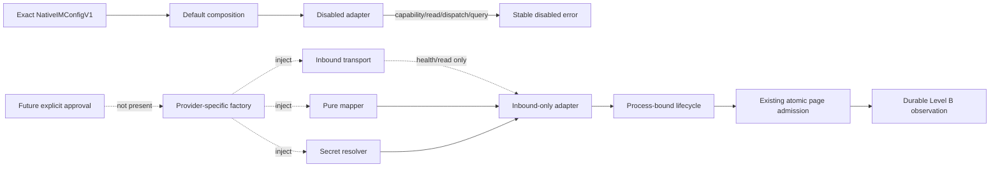
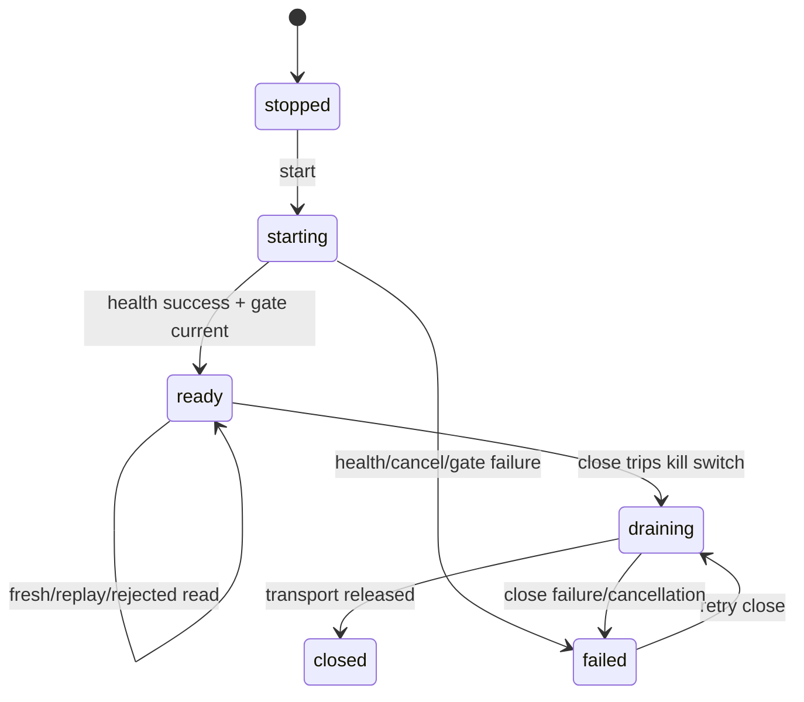

# 原生 IM E2 Adapter/Lifecycle：离线阶段证据与真实接入前硬边界

> 证据日期：2026-08-28（Asia/Shanghai）
>
> 评审分支：`mainline_continue_quantum_entanglement`
>
> 运行源码：`2bdaea1adddcfb3033b4678766f635d7afc242fc`
>
> 运行源码树：`42e6bedf04a1ed971ee269676730b94882112d59`
>
> 远端回读：`origin/mainline_continue_quantum_entanglement` 精确等于上述运行源码
>
> 阶段判定：E2 / Level B 的 default-off adapter、bounded parser、lifecycle、kill switch、
> typed observability、canary 和 recorded probe 离线节点已完成；真实 sandbox 仍未连接
>
> 永久限制：不向飞书、企微、个人、群聊、bot 或 webhook 发消息；本证据不授权任何真实 outbound

## 1. 结论

上一节点完成了 nonce、verified page、canonical event、read CAS 和 checkpoint 的单事务 admission。
本节点已经把该持久化边界前方的 **离线 inbound-only 执行壳** 补齐：默认 composition 只能生成
disabled adapter；只有显式注入的 transport、纯 mapper、secret resolver 和 replay guard 才能构造
inbound adapter；lifecycle 在 process-bound kill switch 下完成 health、read、atomic admission、取消恢复
和 graceful close；所有 operational observation 都通过固定类型、固定字段、无自由文本的 allowlist。

这个结论不等于“原生 IM 已经接入”。源码中仍然没有可注册的 HTTP/WebSocket/socket transport、
真实 provider SDK、真实 credential material、webhook listener 或 external send composition。运行门禁也
主动阻断 socket、DNS、asyncio network connection、subprocess 和 browser。下一次真实动作必须先
取得并冻结专用测试环境批准输入，再新增独立 provider-specific transport/mapper，并单独修订
`SERVICE_BOUNDARY.md`。在此之前，正确行为是停在 durable observation。

## 2. 本节点提交账本

| 提交 | 能力 | 固定保证 |
|---|---|---|
| `2e9aa41` | default-off sandbox transport | 默认 composition 不注册真实 transport；enabled config 机械拒绝 |
| `b164ab2` | bounded canonical page parser | raw/mapped body、scope、request、capability、event、conversation、auth 与 transport evidence 全部绑定 |
| `5f9d78f` | signed body / mapped page 分离 | provider signed bytes 不与 canonical page digest 自引用；authentication evidence 可独立复算 |
| `b08b01e` | 显式 inbound-only adapter | 只接受注入 transport/mapper/secret/replay guard；outbound 在请求检查前稳定拒绝 |
| `40d268e` | lifecycle + kill switch | startup/read/close 串行；kill switch 与最终 SQLite admission 共用临界区 |
| `5a00855` | typed observability | lifecycle/health/read/kill-switch 四类固定事件和无标签 counters |
| `e17180b` | lifecycle observation 接线 | health、fresh/replay/rejected/kill-switch、drain/close 均可观测；logger failure 不改变 admission |
| `bcab05e` | 全链 canary | 消息正文、trace、read secret、verify secret、nonce、signature 不进入日志/repr/metrics/SQLite |
| `5dbd873` | conflict 分类 | checkpoint/identity/page conflict 记为 `rejected`，不伪装成 transport failure |
| `0eeb89c` | recorded contract probe | 离线覆盖 disconnect/resume、duplicate、out-of-order 和 conflicting replay |
| `af79843` | adapter process binding | enabled/disabled adapter 均绑定创建进程且不可序列化 |
| `e1f5690` | cancellation/graceful close | 取消 read 保留 prepared row；取消 close 不提前伪造 closed，可安全重试 |
| `6779e0d` | hostile dependency fence | transport/mapper/secret/close canary 异常只越界为固定错误且 lease 被清零 |
| `67bcb57` | zero-network gate 扩展 | 新进程同时覆盖 fake、sandbox、lifecycle、observability import/runtime |
| `2bdaea1` | package public API | 显式导出稳定 integration API，但仍不导出或注册 HTTP/WebSocket transport |

每个提交均已独立推送到私有 GitHub 分支。本节点没有合并 `main`、删除 worktree、移动历史 tag 或
清理评审分支。

## 3. 默认关闭与权限面



当前实线部分的唯一默认结果是 disabled。虚线部分说明未来批准后的依赖方向，不表示仓库已经存在
网络实现。

### 3.1 机械边界

1. `compose_default_native_im_sandbox_v1(...)` 对 disabled config 返回 exact disabled adapter；对
   inbound-only config 直接拒绝，不能从环境变量、URL 或 credential 自动启用；
2. `NativeIMInboundOnlySandboxAdapter` 构造器没有 provider SDK 或全局 registry，只接受显式对象；
3. `dispatch(...)` 与 `query_acceptance(...)` 不读取 request、clock、transport 或 secret，直接返回
   `native_im_outbound_forbidden`；
4. adapter、lifecycle、kill switch、observer 和 metrics 均为 process-local；带 live authority 的对象
   不可 pickle；
5. adapter 只解析 bounded raw bytes 和 mapper 输出的 canonical bytes，不保留 secret material；
6. 完整 secret lease 在 health/read/verify/异常路径结束时清零；关闭失败或取消不会伪造 closed；
7. Level B 没有 MentionRouter、Agent runtime、plugin、tool、browser、subprocess 或 outbound 入口。

## 4. Signed provider body 与 canonical page

provider 签名证据和平台 canonical page 是两个不同的字节域：

```text
provider raw body
  -> SHA-256 body digest
  -> detached signature/timestamp/nonce verification
  -> NativeIMRawVerificationResultV1

provider raw body + verified evidence + trusted profile/request/capability
  -> pure provider mapper
  -> NativeIMMappedPageV1(canonical_page_body, source_body_digest)
  -> bounded canonical parser
  -> IMInboundPageV1
  -> existing atomic admission
```

parser 重新验证 raw-body digest、mapped source digest、canonical bytes、request/capability/scope、
supported event mapping、conversation allowlist、tenant mapping revision、auth evidence、transport
evidence、verification identity 和各项硬上限。mapper exception 或非 exact output 不会携带 provider
正文越过 boundary。

## 5. Lifecycle、kill switch 与取消语义

### 5.1 状态机



kill switch 是单向、process-bound、不可序列化 gate。read 开始时取得 snapshot；最终
`admit_native_im_inbound_page(...)` 与 kill-switch trip 使用同一线程锁临界区。因此：

- read 中途拉闸后，即使 transport 已返回，也不能完成 observation admission；
- 已持久化的 prepared read 保持可对账，不会被误标为 admitted；
- 新 lifecycle + 新 kill switch 可以从 durable prepared/checkpoint 安全恢复；
- close 在等待 lifecycle lock 前先拉闸，阻断后续 admission；
- read cancellation 传播原始 `CancelledError`，记录为 rejected，并允许同 lifecycle 重试；
- close cancellation 不提前设置 adapter closed；释放成功后才发布 closed。

## 6. Typed observability 与 canary

observer 只接受四类源码固定事件：

| Event | 允许字段 | 明确禁止 |
|---|---|---|
| `qe.native_im.lifecycle` | fixed state、ready bool、kill-switch bool | ID、URL、exception、正文 |
| `qe.native_im.health` | success/failure enum | endpoint、credential、provider response |
| `qe.native_im.read` | fixed outcome、bounded count、trace-present bool | traceparent 原文、event ID、正文 |
| `qe.native_im.kill_switch` | fixed reason enum | caller free text |

metrics 是无 caller label 的进程本地 counters；observer/logger backend failure 不回滚或改变 durable
admission。端到端 canary 把以下值放入真实离线执行链：

- provider raw message-body canary；
- traceparent canary；
- read credential canary；
- verification secret canary；
- detached nonce 与 signature。

测试扫描 captured log、公开 error/repr、metrics snapshot、SQLite logical rows、数据库文件及旁路文件。
所有 canary 均为零命中；保留的 secret `memoryview` 在 lease close 后全部变成同长度零字节。SQLite
只保留 canonical observation 和不可逆 digest/evidence，不保留 provider raw body 或 secret。

这份 canary 证明只覆盖本节点执行路径，不替代未来真实 provider transport、exporter、backup、
Artifact 或 Agent 路径各自的 canary gate。

## 7. Recorded contract probe

`tests/test_native_im_sandbox_recorded_probe.py` 使用无 URL、无 socket、无 outbound method 的内存
transport 和纯 mapper。每个 probe 都在以下运行时 fence 下执行：

- `socket.socket`；
- DNS `getaddrinfo`；
- `subprocess.Popen`；
- `asyncio.create_subprocess_exec`；
- `webbrowser.open`。

| 场景 | 结果 | Durable 不变量 |
|---|---|---|
| 首次 read disconnect，随后 resume | 第一次固定 transport error；第二次 fresh | prepared row 保留；只有一次 event/nonce admission |
| exact duplicate page | fresh 后 `observed_replay` | receipt/page/checkpoint 完全相同；event count 不增加 |
| continuation 先于 parent | checkpoint conflict，transport 调用数仍为零 | parent admission 后 continuation revision 1→2 正常 |
| 同 request 的 conflicting replay | exact conflict | 第二 nonce 与候选 page 事务回滚；原 event/nonce 各一条 |

probe 输出只能进入现有 SQLite atomic admission；没有 Agent、tool、browser、subprocess 或 outbound
消费者。

## 8. 测试与门禁

运行环境使用仓库受控 venv，未读取或输出任何真实 API Key。源码候选完成：

| 验证 | 结果 |
|---|---:|
| 完整 pytest | 2,114 / 2,114 passed；77 个既有 Python 3.13 fork deprecation warnings |
| Native IM 全专项 + safe logging | 616 collected；全部包含在 full suite 中通过 |
| 本节点 sandbox 显式文件 + safe logging | 66 collected；全部通过 |
| Ruff check | passed |
| Ruff format check | 177 files formatted |
| strict mypy | 58 source files，0 issues |
| Native IM V1 golden | 23 / 23 passed |
| zero-network verifier | passed |
| dependency locks | 4 targets / 74 package records verified |
| compileall | passed |
| `git diff --check` | passed |
| GitHub branch SHA readback | exact `2bdaea1adddcfb3033b4678766f635d7afc242fc` |

复现命令：

```bash
PYTHONPATH=src python -m pytest
ruff check src tests scripts
ruff format --check src tests scripts
PYTHONPATH=src mypy --strict src/quantum_entanglement
PYTHONPATH=src python scripts/verify_native_im_zero_network.py
PYTHONPATH=src python scripts/verify_native_im_v1_golden.py
python scripts/verify_dependency_locks.py --repository-root .
PYTHONPATH=src python -m compileall -q src tests scripts
git diff --check
```

测试数量只证明上述源码候选的可复现断言，不代表生产 Gate A–E、真实 provider 兼容性、容量、
SLO、RPO/RTO、商用或 GA 已通过。

## 9. 当前硬停止点与真实 sandbox 前必做

离线 adapter/lifecycle 不再是 TODO。当前 NO-GO 边界变为：**没有 provider-specific approved
transport/mapper 和 sandbox 批准记录时，不建立真实连接。** 必须按顺序完成：

1. IM 后端团队提供并冻结测试 endpoint class/服务身份、transport 类型、health/read 方法路径、
   redirect/DNS/IP 语义、认证/签名/nonce/cursor/limit/error 合同；
2. 冻结测试 tenant/workspace/channel/conversation/account、非敏感合成数据等级、read-only
   credential `SecretRef`、审批人、截止时间、kill switch 与回退触发条件；
3. 在独立 provider-specific 模块实现 transport 与 pure mapper；不得写回 provider-neutral V1，也
   不得加入默认 composition；
4. 给真实 transport 增加 DNS/IP 重验证、TLS identity、redirect 禁止、timeout/size/rate bounds、
   cancellation、record/replay 和 secret/exporter canary；
5. 单独修订 `docs/production/SERVICE_BOUNDARY.md`，只放行此次批准记录中的 sandbox read；
6. 重新执行 full gates、源码/远端 SHA 回读、批准记录和 Notion readback；
7. 才按 `health -> one inbound read -> duplicate -> disconnect/resume -> kill switch` 顺序验收；
8. 验收结果只进入 durable Level B observation，仍不驱动 Agent、tool、browser、subprocess 或
   outbound。

真实 outbound 继续不存在/关闭。任何 send 必须等 E3/E4 的 Result/Action Authority 闭合后，针对
单一测试环境再次取得明确授权。

## 10. 回退与人工验收

- 最小回退使用按逆序 `git revert` 本文提交账本中的代码提交；不要 reset、重写共享历史或删除
  durable evidence；
- 保留 `mainline_continue_quantum_entanglement` worktree、本地分支和远端分支，等待用户人工审阅；
- 不自动合并 `main`，不删除当前评审 worktree；
- 当前节点适合做 provider contract review、fixture replay 和用户阶段验收；不适合作为真实网络、
  Agent activation、outbound 或生产发布批准。
