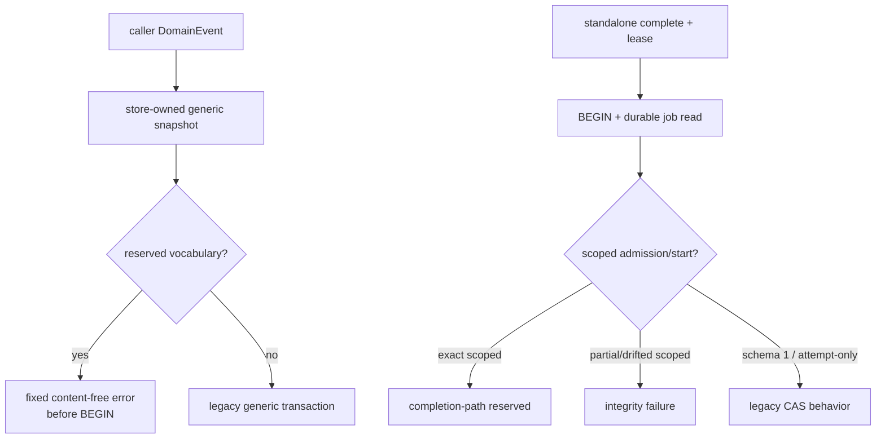

# M2 Reserved Result Event Boundary 实现与验证证据

- 记录日期：2026-08-28（Asia/Shanghai）
- 执行分支：`mainline_continue_quantum_entanglement`
- 代码与对抗测试封板：`dd0ba54`
- 前置节点：M1 private stored-event envelope codec `d889751`
- 设计依据：[`ADR_0005_ATOMIC_RESULT_AUTHORITY.md`](../../docs/production/ADR_0005_ATOMIC_RESULT_AUTHORITY.md)
- 阶段结论：**M2 reserved fence 已完成；下一节点是 M3 store adapter**
- 发布结论：**不是生产晋级；Gate A–E 全部关闭**

## 1. 为什么必须先做 M2

M1 只能对一组已经冻结的 event row 值计算 canonical stored-event envelope。若 generic event API
仍可直接写入 `task.invocation.result.accepted` 或带 result-terminal 字段的
`task.status.changed`，调用者就能绕开未来专用 writer，伪造一个“看起来 canonical”的结果事实。

另一个独立旁路是 `SQLiteInvocationAttemptStore.complete()`。它原本只对 lease 做 CAS，能把 scoped
job/attempt 直接改成 `succeeded`，却没有 Result Artifact、result event、terminal event、receipt 或
outbox。M2 的任务不是实现 writer，而是在 writer 出现前先把这两条第二写路径封死。



## 2. Generic result vocabulary fence

### 2.1 两层 snapshot，而不是 bypass flag

`SQLiteEventStore` 现在明确分成两层：

- `_snapshot_event(...)`：只冻结 event scalar 与 canonical JSON，保留给 M3 私有 typed writer；
- `_snapshot_generic_event(...)`：先调用纯 snapshot，再执行 reserved vocabulary fence。

五个 caller-controlled 写入口全部使用 class-qualified `_snapshot_generic_event`：

| 入口 | 拒绝时点 | 失败后不可变化的表 |
| --- | --- | --- |
| `append` | `BEGIN` 前 | `events` |
| `append_many` | 全 batch snapshot 后、`BEGIN` 前 | `events`、sequence/global position |
| `append_with_outbox` | outbox iterable 前、`BEGIN` 前 | `events`、`outbox` |
| `append_inbox` | result/clock 与 `BEGIN` 前 | `events`、`inbox_receipts` |
| `append_invocation_admission` | job snapshot 与 `BEGIN` 前 | `events`、`invocation_jobs`、`invocation_admissions` |

Class-qualified dispatch 防止给 store 实例 shadow `_snapshot_generic_event` 或
`_reject_generic_reserved_result_event` 后跳过门禁。Public signature inventory 同时冻结为七个
`append*` 方法；没有 `trusted`、`allow_reserved`、caller-owned `connection` 或 `transaction` 参数。

### 2.2 Exact accepted event

Exact event type：

```text
task.invocation.result.accepted
```

无论 payload 是空对象、错误/未来 schema、partial shape、nested object 或 canary，只要 JSON snapshot
本身有效，就抛 exact `ReservedResultEventError`：

```text
code = reserved_result_event
message = generic event append cannot write reserved result authority
```

错误内容不包含 event ID、key、payload value、credential 或 result canary。即使数据库里已经有同
idempotency 的普通/升级 reserved row，generic retry 也会在读取 replay 前拒绝。

### 2.3 Exact 与 near-canonical terminal key

只有 exact `task.status.changed` 的 payload 顶层 key 进入 terminal namespace。每个 key 按以下顺序
生成 skeleton：

```text
NFKC -> casefold -> NFKD -> keep ASCII [a-z0-9]
```

任一 skeleton 命中以下集合即拒绝，value 和其他字段不参与放行判断：

```text
transitionkind
resultreceiptid
resulteventid
resultevidencedigest
runningtaskrevision
terminaltaskrevision
```

这会同时拒绝 camelCase、snake_case、kebab-case、空格/点号/斜线、大小写、全角 ASCII、zero-width、
combining mark 和插入标点/emoji 的近似拼写。门禁在 typed decode 前执行，因此 full、subset、superset、
null/wrong value 与 wrong revision 都不能靠 decoder failure 落回 generic path。

为了避免误伤，合同也冻结为：

- nested `metadata.resultEventId` 不递归拦截；
- reason/narration 字符串中的 `resultEventId` 不拦截；
- `task.result.received` 等其他 event type 不进入该 namespace；
- `resultEventIdentifier` 等不同 skeleton 不拦截；
- exact 五字段 legacy status，包括 `RUNNING -> COMPLETED/FAILED`，仍可写但不获得 Result Authority。

## 3. Standalone scoped completion fence

### 3.1 不使用启发式

`InvocationJob` 和 `InvocationLease` 不携带 tenant/workspace/schema。M2 明确不以这些字段猜 scope：

- `max_attempts == 1`；
- `invoke:` identity 前缀；
- opaque `payload_digest`；
- caller `result_ref`；
- worker/lease label。

因此，一个 attempt-only database 即使故意使用上述形状，legacy `complete()` 仍继续工作。

### 3.2 Durable classification

`complete()` 在自己的 `BEGIN IMMEDIATE` 事务中先读取 durable job，再执行结构分类；分类发生在 store
clock 与第一条 `UPDATE` 之前。候选来源为：

1. `invocation_admissions.first_global_position`；
2. canonical `execution-request:<invocationId>` idempotency；
3. canonical JSON 中 exact `"invocationId":<encoded-id>` needle；
4. execution/start event 的 exact typed schema 与 job binding。

候选限定在 job 的 `session:<sessionId>` stream，最多 64 条；第 65 条直接按
`InvocationIntegrityError` 失败关闭，避免无界 `fetchall`。

分类结果：

| Durable shape | `complete()` 结果 |
| --- | --- |
| exact scoped execution schema 2 | `InvocationCompletionPathReservedError` |
| exact scoped start schema 3 | `InvocationCompletionPathReservedError` |
| scoped marker、receipt、event type/key、digest 或 identity 漂移 | `InvocationIntegrityError` |
| exact legacy execution schema 1 / start schema 2 | 保留原 CAS 行为 |
| attempt-only DB，没有 event/admission domain | 保留原 CAS 行为 |
| 无关 scoped event | 不阻塞目标 legacy job |

Exact receipt 会重算两条 admission event manifest digest 和 job binding digest；删除 receipt 也不会把
仍存在的 scoped execution/start event 降级为 legacy。拒绝后 job、attempt、lease deadline、result_ref
均不变化，transaction 正常 rollback，store 不 poison。

## 4. 独立逆向审查发现并关闭的旁路

M2 没有只依赖实现者正向测试。三路只读审查中，两条复现为真实旁路并先转成回归测试：

### 4.1 Stripped scope marker downgrade

早期实现只在 payload 仍有 `schemaVersion=2` 或 tenant/workspace marker 时拒绝。独立审查同时删除
`schemaVersion`、`tenantId`、`workspaceId` 后，复现了 scoped job 被降级为 legacy 的路径。

修复后，receipt、canonical idempotency、payload invocationId 或 canonical execution type 已定位到目标
时，缺失 schema 的 unknown shape 直接按 integrity 失败；对应提交：

- 修复：`a6926e2`；
- 回归：`0637abd`。

### 4.2 Type/key coordinate drift

第二轮逆向审查删除 receipt，并同时改变 execution-request 的 event type 与 idempotency key，证明只按
coordinates 查询会定位不到行。最终实现增加 canonical payload invocationId needle 与 scoped start
fallback，并给候选数量设硬上限。对应提交：

- 修复：`736e21a`；
- 回归：`dd0ba54`。

测试对这条路径使用仍有效的 `CLAIMED_AT`，不是 expired lease；若再次漏掉，旧行为会真正把
`running` 改成 `succeeded`，不会被 `False` 返回值掩盖。

## 5. 提交台账

| Commit | 独立不变量 |
| --- | --- |
| `d0bf54d` | 初始 reserved vocabulary |
| `8ea0f62` | pure snapshot 与 generic fence 分层，固定异常类型 |
| `5640c74` | class-qualified dispatch 与 Unicode skeleton hardening |
| `6905190` | generic surface/zero-write/legacy/inventory 矩阵 |
| `62365bd` | standalone scoped completion durable classifier |
| `4bd0d8e` | scoped completion/legacy/tamper 回归矩阵 |
| `a6926e2` | stripped marker 失败关闭 |
| `0637abd` | stripped marker 逆向回归 |
| `736e21a` | payload identity 与 scoped start fallback |
| `dd0ba54` | type/key drift 有效 lease 回归 |

每一笔均独立 commit 并推送到私人 GitHub 的
`mainline_continue_quantum_entanglement` 分支；没有合并 `main`。

## 6. 验证矩阵

### 6.1 M2 专项

两个新增文件覆盖 25 个 top-level test：

- `tests/test_reserved_result_event_boundary.py`；
- `tests/test_scoped_invocation_complete_fence.py`。

重点断言包括：

- 5 个 generic surface × accepted/full terminal/六个 exact key；
- 66 个 near-canonical key spelling；
- batch first/middle/last；
- trace 中无 `BEGIN`/DML、`total_changes` 不变、七张 durable 表逐行不变；
- idempotent/升级 row replay 仍先拒绝；
- instance method shadow 失败；
- outbox/result/spec secondary caller input 不被提前触碰；
- scoped EventStore claim 与 standalone claim 两路均不能 standalone complete；
- stale lease 也先结构拒绝，clock 调用次数为 0；
- missing/tampered receipt、payload/type/key/job digest drift 失败关闭；
- schema-1、attempt-only 与 unrelated scoped event 的 legacy 兼容。

M2 专项已在 CPython 3.9.6、3.12.12、3.13.9 运行一致通过。

### 6.2 全仓与静态门禁

- CPython 3.13.9：2,514/2,514 tests 通过；
- warnings：79 条既有 multiprocessing/fork deprecation warning，无 M2 新 warning；
- Ruff 0.16.3：全仓 lint 与 format check 通过；
- Mypy 1.19.1：strict，66 source files 通过；
- `git diff --check` 通过。

## 7. 本阶段明确没有完成什么

M2 只封路径，不签发 authority。以下仍不存在或保持关闭：

- M3 `_EventWriteSnapshot` → envelope adapter；
- INSERT 后 raw `sqlite3.Row` 同事务重算与双路比较；
- typed result/terminal event dispatch；
- migration 7 与 result receipt tables；
- Artifact same-transaction writer；
- atomic result writer、Observed recovery、Accepted mint point；
- heartbeat worker promotion；
- 真实 IM provider sandbox、Agent activation 与任何 outbound。

`ReservedResultEventError` 或 `InvocationCompletionPathReservedError` 只证明某条旁路被拒绝，不是结果
receipt、接受证明或授权 capability。

## 8. 下一步

下一串行节点是 M3：在私有 typed path 中从真正交给 INSERT 的 `_EventWriteSnapshot` 计算 envelope，
INSERT 后用固定列清单读取 exact raw `sqlite3.Row`，独立重算并比较字段、bytes 与 digest。M3 完成前
仍不得注册 migration 7、开放 writer 或启用 worker。

按用户 2026-08-28 的最新决定，本文件只落本地/Git/GitHub；Notion 暂不逐动作同步。当前计划所有
本地任务完成后再一次性批量上传并逐页回读。语雀、飞书、企微、真实 IM 和 outbound 均未操作。
