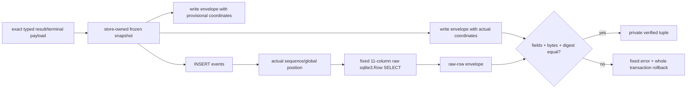

# M3 Stored-Event Envelope Store Adapter 实现与验证证据

- 记录日期：2026-08-29（Asia/Shanghai）
- 执行分支：`mainline_continue_quantum_entanglement`
- 代码、对抗修复与回归封板：`504824c`
- 前置节点：M1 codec `d889751`；M2 reserved fence `dd0ba54`
- 设计依据：[`ADR_0005_ATOMIC_RESULT_AUTHORITY.md`](../../docs/production/ADR_0005_ATOMIC_RESULT_AUTHORITY.md)
- 阶段结论：**M3 private store adapter 已完成；下一节点是 M4 inactive schema / Artifact transaction primitives / backup topology**
- 发布结论：**不是 writer、不是 receipt、不是 Accepted；Gate A–E 全部关闭**

## 1. M3 关闭的风险

M1 只能从一组 value 或 raw SQLite row 计算 capability-free envelope。M2 只封锁 generic result
vocabulary 与 standalone scoped completion。若未来 writer 直接信任 caller `DomainEvent`、普通 read
model 或 INSERT 前算出的坐标，仍可能出现四类错误：

1. caller 在 snapshot 前后改变 event/payload；
2. SQLite adapter、trigger 或 storage class 让实际 row 与写入意图漂移；
3. idempotent replay 被误认为本调用 fresh insert；
4. 正确的 canonical bytes 被错误包装成“已接受结果”。

M3 因此只增加一个私有的 composition seam。它把 store-owned `_EventWriteSnapshot`、实际 INSERT、
真实 sequence/global position、固定 11 列 raw-row SELECT 和 M1 codec 连在同一个 owning transaction
中；任一步不一致都让外层 transaction 回滚。



这里的 `private verified tuple` 仍是 capability-free 中间值。它不表示 COMMIT 已成功，不可作为
Accepted、授权 token 或跨事务 receipt 使用。

## 2. 实现边界

### 2.1 Snapshot 路径

`SQLiteEventStore._stored_event_envelope_from_write_snapshot(...)` 只接受 exact
`_EventWriteSnapshot`，从 snapshot 内 exact `DomainEvent` 和已经冻结的 `payload_json` 构造 M1
envelope。调用者不能提供 digest、sequence 或 global position，不能通过实例方法 shadow 替换私有
composition。

`_freeze_typed_result_event_write_snapshot(...)` 再复制一次 INSERT 将使用的全部 scalar 与 payload
bytes，关闭 trace callback 或 caller 在 INSERT 中途修改原 event/snapshot 的窗口。INSERT、返回的
`StoredEvent` 与写侧 envelope 都使用这份隐藏 frozen snapshot。

### 2.2 Typed-only reserved payload

私有 insert seam 只接受两类 event：

| Event | 必须通过的 typed codec | 必须机械绑定的 event scalar |
| --- | --- | --- |
| `task.invocation.result.accepted` | exact `ScopedInvocationResultEvidenceV2` | `session:<sessionId>`、canonical orchestrator actor、`timestamp == acceptedAt`、non-null correlation/causation、acceptance idempotency key |
| result-bound `task.status.changed` | exact `ScopedInvocationResultTerminalTransitionV2` | `session:<sessionId>`、canonical orchestrator actor、payload correlation、`causation == resultEventId`、task/revision idempotency key |

Typed object 的 canonical bytes 必须与 frozen `payload_json` UTF-8 bytes 完全一致；unknown/missing/
future field、错误 runtime type、额外空白或反射修改都在 INSERT 前失败。Result event 与 terminal
event 的 pair-level timestamp/coordinate/receipt binding 留给 M5 atomic pair writer，不能由单事件 M3
adapter 冒充完成。

### 2.3 Raw durable row 路径

INSERT 返回真实 coordinates 后，adapter 在同一 connection、同一未提交 transaction 内只读取：

```text
global_position, stream_id, sequence, event_id, event_type, actor_id,
timestamp, payload_json, correlation_id, causation_id, idempotency_key
```

读取结果必须是 exact `sqlite3.Row`。M1 raw-row codec 重新检查列 inventory/order、SQLite storage
class、text/UTC/NFC/control/size、canonical JSON、positive signed-64 coordinates，并独立生成 fields、
canonical bytes 与 digest。三项都必须与 write-snapshot 路径相等；代码不调用
`DomainEvent.to_dict()`、`StoredEvent.to_dict()`、普通 `_row_to_event()` 或 runtime presentation JSON。

### 2.4 Fresh、isolated insert

M3 明确采用 **zero-trigger-side-effect** 合同：一次 verified insert 的 top-level `changes()` 必须为
1，connection-wide `total_changes` 必须精确增加 1。以下情况全部失败并回滚：

- idempotency replay 返回已有行；
- AFTER trigger 搬走原行并在原 position 放回克隆；
- BEFORE trigger 更新旧行后 `RAISE(IGNORE)`；
- 保留正确 NEW row 但额外插入第二条 event；
- trigger 写入独立 audit table；
- trigger 对 row 做任意 UPDATE/DELETE。

该策略有意不允许 audit trigger。未来若需要审计，必须把审计 row 纳入 atomic writer 的显式 durable
graph 和 readback，而不是让数据库 trigger 在 verified seam 外制造不可见副作用。

## 3. 异常与 API 表面

返回给未来 caller 的三类已分类错误使用固定、content-free 异常：

- typed contract failure：private `_ResultEventWriteContractError`；
- stored row / insert isolation failure：`EventStoreIntegrityError`；
- expected coordinate conflict：`ConcurrencyError`。

这三类错误会先清除 payload-bearing inner traceback、cause 与 context，等 decorator 参数 frame
释放后再从 clean raiser 创建固定异常。测试遍历完整 cause/context graph 与所有 `store.py` frame
locals，证明 event ID、payload value、64-hex digest canary 和 `snapshot/frozen/event/payload` locals 均
不可达；在已有外层 exception 正被处理时也不会继承其 context。

该保证只覆盖 M3 明确定义的三类 outcome。Direct private verifier 的开发者错误、closed SQLite
connection、exact interpreter control 和未来 public writer 的 COMMIT/rollback/ACK-loss 分类仍由后续
writer transaction boundary 统一处理；M3 没有提前发明不完整的公共错误协议。

`store.py` 没有新增 wildcard-visible 名称。测试冻结 M3 前的 82-name wildcard surface，证明 current
surface 无新增、无移除；result model、event constant、codec error 与 write-contract error 都只以
underscore alias 存在。`SQLiteEventStore` 没有新增 public writer/signature 参数，也没有
`trusted`、`allow_reserved`、caller connection 或 caller transaction escape hatch。

## 4. 独立逆向审查与修复

三路只读审查没有把正向测试当作结论。真实发现如下：

### 4.1 Position-only readback replacement

初版只按 `global_position` 回读。AFTER trigger 可把原 row 搬到其他 position，再把 exact `NEW` 克隆
放回旧 position；固定 SELECT 会验证克隆，却把额外漂移 row 一并提交。BEFORE trigger 也可更新旧
row 后忽略 INSERT。

`504824c` 加入 `changes()` + `total_changes` 双计数和 relocation/clone、old-row/ignore、extra-event、
audit-side-effect 回归，要求一次 verified seam 只能产生一条 top-level fresh event insert。

### 4.2 Exception graph payload retention

初版 fixed `str/repr` 虽不含 payload，但原 decoder/readback exception 仍可从 `__context__` 或
traceback frame locals 读取 canary。`504824c` 增加 clean reissue boundary，并把 concurrency conflict
纳入相同清理；测试不只看 rendered message，而是遍历完整 exception graph。

### 4.3 Wildcard indirect export

`store.py` 没有 `__all__`，初版非下划线 import 会被 `from quantum_entanglement.store import *`
间接导出。`504824c` 使用 private aliases，并用 frozen pre-M3 surface 做 exact compatibility test。

### 4.4 Adapter storage-class coverage

Trigger mutation 会先被 total-change invariant 拒绝，因此不能再证明 raw SELECT 保留 SQLite storage
class。最终测试直接在 owning transaction 中先 INSERT，再把 9 个 TEXT/optional columns 逐列转成
BLOB，然后调用 raw verifier；每一列都按 `readback is invalid` 失败，整笔 transaction 回滚。

## 5. 提交台账

| Commit | 独立不变量 |
| --- | --- |
| `3c1b9a8` | 从 exact store-owned write snapshot 派生 envelope |
| `f9da335` | INSERT 后从固定 raw durable row 独立重算并三重比较 |
| `2df5b63` | reserved result/terminal path 只接受 exact typed payload bytes 与 scalar binding |
| `a35561c` | raw-row column/storage class/digest/byte drift 与 rollback 对抗矩阵 |
| `296aae1` | caller、snapshot 与 payload 在 INSERT 前后 mutation 不改变 hidden frozen bytes |
| `504824c` | trigger replacement/extra-row、fresh isolation、exception graph、private API、ownership 与 cross-version 审查收口 |

每一笔均已推送私人 GitHub 的 `mainline_continue_quantum_entanglement` 分支；没有合并 `main`。

## 6. 验证矩阵

### 6.1 M3 专项与组合专项

- M3 两文件：64 tests；
- M1 codec + M2 fence + typed result models + M3 adapter 组合：209 tests；
- CPython 3.9.6、3.12.12、3.13.9：209/209 全部通过。

对抗覆盖包括：

- typed result/terminal exact bytes 与 scalar bindings；
- fixed projection、raw `sqlite3.Row`、fields/bytes/digest 三重比较；
- idempotent replay、wrong expected version/global position；
- caller/snapshot/payload mutation 与 instance method shadow；
- 每列 scalar drift、全部 TEXT/optional BLOB storage class、missing row；
- relocation/clone、ignored INSERT、extra event、audit side effect；
- pair 第二条 event verification failure 的全事务回滚；
- non-owning/no-transaction/closed connection；
- fixed classified error 的 cause/context/traceback canary containment；
- pre-M3 wildcard surface exact compatibility。

### 6.2 全仓与静态门禁

在代码封板 `504824c` 上：

| 门禁 | 结果 |
| --- | --- |
| CPython 3.13.9 full pytest | 2,578/2,578 tests 通过；79 条既有 fork deprecation warnings |
| Ruff 0.16.3 `check .` | 通过 |
| Ruff 0.16.3 当前改动 Python 文件 format | 通过；仓库已有 Native IM Markdown code-fence 格式差异不属于本节点改动 |
| Mypy 1.19.1 strict | 66 source files 通过 |
| `git diff --check` | 通过 |

## 7. 本阶段明确没有完成什么

M3 只封闭 private stored-event adapter，不创建 Result Authority。以下仍不存在或保持关闭：

- result migration 7 candidate、注册或 legacy bootstrap；
- result acceptance/receipt/outbox tables；
- Artifact same-connection transaction primitives；
- atomic result + terminal pair writer 与最终 COMMIT 前双 row 再验证；
- result receipt 与 Observed replay/reopen/ACK-loss recovery；
- fresh-COMMIT-only `AcceptedV2`；
- heartbeat worker、真实 IM provider、Agent/tool/browser/subprocess activation；
- 任何真实 outbound。

M3 返回的 envelope/digest 不能单独证明 durability、scope authority、complete graph、COMMIT ACK 或
fresh acceptance。后续 M5 writer 必须在 Artifact/receipt/outbox/attempt/task 全部 DML 后、COMMIT
前再次复核 result 与 terminal 两条 event row，不能只复用 M3 的第一次 insert 后验证。

## 8. 下一步与停止线

下一串行节点是 M4：先形成 inactive result schema 和 migration 7 候选，但不注册 legacy bootstrap；
再提取 Artifact same-connection transaction primitives，并把新增表、索引和依赖纳入 backup-v2
topology。M4 完成前不开放 writer；M5 完成前不创建 receipt/Observed；M7 前不创建 Accepted；独立
promotion 前不启用 worker。

按用户 2026-08-29 的决定，Notion 页面操作不再阻塞高频开发。本文件已进入本地 Git/GitHub，但尚未
同步 Notion；当前计划全部完成后再批量上传并逐页回读。语雀、飞书、企微、真实 IM 和 outbound
均未操作。
