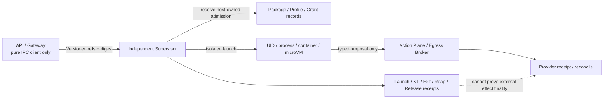

# 第三方执行隔离合同：Supervisor、Generation Fence 与 Receipt Honesty

> 状态：W1 P1-6 已冻结最小 Go 合同与 hostile deterministic fake。
>
> 代码提交：`43e111e`、`fccb64e`、`d32079c`。
>
> 诚实边界：本阶段没有启动任何第三方包，没有实现真实 process/container/microVM supervisor，
> 没有持有 Docker/runtime socket，也不把 deterministic fake 的通过冒充 OS 隔离已经完成。

## 1. 为什么这一步由用户调研直接驱动

一级证据根始终是：

```text
/Users/lwblx/huapohen/agent/automation/2026/05_08/1/2output/more
```

它不是背景阅读，而是产品合同输入。本阶段继续沿用固定链路：

```text
研究证据
  -> 产品硬需求
  -> 领域对象/API
  -> 安全控制
  -> 实施阶段
  -> 可复核验收证据
```

### 1.1 DeepSeek Harness：吸收 seam，不照搬默认信任边界

- `deepseek-harness/research_report.md:384-414`：filesystem sandbox 的语义不覆盖 network 和 process
  visibility；产品组合默认值还可能比独立 policy 类型更宽；
- `443-456`：同 UID 的 `0600` credential 不是 Agent 子进程隔离；
- `516-519`：`node:vm` 不是 security boundary，动态包等价于获得高风险运行能力；
- `568-581`：cancel 依赖 producer 合作，producer 不 settle 会卡 teardown；worker termination 也不能
  回滚已经发生的外部副作用；
- `825-840`：高敏生产需要独立 UID/VM/microVM/container、deny egress、独立 MCP/plugin sandbox。

因此吸收的是 capability seam、Profile/Bundle、可逆 lifecycle 和稳定 host；拒绝的是“能动态加载”就
等于“可在 API 主进程安全运行”、filesystem policy 等于完整 sandbox、context cancel 等于强杀。

### 1.2 隔离与生命周期的交叉证据

| 一级报告 | 行号 | 本阶段硬结论 |
|---|---:|---|
| `tech-agent-security-governance/research_report.md` | 49, 164-167, 282-307 | Docker 名称不是安全证明；必须逐项限制 UID、mount、process、network、secret、resource、kernel |
| 同上 | 254-275 | capability BOM、runtime admission、动态 sandbox 和 runtime enforcement 必须连续 |
| 同上 | 399-424 | cancel/timeout/crash 后外部 effect 通常只能进入 receipt/reconcile，而不是“未发生” |
| `omnigent/research_report.md` | 355-366 | 停流、SIGINT、父进程退出、child 继续和外部 effect 是不同事实 |
| 同上 | 505-534 | 各 OS/backend 的实际保证不同；同一个 profile 名称不能静默宣称等价 |
| 同上 | 570-589, 1242-1261 | durable logical host 与 disposable generation 分离；split-brain 必须 fence 旧 generation |
| `sandbase-harness/research_report.md` | 373-414 | Local 同 UID shell 不隔离；默认 Docker 组合可能缺 non-root、deny network、readonly、cap drop、PID limit |
| 同上 | 398, 1160-1163, 1316-1319 | 杀 transport CLI 不等于杀 workload；需要 kill-tree、wait、reap、orphan/residual 验证 |
| `openbot/research_report.md` | 731-746 | timeout 后 shell child/grandchild 可能继续；PID/父 shell 不能冒充完整 workload identity |
| `openworker/research_report.md` | 257-261 | executor/session close 不等于后台进程和持续 authority 被撤销 |
| `agentspace/research_report.md` | 412-423, 477-488 | queue/worker 需要 owner lease、generation/fence；旧 worker result 必须拒绝 |
| 同上 | 2934-2948 | stale completion 只做证据；effect 后、receipt 前 kill 必须 `unknown -> reconcile` |
| `protocol-a2a/research_report.md` | 344-349 | CancelTask 是请求，不会撤销邮件、支付、工单、DB、merge 或下游任务 |
| `protocol-mcp/research_report.md` | 235-241 | client cancel 不证明 MCP server 已停止外部动作 |
| `clawith/research_report.md` | 425-452, 889-897 | timeout/断流在可能 dispatch 后是 unknown；动态写操作不得盲目重放 |

这些证据共同加强 RQ-011、RQ-012、RQ-032、RQ-034、RQ-037 和 RQ-042。

## 2. 研究到实现的硬映射

| 研究结论 | 产品硬需求 | Go 对象/API | 安全控制 | 阶段 | 本轮验收 |
|---|---|---|---|---|---|
| Skill/Tool definition 与 arbitrary executable 不是同一信任类 | 第三方代码不进 API/Gateway/Plugin Host | `ExecutablePackageVersion`、`ResolvedLaunchAdmission` | Plugin Host 继续只允许可信内建 factory | W1 冻结，W4/W7 实现真实 supervisor | Launch/Process 类型无 callback/handle；当前 app 未接入 supervisor |
| container 名称不能证明隔离 | Profile 必须逐项声明并固定 digest | `ExecutionIsolationProfile` | readonly root、no host home/socket/PID/network、separate UID、资源上限 | W1 合同 | hostile profile 逐项扩权全部拒绝，policy drift 改变 digest |
| grant 是 host authority，不是 package claim | tenant/task/action/package/profile/policy/approval/revocation 精确绑定 | `RuntimeGrant` | immutable digest、单次使用、expiry、纯执行零 capability/secret/egress | W1 合同 | 任一 scope drift 改变 digest；过期/错 package/profile fail closed |
| generation 不能由旧 worker 自报 | supervisor 持久 CAS 推进 incarnation | `LaunchCommand.ExpectedPreviousGeneration`、`ProcessInstance.Generation` | 同一 generation 竞争只有一个 launch；old generation stale | W1 fake，W4 durable | 24 路并发只有 1 个 CAS 成功；旧 fence 不能 get/terminate |
| cancel 依赖合作 | supervisor 内部执行 cancel→grace→kill-tree→wait→reap→release | `TerminateAndReap`、分层 receipts | kill 不是 exit；exit 不是 descendants empty；reap 不是资源 release | W1 receipt 合同，W4/W7 OS 实现 | 缺 wait/reap/release、残留 child 或未释放 network 均不能发布 released |
| kill 不回滚外部 effect | process truth 与 effect truth 分离 | `ProcessOutcome`、`ExternalEffectOutcome` | effectful termination 固定 `dispatched_unknown + reconcileRequired` | W1 合同，W2/W4 Action Ledger | 即使 forced+released，校验仍返回 `ErrReconcileRequired` |
| 无法证明 exit/reap 时不能假装 stopped | operator-visible quarantine | `QuarantineReceipt` | quarantine 后禁止 released/资源复用；后台继续 containment/reconcile | W1 fake，W4/W7 durable | wait unknown/residuals 得到稳定 quarantine，且同时保持 effect unknown |

## 3. 信任边界



### 3.1 API 允许持有什么

API 只允许持有：

- `SupervisorClient` 的 IPC port；
- host-owned `VersionedRef(ID, Revision, Digest)`；
- `OperationID + RequestDigest`；
- safe `ProcessInstance/ProcessFence` audit identity；
- 已验证的 receipt/observation。

API 的 launch command 不存在以下字段：

```text
raw argv / shell command / environment / host path / arbitrary mount
Docker or runtime socket / PID handle / raw secret / callback / Go plugin
```

未来 production adapter 只能是独立 supervisor service 的 authenticated IPC client。`os/exec`、Go
`plugin`、`dlopen/cgo`、container runtime socket、kill/reap capability 和安装 lifecycle script 执行都不得
进入 API/Gateway/Plugin Host 进程。

### 3.2 Content digest 不等于 authority

`SealExecutionIsolationProfile`、`SealRuntimeGrant` 和 command seal 只证明规范内容一致，用于 diff、
idempotency 和 receipt binding；调用方能计算 digest 不代表它能自批 package/profile/grant。

真实 supervisor 必须按 `VersionedRef` 重新读取 host-owned immutable admission，检查 revocation、policy、
expiry 与 expected previous generation，再由自己的 durable CAS 分配新 generation。`ResolvedLaunchAdmission`
明确只存在于 supervisor-side validation view，不是 IPC launch payload。

## 4. 三个核心对象

### 4.1 `ExecutionIsolationProfile`

v1 逐项冻结：

- kind：separate UID process、container 或 microVM；
- filesystem：readonly root、只读或临时 workspace、禁止 host home、禁止 runtime socket；
- process：独立 UID、禁止 privileged、禁止 host PID、PID 数上限；
- network：default deny 或 broker only，禁止 host network；
- resource：memory、disk、CPU time、wall time 都必须有正上限；
- revision + domain-separated SHA-256 digest。

Profile 是声明，不是 enforcement proof。Launch receipt 还必须返回单独的 enforcement evidence digest；
真实 provider 不支持某项要求时必须拒绝启动，不能把 unsupported 静默降级成一个相同名称的 profile。

### 4.2 `RuntimeGrant`

Grant 绑定：tenant、workspace、Task、Attempt、Action、logical execution、package artifact/manifest/admission、
isolation profile、expected previous generation、policy/approval/revocation revision、issued/expiry、max uses、
effect class，以及 capability/secret/egress binding digests。

Grant 只保存非 bearer binding identity。真实 secret、provider credential 和 privileged runtime handle 只能由
supervisor 在 action-time fence 校验后，以短期、受 scope 限制的方式注入隔离边界。

`EffectPure` 在 v1 只有 capability/secret/egress 三个 binding 集合全空时成立；不能通过给 effectful run
贴一个 `pure` 标签来逃过 reconcile。

### 4.3 `ProcessInstance + ProcessFence`

```text
ExecutionID                   durable logical identity
  + Generation               supervisor CAS-assigned incarnation
  + FenceRevision/Digest     revoke/takeover/terminate control epoch
  + InstanceID               exact disposable runtime identity
```

PID、container CLI PID、shell PID 或 provider transport handle 都不得成为对外 authority。所有 control、
heartbeat、result、receipt 与 broker action 后续必须带 exact fence；旧 generation 可以被保留为 evidence，
但不能写 canonical terminal state、领取新 lease 或产生权威 ActionReceipt。

## 5. Supervisor IPC 与幂等

### 5.1 Launch

`LaunchCommand` 只带三个 versioned refs、logical execution、expected previous generation、Attempt、input
manifest digest 和 deadline。同一 `OperationID + RequestDigest` 重放返回同一 receipt；相同 OperationID
换摘要必须 `ErrIdempotencyConflict`，不能重复 spawn。

`LaunchReceipt` 必须原样绑定请求、refs、generation=`previous+1`、profile/grant/package identity、startedAt
和 enforcement evidence。错 profile、错 grant、错 generation、错 Attempt 或 drifted digest 不能推进状态。

### 5.2 Terminate

```mermaid
stateDiagram-v2
  [*] --> CancelRequested
  CancelRequested --> GraceWait
  GraceWait --> Exited: cooperative exit
  GraceWait --> KillIssued: grace expired
  KillIssued --> Exited: exact wait evidence
  KillIssued --> Quarantined: wait unknown
  Exited --> Reaping
  Reaping --> Released: descendants empty + resources released
  Reaping --> Quarantined: residuals or cleanup unknown
  Quarantined --> [*]: scheduler stop; containment continues
  Released --> [*]
```



Receipt 分层：

1. `CancelReceipt`：合作停止请求已发出；
2. `KillReceipt`：对 exact advanced fence 发出了 kill-tree；
3. `ExitReceipt`：wait 正面证明 exact instance 已退出；
4. `ReapReceipt`：descendants/orphans 为空；
5. `ReleaseReceipt`：grant、network、mount、workspace 都已释放；
6. 任一环节不可证明时写 `QuarantineReceipt(operatorVisible=true)`。

`ProcessOutcome=released` 必须有 exit+reap+release 全套正面证据。Kill 成功但 wait 卡死、descendant 仍在、
network/mount/workspace 任一未释放，都不能发布 released。

## 6. 最重要的诚实边界：process truth 与 effect truth

```text
kill issued
  != exact instance exited
  != descendants empty
  != runtime resources released
  != external effect did not happen
```

对 `EffectExternal`，即使得到：

```text
forced -> exact exit -> descendants empty -> resources released
```

termination observation 仍固定为：

```text
EffectOutcome = dispatched_unknown
ReconcileRequired = true
```

只有 Action Plane 从 provider receipt、read-after-write、external operation ID 或人工核验取得正/负 finality，
才能把它收敛成 accepted、not accepted、compensated 或 manual review。Supervisor receipt 永远无权把邮件、
IM、支付、部署、工单、Git push 或数据库写解释成“没有发生”。

## 7. Deterministic volatile fake

`internal/isolation/fake` 的唯一用途是离线验证 control-plane 合同：

```text
durability = volatile
isolation  = none
executesCode = false
```

它不会打开进程、容器、网络、文件、secret 或 runtime socket，不执行 package bytes。它证明：

- 相同 operation+digest exact replay；不同 digest 冲突；
- 并发 generation CAS 只有一个成功；
- old fence 不能 get/terminate；
- graceful 与 forced receipt 路径可区分；
- wait unknown/residuals 进入 operator-visible quarantine；
- effectful kill/release 仍保持 reconcile；
- fresh fake 对相同输入生成相同 receipt；
- caller 修改返回的 nested receipt 不污染 fake 内保存的 operation evidence。

它不证明：

- 宿主 home/env/metadata/runtime socket 不可读；
- rootless、namespace、seccomp、cgroup、PID/process group 真正生效；
- fork/daemon/orphan 能被真实 kill/reap；
- supervisor crash/ACK loss 后可以跨重启恢复；
- 容器或 microVM 没有 escape；
- production IPC 的身份认证、签名、anti-rollback 与持久 operation ledger 已完成。

## 8. 可复核测试与门禁

### 8.1 准入与数据合同

| 测试 | 证明 |
|---|---|
| `TestIsolationProfileRejectsAmbientHostAuthority` | writable root、host home/socket/PID/network、privileged、shared UID、无资源上限逐项拒绝 |
| `TestIsolationProfileDigestDetectsPolicyDrift` | 已 seal profile 被改一项后不能复用旧 digest |
| `TestRuntimeGrantBindsEveryExecutionScopeAndReturnsSnapshots` | tenant/task/action/package/profile/policy/approval/revocation 等任一漂移改变 grant identity |
| `TestPureRuntimeGrantCannotCarryEgressAuthority` | pure 不能携带 capability/secret/egress authority |
| `TestProcessFenceRejectsOldGenerationAndCrossTenantReplay` | old generation 与跨 tenant fence fail closed |
| data-only reflection tests | command/admission/process 对象没有 callback、interface、channel、pointer handle 或 raw authority 字段 |

### 8.2 Receipt honesty

| 测试 | 证明 |
|---|---|
| `TestLaunchSupervisorContractUsesRefsAndSupervisorOwnedGeneration` | launch 只用 refs；receipt generation 与 refs 必须 exact |
| `TestForcedTerminationRequiresKillWaitReapReleaseButKeepsExternalEffectUnknown` | forced release 需完整证据，external effect 仍 unknown |
| `TestGracefulTerminationSkipsKillButStillWaitsReapsAndReleases` | grace 内退出不发 kill，但 wait/reap/release 不省略 |
| `TestKillWithoutExitProofIsOperatorVisibleQuarantineAndEffectUnknown` | kill ACK 无 exit proof 时 quarantine + reconcile |
| `TestTerminationReceiptCannotTurnKillIntoNegativeEffectProof` | forged “not applicable/no reconcile” 被拒绝 |

### 8.3 Fake conformance

| 测试 | 证明 |
|---|---|
| `TestLaunchIdempotencyReplaysExactReceiptAndRejectsDigestConflict` | exact replay、conflict 不重复 launch |
| `TestConcurrentGenerationCASAllowsOneLaunch` | 24 路并发只有一个 generation owner |
| `TestForcedTerminationFencesOldGenerationAndKeepsEffectUnknown` | advanced fence 拒绝旧 owner，forced receipt 不提升 effect finality |
| `TestWaitUnknownProducesStableOperatorVisibleQuarantine` | quarantine 可回读且 caller mutation 不污染保存证据 |
| `TestFakeIsDeterministicAcrossFreshInstances` | 相同输入生成相同 control-plane receipt |

本阶段通过：

```text
GOTOOLCHAIN=local GOPROXY=off GOSUMDB=off GOFLAGS=-mod=readonly go test ./apps/im-api/... -count=1
GOTOOLCHAIN=local GOPROXY=off GOSUMDB=off GOFLAGS=-mod=readonly go test -race ./apps/im-api/internal/isolation/... -count=1
GOTOOLCHAIN=local GOPROXY=off GOSUMDB=off GOFLAGS=-mod=readonly go test -race ./apps/im-api/internal/plugins -count=1
GOTOOLCHAIN=local GOPROXY=off GOSUMDB=off GOFLAGS=-mod=readonly go vet ./apps/im-api/...
git diff --check
```

## 9. 仍未完成的生产工作

以下继续是 W4/W7 阻断，不因本阶段完成而消失：

1. 把权威 wire schema 移到共享 `contracts/execution/v1`，冻结跨语言 timestamp/duration/canonical vectors；
2. 独立部署 supervisor service；API 只有 authenticated IPC client；
3. supervisor 持久 operation ledger、generation CAS、fence revision、ACK-loss query/replay 与 anti-rollback；
4. host-owned package/profile/grant resolver 与 action-time revocation；
5. process/container/microVM backend 的真实 effective-profile attestation；
6. fork/daemon/process-tree/cgroup/PID reuse/SIGKILL/orphan reaper 的真实 OS conformance；
7. no-home/no-env/no-socket/no-metadata/default-deny egress、resource exhaustion 和 escape 测试；
8. receipt 签名、oversize/malformed/stale receipt quarantine；
9. supervisor crash at every control/receipt boundary 后的恢复；
10. Action Ledger 的 durable `effect_unknown -> reconcile -> accepted|not_accepted|manual_review`；
11. quarantine containment reconciler、告警、人工 runbook 和资源复用阻断；
12. 安装/postinstall lifecycle script 走同一隔离合同。

在这些门禁关闭前：

- 第三方 executable package 继续不能安装/运行；
- 当前 Plugin Host 继续只加载可信内建插件；
- fake 继续只用于零网络合同测试；
- 真实融云 outbound 继续关闭；
- 不向飞书、企微、机器人或 webhook 发送消息。

## 10. 后续状态

后续 W1 P1-7 已在 `a4ac9bd`～`4118746` 完成明确标记 `durability=volatile` 的
`VolatileMemoryStore`，冻结 append/read/exact-retry/scoped-cursor 与 test-only event backfill 语义；完整证据见
[`31_volatile_memory_event_store_implementation.md`](31_volatile_memory_event_store_implementation.md)。它没有
production projection engine，同样不能冒充 PostgreSQL durability。第三方 supervisor 的真实 wire/service/
OS backend 仍按 W4/W7 门禁推进，不在 W1 偷跑成同进程 executor。
