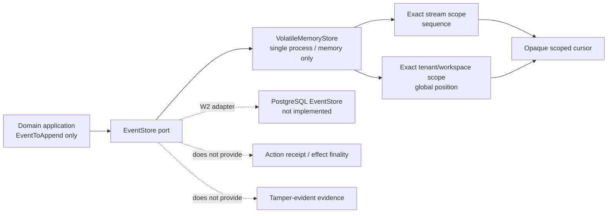

# Volatile Memory EventStore：精确重试、作用域游标与失败原子性

> 状态：W1 P1-7 的 Go port 与 deterministic contract fake 已实现并通过专项、race、全模块和 vet 门禁。
>
> 代码提交：`a4ac9bd`、`a0a8eea`、`034124f`、`b17bf1d`、`4a4aedb`、`9c6c457`、
> `f0040ea`、`0cec339`、`479bab5`、`51b5cb8`、`a472642`、`4118746`。
>
> 诚实边界：本阶段没有 PostgreSQL、磁盘持久化、跨进程事务、projection engine、SSE backfill+live、
> Action receipt、tamper-evident audit、backup/restore、HA 或 crash/reopen/kill-9 证据。

## 1. 结论

`apps/im-api/internal/events` 现在包含一个明确名为 `VolatileMemoryStore` 的单进程合同 fake。它冻结了：

- `EventStore` port 必须公开可检查的存储 characteristics；
- 整批 append 的 expected revision、exact retry、identity drift conflict 与全有或全无；
- `Sequence/GlobalPosition/RecordedAt` 只能由 store 分配；
- tenant、workspace presence/value、stream 精确作用域；
- stream/global 两类 keyset cursor 的 caller-provided deterministic namespace、query kind、scope 与位置绑定；
- 并发 append 的单一 stream owner、全 store 唯一 global position 与整批可见性；
- clock、context、validation、capacity、cursor 失败全部零写入；
- input、append result、replay result、stream/global page 全部深快照；
- unknown event schema 原样保留，测试 reducer 遇到不支持版本时停止，而 source event 不丢。

它只证明单进程、内存内的合同语义。新的 fake value 默认没有任何旧数据；同一测试 fixture 注入相同
cursor namespace ID、clock 输出和 append 调用序列时，可得到相同 StoredEvent 与 cursor。这里的
deterministic 不包括
模型、Tool、网络、外部系统、调度顺序或真实副作用的确定性重执行。

## 2. 一级调研如何改变实现

一级证据根仍是：

```text
/Users/lwblx/huapohen/agent/automation/2026/05_08/1/2output/more
```

本阶段使用固定链路：

```text
研究证据
  -> 产品硬需求
  -> 领域对象/API
  -> 安全控制
  -> 实施阶段
  -> 可复核验收证据
```

### 2.1 直接证据

| 一级报告 | 行号 | 证据事实 | 对 WanWork 的约束 |
|---|---:|---|---|
| `deepseek-harness/research_report.md` | 255-312 | model-visible 内容来自 Session log 投影；durable Session event 与 live Agent/Capability event 分域；并发 tool result 仍有 durable 顺序 | EventStore 只保存 durable-domain 事实；typing/presence/瞬时 progress 不偷混；store 分配稳定顺序 |
| 同上 | 543-573 | local Job 记录 process-local、重启即失，没有 cross-restart guarantee | in-memory fake 必须机械声明 volatile，不能因有接口就叫 durable scheduler/store |
| 同上 | 583-591 | Team mail 只宣称 process-local retry + target-session de-dup；task snapshot 使用 revision CAS | expected revision、exact retry、冲突和“不宣称跨进程 exactly-once”进入合同 |
| 同上 | 823-842 | 有 event log 不等于完整不可抵赖审计；生产仍需完整性、身份、时间源、远端存证、分类与访问控制 | fake characteristics 固定 `TamperEvident=false`，游标 checksum 不写成签名/MAC |
| `sandbase-harness/research_report.md` | 318-333 | EventLogger 生成 session seq；append-only API 仍可被 DB/文件权限主体改写 | store 独占 sequence，但不能据此宣称 WORM/tamper evidence |
| 同上 | 335-351 | SSE 先 subscribe+buffer、再 backfill、再 flush；所谓 replay 只是 event resume/trace backfill，不是 Agent deterministic replay | 当前只做 page/backfill；live bridge 竞态与 Agent re-execution 明确留后续 |
| 同上 | 353-363 | workspace snapshot 不回滚 Git、邮件、工单、云资源、DB 等外部动作 | event log 不能充当 Action receipt 或副作用 negative proof |
| `_portfolio/master_research_report.md` | 179-190 | append-only event/task log 反复用于流式 UI、恢复、审计和多 Agent 协作，但 schema、敏感字段、完整性、迁移仍未标准化 | Event spine 是底层硬需求；W1 冻结 port，W2 才实现持久 schema/migration |
| `agentspace/research_report.md` | 610-629 | provider 调用跨越本地事务，正确闭环需要 immutable intent、idempotency、durable receipt/reconcile | fake 不提供 Action receipt，不把 event append 冒充 provider finality |
| 同上 | 633-662 | 多种“审计/事件”记录不等于规范化 append-only、不可删改或合规保留 | 业务事件、普通 telemetry 和 tamper-evident evidence 分开 |
| 同上 | 2946-2948 | provider success 后、receipt 保存前 kill，应进入 unknown + read/reconcile，而不是盲重试 | Memory EventStore 不声称解决外部副作用一致性 |
| `tech-agent-security-governance/research_report.md` | 399-424 | 模型非确定、Tool 已有副作用、版本会漂移；exactly-once 通常只是幻觉 | “replay”限定为 event backfill/fixture simulation；业务 idempotency/receipt 留 Action Plane |
| 同上 | 450-456 | UI replay、deterministic simulation、live re-execution 是三类不同能力 | 文档和类型不把三者混写 |

### 2.2 研究到代码的硬映射

| 研究结论 | 产品硬需求 | Go 对象/API | 安全/正确性控制 | 验收证据 |
|---|---|---|---|---|
| durable 事实必须有稳定顺序 | caller 不能注入存储事实 | `EventToAppend`、`StoredEvent` | store 单临界区分配 sequence/global position/recordedAt | 单批连续、并发不同 stream 全局位置唯一 |
| process-local 不等于 durable | fake 必须可机械拒绝 | `StoreCharacteristics`、`StoreRequirements` | `EventStore.Characteristics()` 进入 port；durable/restart/tamper requirement 拒绝 fake；Action receipt 不属于该 port | `TestVolatileMemoryStoreDeclaresItsNonProductionBoundaries` |
| revision/CAS 是恢复基础 | 同 stream 只有 exact owner | `AppendBatch.ExpectedVersion` | replay 检查先于当前 revision；新请求再做 expected revision CAS | 64 路竞争 1 success、63 revision conflict |
| 去重必须绑定原意图 | exact retry 返回原事实，换意图冲突 | 内部 ordered append digest + retry receipt | scope、expected revision、有序 event digest、EventID/idempotency identity exact bind | subset/superset/reorder/header/payload/key drift 全拒绝 |
| durable/live 分域 | ephemeral UI 事件不冒充事实 | 当前 port 只有 append/page，没有 subscribe | 不实现 listener/live API，不伪造 SSE gate | 文档明确 W2/live adapter 边界 |
| replay 不等于重执行 | 只证明 event backfill | `ReadGlobalPage` + test-only pure reducer | unknown schema 返回 projector unsupported，但 source 原样可读 | 两种 page size 重建同一 fixture；unknown source 不丢 |
| event log 不等于证据 | fake 不提供 audit finality | characteristics 固定 false | 不提供 signed receipt、WORM、hash chain、retention claim | production requirement fail closed |

## 3. Port 与信任边界



调用方可提供 immutable event intent：schema、event/stream/tenant/workspace/actor、occurred time、causation/
correlation、idempotency identity 与 inline/reference payload。调用方不能提供：

```text
Sequence / GlobalPosition / RecordedAt
```

`OccurredAt` 是业务事实时间；`RecordedAt` 是 store 记录时间，二者不能互换。inline JSON 已在 port 层做
有界、重复 key 拒绝、整数-only canonicalization；大正文与二进制只允许 opaque reference + digest，不把
凭据或永久下载 token 放进 event。

## 4. Append 的原子算法

实现使用一个 store-owned mutex，把 batch 发布当作单一临界区：

```text
context precheck
  -> validate exact batch scope and bounds
  -> deep snapshot caller data with bounded context rechecks
  -> compute domain-separated ordered request digest
  -> lock
  -> context recheck
  -> exact replay or identity conflict
  -> expected revision check
  -> uint64 capacity check
  -> sample and validate cooperative context-aware clock once
  -> context pre-commit check
  -> build complete candidate StoredEvent batch
  -> publish stream/global/retry indexes together
  -> return deep snapshot
```

任一步失败都不会推进 stream slice、global slice、retry index、global position 或 recorded-time high-water。
查询与 append 共享同一锁纪律，读者只能观察整个 batch 之前或整个 batch 之后，不能看到前半批。

### 4.1 store-owned facts

同一 stream 当前版本为 `N`、batch 大小为 `K` 时：

```text
Sequence = N+1 ... N+K
GlobalPosition = currentGlobal+1 ... currentGlobal+K
RecordedAt = one normalized UTC clock sample for the whole batch
```

clock 为 zero、年份越界、低于 recorded-time high-water 或 panic 时返回固定 `ErrStoreClock`；相同时间允许，
全局位置负责 total order。exact replay 不再次读取 clock。clock 是 trusted fake dependency，必须及时返回并
合作响应 context；任意 Go callback 若忽略 context，fake 无法强杀它，这一点与 Plugin lifecycle deadline
边界相同。append snapshot 和 global scan 在有界循环中重查 context。

### 4.2 exact retry identity

内部 append receipt 绑定：

```text
tenant
+ workspace presence/value
+ stream
+ original expected revision
+ ordered [EventID, IdempotencyKey, DigestEventToAppend]
```

EventID identity 的范围是 tenant + workspace presence/value；idempotency key 的范围是 tenant + workspace
presence/value + stream。这样：

- 跨 tenant 或跨 workspace 的相同 ID 独立；
- 同一 workspace 中 EventID 不能换 stream 重用；
- idempotency key 可以在不同 stream 独立使用；
- subset、superset、reorder、部分旧/部分新、ExpectedVersion 漂移、EventID/key/header/payload 漂移全部
  `ErrIdempotencyConflict`；
- 完全相同 retry 即使当前 stream revision 已增加，也先返回首次 StoredEvent，`Replayed=true`；
- 冲突不消费 clock、sequence 或 global position。

这不是跨进程 exactly-once。fake 丢失进程内 map 后，旧 retry receipt 同样丢失。

## 5. Opaque cursor 的合同与边界

cursor 绑定：

```text
schema version
+ caller-provided deterministic cursor namespace
+ query kind: stream | global
+ tenant
+ workspace presence/value
+ stream (stream query only)
+ exclusive sequence/global position
+ domain-separated SHA-256 checksum
```

已冻结行为：

- `""` 是唯一开始位置；
- stream/global cursor 不可互换；
- tenant、workspace presence/value、stream 任一变化都 `ErrInvalidCursor`；
- 不同 cursor namespace 的 cursor 不可互换；
- truncated、oversize、unknown/duplicate JSON field、checksum drift、future position 全部失败关闭；
- cursor 不绑定 page limit，下一页可改变 limit；
- 有事件时 `Next` 指向最后一个返回事实；空尾页保持 `Next==After`；
- 尾 cursor 后续可继续轮询新 append；
- `WorkspaceID=nil` 表示 tenant-root 的精确作用域，不是“该 tenant 所有 workspace”。

这里的 checksum 不是 secret-key MAC、签名、authentication 或 authorization。它只冻结 fake 的严格解析与
误用检测；“opaque”只表示 caller 不应依赖编码格式，Base64 内字段不保密，调用方可以重新计算 checksum。
相同 namespace ID + 相同重建事件会有意复现旧 cursor，因此它也不是自动的 process incarnation fence；需要
拒绝旧 cursor 时必须注入新 namespace。它不能作为公网 bearer token。W2 production cursor 需要持久版本、
密钥轮换/签名或 server-side state、rollback/restore 语义和外部 API threat model。

## 6. 并发、作用域与不可变快照

### 6.1 并发结果

| 注入 | 结果 |
|---|---|
| 同 stream、同 expected revision、64 个不同请求 | 1 success，63 `ErrRevisionConflict`，clock 只调用 1 次 |
| 同 exact batch、64 路并发 | 1 fresh，63 replay；全部返回同一 StoredEvent 事实 |
| 同 identity、不同 Actor/content 并发 | 1 success，1 `ErrIdempotencyConflict` |
| 128 个不同 stream 并发 | 每个 stream 从 sequence=1 开始；global position 恰为 1..128 且唯一 |
| append 在 clock 处阻塞、32 个 reader 竞争 | 所有 reader 只看到完整三事件 batch，不出现部分可见 |
| 第二个 writer 等锁时 context canceled | 获取锁后再次检查，零写入 |

这些结果只证明同一 `VolatileMemoryStore` value 内的 mutex/race 合同，不证明跨进程、fork、HA、数据库
transaction 或 crash atomicity。

### 6.2 深快照

store 在入站 snapshot 和所有出站路径都复制：

- events slice；
- workspace/causation/idempotency/traceparent pointer；
- inline payload bytes 或 reference value；
- append/replay result；
- stream/global page。

测试会主动改写原 input、首次 result、payload 和 page，再次 replay/read 仍返回原事实。两个 reader 不共享
可变 backing storage。

## 7. Backfill 与 projection 的诚实边界

`0cec339` 增加的是 test-only pure fixture reducer；`479bab5` 进一步把 characteristics 精确命名为只有在
inputs、clock 输出和 call schedule 都相同时才 deterministic；`51b5cb8`～`4118746` 把 namespace、store
admission 和 cooperative context 边界改成可执行合同。相同 source events 分别按 page size 1 和 256 backfill，
得到相同 stream-version/global-order projection；遇到 schema version 99 时返回
`ErrProjectionUnsupported`，随后仍可从 store 原样读取该 source event。

它证明：

- page cursor 没有漏/重；
- store 没有重写 unknown event；
- 一个纯 reducer 可以从零状态消费同一事实序列。

它不证明：

- 已有生产 projection engine/checkpoint；
- unknown event 的业务迁移策略已经完成；
- backfill 与 live subscription 的竞态已经闭合；
- model/Agent/Tool 可按历史事件确定性重执行；
- 外部副作用会被回滚或避免重复。

## 8. 可复核测试

当前 `internal/events` 共 28 个 `Test*`，其中 MemoryFake 22 个，覆盖：

| 类别 | 代表测试 | 证明 |
|---|---|---|
| characteristics | `TestVolatileMemoryStoreDeclaresItsNonProductionBoundaries` | 空/unknown/矛盾/typed-nil 拒绝，production durability/tamper requirement 拒绝 fake；Action receipt 保持独立 port |
| append/retry | `...AppendOwnsFactsAndExactRetry`、`...RejectsRetrySubsetSupersetAndReorder` | 原事实 replay、所有 drift fail closed |
| atomic failure | `...InvalidBatchAndCapacityAreAtomic`、`...RevisionContextAndClockFailuresWriteNothing` | invalid/revision/cancel/clock/overflow 零 mutation |
| cursor/scope | `...PagesExactScopesWithoutGapOrDuplicate`、`...CursorBindsKindScopeAndNamespace` | no gap/dup、跨 scope/kind/namespace 拒绝 |
| immutable snapshot | `...ReturnsIndependentPageSnapshots` | caller 无法经 result/page 修改 store |
| concurrency | `...ConcurrentExpectedRevisionHasOneOwner`、`...ConcurrentStreamsShareOneGlobalOrder` | single owner、global uniqueness、race clean |
| whole-batch visibility | `...ReadersObserveWholeBatchAndCanceledWaiterWritesNothing` | reader 无部分 batch，cancel waiter 零写入 |
| cooperative context | `...ClockCanCooperateWithContextCancellation` | trusted clock 响应取消后返回 context error 且零写入 |
| backfill fixture | `...BackfillRebuildsFixtureProjectionDeterministically` | 相同 source、不同 page size 得到同一测试投影 |
| unknown schema | `...PreservesUnsupportedProjectionSourceEvent` | reducer 停止但 source event 原样保留 |

阶段门禁：

```bash
GOTOOLCHAIN=local GOPROXY=off GOSUMDB=off GOFLAGS=-mod=readonly \
  go test ./apps/im-api/... -count=1

GOTOOLCHAIN=local GOPROXY=off GOSUMDB=off GOFLAGS=-mod=readonly \
  go test -race ./apps/im-api/internal/events -count=3

GOTOOLCHAIN=local GOPROXY=off GOSUMDB=off GOFLAGS=-mod=readonly \
  go vet ./apps/im-api/...

git diff --check
```

全部通过。专项普通测试和 race 还以多次 `-count` 重跑，未发现数据竞争或不稳定失败。

## 9. 绝对不能从本阶段推导的能力

以下全部仍为 false：

- production-ready/durable event spine；
- PostgreSQL、数据库事务、outbox 或跨 aggregate 原子性；
- restart/crash/reopen/kill-9/backup/restore/HA；
- 跨进程或跨副本 exactly-once；
- tamper-evident、WORM、hash chain、签名时间戳或合规审计；
- Action receipt、provider finality 或 external effect negative proof；
- production projection engine/checkpoint/schema migration；
- SSE subscribe-before-backfill/live de-dup；
- deterministic Agent/model/tool/live replay；
- retention、encryption、deletion、legal hold 或 tenant key management；
- cursor authentication、authorization、unforgeability 或公网 bearer safety；
- 跨租户公开全局排序。

## 10. W2 PostgreSQL 交接门禁

W2 必须重新实现和证明，而不是复用 fake 的绿色测试冒充：

1. versioned stream/event/projection-checkpoint schema 与 immutable migration；
2. 单 stream expected revision 的真实数据库 transaction 和唯一约束；
3. batch events、stream revision、global order、outbox/checkpoint 的原子边界；
4. duplicate ACK loss、两连接竞争、事务 rollback 和 deadlock/retry 分类；
5. crash/reopen、kill-9、WAL/backup/restore 和 non-empty migration；
6. 从空 projection 读取 durable store 重建，并冻结 unknown version/migration 策略；
7. subscribe-before-backfill、buffer、flush、live de-dup 的 SSE/stream 竞态；
8. persistent cursor/wire version、签名/密钥轮换、restore epoch 与外部 API threat model；
9. row/tenant authorization、RLS 或等价控制及跨 tenant 负向语料；
10. payload reference、encryption、retention、deletion、legal hold、backup/restore policy；
11. 普通 business event、telemetry、security audit 与 tamper-evident evidence 分层；
12. Action Ledger 独立实现 intent/idempotency/receipt/unknown/reconcile，不能塞进通用 EventStore fake。

## 11. 下一小阶段

W1 的下一顺序是冻结 IM identity/conversation value contracts 与 strict provider metadata codec。它可以依赖
当前 EventStore port 作为未来事实边界，但不能把 volatile fake 接到生产 route，也不能跳过 W2 PostgreSQL
门禁。真实融云 outbound 继续关闭；飞书、企微、机器人和 webhook 继续禁止发送消息。
