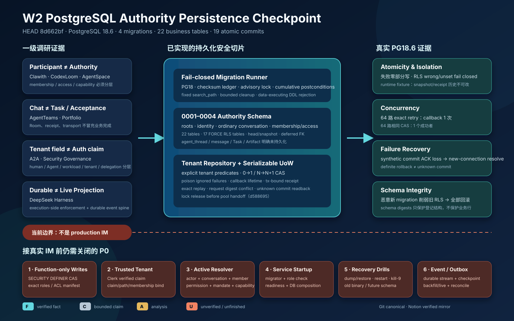

# PostgreSQL 权威持久化阶段检查点

> 历史检查点：本文冻结在 `8d662bf`、`0001–0004` 和本批 19 个小提交，不回写后续实现事实。
> `0005` function-only writes、exact access validator 与 PostgreSQL 18.6 新证据见
> [`34_postgres_function_only_writes_and_exact_access_checkpoint.md`](34_postgres_function_only_writes_and_exact_access_checkpoint.md)。

> 日期：2026-08-28（Asia/Shanghai）
>
> 分支：`dev_wanwork_quantum_entanglement`
>
> 代码基线：`8d662bf4faec1cfaa12b63f4dfc2132ae6869dbb`
>
> 本批提交范围：`8814e8d^..8d662bf`（19 个小提交）
>
> 一级研究根：
> `/Users/lwblx/huapohen/agent/automation/2026/05_08/1/2output` 与
> `/Users/lwblx/huapohen/agent/automation/2026/05_08/1/2output/more`
>
> 代码范围：`apps/im-api/internal/platform/postgres/migrations`、
> `apps/im-api/internal/platform/postgres/imstore`、`apps/im-api/internal/imstore`

## 1. 执行摘要



本阶段把上一检查点中的 IM 身份、普通会话、provider mapping、membership 和 access 纯值合同，向
PostgreSQL 权威持久化推进了一层。当前已经具备：

1. 只接受 PostgreSQL 18.x、带 checksum ledger、session advisory lock、累计 postcondition 的
   fail-closed migration runner；
2. `0001`～`0004` 四个 migration，共 22 张 `wanwork_im` 业务表；
3. identity、ordinary conversation、provider conversation binding、conversation membership、
   conversation access 和 tenant-scoped command receipt 的数据库约束；
4. typed tenant repository 与 revision CAS 合同；
5. serializable tenant Unit of Work、稳定幂等键、request/result SHA-256、exact replay 和 commit ACK
   丢失后的新连接回读；
6. PostgreSQL 18.6 下的真实 transaction、RLS、并发、rollback、unknown-commit 和 runtime-role
   负向测试。

这不是 W2 完成，更不是“原生 IM 已经可生产接入”。当前成立的是一个经过真实 PostgreSQL
验证的 authority persistence substrate。仍未成立的关键路径包括：受控数据库写函数与精确角色/ACL
manifest、Clerk verified claim 到 trusted tenant context、action-time authority resolver、服务启动时
migration/DB composition、PostgreSQL event store/outbox、message/agent thread、融云 adapter 和完整
Task/Artifact/Acceptance 闭环。

### 1.1 当前能诚实宣称什么

| 标记 | 当前结论 |
|---|---|
| `[F]` | 4 个 migration 在本地 PostgreSQL 18.6 被实际应用；22 张业务表被创建；17 张 tenant-scoped 表启用并强制 RLS。 |
| `[F]` | migration catalog checksum、ledger 连续性、旧版本累计 postcondition、固定 `search_path` 和 token-aware DDL allowlist 均有代码与测试。 |
| `[F]` | repository 的每条读写 SQL 都显式携带 tenant predicate，create 只允许 `0→1`，update 只允许 `N→N+1`。 |
| `[F]` | 64 路相同幂等请求只执行一次 callback；64 路相同 CAS 只有一个成功者；已在真实 PostgreSQL 测试中验证。 |
| `[F]` | synthetic commit ACK loss 会隔离原连接并用新连接回读 receipt；能读到时收敛为 `ResolvedAfterUnknown=true`。 |
| `[C]` | 所有保证只限定在当前登记的 PostgreSQL schema、四类 conversation authority repository、同一数据库 transaction 和测试过的 runtime-role fixture。 |
| `[A]` | 当前分层为后续 IM authority resolver 和 durable event spine 提供了正确底座，但不能替代它们。 |
| `[U]` | dump/restore、kill-9、旧 binary 对 future schema、角色恢复、真实多实例部署和生产连接故障尚未形成完整证据。 |

### 1.2 当前绝不能宣称什么

- 不能宣称原生 IM、融云入站/出站或 Clerk 认证已经生产完成；
- 不能宣称六个 access boolean 已构成 action-time authorization；
- 不能宣称 command receipt 提供 provider ACK、完整结果回放、不可抵赖证据或 exactly-once；
- 不能宣称 provider binding 证明融云群真实存在、属于当前 tenant 或消息已投递；
- 不能宣称 RLS 的 tenant GUC 自身证明调用者属于该 tenant；
- 不能因为表名含 `snapshot` 就宣称拥有 DB credential 的任意代码无法改写历史；
- 不能宣称 schema digest 保护业务数据行、event payload 或 receipt 内容；
- 不能宣称 `agent_thread`、message、Task、Artifact、Acceptance 或生产 event store 已持久化。

## 2. 调研不是附录：证据如何改变本阶段设计

本阶段继续使用固定证据链：

```text
一级调研 [F]/[C]/[A]/[U]
  -> 产品不变量
  -> 数据库对象与 transaction seam
  -> 运行时 enforcement
  -> 失败矩阵
  -> 可复核证据
```

其中 `[F]` 是固定源码、规范或可复现实验事实，`[C]` 是厂商/维护者主张，`[A]` 是分析判断，
`[U]` 是未知。`[C]/[A]` 不得被改写成已经交付的产品能力。

### 2.1 一级证据到本批实现的硬映射

| 一级证据 | 证据口径 | 设计决策 | 当前已落实 | 仍未落实 |
|---|---|---|---|---|
| `clawith/research_report.md:148-152,196-226,493-503,543-557,599-611` | `[F]/[A]` 人与 Agent 可统一为 Participant，但 tenant/member/Agent 状态必须在发送点独立重验；IM provider 是 projection。 | Actor、tenant membership、conversation membership、access、provider mapping 分表，不互相授予权限。 | identity/conversation/membership/access/provider-binding schema 与 repository seam。 | active resolver、installation/mandate/budget 和发送点重验。 |
| `_portfolio/master_research_report.md:220-226,648-671` 与 `agentteams/research_report.md:250-282` | `[A]` Room/chat 不等于 Task、Artifact 或 Acceptance authority。 | 本批只持久化普通会话及其 authority seam，不把 command receipt 或会话状态冒充业务完成。 | ordinary direct/group、membership/access 和 digest receipt。 | Task/Attempt/Action/Artifact/Acceptance/event spine。 |
| `codexloom/research_report.md:216-234`、`agentspace/research_report.md:739-759` | `[A]` membership/role 声明不自动开放工具、知识或外部执行；adapter 能启动不证明语义完整。 | access projection 与 capability/mandate/adapter acceptance 分离。 | 六个 immutable access projection 字段；provider binding 只做映射。 | action-time policy、capability assignment、provider sandbox/readback。 |
| `deepseek-harness/research_report.md:255-312,543-591,823-842` | `[F]/[A]` durable/live 分域，可靠恢复依赖 durable event spine 和 execution-side enforcement。 | 本批不把进程内 event fake、数据库 receipt 或 UI visibility 当成 durable event system。 | transaction seam 和未来 event store 的 PostgreSQL 基础。 | event stream/event/outbox/checkpoint、backfill+live 和 crash replay。 |
| `protocol-a2a/research_report.md:425-457,480` | `[A]` payload 中出现 tenant 字段不等于认证或隔离，extension 可被伪造。 | repository 显式 tenant predicate；GUC 只作纵深防线。 | typed tenant + SQL predicate + FORCE RLS。 | Clerk verified claim、claim/path mismatch admission、trusted tenant derivation。 |
| `tech-agent-security-governance/research_report.md:187-231,315,442-444` | `[A]` human、Agent、workload、tenant、delegation、secret 必须分层。 | identity schema 不把 `agt_`、`sys_`、`svc_` 前缀当作可执行 authority。 | human principal、Actor、tenant membership、provider actor binding 分层。 | workload/delegation/installation/secret lease/action executor。 |

### 2.2 明确没有照搬的做法

- 没有把群成员身份直接转成工具、文件、知识或执行权限；
- 没有把 provider metadata、群 ID 或 HTTP 成功当成平台 authority；
- 没有把 process-local receipt 当成 durable event spine；
- 没有把 `exactly-once` 当作宣传词。当前只证明同一服务数据库命令在特定 transaction/receipt
  合同下的 exact replay；外部 effect 仍必须按 at-least-once + idempotency + unknown/reconcile 设计；
- 没有因为 schema digest、RLS 或表名存在就贴“生产不可篡改”标签。

## 3. 数据库对象清单

### 3.1 Migration 总览

| 版本 | 名称 | 主要对象 | 当前边界 |
|---:|---|---|---|
| `0001` | `authority_roots` | `provider_realms`、`tenants`、`workspaces` | 只建立 provider realm 与 tenant/workspace 根；不包含 credential、endpoint 或 provider capability。 |
| `0002` | `identity_authority` | human principal、Clerk binding、Actor、tenant membership、provider actor binding 的 head/snapshot | 分离全局 human principal 与 tenant Actor；prefix/type 仍不授予执行权限。 |
| `0003` | `conversation` | conversation 与 RongCloud conversation binding 的 head/snapshot | 只支持 ordinary `direct/group`；故意拒绝 `agent_thread`。 |
| `0004` | `conversation_authority` | membership/access head/snapshot、`tenant_command_receipts` | membership、access、receipt 互相独立；receipt 不是 provider receipt。 |

业务 schema 一共 22 张表：

```text
wanwork_im
├── roots (3)
│   ├── provider_realms
│   ├── tenants
│   └── workspaces
├── identity authority (10)
│   ├── human_principal_{heads,snapshots}
│   ├── human_identity_binding_{heads,snapshots}
│   ├── actor_{heads,snapshots}
│   ├── tenant_membership_{heads,snapshots}
│   └── provider_actor_binding_{heads,snapshots}
├── conversation (4)
│   ├── conversation_{heads,snapshots}
│   └── provider_conversation_binding_{heads,snapshots}
└── conversation authority (5)
    ├── conversation_membership_{heads,snapshots}
    ├── conversation_access_{heads,snapshots}
    └── tenant_command_receipts
```

另有 `wanwork_meta.schema_migrations` 作为 migration ledger。它不属于业务 authority schema。

### 3.2 Scope 与 RLS

17 张 tenant-scoped 表启用 `ENABLE ROW LEVEL SECURITY` 与 `FORCE ROW LEVEL SECURITY`，每张表都使用
exact tenant policy：

```sql
USING (tenant_id = current_setting('wanwork.tenant_id', true))
WITH CHECK (tenant_id = current_setting('wanwork.tenant_id', true))
```

这能证明：当连接以受 RLS 约束的角色运行且 GUC unset/wrong 时，tenant row 不可见或不可写。

它不能证明：调用者有权选择某个 tenant。当前 UoW 接受已经类型化的 `TenantID` 并设置 GUC；把 Clerk
verified claim、HTTP path 和平台 membership 收敛为 trusted tenant context 仍是独立的 P0 admission。

### 3.3 Head/Snapshot 约束

head 持有 current revision，snapshot 持有版本内容；head 通过 `DEFERRABLE INITIALLY DEFERRED` 的
current-snapshot FK 指向同一 aggregate 的当前版本。repository 采用同一 transaction 内：

```text
create: INSERT head revision=1
        INSERT snapshot revision=1

update: UPDATE head
        WHERE current_revision = expected
        SET current_revision = expected + 1
        INSERT snapshot revision = expected + 1
```

repository 强制 create `0→1`、update `N→N+1`，并把 CAS miss 映射为稳定
`ErrRevisionConflict`。但 runtime role 当前仍需要直接 `INSERT` snapshot 和 `UPDATE` head，因此拥有该
credential 的其他代码可以绕过 repository。这正是下一批 `0005` 受控写函数和角色 ACL 必须关闭的
边界。

### 3.4 Identity 不变量

- human principal 是全局对象，Clerk binding 以 `(provider, realm, subject)` 为键；
- Actor 是 tenant-scoped 对象，`usr_ | agt_ | sys_ | svc_` 与 subject type 精确匹配；
- tenant membership 当前只连接 human principal 与 `usr_` Actor；
- provider Actor binding 以 provider realm 隔离外部身份；
- active uniqueness、revision、status 与 deferred current-snapshot FK 由数据库约束；
- subject prefix、binding 或 Actor row 都不能单独证明 conversation membership、Agent installation、
  workload identity 或 delegation。

### 3.5 Conversation 不变量

- 当前持久层只接受 ordinary `direct | group`，明确拒绝 `agent_thread`；
- `workspace_id` 允许 NULL，与 Go 值合同中 nil workspace 一致；
- conversation type 在 head 中冻结，历史 revision 不能从 group 漂移为 direct；
- RongCloud provider conversation binding 只能映射 group；
- provider conversation ID 当前要求等于平台 conversation ID；
- active `(provider, realm, provider_conversation_id)` 跨 tenant 唯一，防止同一真实群被两个 tenant
  同时宣称；
- binding 只证明平台数据库中的映射，不证明融云群存在、成员一致或写入已 ACK。

### 3.6 Membership 与 Access

- ordinary conversation member 只允许 `usr_` 和 `agt_`，拒绝 `sys_` 与 `svc_`；
- membership role 为 `owner | manager | member`，status 为 `active | removed`；
- access 必须引用已有 membership head；
- access snapshot 使用六个 immutable boolean projection：`can_read`、`can_send_message`、
  `can_manage_members`、`can_manage_conversation`、`can_invoke_agent`、
  `can_publish_artifact_reference`；
- 六个 boolean 全 false 是显式撤权快照，不是删除历史；
- `can_invoke_agent` 和 `can_publish_artifact_reference` 当前只是冻结词汇，不是生产 action gate。

数据库 FK 只保证 access 对应一个 membership head，不保证 current membership snapshot 是 active。
因此移除成员的 use case 必须在同一 UoW 内同时追加 `membership=removed` 与 all-false access revision；
授权读取仍必须组合 current membership active 与目标 permission bit，不能只查 access row。

真正执行 `invoke_agent` 还必须组合 conversation/actor/membership active、Agent release/installation、
mandate、capability、budget、data route、taint 和 action-time policy；真正发布 Artifact ref 还必须组合
Artifact immutable digest、scan、Acceptance 和显式 publish authorization。

## 4. Migration runner 的失败关闭边界

### 4.1 Catalog 与 ledger

- migration version 必须从 1 连续增长，name 使用受限 grammar；
- Up/Down SQL 使用 domain-separated SHA-256 checksum；
- catalog 每次返回独立副本，调用方不能篡改全局定义；
- ledger 必须是 catalog 的精确连续前缀；future version、gap、name drift、checksum drift 全部拒绝；
- ledger 自身的 relation、column、constraint、owner、PUBLIC ACL 等关键形状经过精确 postcondition。

### 4.2 PostgreSQL 版本与并发

- `server_version_num >= 180000 && < 190000`，其他 major fail closed；
- 使用 session advisory lock 串行化 migrator；
- lock acquisition 结果未知、unlock 失败、panic 或 commit outcome unknown 时隔离并关闭连接；
- unlock、rollback、close 都使用 5 秒有界清理 context。

### 4.3 累计 postcondition

每个新 migration 在写 ledger 前，不仅检查自己的 postcondition，而是累计检查 `1..currentVersion`。
真实 PostgreSQL 测试注入了一个“新 migration 自己合法，但禁用旧 `actor_heads` RLS”的恶意版本；
预期结果是整个 migration transaction 回滚、旧 schema 保持、ledger 不增长。

该门禁避免未来 `0005` 通过“自己满足新 digest”来静默削弱 `0001`～`0004`。

### 4.4 固定执行环境

每个 ledger bootstrap/migration transaction 设置：

```sql
SET LOCAL search_path = pg_catalog;
```

真实测试使用 hostile ambient search path，确认 migration 仍命中显式 schema 与 `pg_catalog`。

### 4.5 Token-aware DDL allowlist

SQL policy 会跳过 line/block comment、single/double quote 和 dollar quote，然后按 statement head
allowlist。当前只允许：

- `ALTER TABLE`；
- `CREATE TABLE|SCHEMA|INDEX|UNIQUE INDEX|POLICY`；
- `DROP TABLE|SCHEMA|INDEX|POLICY`。

transaction control、`SET/RESET`、`set_config`、`DO`、function、`GRANT`、view 以及未闭合
comment/quote/dollar quote 默认拒绝。`8d662bf` 进一步扫描每条语句的全部非 literal token，拒绝
`CREATE TABLE AS SELECT`、危险 `DEFAULT`、`set_config`、`pg_sleep`、file/backend-control 等已知
data-executing form；`ALTER TABLE ... DEFAULT` 当前全部拒绝，`CREATE TABLE DEFAULT` 只允许 literal 或
`clock_timestamp()`。

该 lexer 仍不是通用 SQL parser，也不是不可信 SQL 沙箱；嵌套表达式的完整语义不能仅靠 token policy
证明。它的目标是把 source-controlled migration 语言压缩为当前所需的可审计 DDL 子集，并由 transaction
rollback 与累计 postcondition 兜底。未来要引入受控 function 时，不能直接放开所有
`CREATE FUNCTION`，必须对函数定义、owner、security、search_path、ACL 和 body 建立专门 manifest。

### 4.6 Schema digest 的真实含义

当前冻结三个 table-schema digest：

```text
identity authority:
9a178617cbb463df31450f4302454ae4eba101dd2d2f8b2567dad7f49088c5d5

conversation:
17002b4c0b7a757e23a96418634af02c517aa85a4bae415175ab33e75cff8457

conversation authority:
b500175ab19a74fdd1f4cf810906318f9d76e1f1113cad59ec9cd0aa1dde6d34
```

digest 覆盖受清单管理表的 relation、column、constraint、index、policy 与一部分 ACL/trigger/rewrite/
publication 负向形状。它不覆盖业务行，也尚未冻结所有 named role/table/schema/function ACL。这一限制
必须保留在所有对外文档中。

## 5. Repository 合同

### 5.1 Typed port

`internal/imstore` 冻结：

- `SHA256Digest`：只接受 64 字节 lowercase canonical hex；
- `CommandIdentity`：`kind + idempotency key + request digest`；
- `CommitReceipt`：result digest、commit time、fresh/replay/unknown-resolution 状态；
- `ConversationRepository`；
- `ConversationAuthorityRepository`；
- `TenantRepositories`；
- `TenantUnitOfWork.Read/Execute/Resolve`；
- 稳定错误：invalid、not found、revision conflict、idempotency conflict、integrity、unavailable、
  commit unknown、unsupported、transaction closed。

port 不暴露 `pgx.Tx`，避免 use case 自由执行 SQL 或控制 transaction。

### 5.2 Tenant 绑定

repository instance 在构造时绑定一个 typed tenant。每条 SQL 同时满足：

1. key/reference 的 tenant 必须与 repository tenant 相同；
2. SQL `WHERE`/`INSERT` 显式包含 tenant；
3. transaction 设置 tenant GUC，RLS 再做纵深防御；
4. callback 返回后 repository 原子失效；escaped repository 返回 `ErrTransactionClosed`。

这防止把连接池残留 GUC 或调用方传错 reference 当作唯一隔离边界。

### 5.3 Poison-on-ignored-error

repository 会记录第一次 CAS、完整性、read corruption 等错误。即使 callback 故意忽略错误并返回
成功 digest，UoW 在 commit 前仍读取 poison 状态并回滚；不会写出“业务状态没成功但 receipt 成功”的
假象。

`ErrNotFound` 等真实 read 失败也不能被 callback 吞掉后继续提交另一半状态。

### 5.4 当前支持与拒绝的对象

| 对象 | Repository 能力 | 当前拒绝 |
|---|---|---|
| Conversation | current read、create/update CAS | `agent_thread`、跨 tenant、revision skip/rewind、type drift |
| Provider conversation binding | current read、create/update CAS | 非 RongCloud、非 group、跨 tenant、active subject conflict |
| Conversation membership | current read、create/update CAS | system/service participant、跨 tenant、无 conversation/Actor |
| Conversation access | current read、create/update CAS | 无 membership、跨 tenant、revision drift |

identity schema 当前已有 migration/test，但尚未暴露对应 production repository；它不能被列为已完成的
服务读写能力。

## 6. Tenant Unit of Work 与幂等收敛

### 6.1 写路径

```text
typed TenantID + CommandIdentity
  -> acquire dedicated pool connection
  -> session advisory lock(tenant, kind, idempotency key)
  -> BEGIN SERIALIZABLE
  -> SET LOCAL search_path + tenant GUC
  -> read existing receipt
     ├── same request digest -> exact replay, callback 不执行
     └── different request digest -> ErrIdempotencyConflict
  -> execute callback with tx-bound repositories
  -> reject callback error or repository poison
  -> INSERT final receipt once
  -> COMMIT
     ├── definite rollback -> unavailable, no receipt
     └── unknown outcome -> quarantine original connection + new connection Resolve
```

advisory lock 在 `BEGIN SERIALIZABLE` 前获取，避免等待者拿着 stale snapshot 进入 transaction。lock key
对 tenant、command kind、idempotency key 做 domain-separated SHA-256 后取 64-bit。

### 6.2 Receipt 语义

`tenant_command_receipts` 的主键是 `(tenant_id, command_kind, idempotency_key)`，内容保存
`request_sha256`、`result_sha256` 和 `committed_at`。

它证明的是：在当前数据库内，同一 tenant command identity 对应的 mutation transaction 与最终 digest
一起提交；exact retry 可以返回同一个 digest，不再次执行 callback。

它不保存 response body、event sequence、Artifact bytes 或 provider receipt，因此：

- 不提供完整结果回放；
- 不证明外部 side effect exactly-once；
- 不证明消息到达 provider；
- 不提供不可抵赖签名；
- 不替代 audit/evidence ledger；
- 不替代 outbox。

`result_sha256` 也不能自行重建 typed result。command kind 与 request/result digest 的 canonicalization
必须版本化；unknown/replay 后，上层还需按 typed aggregate reference 回读 current state 并做 revision/
integrity 校验，不能仅凭 digest 宣称业务结果已经恢复。

### 6.3 Commit outcome unknown

若 commit 返回一个不能证明 definite rollback 的错误，UoW：

1. 不在原连接上猜测 transaction 状态；
2. hijack 并关闭原连接；
3. 通过 pool 获取新连接；
4. 用相同 tenant/command identity 回读 receipt；
5. 找到且 request digest 相同时，返回 replayed + resolved receipt；
6. 找不到时返回 `ErrCommitOutcomeUnknown`，不盲重试 mutation。

synthetic ACK-loss 测试在真正 commit 后人为返回错误，验证新连接回读能收敛为成功。

### 6.4 为什么没有把 EventStore 塞进 transaction

现有 W1 `EventStore` 是 volatile contract fake，没有 tx-bound PostgreSQL implementation。若当前在
repository commit 后再 append event，会产生业务状态已提交但 event 丢失的 crash gap；若先 append fake
再 commit DB，则会产生 event 存在但业务状态回滚的反向 gap。

因此本批明确不做伪双写。下一步必须以同一 PostgreSQL transaction 内的 event store/outbox 或经过证明的
transactional handoff 关闭这个缺口。

## 7. 真实 PostgreSQL 18.6 验证证据

临时实例：PostgreSQL `18.6`，loopback 端口 `55488`。实例与 data root 只用于本机测试，不进入 Git。

### 7.1 已执行命令

```bash
WANWORK_TEST_POSTGRES_ADMIN_URL='postgresql://<local-user>@127.0.0.1:55488/postgres?sslmode=disable' \
  go test -count=1 ./internal/platform/postgres/migrations

WANWORK_TEST_POSTGRES_ADMIN_URL='postgresql://<local-user>@127.0.0.1:55488/postgres?sslmode=disable' \
  go test -race -count=1 ./internal/platform/postgres/migrations

WANWORK_TEST_POSTGRES_ADMIN_URL='postgresql://<local-user>@127.0.0.1:55488/postgres?sslmode=disable' \
  go test -count=1 ./internal/platform/postgres/imstore

WANWORK_TEST_POSTGRES_ADMIN_URL='postgresql://<local-user>@127.0.0.1:55488/postgres?sslmode=disable' \
  go test -race -count=1 ./internal/platform/postgres/imstore

go vet ./internal/platform/postgres/migrations
go vet ./internal/platform/postgres/imstore
```

以上均通过。报告不记录任何 API Key 或外部服务 credential。

### 7.2 Migration 失败矩阵

- fresh apply 与 repeat apply；
- migration checksum drift、ledger gap/future version；
- ledger relation/column/constraint/owner/PUBLIC ACL drift；
- identity/conversation/authority schema digest；
- 旧 RLS 被新 migration 削弱时累计 postcondition 回滚；
- hostile ambient search path；
- 两个 migrator 串行；
- lock acquisition outcome unknown、unlock/panic/commit unknown 时连接隔离；
- RLS unset/wrong tenant fail closed；
- type/status/prefix/revision/FK/active uniqueness/跨 tenant 负向矩阵；
- DownSQL 只在 disposable database 显式测试，不由 production runner 自动执行。

### 7.3 Repository/UoW 失败矩阵

- fresh、exact replay、same key different request digest；
- Conversation/provider binding/membership/access 同 transaction 写入与 read round-trip；
- callback error 导致零部分写、零 receipt；
- callback 忽略 CAS/read/integrity error 时 poison 导致回滚；
- escaped repository 与 panic 后 repository 均失效；
- 64 路 exact retry：callback 只执行一次；
- 64 路相同 create CAS：只有一个 writer 成功；
- synthetic commit ACK loss：新连接 receipt readback；
- definite rollback：无业务状态、无 receipt；
- `NOSUPERUSER NOBYPASSRLS NOINHERIT` runtime role 下，snapshot/receipt 的
  `UPDATE/DELETE/TRUNCATE` 均返回 SQLSTATE `42501`。

最后一条只证明这些操作在当前 grant 下被拒绝。runtime 仍直接拥有完成 repository CAS 所需的 head
写和 snapshot insert 权限；尚不能说 credential 被限制到固定 command function。

## 8. 19 个小提交台账

| Commit | 内容 |
|---|---|
| `8814e8d` | checksummed authority-root migration |
| `9f72aa5` | fail-closed PostgreSQL migration runner |
| `eac2cbb` | migration postcondition verification |
| `457a0e1` | identity authority migration |
| `d3915ca` | identity authority PostgreSQL boundary tests |
| `54f2ea0` | ordinary conversation migration |
| `1b9047b` | conversation routing/type/binding boundary hardening |
| `371664e` | conversation isolation PostgreSQL tests |
| `c84f363` | conversation participant restriction |
| `8a6e509` | conversation authority migration |
| `9c4a374` | conversation authority PostgreSQL tests |
| `24561cc` | typed tenant IM store contracts |
| `bd60371` | cumulative migration invariant verification |
| `4afe28d` | token-aware atomic migration DDL allowlist |
| `69a3597` | tenant-bound PostgreSQL repositories |
| `bf4c5d1` | poison ignored repository read failures |
| `09511ef` | idempotent PostgreSQL tenant Unit of Work |
| `d588695` | receipt conflict 路径先释放 advisory lock，再交还 pool connection 并 resolve |
| `8d662bf` | 拒绝 data-executing migration DDL form 与危险 default expression |

该范围共修改 29 个文件，新增 7,626 行、删除 1 行。每个阶段性改动独立提交，并已推送到远端同名
分支；本报告产生后的文档提交另行记录。

## 9. 当前 P0 与顺序

### P0-1：受控数据库写函数与精确角色/ACL manifest

必须先完成，不能只靠 Go repository 约定：

1. non-login owner/migrator/runtime 角色分离；
2. 固定 `SECURITY DEFINER` revision write functions；
3. 函数体强制 tenant、expected revision、next revision、head/snapshot 一致和 receipt 原子写；
4. runtime 只获 `EXECUTE` 与必要 `SELECT`，不获 head `UPDATE`、snapshot `INSERT`、schema `CREATE`；
5. 冻结 function definition、owner、`prosecdef`、`proconfig/search_path`、volatility、PUBLIC/named ACL；
6. 冻结 role 的 `rolsuper/rolbypassrls/rolinherit/rolcanlogin`、owner membership 和 exact grants；
7. 增加绕过 repository、named grant、TRUNCATE、schema CREATE、owner membership、BYPASSRLS、
   malicious function replacement 负向测试。

### P0-2：Trusted authenticated tenant context

Clerk JWKS verified claim、HTTP path tenant、external human binding 和 active tenant membership 必须在进入
UoW 前收敛；claim/path mismatch、revoked binding、suspended principal、removed membership 一律拒绝。
tenant GUC 不接受客户端自报。

### P0-3：Active authority resolver

最小 ordinary IM action gate：

```text
authenticated human/workload
  + tenant active
  + Actor active
  + Conversation active
  + ConversationMembership active
  + explicit ConversationAccess bit
  + current revision / no held-draft drift
```

Agent invoke/publish 还必须叠加 installation、release、mandate、capability、budget、Artifact acceptance 和
data-route/taint policy。resolver 必须在 action time 执行，不能只在页面隐藏按钮。

### P0-4：Migration/service startup composition

当前 production `cmd/im-api/main.go` 尚未把 migration runner、pool、UoW、readiness gate 和 shutdown
组合起来。DB-backed route 不得在 migration/postcondition/role manifest 未通过时 ready。

### P0-5：恢复与版本演练

- dump/restore 后 schema/role/function manifest 回读；
- process restart、DB restart、network break、kill-9；
- old binary 遇到 future schema 必须拒绝 ready；
- commit unknown、pool reuse、role restoration 和 backup encryption/runbook；
- evidence 中不出现 credential。

### P0-6：PostgreSQL event store/outbox/checkpoint

必须实现 expected-revision stream append、global position、projection checkpoint、transactional outbox、
backfill+live、unknown event preservation 和 crash/reopen/restore 测试。command receipt 不能代替这一层。

### 后置

`agent_thread`、message/reaction/read state、RongCloud adapter、Task/Attempt、Artifact/Acceptance 在上述
P0 seam 稳定后增量接入。这样避免将真实 IM 流量压到仍可被 DB credential 绕过的 authority 基础上。

## 10. 阶段判定

| 维度 | 状态 | 说明 |
|---|---|---|
| Migration catalog/runner | 已完成当前版本 | PostgreSQL 18.x、checksum、lock、累计 postcondition、DDL allowlist；未来 function/role manifest 仍需扩展。 |
| Authority schema 0001-0004 | 已完成当前版本 | roots、identity、ordinary conversation、membership/access/receipt；不含 message/thread/Task。 |
| Repository/UoW | 已完成当前版本 | conversation authority transaction、CAS、idempotency、unknown readback；identity repository 未完成。 |
| Database credential containment | 未完成 P0 | runtime 仍能直接执行 repository 所需 table writes。 |
| Authenticated tenant admission | 未完成 P0 | 尚未接 Clerk verified claim。 |
| Action-time authorization | 未完成 P0 | access 还是 projection vocabulary。 |
| Durable event/outbox | 未完成 P0 | W1 memory fake 和 command receipt 均不能代替。 |
| Provider truth | 未开始 | 未连接融云 sandbox 或 production outbound。 |
| Production readiness | 未达到 | 当前是可复核工程检查点，不是商用发布。 |

最终结论：`8d662bf` 是一个值得保留和远端备份的 W2 PostgreSQL authority persistence 检查点；它已
把大量“靠调用约定”的风险压进 schema、repository 和 transaction，但数据库 credential containment、
authenticated tenant admission、action-time resolver、service startup 与 durable event/outbox 仍是接入
真实 IM 前的硬门槛。

## 11. 复核入口

- Migration catalog：`apps/im-api/internal/platform/postgres/migrations/catalog.go`
- Runner：`apps/im-api/internal/platform/postgres/migrations/runner.go`
- SQL policy：`apps/im-api/internal/platform/postgres/migrations/sql_policy.go`
- Postconditions/digest：`apps/im-api/internal/platform/postgres/migrations/postconditions.go`、
  `schema_digest.go`
- SQL：`apps/im-api/internal/platform/postgres/migrations/sql/0001_*.sql`～`0004_*.sql`
- Store port：`apps/im-api/internal/imstore/contract.go`
- Repository：`apps/im-api/internal/platform/postgres/imstore/repositories.go`
- Unit of Work：`apps/im-api/internal/platform/postgres/imstore/uow.go`
- 真实 PostgreSQL tests：migration 目录的 `*_integration_test.go` 与
  `imstore/uow_integration_test.go`

本报告是 Git canonical evidence。Notion 只在本批 Git 文档提交、推送并远端回读后同步；同步完成必须
再次 fetch/readback，不能仅以工具返回成功冒充内容一致。
