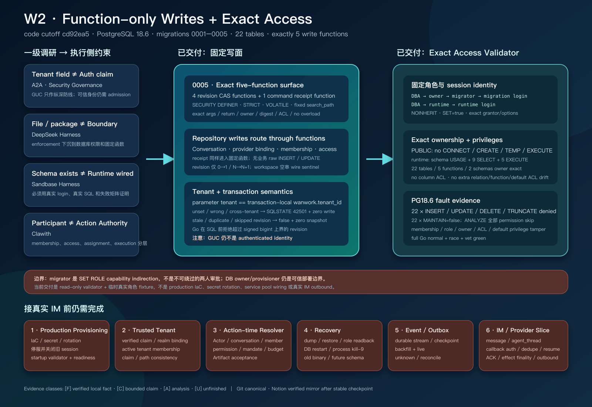

# PostgreSQL Function-only Writes 与 Exact Access 阶段检查点

> 日期：2026-08-28（Asia/Shanghai）
>
> 分支：`dev_wanwork_quantum_entanglement`（本报告不改变 `main`）
>
> 代码基线 / HEAD：`cd92ea56493b43889f5165892b40ec36e958d44a`
>
> 本批提交范围：`5fa2456^..cd92ea5`（30 个小提交）
>
> 上一历史检查点：`analysis_report/research/33_postgres_authority_persistence_checkpoint.md`
> （保留原样；本文件是增量检查点，不覆盖 Topic 33）
>
> 一级研究根：
> `/Users/lwblx/huapohen/agent/automation/2026/05_08/1/2output` 与
> `/Users/lwblx/huapohen/agent/automation/2026/05_08/1/2output/more`
>
> 主要代码范围：`apps/im-api/internal/platform/postgres/migrations`、
> `apps/im-api/internal/platform/postgres/imstore`、`apps/im-api/internal/imstore`

阶段结构图（一级调研约束、五函数写面、exact access、PostgreSQL 18.6 实证与剩余生产 gate）：



## 1. 执行摘要

Topic 33 的结论是：PostgreSQL authority persistence substrate 已经存在，但 runtime credential 仍能直接
`INSERT/UPDATE` head/snapshot/receipt 表，因此 repository 中的 successor-only CAS、append-only snapshot 与
tenant check 可以被同一凭据下的任意 SQL 绕过。

本阶段针对这个具体缺口完成了两层收口：

1. migration `0005_function_only_writes` 增加五个固定 `SECURITY DEFINER` 写函数；conversation、provider
   binding、membership、access 与 command receipt repository 已全部改为调用固定函数，而不是发送业务 raw
   table write；
2. `AuthorityAccessManifest` 把 database owner、owner/migrator/runtime group role、显式 migration/runtime
   login、membership grantor/options、数据库/schema/table/function/default privilege 冻结为 exact manifest，
   并在 PostgreSQL 18.6 真实登录连接上验证允许面与拒绝面。

当前因此可以成立一个更窄、更准确的结论：

> 对当前五条 ordinary conversation authority 写路径，测试中的 runtime login 必须先显式
> `SET ROLE runtime`，随后只能通过五个登记函数写入；它不能直接修改 22 张 authority 表，也不能获得未登记
> 的 read、`MAINTAIN`、DDL、TEMP、owner 或 migrator 能力。函数与角色/ACL 漂移会被 exact comparator 拒绝。

这个结论仍然不是“生产 IM 已完成”，也不是“完整多租户授权已完成”。角色创建、database ownership 转交、
login/password/secret rotation、startup/readiness validator、旧 session cutover 目前只有代码合同和测试 fixture，
没有 production IaC 与生产组合。trusted tenant、action-time resolver、durable event/outbox、恢复演练和 IM
outbound 仍未交付。

### 1.1 证据口径

全文使用四类标记，避免把研究判断、代码存在和真实运行混成同一件事：

| 标记 | 含义 | 本报告的使用边界 |
|---|---|---|
| `[F]` | 可复核事实 | 固定源码、git 提交、PostgreSQL catalog 查询或本次实际测试结果。 |
| `[C]` | 有条件结论 | 只有在当前数据库、当前登记对象、列出的连接角色与测试前提下成立。 |
| `[A]` | 分析判断 | 从一级调研和当前实现推导出的设计判断，不冒充已交付能力。 |
| `[U]` | 未知 / 未验证 | 生产拓扑、故障、恢复或 provider 行为尚无足够证据。 |

### 1.2 当前可以诚实宣称什么

| 标记 | 结论 |
|---|---|
| `[F]` | catalog 已激活 `0005_function_only_writes`；migration 总数从 4 增至 5。 |
| `[F]` | 五个函数的名字、参数名/顺序、identity signature、返回类型、owner、安全属性、`search_path`、definition digest、ACL 与 overload 数量都被 exact manifest 校验。 |
| `[F]` | 四个 revision 函数只接受 create `0→1` 或 update `N→N+1`；duplicate/stale/skipped 返回 `false`，不追加 snapshot。 |
| `[F]` | 未设置 tenant GUC、GUC 与函数 tenant 参数冲突时，固定 SQLSTATE `42501`，且目标 aggregate 零写入。 |
| `[F]` | repository 已不再直接发出业务 `INSERT/UPDATE`；receipt 也通过固定函数写入。 |
| `[F]` | exact access manifest 覆盖显式登录角色、role attributes/settings、membership grantor/options、database/schema/relation/column/function/default ACL。 |
| `[F]` | PostgreSQL 18.6 normal/race 下，migration 与 imstore 两个包本次独立复跑均通过。 |
| `[C]` | runtime function-only write 保证只覆盖五个登记函数和当前 22 张 `wanwork_im` 表；不自动覆盖未来对象、外部数据库、provider 或未登记写路径。 |
| `[A]` | 这一层是生产 credential containment 的必要底座，但不是 authenticated tenant admission 或 action-time business authorization。 |

### 1.3 当前绝不能宣称什么

- 不能宣称 production IaC、生产 database owner/provisioner 交接、login/secret rotation 已完成；
- 不能宣称 `AuthorityAccessManifest` 已接入服务 startup/readiness；当前 production composition 中没有调用它；
- 不能宣称 tenant-local GUC 是 Clerk verified claim，或证明调用者属于该 tenant；
- 不能宣称六个 access boolean 已构成动作时的完整授权；
- 不能宣称 command receipt 是 provider ACK、完整结果回放、不可抵赖证据或 exactly-once；
- 不能宣称 event stream、global position、outbox、checkpoint、crash replay 或灾备恢复已经交付；
- 不能宣称 `agent_thread`、message/reaction/read state、Task、Attempt、Artifact、Acceptance 已持久化；
- 不能宣称融云或原生 IM outbound 已连接、投递、去重、回读或 reconcile；
- 不能把 `migrator` 角色说成不可绕过的“双人审批”。它是 capability indirection；列出的 migration login
  在固定 membership 图中可以沿 `migrator → owner` 显式 `SET ROLE`。

## 2. 一级调研如何约束本阶段，而不是只做附录

本阶段继续把用户指定的两层目录并列视为一级研究输入。根目录保存调研组合，`more` 保存各项目和专题的
冻结研究报告；本报告不把二次摘要替代为新的“事实来源”。采用的链路是：

```text
一级报告中的 [F]/[C]/[A]/[U]
  → 产品/安全不变量
  → PostgreSQL function 与 ACL enforcement point
  → 真实 login/role/SQL 负测
  → 只在证据覆盖范围内下结论
```

### 2.1 一级证据到实现的硬映射

以下路径均相对于
`/Users/lwblx/huapohen/agent/automation/2026/05_08/1/2output/more`。

| 一级证据 | 原始证据边界 | 对本阶段的硬约束 | 当前落实 | 没有被错误升格的部分 |
|---|---|---|---|---|
| `protocol-a2a/research_report.md:425-457,480-500` | `[F]/[A]` A2A 的 tenant path/参数不等于 authenticated caller authorization；tenant IDOR、duplicate execution、stream gap 需要 object authorization、idempotency/outbox/replay。 | 函数 tenant 参数必须与 transaction-local context 精确一致，冲突 fail closed；测试必须包含 cross-tenant negative case。 | 五函数显式 tenant equality check；unset/wrong/cross-tenant 均以 `42501` 拒绝。 | GUC 没有被称为 token claim；outbox/replay 仍列为未交付。 |
| `tech-agent-security-governance/research_report.md:145-170,315-329,460-486` | `[A]` long-lived credential、secret in context、overgrant、cross-tenant state 是核心风险；permission/tenant/role negative cases 应进入 release gate。 | 同一 runtime credential 不应拥有 raw table mutation；验证必须在资源侧而非依赖模型、UI 或 Go package 私有性。 | runtime 只获固定 function `EXECUTE`、九张表 `SELECT`；全部 22 张表 raw mutation 与 `MAINTAIN` 被拒绝。 | 当前没有 secret broker、短 lease、KMS 或 production rotation，不能用 ACL 代替这些能力。 |
| 同上 `:595-627` | `[A]` Agent 只提交 canonical intent，trusted gateway/executor 获取窄 credential；资源侧应只信受控入口，避免绕过直连。 | 将 database function 作为独立 execution-side PEP；登录身份与有效 group role 分离。 | runtime login 必须显式 `SET ROLE runtime`；写资源只信五个函数。 | 函数入口只约束 DB mutation，不等于完整 Action Gateway、mandate、approval 或 outbound executor。 |
| `deepseek-harness/research_report.md:255-312,543-591,823-842` | `[F]/[A]` durable/live 状态必须分域；恢复依赖 durable event spine、checkpoint 与重放；enforcement 应在真实执行边界。 | 不把 process memory、UI 或 receipt 冒充 durable event system；数据库层应留下可复核 enforcement。 | function-only write 与 transaction receipt 被收窄；PG catalog/test 可独立复核。 | event stream/global order/outbox/checkpoint/backfill+live/crash recovery 仍未实现。 |
| `deepseek-harness/research_report.md:433-447,809-837` | `[F]/[A]` 文件权限、同 UID 或 package boundary 不是强安全边界；side effect 需要执行侧 capability、receipt 与 reconcile。 | 不以 repository 私有函数作为安全证明；必须使 raw SQL 在数据库权限层失败。 | 使用真实 runtime role 对 raw mutation、DDL、TEMP、owner/migrator escalation 做 SQLSTATE 负测。 | 未验证 provider side effect、ACK 丢失和生产 reconcile。 |
| `sandbase-harness/research_report.md:485-489,551-569` | `[F]/[A]` schema/配置“存在”不证明 runtime wiring；权限合同必须在真实执行路径被实际使用。 | 不仅创建函数，还必须把 repositories 改为调用函数，并由 runtime login 完成 round trip。 | conversation/binding/membership/access/receipt repositories 全部切换；runtime-login imstore integration 通过。 | access validator 仍未接 production startup，因此只能称库和测试已完成。 |
| `clawith/research_report.md:198-226,403-419,543-575` | `[F]/[A]` Participant、global identity、tenant membership、workspace/group membership、acting principal、assignment 与 execution binding 应分层。 | 数据库角色不应被升格为业务 Participant authority；access projection 与 capability/credential/action gate 分离。 | 本批只收窄 ordinary conversation persistence 写入口。 | trusted acting principal、Agent installation/mandate/budget/action-time recheck 未实现。 |
| `clawith/research_report.md:599-611` | `[F]/[A]/[U]` 渠道枚举或 adapter 文件数量不证明 webhook、成员映射、顺序、幂等 ACK 和 outbound 成熟；outbound 应保存 provider receipt 与 unknown/reconcile。 | provider binding 只能被视为平台映射；不得宣称真实 IM 已发送。 | 仍保持“默认不发送”；没有触达任何外部 IM。 | inbound signature、outbound dispatch、provider message ID、unknown/reconcile 均未交付。 |
| `_portfolio/master_research_report.md:220-226,640-679` | `[A]` 群聊不自动产生可靠协作；Task、Artifact、Acceptance、Evidence、Recovery 是独立权威对象。 | 不把 conversation row、access row 或 receipt 冒充 Task 完成和业务验收。 | 本阶段只做 authority persistence write containment。 | Task/Attempt/Artifact/Acceptance/Recovery 仍保留在后续计划。 |

### 2.2 本阶段明确没有照搬或夸大的做法

- 没有把“函数是 `SECURITY DEFINER`”等同于函数天然安全；其 body digest、owner、security mode、
  language、volatility、strictness、parallel、leakproof、search path、ACL 和 overload 都被逐项比较；
- 没有把“有 runtime role”当成 least privilege 已自动成立；直接 login grant、column ACL、default
  privilege、`MAINTAIN`、TEMP、PUBLIC CONNECT 和 membership grantor/options 都进入负测；
- 没有把“RLS 已开启”当成 caller authentication；函数仍显式比较 tenant 参数和 GUC；
- 没有把“receipt 在同一 DB transaction”写成 provider exactly-once；外部副作用不在本批事务边界内；
- 没有把 test provisioning helper 写成生产 IaC；真实环境的 role/database/secret/cutover 仍需独立交付；
- 没有操作或发送任何飞书、企微、群聊、bot、webhook 或其他 IM 消息。

## 3. 提交与改动范围

### 3.1 可复核范围

```text
from: 5fa24563ba237e2deafdb4da1e31bf5a4645490b
to:   cd92ea56493b43889f5165892b40ec36e958d44a
rev:  5fa2456^..cd92ea5
count: 30 commits
diff: 22 files, +3159 / -288
```

主要新增/修改：

- `migrations/sql/0005_function_only_writes.up.sql` / `.down.sql`；
- `migrations/function_postconditions.go` 及 unit/integration tests；
- `migrations/access_manifest.go` 及 unit/integration tests；
- `migrations/sql_policy.go`、catalog/postcondition/runner integration；
- `imstore/repositories.go`、`uow.go` 与 normal/race PostgreSQL integration；
- `docs/wanwork_im/W2_POSTGRES_FUNCTION_WRITE_PLAN.md`。

### 3.2 30 个小提交台账

| # | 提交 | 作用 | 阶段边界 |
|---:|---|---|---|
| 1 | `5fa2456` | 仅为 migration version 5 冻结 function DDL policy | 没有向未来 migration 泛化 function DDL。 |
| 2 | `0c21cc8` | 冻结五函数签名、workspace 空串 sentinel、PostgreSQL bigint 上界 | 先冻结 wire contract，尚未写 schema。 |
| 3 | `a3ebc3f` | 增加 exact function manifest comparator | comparator 先行。 |
| 4 | `6f9a233` | 暂存 `0005` up/down SQL | 尚未激活 catalog。 |
| 5 | `89153d9` | 激活 `0005`，接 definition digest/postcondition 与 PG18 集成 | 五函数成为 migration catalog 一部分。 |
| 6 | `af7e1e4` | repository 入口拒绝超过 PostgreSQL `bigint` 的 revision | 避免把编码失败误报为 store outage。 |
| 7 | `452cf30` | conversation revision 改走固定函数 | 移除该 aggregate 的 raw write。 |
| 8 | `0c25e65` | provider conversation binding 改走固定函数 | 同上。 |
| 9 | `831e491` | conversation membership 改走固定函数 | 同上。 |
| 10 | `557cda3` | conversation access 改走固定函数 | 同上。 |
| 11 | `47c743b` | command receipt 改走固定函数 | receipt 不再 raw insert。 |
| 12 | `22cb361` | runtime 撤销 raw authority write，并增加 mutation/DDL 负测 | 初始 runtime containment。 |
| 13 | `2ef2551` | 允许安全 function grant 后重复 `Apply` 继续通过 | 历史 postcondition 与安全 ACL 共存。 |
| 14 | `3fcc7ba` | runtime `SELECT` 缩到真实使用的九张表 | 不授予全部 authority read。 |
| 15 | `d911c51` | 引入 exact authority access manifest | role/object/ACL comparator 主体。 |
| 16 | `5bf39f8` | raw write 矩阵扩到全部 22 张 authority 表 | 防止只测 repository 当前九表。 |
| 17 | `acdd908` | 拒绝 scoped role/database settings | 阻止 role config 偷渡 search path 等设置。 |
| 18 | `0230437` | 冻结 `wanwork_meta` relation inventory | metadata schema 不能静默加 relation。 |
| 19 | `949c3c9` | 拒绝 metadata schema routines | `wanwork_meta` 不允许旁路函数。 |
| 20 | `68989b8` | exact 比较 owner 的 function default ACL | 未来函数默认不向 PUBLIC 开放。 |
| 21 | `f21a8c7` | 注入 object ACL drift | 验证额外/缺失 grant fail closed。 |
| 22 | `9d745a7` | 注入 role attribute 与 database drift | 验证 LOGIN/INHERIT/settings/PUBLIC/TEMP 等漂移。 |
| 23 | `4f9d1a1` | 拒绝相同 membership 的重复 grantor row | 不因 group/去重漏掉不同授权者。 |
| 24 | `5f9c962` | 通过真实 migration login 验证 access | 不再只用 admin session 假装 deploy identity。 |
| 25 | `bceb8bc` | validator 绑定列出的 migration `session_user` | unlisted admin 即使 `SET ROLE owner` 也失败。 |
| 26 | `f553f10` | 增加 unlisted migration session 负测 | 固定 validator 入口身份。 |
| 27 | `c623aea` | 通过真实 runtime login 执行 store | 验证 login→`SET ROLE runtime`→repository。 |
| 28 | `b10e7c7` | 每张表拒绝 runtime `MAINTAIN` / `ANALYZE` | 吸收 PostgreSQL 18 新 privilege 面。 |
| 29 | `83d38d8` | 证明 migration login 的允许/拒绝边界 | 只可走指定 SET ROLE 路径。 |
| 30 | `cd92ea5` | out-of-band writer 测试显式绑定 runtime role | 幂等冲突/锁路径不再借 owner 权限通过。 |

## 4. `0005_function_only_writes` 精确合同

### 4.1 固定调用链

```text
runtime login（LOGIN, NOINHERIT）
  → SET ROLE runtime
  → Serializable tenant Unit of Work
  → SET LOCAL wanwork.tenant_id
  → typed repository
  → SELECT wanwork_im.write_*($1, ...)
  → SECURITY DEFINER function
  → tenant 参数 == transaction-local GUC
  → successor-only head CAS + append snapshot / insert receipt
  → outer transaction commit / rollback
```

这里的 `SECURITY DEFINER` 只用于把有限函数调用转换为 owner 执行的固定 SQL。runtime 不获得 underlying
table write。函数没有动态表名、动态 `EXECUTE`、JSON patch 或“通用 SQL”入口。

### 4.2 五个 exact 函数

| 函数 | exact 参数名与顺序 | 返回 | 当前用途 |
|---|---|---|---|
| `write_conversation_revision` | `p_tenant_id text, p_conversation_id text, p_expected_revision bigint, p_next_revision bigint, p_workspace_id text, p_conversation_type text, p_status text` | `boolean` | ordinary direct/group conversation head + snapshot。 |
| `write_provider_conversation_binding_revision` | `p_tenant_id text, p_provider text, p_realm_id text, p_provider_conversation_id text, p_expected_revision bigint, p_next_revision bigint, p_conversation_id text, p_status text` | `boolean` | provider conversation mapping head + snapshot。 |
| `write_conversation_membership_revision` | `p_tenant_id text, p_conversation_id text, p_actor_id text, p_expected_revision bigint, p_next_revision bigint, p_role text, p_status text` | `boolean` | conversation membership head + snapshot。 |
| `write_conversation_access_revision` | `p_tenant_id text, p_conversation_id text, p_actor_id text, p_expected_revision bigint, p_next_revision bigint, p_can_read boolean, p_can_send_message boolean, p_can_manage_members boolean, p_can_manage_conversation boolean, p_can_invoke_agent boolean, p_can_publish_artifact_reference boolean` | `boolean` | 六项 immutable access projection head + snapshot。 |
| `write_tenant_command_receipt` | `p_tenant_id text, p_command_kind text, p_idempotency_key text, p_request_sha256 text, p_result_sha256 text` | `timestamptz` | 插入 transaction-local command receipt 并返回 `committed_at`。 |

### 4.3 Revision 与 tenant 语义

四个 revision 函数共同冻结：

- create 只接受 `expected_revision=0` 且 `next_revision=1`；
- update 只接受 `expected_revision>=1` 且 `next_revision=expected_revision+1`；
- CAS miss、duplicate、stale 或 skipped revision 返回 `false`；
- 返回 `false` 时不产生 snapshot；repository 映射为稳定的 revision conflict；
- head mutation 与 snapshot append 在同一 function statement、同一 outer transaction 中；
- `current_setting('wanwork.tenant_id', true)` 必须与 `p_tenant_id` 精确相同；缺失或不同均抛
  SQLSTATE `42501`；
- tenant check 不依赖 RLS 是否因 owner/BYPASSRLS 语义被绕开；它位于函数 body 内；
- Go `uint64` 在发 SQL 前限制为 PostgreSQL signed `bigint` 上界 `9223372036854775807`；
- conversation 的 nil workspace 固定编码为空字符串，函数仅在 snapshot insert 处用
  `NULLIF(p_workspace_id, '')` 恢复 SQL NULL；其他参数不共享这个 sentinel。

receipt 函数没有 revision CAS。它执行受约束的单行 insert；既有 Unit of Work 仍负责 transaction advisory
lock、request/result digest、existing receipt read、exact replay 和 unknown commit 后的新连接回读。函数本身不保存
response body、provider receipt 或 event position。

### 4.4 Exact function manifest

每个登记函数必须同时满足：

| 维度 | exact 要求 | 防止的漂移 |
|---|---|---|
| name/signature | exact 名字、参数名/顺序、identity arguments、返回类型 | 错参、隐式 cast、额外 overload。 |
| owner | owner 必须等于当前 migration owner；access manifest 再精确绑定命名 owner role | 函数被转给错误角色。 |
| language/kind | `plpgsql`、普通 function kind `f` | procedure/language 换壳。 |
| execution | `SECURITY DEFINER` | 漂移为 invoker 导致权限/语义变化。 |
| behavior flags | `VOLATILE`、`STRICT`、`PARALLEL UNSAFE`、`LEAKPROOF=false` | planner/NULL/并行/泄漏语义变化。 |
| path | function-local `search_path=pg_catalog`；业务对象 fully qualified | hostile ambient schema shadowing。 |
| body | domain-separated SHA-256 definition digest exact | 安全属性不变但函数逻辑被修改。 |
| ACL | owner 自身 exact execute；PUBLIC 无 execute；仅安全 non-login group 可获非 grantable execute | PUBLIC、login 直授或危险 role 进入。 |
| inventory | `wanwork_im` 中只允许五个 exact function identity | 旁路函数与同名 overload。 |

definition digest 保护的是 catalog 中的函数定义，不保护业务行、event payload、provider response 或备份内容。
它也不是代码签名或供应链 provenance。

### 4.5 Migration DDL policy 边界

function DDL 不是被全局开放。`5fa2456` 只给 catalog 中 version 5 的固定 SQL policy 开口；future migration
不会自动继承 `CREATE FUNCTION` 能力。`0005` 的 embedded SQL 仍受 checksum、version/name、lexer policy、
exact postcondition 与累计历史 postcondition 共同约束。

该 token-aware policy 仍不是用于执行任意不可信 SQL 的 parser/sandbox。安全结论依赖 migration source review、
embedded checksum 与 exact postcondition 的组合，不能把 allowlist 单独宣传成通用 SQL firewall。

## 5. Repository wiring：函数不是“放在那里”，而是实际执行路径

### 5.1 已切换路径

| Repository path | 旧路径 | 当前路径 | 返回语义 |
|---|---|---|---|
| Conversation CAS | raw head insert/update + snapshot insert | `write_conversation_revision` | `true` 成功；`false` revision conflict。 |
| Provider binding CAS | raw head/snapshot write | `write_provider_conversation_binding_revision` | 同上。 |
| Membership CAS | raw head/snapshot write | `write_conversation_membership_revision` | 同上。 |
| Access CAS | raw head/snapshot write | `write_conversation_access_revision` | 同上。 |
| Command receipt | raw receipt insert | `write_tenant_command_receipt` | 返回 non-zero `committed_at`。 |

代码搜索与本批 diff 表明 `repositories.go` 的这些业务 mutation 已被函数 `SELECT` 替代。integration 又通过
真实 runtime login/pool 执行 round trip，因此不是“只创建 SQL 函数、应用仍走旧 SQL”。

### 5.2 仍故意没有写入口的对象

五个函数没有覆盖 roots 与 identity authority（如 tenant/workspace、human principal、Actor、tenant
membership、provider Actor binding）。runtime 对这些表同样无 raw mutation，因此当前服务不能把它们当作已完成的
production write API。后续若需要写入，应为具体 use case 新增窄函数/command，不应恢复表级通用写权限。

### 5.3 Unit of Work 保持的既有语义

- Serializable transaction；
- transaction-local tenant binding；
- tenant/command/idempotency-key scoped advisory lock；
- request/result SHA-256 exact replay；
- callback error、repository poison 与 rollback fail closed；
- synthetic commit ACK unknown 后隔离原连接，在新连接回读 receipt；
- out-of-band receipt conflict 测试也显式通过 runtime role，而非 owner 旁路。

本批收窄的是数据库写 capability，没有把 Unit of Work 扩张为外部 provider transaction coordinator。

## 6. Exact authority access manifest

### 6.1 Manifest 输入与 validator 入口

`AuthorityAccessManifest` 包含：

```text
DatabaseOwnerRole
OwnerRole
MigratorRole
RuntimeRole
MigrationLoginRoles[]
RuntimeLoginRoles[]
```

role name 只接受 canonical lowercase `[a-z][a-z0-9_]{0,62}`，所有 core/login 名必须全局互异，migration
与 runtime login 列表均不能为空。

`ValidateAuthorityAccess` 是 read-only、repeatable-read、fail-closed comparator，不会自动修复角色、owner 或
grant。调用连接还必须同时满足：

```text
session_user ∈ manifest.MigrationLoginRoles
current_user = manifest.OwnerRole
```

因此：

- 未列入 manifest 的 admin session 即使能 `SET ROLE owner`，validator 也拒绝；
- 列出的 migration login 尚未 `SET ROLE owner`，validator 也拒绝；
- validator 通过说明本次 catalog snapshot 与 manifest 精确相等，不代表它已被 production startup 调用。

`DefaultAuthorityAccessManifest` 只提供 core role 默认名；由于环境 login 列表必须显式填写，默认值本身不能直接
通过 validation。这是刻意的 fail closed，不是开箱即用的生产配置。

### 6.2 Role graph

```text
external database owner / provisioner
  ├─ GRANT owner    TO migrator       WITH ADMIN false, INHERIT false, SET true
  ├─ GRANT migrator TO migration_login WITH ADMIN false, INHERIT false, SET true
  └─ GRANT runtime  TO runtime_login   WITH ADMIN false, INHERIT false, SET true

migration_login → SET ROLE owner（沿显式 membership 路径）→ Apply + Validate
runtime_login   → SET ROLE runtime                           → service UoW
```

所有上述 membership row 的 `grantor` 必须精确等于 `DatabaseOwnerRole`。comparator 按
`granted/member/grantor` 比较，并逐项要求 `admin=false`、`inherit=false`、`set=true`；不同 grantor 创建的
“同一 granted/member”重复 row 也会被识别为 drift。

`migrator` 的作用是 capability indirection 和 login 集合管理。它没有构成两人审批，也没有让 migration login
无法到达 owner；真正的双人/审批控制需要外部 deploy workflow、短期凭据、审计和 separation-of-duties，当前未实现。

### 6.3 Role attribute exactness

对 owner/migrator/runtime 三个 group role 与所有列出的环境 login，manifest 要求：

| 属性 | group role | environment login |
|---|---:|---:|
| `LOGIN` | false | true |
| `INHERIT` | false | false |
| `SUPERUSER` | false | false |
| `CREATEROLE` | false | false |
| `CREATEDB` | false | false |
| `REPLICATION` | false | false |
| `BYPASSRLS` | false | false |
| connection limit | `-1` | `-1` |
| `VALID UNTIL` | unset | unset |
| role-level `rolconfig` | absent | absent |
| database-scoped role settings | absent | absent |

这里不对 external database owner/provisioner 的 cluster-level attributes 下同样结论；它是 manifest 外部的
bootstrap authority，但其 database ownership 与 grantor 身份会被比较。生产环境如何保护该高权主体属于 IaC/DBA
交接边界。

### 6.4 Database ACL exactness

- 当前 database owner 必须精确等于 `DatabaseOwnerRole`；
- PUBLIC 无 `CONNECT`、`CREATE`、`TEMPORARY`；
- owner group 只有 database `CREATE`；
- 显式 migration/runtime login 只有直接 `CONNECT`；
- migrator/runtime group 不直接 `CONNECT`，所有 manifest roles 均无 database `TEMPORARY`；
- 额外 database ACL、grant option 或错误 grantor 都构成 drift。

撤销 PUBLIC CONNECT 只影响新连接许可，不会断开已经存在的 session。真实 cutover 必须停服务、确认/终止旧
session、完成 ownership/grant、再以新 login 启动；本批测试没有把这一点冒充已交付的 production runbook。

### 6.5 Schema 与 relation inventory

| 对象域 | exact owner/inventory | non-owner privilege |
|---|---|---|
| `wanwork_meta` schema | owner role；exact 一张 `schema_migrations` table；无 routine | 无 runtime USAGE/表 privilege。 |
| `wanwork_im` schema | owner role；exact 22 张 ordinary table；无额外 table/view/materialized view/sequence/foreign table/partitioned table | runtime 仅 `USAGE`。 |
| `wanwork_im` tables | 22 张均由 owner role 拥有 | runtime 只对九张表有 `SELECT`；其余无 non-owner table ACL。 |
| columns | owner 之外不得存在 column ACL | direct `UPDATE(column)` 等 grant 会 drift。 |

access manifest 的 relation inventory 不把 index relkind 纳入自己的 exact list；index/constraint/RLS 的形状仍由
各 migration postcondition 检查。不能把 relation comparator 夸大为“整个 PostgreSQL catalog 的通用 schema
digest”。

runtime exact read 九表：

```text
conversation_access_heads
conversation_access_snapshots
conversation_heads
conversation_membership_heads
conversation_membership_snapshots
conversation_snapshots
provider_conversation_binding_heads
provider_conversation_binding_snapshots
tenant_command_receipts
```

runtime 不读取 identity/root 表并不证明对应业务不需要它们，而是说明当前 repository 的真实读面只到这九张表。
未来增加 read use case 时必须显式更新 manifest、测试和审计，而不是用 `GRANT SELECT ON ALL TABLES`。

### 6.6 Function ACL 与 default privilege

- `wanwork_im` routine inventory 精确等于五个登记函数；
- 五个函数 owner 精确等于 owner role；
- runtime group 对五函数各有 non-grantable `EXECUTE`；
- environment login 不得有 direct function grant；
- PUBLIC 不得有 function `EXECUTE`；
- `wanwork_meta` 不得存在 routine；
- owner 的 global function default ACL 必须精确为 owner 自身 execute，不得让未来函数默认向 PUBLIC 开放。

关键 provisioning 语义是：

```sql
ALTER DEFAULT PRIVILEGES FOR ROLE <owner>
REVOKE EXECUTE ON FUNCTIONS FROM PUBLIC;
```

这里是 owner 的全局 function default privilege（catalog 中 `defaclnamespace=0`），不能用只写
`IN SCHEMA wanwork_im` 的版本代替。

### 6.7 Runtime 的精确允许面与拒绝面

runtime login 连接时 `session_user=current_user=runtime_login`，且由于 `NOINHERIT` 不自动获得 schema
USAGE。成功 `SET ROLE runtime` 后：

允许：

- database 已连接 session 内使用 `wanwork_im` schema；
- 对上述九表 `SELECT`；
- 对五个 exact function identity `EXECUTE`；
- 通过 typed UoW/repository 完成已登记 mutation。

拒绝：

- 22 张表逐表 `INSERT/UPDATE/DELETE/TRUNCATE`；
- 22 张表逐表 `MAINTAIN`，以及 `ANALYZE`（权限错误或 PostgreSQL skip warning 均不能实际维护表）；
- `CREATE SCHEMA`、schema 中 `CREATE TABLE/FUNCTION`、`CREATE TEMPORARY TABLE`；
- `ALTER POLICY`；
- `SET ROLE owner`、`SET ROLE migrator`；
- 对 root/identity 表的额外 `SELECT`；
- direct login schema/table/function grant；
- column-level mutation grant。

## 7. PostgreSQL 18.6 实证

### 7.1 本次独立复核环境

```text
server_version:     18.6 (Homebrew)
server_version_num: 180006
endpoint:           disposable localhost PostgreSQL test instance
code HEAD:          cd92ea56493b43889f5165892b40ec36e958d44a
date:               2026-08-28 Asia/Shanghai
```

报告不记录任何 API key、数据库密码或外部 signed URL。本机测试 URL 只连接无凭据的 disposable local
PostgreSQL admin database；integration tests 为每个场景创建唯一临时 database/role，并在 cleanup 中显式回收。

### 7.2 本次实际执行结果

在 `apps/im-api` 下，以 `WANWORK_TEST_POSTGRES_ADMIN_URL` 指向上述本地 PG18 实例执行：

```text
go test ./internal/platform/postgres/migrations -count=1
  ok .../postgres/migrations 5.050s

go test -race ./internal/platform/postgres/migrations -count=1
  ok .../postgres/migrations 7.172s

go test ./internal/platform/postgres/imstore -count=1
  ok .../postgres/imstore 1.443s

go test -race ./internal/platform/postgres/imstore -count=1
  ok .../postgres/imstore 2.274s
```

以上四条是本报告生成过程中的实际复跑，不是从旧报告复制的结果。它们证明当前两个包在该机器、该 PG18.6
实例和该代码 HEAD 下通过；不证明生产网络、RDS、连接代理、备份恢复或多地域行为。

### 7.3 Function-only write 场景

`TestFunctionOnlyWritesAgainstPostgres` 覆盖：

- 五函数在同一 serializable transaction 内成功写入；
- empty workspace sentinel 最终成为 snapshot 的 SQL NULL；
- unset tenant context 拒绝且零行；
- GUC=`ten_alpha`、参数=`ten_beta` 的 cross-tenant 调用拒绝且零行；
- duplicate、stale、skipped revision 返回 false，head/snapshot 仍保持一份；
- function 漂移：`SECURITY INVOKER`、错误 volatility、危险 search path、PUBLIC execute、额外 overload；
- 漂移后的重复 `Apply` 返回 `ErrMigrationSchema`，确定性 drift 不把连接误隔离为 unknown outcome。

exact function comparator 的 unit tests 还覆盖参数/owner/language/kind/strict/security/parallel/leakproof/config/
safe ACL/body digest 的偏差。

### 7.4 Exact access drift 场景

`TestAuthorityAccessManifestAgainstPostgres` 使用真实 provisioner、migration login、runtime login 与
`SET ROLE` 链，而不是只比较内存 fixture。它逐个注入、确认拒绝、修复后再确认通过：

- raw table write grant；
- PostgreSQL 18 `MAINTAIN` grant；
- PUBLIC function execute；
- runtime 额外 read；
- runtime login 直授 schema/table/function privilege；
- column privilege；
- 缺失 function execute；
- `wanwork_im` 额外 table/function；
- `wanwork_meta` 额外 table/function；
- owner global function default privilege 恢复 PUBLIC execute；
- runtime group 漂移为 LOGIN 或 INHERIT；
- role/database scoped setting；
- membership `ADMIN` / `INHERIT` / `SET` option 漂移；
- 相同 membership 由 rogue grantor 创建的重复 row；
- PUBLIC database CONNECT；
- runtime database CREATE/TEMP；
- login direct database CREATE；
- schema/table/function owner 漂移；
- validator 由 unlisted admin session 或错误 current role 调用。

### 7.5 Runtime raw SQL 矩阵

imstore integration 构造 93 个拒绝 fixture：

```text
22 authority tables × 4 operations
  = INSERT + UPDATE + DELETE + TRUNCATE
  = 88

+ CREATE SCHEMA
+ CREATE TABLE
+ CREATE FUNCTION
+ ALTER POLICY
+ CREATE TEMPORARY TABLE
  = 5

total = 93
```

每个 statement 都在绑定 tenant 的 transaction 中通过真实 runtime role 执行，并要求 SQLSTATE `42501`。
这避免只验证 conversation repository 当前涉及的九张表，却把其他 13 张 root/identity 表留作 credential
旁路。

另一个 access integration 逐张检查 22 表的 `SELECT` exactness、`MAINTAIN=false`，并尝试 `ANALYZE`；
migration login integration 同时确认它不能 `SET ROLE runtime`、不能在未切 owner 时继承业务 schema privilege，
只能沿登记路径显式选择 owner。

### 7.6 测试没有覆盖什么

- 真实 production database / managed RDS 的 parameter、extension、proxy 与 DBA policy；
- IaC 从零创建/轮换/撤销角色和 secret；
- PUBLIC CONNECT 撤销前已建立连接的停服与强制回收；
- database owner/provisioner credential 泄露或恶意 DBA；
- kill-9、disk full、WAL/replica lag、point-in-time recovery、dump/restore 后 exact manifest；
- 蓝绿双版本同时运行、future schema 与 old binary 的兼容；
- provider webhook/outbound timeout、ACK 丢失、重复 callback、消息乱序；
- production load、连接池耗尽、长事务、锁等待与容量上限。

## 8. 相对 Topic 33 的增量结论

| Topic 33 缺口 | Topic 34 状态 | 证据 |
|---|---|---|
| runtime 可 raw write head/snapshot/receipt | 已在当前登记表面关闭 | 五函数、repository wiring、22 表 × 4 mutation 负测。 |
| 受控数据库写函数未完成 | 已完成五个 exact 函数 | `0005` SQL、manifest、digest、tamper tests。 |
| 角色/ACL 只有宽泛 runtime fixture | exact access validator 与真实 login fixture 已完成 | role/database/schema/relation/function/default ACL drift matrix。 |
| runtime read 过宽 | 缩到九张真实 read 表 | exact table ACL comparator 与 runtime login test。 |
| PostgreSQL 18 `MAINTAIN` 未显式建模 | 已纳入 exact privilege 和负测 | 22 表 privilege/`ANALYZE` 检查。 |
| function 安全 grant 后旧 migration 可能无法复验 | 已允许安全 non-login runtime grant，重复 `Apply` 通过 | `2ef2551` 与 migration tests。 |
| production IaC/startup/trusted tenant/resolver/event/IM adapter | 仍未完成 | 本报告第 9 节。 |

因此 Topic 33 不应删除或改写：它记录了进入 `0005` 之前的 authority persistence 边界；Topic 34 只记录
function-only write + exact access 收口后的新基线。

## 9. 仍未完成的生产关键路径

以下不是“锦上添花”，而是把当前数据库 substrate 变成可安全接入原生 IM 的独立交付项。

### P0-1：Production IaC 与 access cutover

当前 `provisionAuthorityAccess` 是 test helper，不是部署代码。生产必须提供：

- database owner/provisioner、owner/migrator/runtime、environment logins 的声明式创建；
- exact membership/options/grantor、database owner transfer、schema/table/function owner transfer；
- PUBLIC database/schema/function default privilege 收口；
- secret manager/KMS、短期 deploy credential、runtime password rotation 与 revoke；
- 停服、关闭旧 session、迁移、validator、readiness、rollback 的可执行 runbook；
- drift alert 与生产证据导出。

在这项完成前，不能把测试 fixture 的 exact ACL 称为生产已经启用。

### P0-2：Trusted authenticated tenant context

函数只比较 `tenant_id` 参数与 GUC，UoW 负责设置 GUC；二者可能来自同一个不可信输入，因此不能互相证明
真实性。必须把以下输入收敛为 server-owned context：

```text
verified issuer/JWKS claim
  + human/service/Agent identity binding
  + HTTP/path tenant
  + active tenant membership
  + session/workload identity
  → TrustedTenantContext（调用方不能任意覆盖）
```

claim/path mismatch、inactive membership、cross-tenant object ID、worker 无 tenant context 都必须 fail closed。

### P0-3：Action-time authority resolver / PEP

六个 access boolean 是持久化 projection，不是最终 permit。发送消息、invoke Agent、publish Artifact ref 时至少要
组合：

- tenant、conversation、Actor、membership、access current revision 与 active status；
- human/Agent/workload/on-behalf-of identity；
- Agent release/installation/assignment、mandate、capability、budget；
- provider route、credential lease、data route、taint/DLP；
- policy revision、approval 与 action-time revocation。

resolver 必须在 dispatch 前重验，不能只在 UI 隐藏按钮，也不能因为数据库 role 允许执行写函数就批准业务动作。

### P0-4：Production startup/readiness composition

当前 `cmd/im-api/main.go` 尚未把以下对象组成完整启动闭环：

```text
production config
  → migration login connect
  → SET ROLE owner
  → Apply migrations
  → ValidateAuthorityAccess
  → runtime login pool
  → AfterConnect SET ROLE runtime
  → UoW/repositories/use cases/routes
  → readiness only after all checks
  → bounded shutdown / connection drain
```

特别是 `ValidateAuthorityAccess` 当前只被测试调用。未接 startup 前，生产 drift 不会自动挡住 readiness。

### P0-5：Recovery 与 operational proof

需要形成可重复证据：

- process kill-9 / restart；
- commit outcome unknown 与 connection quarantine；
- backup、dump/restore、PITR 后 migration ledger/function/access manifest 回验；
- old/new binary 并存与 schema compatibility；
- deploy 中断、owner transfer 中断、credential rotation/rollback；
- PUBLIC CONNECT cutover 的旧 session 清理；
- SLO、capacity、lock timeout、pool exhaustion 与 incident runbook。

单元测试和本地 integration 不能替代 production recovery drill。

### P0-6：PostgreSQL durable event store / outbox / checkpoint

command receipt 只证明一个 digest-based command transaction，不提供协作产品需要的 durable event spine。仍需：

- expected-revision stream append；
- global monotonic position；
- event envelope/version/upcaster/unknown-event preservation；
- projection checkpoint 与 backfill+live 无缝切换；
- transactional outbox；
- dispatch attempt、provider receipt、unknown/reconcile；
- crash/reopen/restore 与并发 writer 测试。

不能采用“DB commit 后再 append memory event”的伪双写；那会留下 crash gap。

### P0-7：IM inbound/outbound 与 provider truth

当前 provider conversation binding 只是一条平台映射。提前接原生 IM 前仍需最小闭环：

- inbound webhook signature/timestamp/nonce/replay protection；
- provider realm → tenant → conversation → participant exact mapping；
- canonical message/event 与原始 provider event ID；
- outbound action intent、idempotency key、dispatch attempt；
- provider message ID/receipt、timeout unknown、readback/reconcile；
- mention/rich text/file capability negotiation；
- rate limit、duplicate callback、ordering、withdraw/delete 语义；
- 默认不发送，只有显式授权的 use case 才外发。

本阶段没有向任何 IM 发消息，也没有验证融云 sandbox/production。

### P1：Agent collaboration domain

`agent_thread`、message/reaction/read state、Task/Attempt/Action、Artifact/Acceptance、attention routing 与
human-in-the-loop 仍是独立业务域。一级调研明确说明群聊只是协作 surface，不能反向充当所有权威状态。

## 10. 提前接入 IM 的 readiness 判定

| 层 | 当前状态 | 能否作为 IM 依赖 |
|---|---|---|
| PostgreSQL 18 migration + 22 authority tables | 已有真实 normal/race 证据 | 可作为底座。 |
| 五个 function-only writes | 当前登记路径已完成 | 可作为 conversation authority 写底座。 |
| exact access manifest library/test | comparator 与 fixture 完成 | 只有 production IaC/startup 接入后才能作为生产 gate。 |
| trusted tenant admission | 未完成 | 不可由 IM 输入直接替代。 |
| action-time resolver | 未完成 | 不可发送前省略。 |
| durable event/outbox | 未完成 | outbound 前至少需要最小 transactional outbox。 |
| provider inbound/outbound adapter | 未完成 | 不能宣称已接 IM。 |
| recovery/runbook | 未完成 | 不能宣称生产可运营。 |

阶段结论：

- `[A]` 可以并行开始定义原生 IM adapter 的纯合同、canonical event、provider receipt 与 sandbox fixture；
- `[A]` 不应让真实 inbound 请求在没有 trusted tenant admission 时直接选择 tenant；
- `[A]` 不应让真实 outbound 在没有 action-time resolver 和 transactional outbox 时发送；
- `[A]` production access cutover/startup gate 应先于真实流量，而不是在事故后补做。

## 11. 推荐下一阶段顺序与验收门

### Gate A：把 exact access 从测试变成生产部署事实

1. production role/database IaC；
2. deploy/runtime login 的 secret broker 与 rotation；
3. startup `Apply → ValidateAuthorityAccess → runtime pool`；
4. readiness、drain、旧 session cutover、rollback runbook；
5. ephemeral production-like environment 从零 provision + drift injection + recovery。

验收：未列 login、任一 owner/grant/default ACL/role setting drift 都阻止 readiness；runtime credential
无法 raw write；部署可回滚且旧 session 不存留。

### Gate B：trusted tenant + action-time resolver

1. verified authentication adapter；
2. immutable request tenant context；
3. identity/membership resolver；
4. conversation send/invoke/publish policy composition；
5. cross-tenant/IDOR/revocation/race negative matrix。

验收：客户端 tenant 字段不能覆盖 verified context；权限在 dispatch 时重新验证；撤权立即影响新 action。

### Gate C：durable event/outbox + minimal IM adapter

1. PostgreSQL event stream/global position/checkpoint；
2. transactional outbox；
3. provider sandbox inbound verification；
4. outbound intent/attempt/receipt/unknown/reconcile；
5. duplicate/order/timeout/crash/reopen tests。

验收：DB authority mutation 与待发送事件原子提交；ACK 丢失不会被误报失败或盲目重复发送；可从 durable
position 重建 projection。

### Gate D：Agent collaboration domain

在前三个 gate 形成可信底座后，再把 `agent_thread`、message、Task、Artifact、Acceptance 与 Agent runtime
接入，避免用聊天记录和 provider 状态替代平台权威对象。

## 12. 复核索引

### 12.1 代码证据

| 主题 | 文件 |
|---|---|
| migration catalog / policy | `apps/im-api/internal/platform/postgres/migrations/catalog.go`、`sql_policy.go` |
| `0005` DDL | `apps/im-api/internal/platform/postgres/migrations/sql/0005_function_only_writes.up.sql`、`.down.sql` |
| exact function manifest | `apps/im-api/internal/platform/postgres/migrations/function_postconditions.go` |
| function PG integration | `apps/im-api/internal/platform/postgres/migrations/function_only_writes_integration_test.go` |
| exact access manifest | `apps/im-api/internal/platform/postgres/migrations/access_manifest.go` |
| access PG integration | `apps/im-api/internal/platform/postgres/migrations/access_manifest_integration_test.go` |
| repository function calls | `apps/im-api/internal/platform/postgres/imstore/repositories.go` |
| runtime/login/UoW matrix | `apps/im-api/internal/platform/postgres/imstore/uow_integration_test.go` |
| 冻结计划 | `docs/wanwork_im/W2_POSTGRES_FUNCTION_WRITE_PLAN.md` |

### 12.2 一级研究证据

| 主题 | 报告 |
|---|---|
| Agent loop / durable event spine / recovery | `more/deepseek-harness/research_report.md` |
| tenant / identity / action-time / channel adapter | `more/clawith/research_report.md` |
| A2A auth / tenant / duplicate / outbox | `more/protocol-a2a/research_report.md` |
| credential / PEP / negative release gate | `more/tech-agent-security-governance/research_report.md` |
| runtime wiring 不得只看 schema | `more/sandbase-harness/research_report.md` |
| 群聊、Task、Artifact、Acceptance、Recovery 分层 | `more/_portfolio/master_research_report.md` |

## 13. 最终结论

`5fa2456^..cd92ea5` 把 Topic 33 最明确的数据库权限缺口真正关闭了一段：五条 ordinary conversation
authority mutation 已经从“repository 约定的 raw SQL”变成“数据库只授予固定函数的窄 capability”；函数本身和
database/schema/table/function/role/default ACL 又由 exact manifest 与 PostgreSQL 18.6 真实负测约束。

这是一项实质性的阶段交付，但证据边界必须保持克制：当前完成的是 function-only write substrate 与 exact
access validator/test，不是 production IaC，不是 trusted tenant，不是 action-time resolver，不是 durable
event/outbox，不是恢复体系，也不是 IM outbound。下一阶段应先把 exact access 接入 production-like startup，
再完成 trusted tenant + resolver + transactional outbox，之后真实 IM 流量接入才会“舒服”，而不是靠宽凭据和
聊天状态把基础债务带入生产。
