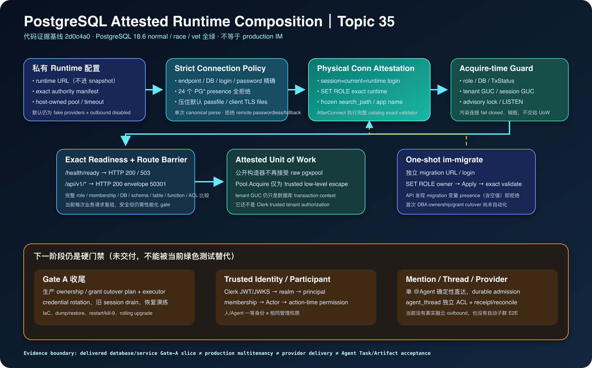

# PostgreSQL Attested Runtime Composition 阶段检查点

> 日期：2026-08-28（Asia/Shanghai）
>
> 分支：`dev_wanwork_quantum_entanglement`（未合并 `main`）
>
> 最终代码证据基线：`2d0c4a069ef016c085541b3ec26426ccd6ace70b`
>
> 本批提交范围：`03cc94e^..2d0c4a0`（25 个小提交；17 个代码/安全提交，8 个文档/证据提交）
>
> 上一增量检查点：`analysis_report/research/34_postgres_function_only_writes_and_exact_access_checkpoint.md`
>
> 一级研究根：`/Users/lwblx/huapohen/agent/automation/2026/05_08/1/2output` 与其 `more`



## 1. 结论先行

Topic 34 已证明测试数据库里的 runtime login 只能通过五个固定函数写 ordinary conversation
authority；但当时 API 进程仍不创建数据库连接，exact validator 也没有进入真实服务入口。因此“数据库权限合同存在”
与“服务运行时一定使用该合同”之间还有一条高风险断链。

本阶段把这条断链收窄到一个可以运行、可以 fail closed、可以继续扩展的 Gate-A 切片：

1. `AuthorityAccessManifest` 现在同时绑定明确数据库名，并可在 runtime credential 下执行完整 exact
   catalog 验证；
2. 新增 strict connection policy：原始 DSN 只允许连接、身份、credential 与 TLS keys；database、login、
   password、host、port 与 transport 必须精确；24 个 pgx `PG*` 变量只要存在（包括空值）就拒绝；
3. 新增 opaque attested runtime pool：每条物理连接在进入池前完成初始登录身份检查、`SET ROLE`、session
   baseline 与完整 exact validation；每次借出前再检查 session contamination；
4. `imstore.NewUnitOfWork` 的生产构造器不再接受任意 raw `*pgxpool.Pool`，owner/migrator pool 不能从公开
   API 注入；
5. runtime API composition 在监听端口前必须完成 `Open → Ready → UnitOfWork → NewRuntime`；
6. runtime 模式增加 `/health/ready` 和 `/api/v1/*` route barrier；数据库失准时 health 返回 HTTP 503，
   business route 保持既定 HTTP 200 envelope 并返回 `50301`；
7. 新增独立 `cmd/im-migrate`；API 启动时只要发现 migration URL 变量存在（包括空值）就拒绝，防止
   owner-capable credential 被继承进长生命周期进程；
8. SIGINT/SIGTERM 的顺序为 HTTP 有界 graceful drain，随后关闭 pool。

本阶段可以诚实宣称：

> 对当前明确配置的数据库、runtime login、runtime group role 和 authority object inventory，API runtime
> composition 已有一条从私有配置到连接、readiness、受控 UoW 和 route barrier 的 fail-closed 链；连接
> session 被 `RESET ROLE`、search path、application name、tenant GUC、session GUC、advisory lock、LISTEN 或
> transaction 污染时，不会交给业务 UoW。

本阶段仍不能宣称：production IaC 已完成、生产 credential rotation 已完成、Clerk tenant 已可信、完整多租户
授权已完成、融云已连接、Agent 子群已实现、provider exactly-once 已实现，或产品已达到生产商用级别。

## 2. 证据口径

| 标记 | 含义 | 本报告使用边界 |
|---|---|---|
| `[F]` | 可复核事实 | 当前固定代码、git 提交、PostgreSQL 18.6 catalog/连接实测。 |
| `[C]` | 有条件结论 | 只在显式 manifest、测试数据库与当前 object inventory 下成立。 |
| `[A]` | 分析判断 | 由一级调研与实现边界导出的下一步设计。 |
| `[U]` | 尚未验证 | 生产拓扑、credential rotation、真实 provider、恢复和容量。 |

### 2.1 当前已交付事实

| 标记 | 事实 |
|---|---|
| `[F]` | API runtime URL 只存在于 private config；`PublicSnapshot` 只暴露 `postgresMode=disabled/runtime`。 |
| `[F]` | manifest JSON 未知字段、尾随 JSON、非 canonical database/role、重复/交叉登录角色均拒绝。 |
| `[F]` | connection policy 拒绝 keyword DSN、隐式 user/host/port/database/sslmode、query identity override、runtime params、service/passfile、pgx query-mode/cache 与 pgxpool lifecycle 参数。远程 URL 必须显式携带非空 password；passwordless 只允许显式开启的 loopback/Unix-socket 测试。 |
| `[F]` | pgx 识别的 24 个 `PG*` 环境变量按 presence 拒绝，空值也拒绝。规范化连接串强制 `passfile=`，并在未显式配置时强制空 `sslcert/sslkey/sslrootcert`，从而不采用默认 `.pgpass` 或默认客户端证书材料。 |
| `[F]` | 远程只接纳 verify-full 等价配置；`sslmode=require`、`prefer` downgrade、multi-host/fallback 与远程明文拒绝。明文只允许显式开启且目标为 numeric loopback 或 absolute Unix socket 的本地测试。 |
| `[F]` | runtime pool 只解析一次规范化 DSN，不再二次解析 raw DSN；最终 host/port/database/login/password 与原始审阅 URL 精确一致，并重建带显式 timeout 的 `DialFunc`。 |
| `[F]` | `AfterConnect` 先要求 `session_user=current_user=configured runtime login` 和 exact database，再 `SET ROLE runtime`，固定 `search_path=pg_catalog` 与 `application_name=wanwork-im-runtime`，随后运行完整 runtime exact validator。 |
| `[F]` | `PrepareConn` 每次借出检查 open/not-busy/idle transaction、session/current/database、search path、application name、tenant GUC、session settings、advisory locks 与 LISTEN；drift 返回固定错误并销毁连接。 |
| `[F]` | 正常 `SET LOCAL wanwork.tenant_id` 事务提交后 PostgreSQL 会留下空 placeholder；当前 guard 明确允许 null/empty，拒绝任何非空 session tenant，并用同一 backend PID 证明正常 UoW 不 churn。 |
| `[F]` | readiness 不是 `Ping`：借出已 guard 的连接后，再执行完整 exact roles/memberships/database/schema/table/function/default ACL comparator。 |
| `[F]` | runtime pool 公开类型不暴露底层 `*pgxpool.Pool`；生产 UnitOfWork 构造器只接受 attested pool。`Pool.Acquire` 仍是 exported trusted low-level escape hatch，返回 guard 后的连接但可在 runtime role 权限内执行 SQL；它不是 tenant/action authority 边界。 |
| `[F]` | runtime service 监听前必须成功组装 database readiness 与 persistence；DB 不 ready 时 `/api/v1/*` 返回业务码 `50301`，内部 drift 原因不回显。 |
| `[F]` | `im-migrate` 使用独立 migration URL、列出的 migration login 和 owner role；API command 不读取其值，并拒绝继承了该变量（含空值）的启动环境。 |
| `[F]` | 本阶段最终全包 PostgreSQL 18.6 normal、全包 `-race`、`go vet ./...` 均通过。 |

### 2.2 仍不成立的结论

- `[U]` 没有 production IaC/Terraform/Kubernetes secret injection；测试 role provisioner 不是生产 bootstrap；
- `[U]` 没有 deterministic ownership/grant cutover plan/executor；首次 schema apply 后的对象转交仍需 DBA 流程；
- `[U]` 没有 runtime/migration credential rotation、双 credential overlap、旧 session drain、撤销与回滚演练；
- `[U]` 没有 dump/restore、DB restart、process kill-9、old binary/future schema、rolling upgrade 的生产演练；
- `[U]` 当前 route barrier 每个业务请求都执行完整 catalog validation，安全但昂贵；尚未实现带 max-staleness、
  positive-success timestamp 和 drain state 的后台 readiness gate；
- `[U]` `tenant_id` 仍由内部调用者传入 UoW。GUC 防止 transaction 内串 tenant，但没有证明 tenant 来自
  Clerk verified identity；
- `[U]` 没有 Clerk JWT/JWKS verifier、realm binding resolver、principal/membership/Actor active chain 或
  conversation action-time PEP；
- `[U]` 没有 Agent installation authority、`agent_thread` persistence、durable mention admission、Go→Python
  单次窄化调用授权；
- `[U]` 没有融云 SDK、普通用户 provisioning、inbound signature、outbox/receipt/readback/unknown reconcile；
- `[U]` `im-migrate` 的 config/connection failure 已有单测，底层 Apply/validator 有 PostgreSQL 实测，但当前还缺
  一个从 production-like bootstrap 到 command happy path 的独立 E2E；不能把两组测试的组合误写成该命令的
  生产部署证明。

## 3. 从一级调研吸收的约束

以下路径均相对于 `automation/2026/05_08/1/2output/more`。这些资料用于形成门禁，不作为本地已实现能力的
替代证据。

| 一级来源 | 准确边界 | 对当前阶段/下一阶段的约束 | 当前落实与未落实 |
|---|---|---|---|
| `deepseek-harness/research_report.md:207-251` | Everything-is-a-plugin 的核心是 capability seam、最终组合树与可逆 effect；Session/Agent Loop/LLM/Tools/Scope 仍形成事实脊柱。 | DB migrator/runtime、identity resolver、provider、supervisor 可以是可替换 provider，但 tenant、Action、Task、Artifact 等不变量必须由 host/kernel 验证，插件不能自证兼容。 | connection/pool 已成为明确 seam；exact manifest 由 host 持有。动态 plugin sandbox、provider composition 仍未交付。 |
| 同上 `:384-414,805-845` | package 默认安全不等于 final effective composition 安全；filesystem sandbox 不覆盖网络/进程。 | readiness 必须验证最终 effective profile；第三方 plugin/MCP 不进入 API 主进程。 | 当前 runtime composition 在监听前检查 DB final config；第三方执行仍只存在 isolation contract/fake。 |
| `sandbase-harness/research_report.md:416-468,551-574` | validator/schema/vault“存在”不证明 server/runtime 真接线；固定报告曾找到 route 漏传 DB、credential helper 无 runtime caller。 | 必须从真实 entrypoint 追踪 config→pool→validator→readiness→route。 | 本阶段完成该条 Gate-A 链；production bootstrap 和 credentials 尚未完成。 |
| `agentspace/research_report.md:678-685,743-788` | deploy health 不能只看 `/health`；应形成 credential→scope→event→identity/channel binding→runtime→data plane→approved write 的诊断漏斗。 | liveness、readiness、业务授权、provider effect、Artifact acceptance 必须分开。 | 已拆 live/ready/business gate；identity/provider/approved write 仍未实现。 |
| `omnigent/research_report.md:680-706` | 放进负载均衡不自动得到长连接/presence 一致性；需 drain、resume token、cursor、背压和 rolling upgrade。 | 当前 graceful HTTP drain 只是第一层；provider/runtime 长连接必须有 generation/fence/resume。 | HTTP drain 已接；旧 DB session、provider stream、runtime generation 尚未演练。 |
| `clawith/research_report.md:198-226` | 人和 Agent 统一为 Participant；单 Agent mention 确定性直达，多 Agent mention 才规划；mention intent 不等于发送、Run 完成或责任接受。 | 下一阶段单 `@Agent` 不应让模型重新选目标；MentionIntent、delivery、acceptance、execution、Artifact acceptance 分状态/receipt。 | 仅纳入计划；本阶段没有 mention/thread 实现。 |
| `raft-slock/research_report.md:239-245,326-344` | human/Agent 共享 channel/DM/thread/mention/search，但 Agent 管理能力证据冲突；wake 可重复，Activity 可丢。 | 一等 Participant 不等于相同 admin 权限；durable wake/inbox 与 lossy activity/presence 分域。 | Actor 值对象已有；trusted role matrix 与 durable inbox 未交付。 |
| `floatim-floatboat/research_report.md:152-163,229-240` | 静态前端可证明 `all_messages/mention_only` 与 pairing 的客户端语义；不能证明后端授权/去重。 | mention lifecycle 必须覆盖新消息、编辑、引用、转发、重复 callback，V1 默认 mention-only。 | 作为下一阶段 acceptance matrix，不能宣称现有实现已支持。 |
| `orca/research_report.md:239-255` | execution host 才拥有工具、credential、process、Artifact 真相；remote state 只有 live/unverifiable/exited。 | 断联不能推导 exit 或触发本地补跑；unverifiable 应停止新 admission，不可启动第二实例。 | isolation contract 已区分 termination evidence；真实 supervisor 未交付。 |

### 3.1 明确只作为灵感、不能当实现证据

- 一级资料没有直接证明“`@Agent` 自动创建独立 ACL 子群”这一产品设计；它必须由我们自己的 aggregate、unique
  key、事务、provider receipt 和 E2E 证明；
- FloatIM 主要是静态前端/公开资料，不能证明 server authorization、dedupe、稳定性或企业合规；
- Raft External Agents 标为 Experimental，Agent 管理权限文档互相冲突，不能照搬；
- DeepSeek Harness 的细粒度 Loader 证明官方模块化，不证明成熟第三方插件生态，也不证明我们的 runtime；
- 其他项目的固定源码和测试只证明对应快照，不证明 WanWork service wiring、isolation 或 production readiness。

## 4. 代码链路与安全语义

### 4.1 Runtime API 路径

```text
WANWORK_IM_POSTGRES_RUNTIME_URL（private）
  + WANWORK_IM_POSTGRES_AUTHORITY_MANIFEST（non-secret）
  + host-owned pool/timeouts/local-test flag
    → config.Load
    → connectionpolicy.ParsePool（single canonical parse）
      → reject all ambient PG* presence
      → exact URL endpoint/database/login/password/TLS
      → override implicit passfile/default TLS files
      → reject RuntimeParams + parser-consumed params + raw file/fallback overrides
    → runtimepool.Open
      → pgxpool.AfterConnect
        → initial login/database proof
        → SET ROLE runtime
        → frozen session baseline
        → ValidateRuntimeAuthorityAccess
      → explicit Ready（解决 lazy pool）
    → imstore.NewUnitOfWork(attested pool only)
    → app.NewRuntime
      → /health/ready exact check
      → /api/v1 route barrier
    → Listen
```

任何 parse/connect/role/catalog/composition 错误都在监听前返回固定错误。错误不 wrap pgx parse/connect 原因，因此
不会把包含 password 的 DSN 带到普通日志边界。

### 4.2 每条物理连接的证明

首次进入 pool 前必须满足：

1. connection open、not busy、`TxStatus=I`；
2. `session_user == current_user == configured runtime login`；
3. `current_database == manifest.DatabaseName`；
4. login 可以且只能沿 exact membership `SET ROLE manifest.RuntimeRole`；
5. `search_path=pg_catalog`；
6. `application_name=wanwork-im-runtime`；
7. session/role/database/schema/relation/function/default ACL 完整 exact comparator 通过；
8. comparator 后再次复核 session baseline。

### 4.3 每次借出的快速 session guard

| 检查 | 拒绝的污染/风险 |
|---|---|
| open / not busy / `TxStatus=I` | open/failed transaction、未关闭 rows/batch、已断连接。 |
| session/current/database | `RESET ROLE`、`SET SESSION AUTHORIZATION`、错误 DB。 |
| search path / application name | hostile object resolution、旧 session 无法精确识别。 |
| tenant GUC null-or-empty | 非空 session tenant 跨请求泄漏；允许正常 `SET LOCAL` 提交后的空 placeholder。 |
| `pg_settings source=session` exact | `statement_timeout`、row security 等 recognized session drift。 |
| no advisory locks | session-level idempotency lock 遗留。 |
| no LISTEN channels | provider/事件 channel session state 泄漏。 |

`PrepareConn(false, ErrRuntimeConnectionDrift)` 会让当前借出失败并销毁旧物理连接；不会静默换一条连接后让污染
事件看似不存在。下一次独立借出可以新建物理连接，并重新执行完整 `AfterConnect` attestation。

`runtimepool.Pool.Acquire` 是有意保留给受信基础设施代码的低层入口：它会经过上述 guard，但拿到连接的调用者
仍能在 runtime database role 的权限范围内直接执行 SQL。因此“opaque pool”只表示不暴露底层
`*pgxpool.Pool` 和生产 UoW 不接受任意 raw pool，不表示 `Acquire` 自身构成 conversation/tenant/action
授权边界。业务代码应优先通过受控 UnitOfWork；后续 PEP 仍必须在 action time 独立成立。

### 4.4 Readiness、业务错误与 graceful drain

- `/health/live`：只证明进程可响应，HTTP 200；
- `/health/ready`：runtime 模式执行 exact DB readiness，成功 HTTP 200，失败 HTTP 503；
- `/api/v1/*`：effect 前先过 DB gate；失败仍使用 HTTP 200 business envelope，`code=50301`；
- 该 `50301` 只表示 effect 前 dependency 不可用，不得用于 provider `effect_unknown`；
- SIGINT/SIGTERM 触发 Fiber `GracefulContext`，shutdown timeout 10 秒；Listen 返回后才关闭 pool；
- 尚无显式 draining readiness state、in-flight metric 和旧 credential session drain，这些仍属 Gate A 收尾。

### 4.5 One-shot migration 路径

```text
WANWORK_IM_POSTGRES_MIGRATION_URL
  → strict connection policy（只允许 manifest 中 migration login）
  → session=current=migration login + exact database
  → SET ROLE owner
  → migrations.Apply（lock + ledger + checksum + cumulative postconditions）
  → ValidateAuthorityAccess
  → safe summary（count/version/name；无 DSN）
```

API binary 只读取 runtime URL；migration URL 只由 `im-migrate` 读取。API 启动对 migration 变量执行
presence-only fail-closed 检查，不读取、不保留也不回显其值。两种 credential 的 lifetime 和进程边界已
分离。但 first-deploy ownership/grant cutover 尚未自动化，所以当前命令不能被称为完整 production bootstrap。

## 5. 25 个小提交台账

| # | 提交 | 内容 | 边界 |
|---:|---|---|---|
| 1 | `03cc94e` | runtime credential 下复用完整 exact access validator | 尚无 pool/service wiring。 |
| 2 | `9ece0c7` | manifest 绑定 exact database identity | 仍只在 validator 层。 |
| 3 | `27079c9` | 冻结 runtime pool config 与 DSN/TLS 基础门禁 | 纯 parse，不连 DB。 |
| 4 | `a0495d1` | 新增 physical connection attestation、Prepare guard、Ready | 尚无实机污染矩阵。 |
| 5 | `25f27d6` | 补 parser-consumed allowlist、verify-full、显式 endpoint、fixed app name、visible drift；修正 tenant placeholder | 仍未绑 UoW。 |
| 6 | `d93b18f` | PostgreSQL 18.6 attestation/污染/ACL drift/timeout 实机测试 | 测试 fixture 不是 IaC。 |
| 7 | `74a93af` | UnitOfWork 生产构造器只接受 attested pool | transport tenant 仍未可信。 |
| 8 | `910f78a` | 加载 private runtime DB config 与 non-secret manifest | 默认仍为 fake/no outbound。 |
| 9 | `b11ae04` | `/health/ready` 与 `/api/v1` route barrier | 当前每请求 full validator，待性能化。 |
| 10 | `1cc1e8b` | API startup composition 与有界 HTTP drain/pool close 顺序 | 旧 DB session rotation 未做。 |
| 11 | `b782774` | runtime/migrator 共用 strict connection policy | 无行为扩张。 |
| 12 | `5c19fdb` | 独立 one-shot `im-migrate` | first-deploy cutover/E2E 尚未完成。 |
| 13 | `64f04a3` | 增加 guarded API start script | runtime composition 仍需显式 opt-in。 |
| 14 | `72b0f96` | 发布 Topic 35 Markdown 与结构图 | 文档不替代运行证据。 |
| 15 | `fa05a1d` | 修正 Go 验证命令的可直接运行性 | 无代码行为变化。 |
| 16 | `89a3ce8` | 发布 W2 runtime 工程入口 | 无代码行为变化。 |
| 17 | `c859efb` | 项目索引切换到 Topic 35 | 历史 Topic 33/34 保留。 |
| 18 | `0e825cc` | 登记 Topic 35 SVG/PNG 与截图 manifest | 导航图不冒充测试截图。 |
| 19 | `4f578fb` | 生成 Topic 35、项目首页和实施计划 HTML 镜像 | 派生 HTML 必须与 Markdown 同步。 |
| 20 | `c70a0cf` | 把 function-write 文档标为历史检查点 | 当前入口保持 Topic 35。 |
| 21 | `2c65b80` | 拒绝 pgx 识别的 24 个 ambient `PG*` 变量 | 当时先覆盖非空值。 |
| 22 | `1f399e5` | API 启动拒绝 migration URL 环境继承 | presence-only，不读取 credential。 |
| 23 | `5f5cb3e` | 增加 API/runtime/migrator ambient composition 测试 | 审计随后发现空值与默认文件缝隙。 |
| 24 | `fa9f602` | canonical PostgreSQL parse：presence 拒绝、显式 password、默认文件压制、exact endpoint/credential、受控 DialFunc | passwordless 仅限显式本地测试。 |
| 25 | `2d0c4a0` | runtime pool 改为单次 canonical parse | 消除 raw DSN 二次解析回流。 |

## 6. 验证矩阵与实跑结果

### 6.1 Runtime pool PostgreSQL 18.6

| 场景 | 预期 | 实际 |
|---|---|---|
| exact runtime login/role/database/catalog | Open + Ready 成功 | 通过 |
| runtime raw table insert | SQLSTATE `42501` | 通过 |
| runtime `MAINTAIN` privilege | false | 通过 |
| 正常 transaction-local tenant | 同一 backend PID 可复用 | 通过 |
| `RESET ROLE` | 当前 Acquire fail，旧 PID 销毁 | 通过 |
| hostile search path | 同上 | 通过 |
| application name drift | 同上 | 通过 |
| non-empty session tenant | 同上 | 通过 |
| session `statement_timeout` | 同上 | 通过 |
| advisory lock | 同上 | 通过 |
| LISTEN | 同上 | 通过 |
| open transaction on release | pgxpool guard 销毁，下一 PID 不同 | 通过 |
| function EXECUTE ACL drift | Ready 失败 | 通过 |
| ACL 修复但未重验 | 不沿用历史 ready | 通过：必须再次完整 Ready |
| cancelled context / pool exhaustion | bounded `ErrNotReady` | 通过 |
| 24 个 `PG*` 环境变量（含 empty-presence） | parse 前固定拒绝且不泄露值 | 通过 |
| 远程 passwordless URL | 固定拒绝 | 通过 |
| 显式本地 passwordless 测试 | 允许且 password 保持为空，不采用 passfile | 通过 |
| 默认 passfile/client TLS 文件设置 | canonical DSN 显式置空，不采用隐式材料 | 通过 |
| runtime raw DSN 二次解析 | 不存在；`ParsePool` 单次规范化解析 | 通过 |
| API 环境含 migration URL（含空值） | 启动前固定拒绝 | 通过 |

### 6.2 最终命令

```bash
cd apps/im-api

GOTOOLCHAIN=local GOPROXY=off GOSUMDB=off \
WANWORK_TEST_POSTGRES_ADMIN_URL='postgresql://127.0.0.1:55488/postgres?sslmode=disable' \
go test ./... -count=1 -timeout=10m

GOTOOLCHAIN=local GOPROXY=off GOSUMDB=off \
WANWORK_TEST_POSTGRES_ADMIN_URL='postgresql://127.0.0.1:55488/postgres?sslmode=disable' \
go test -race ./... -count=1 -timeout=15m

GOTOOLCHAIN=local GOPROXY=off GOSUMDB=off go vet ./...
```

结果：所有 Go package normal/race 通过，vet 无输出；本地 PostgreSQL 版本 18.6。

## 7. 下一阶段详细计划

### P0-A：完成 production Gate A

1. 冻结 production authority bootstrap/cutover `Plan`：roles、membership grantor/options、DB ownership、schema/
   relation/function ownership、table/function/default/column ACL；Plan 必须可 dry-run、canonical digest、不可夹带
   credential；
2. executor 只使用独立 provisioner credential，先 preflight 再 transactionally apply 可事务部分；非事务 DB/role
   操作必须有逐步 receipt 与 reconcile；
3. 首部署 E2E：empty DB → role/db preflight → migrate → cutover → migration exact validate → runtime Open/Ready；
4. rotation：new login membership → 双 credential overlap → 新 pool ready → business drain → terminate old sessions →
   revoke old membership/CONNECT → exact validate；
5. drift/cutover 负测：错误 grantor、duplicate membership、old role setting、column ACL、PUBLIC/TEMP/MAINTAIN、
   stale session；
6. dump/restore、DB restart、process kill-9、future schema、old binary、rolling shutdown 与 pool exhaustion；
7. 把当前每请求 full catalog check 改为 host-owned readiness monitor：只缓存最近一次成功结果，绑定 exact manifest
   digest 与 max staleness；过期/错误/draining 一律 gate closed，业务请求只读 immutable gate snapshot。

### P0-B：Trusted Clerk tenant 与 Go-native Participant authority

1. `ClerkCredentialVerifier`：issuer/audience/azp/alg/kid/JWKS TTL/rotation/session status 全矩阵；
2. server-owned realm → active external binding → human principal → tenant membership → exact Actor；
3. Go-native opaque `TrustedRequestContext`，绑定 request/audience/subject/realm/principal/tenant/Actor/revisions/TTL；
4. UoW 不再接受 transport 的裸 TenantID；只能从 trusted context 导出受控 tenant operation；
5. conversation action-time PEP：conversation active + membership active + exact permission，removed member 即使旧 access
   仍 true 也拒绝；
6. human-member / human-admin / agent-member / agent-admin 四主体 CRUD 矩阵；“一等 Participant”不推导相同权限。

### P1：Agent installation、mention 与独立工作子群

1. Agent definition/release/installation/status/revision 与 Agent Actor 一一绑定；
2. Agent 通过融云普通用户投影；禁止 robot-account path；
3. `agent_thread` persistence：parent/root message/invocation/installation lineage，同 tenant，独立 membership/access；
4. unique key `(tenant,parent,rootMessage,agentInstallation)`，并发/重放只产生一个 thread/Task/Invocation；
5. 单 Agent mention 确定性直达；多 Agent 规划结果仍由平台校验；编辑/引用/转发/duplicate callback 入矩阵；
6. durable inbox/wake 与 lossy Activity/presence 分域；
7. provider subgroup create/invite 使用 durable command、receipt/readback/unknown reconcile；provisioning 未成功不得启动 Agent；
8. Go→Python QE 只签发短 TTL、single-use、exact tenant/conversation/Agent/action/audience 的内部调用授权，不序列化
   Python opaque RequestContext，不把 ActorRef/ext_info 当 authority。

## 8. 阶段停止条件与验收建议

当前适合停下来验收的是：

- 默认 fake/no-outbound 服务仍能启动；
- runtime DB 配置合同、attested pool 和 readiness/gate 的代码与测试；
- 独立 migrator 的进程/credential 边界；
- 报告、HTML 与结构图是否准确表达“已完成/未完成”。

当前不适合拿真实 IM、真实组织或 production credential 验收。进入真实 IM 之前，至少完成 P0-A 的 production
cutover/rotation/recovery 和 P0-B 的 trusted tenant/action-time PEP；若选择“提前接 IM”，也只能在 fake/sandbox、
outbound disabled 或只读 provider profile 下进行，不得把 provider metadata 或聊天 path tenant 直接当授权。

全程没有向飞书、企微、群聊、bot、webhook 或任何人发送消息；没有操作语雀；没有记录或输出完整 API key。
