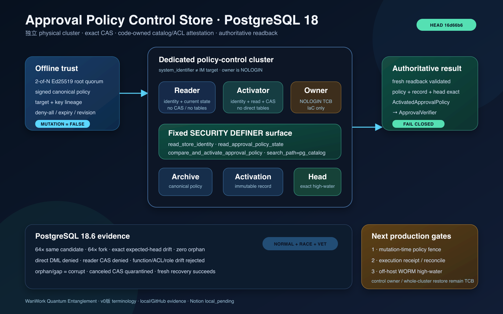

# PostgreSQL Approval Policy Control Store 阶段检查点

> 日期：2026-08-29（Asia/Shanghai）
> 分支：`dev_wanwork_quantum_entanglement`（未合并 `main`）
> 代码证据基线：`16d66b6f`
> 本批提交：`49e2c76`、`5b7e89a`、`dff667c`、`910865a`、`4603a68`、`16d66b6`
> 一级研究根：`/Users/lwblx/huapohen/agent/automation/2026/05_08/1/2output` 及其 `more` 子树
> 远端同步状态：本地/GitHub 已完成，Notion 按用户最新指示延后批量同步，当前为 `local_pending`



## 1. 结论先行

前一阶段已经能验证离线 root quorum 签发的 `ApprovalPolicy`，并通过 durable CAS 抽象产生
`ActivatedApprovalPolicy`。但抽象背后仍只有内存 fake；如果把目标 IM PostgreSQL 自己用作 policy high-water，
目标库恢复就可能同时回滚批准 policy，所谓 anti-rollback 也就不成立。

本阶段完成了一个独立、fail-closed、可由 PostgreSQL 18.6 实测的 policy-control store：

1. 新增独立数据库部署单元，数据库/Schema/Table/Function 由专用 `NOLOGIN` owner 持有；
2. reader 与 activator 使用两个独立 `LOGIN` 角色，reader 只能读取，只有 activator 能调用 exact CAS；
3. activator 对三张表没有任何直接 DML、DDL、TRUNCATE 或 SELECT 权限；所有读写只经过三个固定
   `SECURITY DEFINER` 函数；
4. archive、activation record、head 由复合 PK/UK/FK 连成一个关系闭包；CAS 在 namespace advisory
   transaction lock 下先验证完整历史再插入，失败不会留下 loser archive/record；
5. `read_approval_policy_state` 不把“无 head”简单解释为空库，而是区分 `empty`、`present`、`corrupt`，并验证
   revision 从 1 连续、previous digest 链、record/archive 数量、head 指向与 byte-size；
6. Go 客户端每次连接都验证 TLS transport、database、session/current role、owner、PG major、primary、
   physical system identifier 与 control/target 物理隔离；
7. 数据库自报的 compatibility digest 之外，Go 还独立读取 `pg_catalog`，冻结列、约束、索引、函数正文、
   language/volatility/strict/security/search_path、owner、ACL、role graph、default ACL、policy/trigger/rule/
   publication 等最终有效面；
8. commit response 丢失或 caller context 取消时，歧义连接会 `Hijack + Close`，随后使用保留 request values、
   不继承取消信号且最多 5 秒的 fresh context 回读；没有 authoritative readback 就不会生成 active policy；
9. PostgreSQL 18.6 上已证明 genesis、rev1→rev2、deny-all、pool 重建、64 路 same-candidate、64 路 fork、
   exact-head 漂移、ACL/函数/角色图篡改、孤儿/断链历史、取消中的 CAS 与零残留；
10. 全 Go 模块 normal、全模块 `-race`、`go vet ./...`、`go mod verify`、Linux/Windows authoritycutover
    交叉构建均通过。

本阶段可以诚实宣称：

> 在 control database owner 与平台整库恢复权限属于受信管理边界的前提下，普通 reader/activator credential、
> 并发请求、进程重启、连接取消、目标 IM 数据库单独恢复和已覆盖的 catalog/ACL 漂移不能让应用构造未经
> authoritative PostgreSQL readback 证明的 `ActivatedApprovalPolicy`。

本阶段仍不能宣称：control cluster 自身被旧快照恢复也能自动发现、approval 已与目标 mutation 原子消费、
cutover executor 已交付、生产 Secret/TLS/IaC 平台已部署，或原生 IM 已可开放真实 outbound。

## 2. 威胁模型与信任边界

| 主体/故障 | 当前处理 | 结论 |
|---|---|---|
| 普通 reader credential 泄漏 | 只能调用 identity/read；CAS、表访问均被 ACL 拒绝 | 不能推进 policy head |
| 普通 activator credential 泄漏 | 可调用签名 policy CAS，但不能直接读写表；伪造 policy 会在应用 root verifier 回读时失败并 fail closed | 能造成拒绝服务，不能产生可信 active policy |
| 同 revision 并发 | namespace transaction advisory lock + exact expected head | 唯一 durable winner；失败方零 archive/record 残留 |
| lost ACK / caller cancel | 歧义连接隔离；fresh bounded authoritative readback | 不把 transport error 当 rollback，也不把 false success 当 commit |
| head/archive/record 缺失或断链 | `corrupt`，不是 `empty` | 不允许回到 revision 1 重建历史 |
| function/ACL/role membership 漂移 | code-owned catalog digest + exact ACL/role graph comparator | 在任何 store read/CAS 前拒绝连接 |
| 目标 IM DB restore | policy high-water 位于不同 physical system identifier 的 control cluster | 目标恢复不会同步回滚 policy |
| control DB owner 恶意或整库旧快照恢复 | 当前 owner/平台属于受信 TCB | 尚需 off-host WORM/high-water anchor |
| policy 激活后、目标 mutation 前出现 deny-all/rev+1 | 当前 `Load` 只是瞬时证明 | 尚需 mutation-time fence/lease；本阶段不授权 mutation |

特别强调：`ApprovalPolicyActivationRecord.MutationAuthorized` 永远为 `false`。policy 激活只让 verifier 有资格验证
后续 approval，不是数据库 cutover 的写租约。

## 3. 部署拓扑

```text
offline root quorum
  └─ signed ApprovalPolicy
       └─ ApprovalPolicyVerifier
            └─ PostgresApprovalPolicyActivationStore
                 ├─ transport + physical identity proof
                 ├─ code-owned pg_catalog/ACL/role attestation
                 └─ dedicated PostgreSQL control cluster
                      ├─ NOLOGIN owner
                      ├─ reader login ── identity/read only
                      ├─ activator login ── identity/read/exact CAS
                      ├─ immutable policy archive
                      ├─ immutable activation record
                      └─ exact high-water head
                           └─ authoritative readback
                                └─ ActivatedApprovalPolicy
                                     └─ ApprovalVerifier
```

部署文件位于：

- `deploy/postgres/approval-policy-control-store/bootstrap_cluster.psql`
- `deploy/postgres/approval-policy-control-store/schema.psql`
- `deploy/postgres/approval-policy-control-store/README.md`

脚本是 create-only；遇到已有 role/database/schema/object 会失败，不会通过 `IF NOT EXISTS` 或
`CREATE OR REPLACE` 静默收编未知状态。activator 密码不写入脚本、报告或 Git，由部署 Secret manager
单独注入。

## 4. 数据库合同

### 4.1 角色与函数面

| 角色 | LOGIN | Database | Schema | Function | Table/sequence |
|---|---:|---|---|---|---|
| owner | 否 | owner implicit | CREATE/USAGE | owner implicit | owner implicit；属于受信 TCB |
| reader | 是 | CONNECT | USAGE | identity + read | 无 |
| activator | 是 | CONNECT | USAGE | identity + read + CAS | 无 |
| PUBLIC | — | 无 CONNECT/CREATE/TEMP | 无 | 无 | 无 |

三个固定函数：

1. `read_store_identity()`：返回 session login、definer owner、database、PG version、recovery、physical system
   identifier、schema format 与 compatibility digest；
2. `read_approval_policy_state(text,text)`：在单个 SQL statement snapshot 内返回 `empty/present/corrupt`；
3. `compare_and_activate_approval_policy(...)`：验证输入/JSON 关系、锁 namespace、验证完整历史、原子插入
   archive/record 并推进 exact head。

函数均固定 `search_path=pg_catalog`，内部对象完全限定，无动态 SQL。reader 不能调用 CAS；activator 也不能
直接查看或修改表。

### 4.2 三表关系

| 表 | 语义 | 关键约束 |
|---|---|---|
| `approval_policy_archive` | exact canonical signed policy，create-only archive | `(policy_id,target_digest,revision)` PK；namespace policy digest unique；revision/digest/size checks |
| `approval_policy_activation_record` | exact canonical activation evidence | PK + activation digest unique；复合 FK 指向 archive |
| `approval_policy_head` | namespace monotonic high-water | namespace PK；复合 FK 同时指向 archive 与 activation record |

合法写入只能在同一 SQL statement transaction 内产生三者闭包。CAS 失败发生在任何 insert 前；函数内部异常会
回滚整个 statement transaction。

### 4.3 `empty` 不等于 “没查到 head”

真正的 genesis 需要同时满足：

- head 数量为 0；
- archive 数量为 0；
- activation record 数量为 0。

只要存在 orphan archive/record、head 指向丢失对象、历史 revision 不是 `1..head.revision`、previous digest
不等于上一版 policy digest、record/archive 数量不等于 head revision，结果就是 `corrupt`。Go 映射成固定
`ErrInvalidApprovalPolicyStoreState`，不会转成 `ErrApprovalPolicyStoreEmpty`。

## 5. 双重 attestation

数据库 identity 函数返回的 schema digest只用于 compatibility negotiation，不被当作完整自证。客户端随后独立
读取 `pg_catalog` 并计算 code-owned digest：

`sha256:8ac32cf0ef53b447fd1b152c5359f5854c4f50f7e513af1f71d19dd57d4d1ea0`

冻结范围包括：

- 所有 table/index relation 的 kind、persistence、access method、RLS、replica identity、options；
- 所有列的顺序、类型、collation、not-null、default、identity/generated；
- 所有 PK/UK/FK/CHECK/PG18 not-null constraint 定义；
- 所有 index definition 与 unique/primary/valid/ready/live/replica/clustered flags；
- 三个 function 的 exact arguments/result、language、kind、volatility、strict、security definer、leakproof、
  parallel、`proconfig` 与 `pg_get_functiondef` SHA-256；
- schema/database/table/function 的 exact ACL 和 grantor；
- owner/reader/activator role flags、role membership、database owner/encoding；
- default ACL、standalone type、non-internal trigger、rule、policy、publication 必须为零。

因此错误 CAS 函数不能只回报正确的静态 schema digest 来绕过验证；函数正文或最终授权面变化都会被独立拒绝。

## 6. PostgreSQL 18.6 实测矩阵

| 测试 | 证明 | 结果 |
|---|---|---|
| empty → rev1 → deny-all rev2 | 连续 digest chain、deny-all、记录/head 关系 | 通过 |
| pool/store 重建后 Load | 状态不依赖进程内存 | 通过 |
| 64 goroutine same genesis | same content 幂等、唯一物理三表写 | 全部成功；1 archive/1 record/1 head |
| 32+32 fork revision 2 | exact CAS 唯一 winner | 仅一个 policy digest 成为 head；总历史 2 版 |
| expected activation/policy/revision/target 漂移 | 所有 expected-head/namespace 组成均参与判定 | conflict/rejected；无 orphan |
| activator SELECT/INSERT/UPDATE/DELETE/TRUNCATE | function-only surface | 全拒绝 |
| reader 调 CAS | reader/activator 分权 | 拒绝 |
| activator 直接传 `{}` | fixed function 自身基础语义校验 | `rejected`；无写入 |
| function 改成 SECURITY INVOKER | function metadata/body attestation | `ErrUntrustedPostgresApprovalPolicyStore` |
| reader 获得 table SELECT | exact ACL attestation | 拒绝连接 |
| activator 获得 owner SET membership | exact role graph | 拒绝连接 |
| orphan archive | empty/corrupt 区分 | fixed integrity error |
| 删除 revision 1、保留 head revision 2 | 完整历史连续性 | fixed integrity error |
| CAS 被 advisory lock 阻塞后 context 超时 | commit unknown + connection quarantine | fixed uncertain；零行；解锁后 fresh activation 成功 |
| error canary | DSN、password、canonical policy、signature 不进入固定错误 | 通过 |

测试使用本机 PostgreSQL `18.6 (Homebrew)`；fixture 不是生产 topology，也不替代远程 verify-full TLS、Secret
rotation、backup/restore 或平台 IaC 验收。

## 7. 全量验证证据

在 `16d66b6` clean tree 上执行：

```bash
WANWORK_TEST_POSTGRES_ADMIN_URL='postgresql://127.0.0.1:55488/postgres?sslmode=disable' \
GOTOOLCHAIN=local GOPROXY=off GOSUMDB=off go test -count=1 ./...

WANWORK_TEST_POSTGRES_ADMIN_URL='postgresql://127.0.0.1:55488/postgres?sslmode=disable' \
GOTOOLCHAIN=local GOPROXY=off GOSUMDB=off go test -race -count=1 ./...

GOTOOLCHAIN=local GOPROXY=off GOSUMDB=off go vet ./...
GOTOOLCHAIN=local GOPROXY=off GOSUMDB=off go mod verify
```

结果：19 个 Go package normal 全通过；19 个 package race 全通过；vet 通过；`all modules verified`。
`authoritycutover` 另完成 `linux/amd64` 与 `windows/amd64`、`CGO_ENABLED=0` test binary 交叉构建；
`git diff --check` 通过，分支已推送 GitHub，未合并 `main`。

## 8. 一级调研如何影响本阶段

| 来源 | 吸收的硬约束 | 本阶段落实 |
|---|---|---|
| `more/deepseek-harness/research_report.md` | Everything-is-a-plugin 是 capability seam，不是让插件自证权限 | PostgreSQL store 是可替换 provider seam；policy/target/catalog/ACL 不变量由 host 验证 |
| `more/sandbase-harness/research_report.md` | schema/validator“存在”不证明运行时真接线 | 每次 Load/CAS 都在同一真实连接上先做 transport/identity/catalog attestation |
| `more/agentspace/research_report.md` | health 需要 credential→scope→effect 的证据漏斗 | login/owner/role graph→function surface→CAS→authoritative readback 分层 |
| `more/clawith/research_report.md` | 自治和审批必须留下可回放治理证据 | signed policy、immutable activation record、完整历史、head 分离 |
| `more/raft-slock/research_report.md` | wake/activity 可重复或丢失，不能冒充 durable truth | provider/IM message 不参与 policy high-water；control store 是独立 durable truth |

没有直接照搬任何参考项目的高层 Agent API。实现保持 DeepSeek Harness 的底层 seam 思想，同时把 anti-rollback、
identity、catalog 和 durable evidence 固定在 WanWork 自己的 kernel contract 中。

## 9. 当前明确未完成（NO-GO）

以下项目仍是接真实 IM outbound / production cutover 前的阻断项：

1. **approval 原子消费与 mutation fence**：必须在最终目标 mutation 时锁定/验证 current policy head、
   verification enabled、approval digest、plan digest、execution attempt，不能把本阶段瞬时 Load 当 lease；
2. **durable execution receipt/reconcile**：step start、effect unknown、readback、terminal receipt、重试和 operator
   quarantine 尚未落库；
3. **cutover executor**：当前仍只有 plan/preflight/policy，不能执行 ownership/migration/runtime cutover；
4. **off-host high-water/WORM anchor**：control DB 整库旧快照恢复仍是可信平台边界；
5. **生产 Secret/TLS/IaC**：本地 psql deployment unit 不是云平台 module，未完成 remote verify-full 正向 E2E、
   credential rotation、旧 session drain；
6. **恢复演练**：control/target 独立 backup、PITR、restore、failover、old binary/future schema 尚未演练；
7. **Clerk/融云/Agent Store/@Agent 子群**：provider 与产品层尚未建立在上述 execution receipt 之上；
8. **Web/Desktop/Mobile 产品闭环**：现有试用 UI 不是本轮新 IM 全端实现。

## 10. 下一阶段执行顺序

1. 定义 `VerifiedApproval` 的 durable consumption key 与 policy-head fence；
2. 新建 execution attempt/step receipt/reconcile store，先支持 no-effect 与 fixed-SQL effect；
3. 把 preflight report、approval、policy activation、plan、release/backup digest 绑定到一次 execution admission；
4. 实现 cutover executor 的 bootstrap→migrate→cutover→runtime proof，任何 unknown 进入 reconcile，不盲重试；
5. 建立 off-host immutable high-water evidence 与 control/target 分离恢复演练；
6. 收口生产 Secret/TLS/IaC 后，再将 Clerk trusted tenant、融云普通用户 Agent、Agent Store、`@Agent` 子群与
   provider outbox 接到同一 durable receipt 模型；
7. 本地代码、文档、HTML、截图全部完成并推送后，再批量同步 Notion 并逐页回读。

## 11. 提交台账

| 提交 | 内容 |
|---|---|
| `49e2c76` | activation record duplicate-aware strict canonical decoder |
| `5b7e89a` | caller 取消后使用 bounded fresh reconciliation context |
| `dff667c` | corruption 在 activator 层保持 fixed integrity error |
| `910865a` | 独立 control database role/schema/table/function PSQL 与部署说明 |
| `4603a68` | PostgreSQL activation store、连接隔离、code-owned catalog/ACL/role attestation |
| `16d66b6` | PostgreSQL 18.6 persistence/concurrency/ACL/corruption/cancellation integration tests |

## 12. 诚实验收口径

- 这是 approval policy durability 与 attestation 的生产候选子组件，不是完整 IM 产品；
- “control database 独立”在生产必须是不同 physical system identifier；同一 cluster 的另一个 database 不合格；
- 本地测试通过不等于云平台 restore/TLS/Secret 演练通过；
- Notion 尚未批量回读，本报告当前只以本地 Git 和 GitHub 分支为真相源；
- 后续任何阶段统一称“v0版”，不再沿用旧称。
