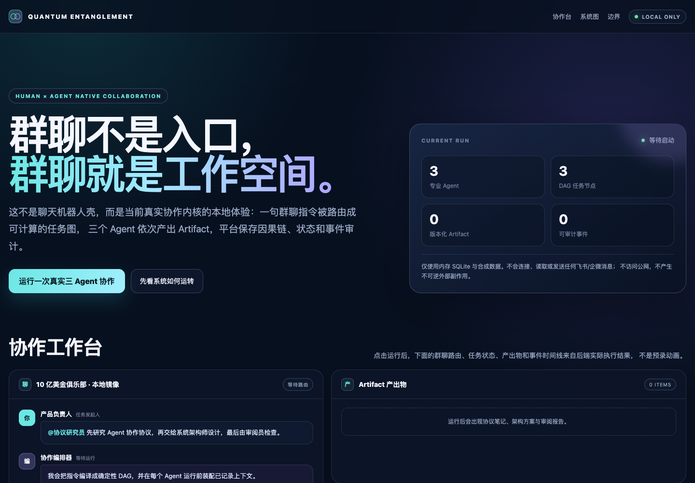
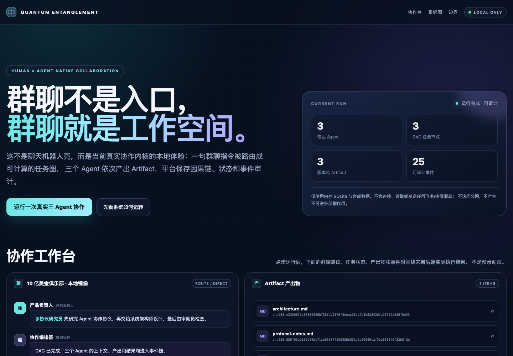
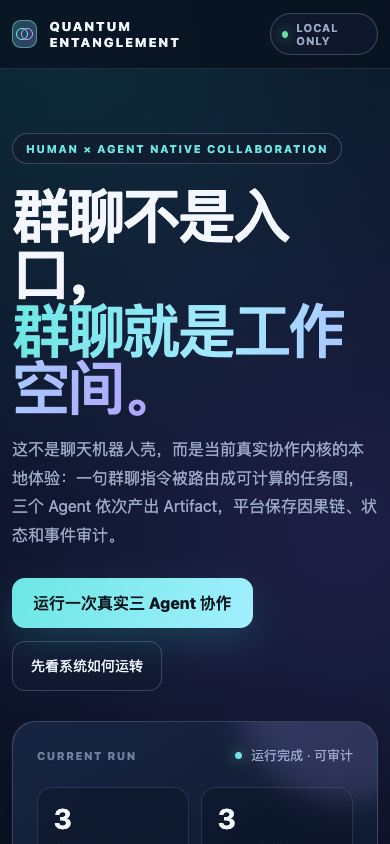
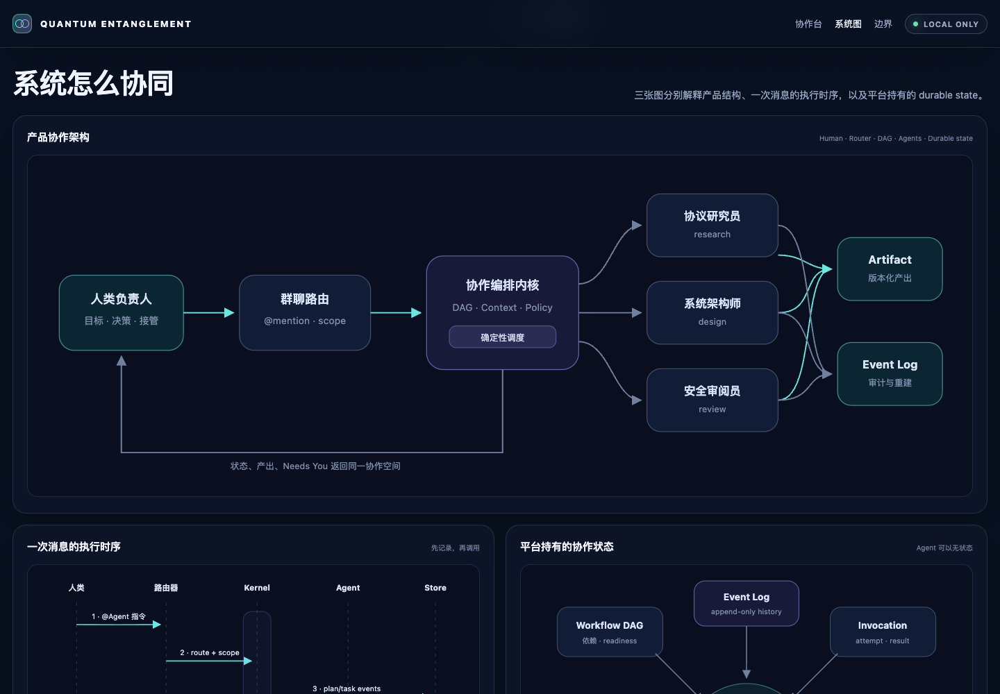

# Quantum Entanglement 本地产品体验入手教程

这份教程帮助你在本机启动并核验当前阶段的“人 + Agent 原生群聊协同”产品切片。它会真实执行仓库里的协作内核，展示任务 DAG、三个 Agent 的状态、三个版本化 Artifact 和完整事件链；但 Agent 输出仍是合成函数，不会调用大模型，也不会连接或发送任何飞书、企微消息。

> 当前定位：可运行、可审计的本地产品体验，不是生产发布。Gate A–E 仍全部关闭。

## 1. 最快开始

前置条件：

- macOS 或 Linux；
- Python 3.9 或更高版本；
- 任意现代浏览器；
- 不需要安装第三方 Python 包，不需要配置模型凭据。

进入仓库后运行：

```bash
cd /Users/lwblx/huapohen/agent/execute/quantum_entanglement
./scripts/start_local_trial.sh
```

脚本默认执行三件事：

1. 检查 Python 版本；
2. 在 `127.0.0.1:8765` 启动仅本机可访问的服务；
3. 用本次启动专属的临时页面令牌打开浏览器。

终端会显示类似下面的提示：

```text
Quantum Entanglement 本地体验已启动（仅合成数据，不连接任何聊天平台）
http://127.0.0.1:8765/#token=…
按 Ctrl-C 停止。
```

令牌每次启动都会重新生成，在该服务进程存活期间可用于多次本地 demo 调用。页面读到令牌后会立刻从地址栏移除 fragment；后续调用只把它放在发往同源 loopback 服务的 `X-QE-Trial-Token` 请求头中。

## 2. 页面怎么试

打开页面后，先确认右上角显示 `LOCAL ONLY`，然后点击“运行一次真实三 Agent 协作”。这次运行不是预录动画：浏览器会调用本地 `/api/demo`，后端再执行仓库中的 `run_demo()`。

正常完成后应看到：

| 区域 | 预期结果 | 代表什么 |
| --- | --- | --- |
| 运行状态 | `运行完成 · 可审计` | 本地协作执行完成 |
| 群聊路由 | `ROUTE / DIRECT` | mention 路由选择了目标 Agent |
| 任务 DAG | research、design、review 全部 `COMPLETED` | 依赖顺序由确定性调度器推进 |
| Artifact | 3 ITEMS | 协议笔记、架构方案、审阅报告各形成一个版本 |
| Needs You | 0 BLOCKERS | 当前合成场景没有审批或歧义阻断 |
| 事件时间线 | 25 EVENTS | 计划、任务、上下文、调用、产出和结果均进入因果序列 |

三个预期 Artifact 是：

- `protocol-notes.md`：协议研究员的产出；
- `architecture.md`：系统架构师的产出；
- `review.md`：安全审阅员的产出。

每个 Artifact 卡片会显示版本号和 digest。运行生成的 session、plan 和 Artifact ID 可以变化，但任务数量、Artifact 数量、事件数量和因果顺序应保持稳定。

页面下半部分还有三张完整内联 SVG：

1. 产品协作架构图：人类、群聊路由、编排内核、专业 Agent、Artifact 与 Event Log 的关系；
2. 消息执行时序图：从 `@Agent` 指令到先记录、再调用、再投影回 UI 的顺序；
3. 平台状态关系图：Session、DAG、Invocation、Approval、Artifact、Event Log 与 Projection 的关系。

继续向下可看到 Gate A–E 阶梯和当前边界。展开“给工程师看的原始结果”，可以直接核对后端返回的 JSON，而不是只看 UI 投影。

## 3. 已保存的浏览器验收截图

下面四张图来自绑定 Git commit `8e4d8d7990d536ce78c1e65c5a3eb77bafc54c24` 的 Playwright 本地验收；完整 SHA-256、尺寸、生成时间和证据限制见 [`analysis_report/screenshots/manifest.json`](../analysis_report/screenshots/manifest.json)。

桌面初始态：



真实运行后的桌面完成态：



390×844 移动端完成态：



架构、执行时序和平台状态图：



这些是 viewport 证据，不代表真实模型、外部 connector、持久化部署或生产门禁已经通过。

## 4. 其他启动方式

### 只启动服务，不自动打开浏览器

```bash
./scripts/start_local_trial.sh --no-open
```

把终端打印的完整 URL 复制到浏览器即可。不要直接双击 `index.html`，也不要丢掉 URL 中初始的 `#token=…`；缺少启动令牌时，页面会故意禁用运行按钮。

### 更换端口

```bash
./scripts/start_local_trial.sh --port 8877
```

端口必须是 `1` 到 `65535` 的整数。服务始终只绑定 `127.0.0.1`，脚本不提供公网监听选项。

### 直接看 CLI 结果

```bash
./scripts/start_local_trial.sh --cli
```

CLI 模式执行与网页后端相同的合成协作 demo，然后把完整 JSON 输出到终端。正常结果应包含 3 个 Artifact、25 个事件、0 个 Needs You 和 0 个 errors。

### 指定 Python

```bash
QE_TRIAL_PYTHON=/usr/bin/python3 ./scripts/start_local_trial.sh
```

`QE_TRIAL_PYTHON` 可以是 PATH 中的命令，也可以是 Python 可执行文件的绝对路径。若某个较新的 Python 在冷启动时明显偏慢，可显式选择已安装的 Python 3.9–3.13。

### 查看全部参数

```bash
./scripts/start_local_trial.sh --help
```

## 5. 怎么停止

回到启动服务的终端，按 `Ctrl-C`。服务会关闭监听端口并退出。页面随即无法再运行；下次启动会生成新令牌。

如果使用 `--cli`，进程会在打印 JSON 后自动退出。

## 6. 数据、网络与安全边界

本地体验刻意保持一个很窄的边界：

- HTTP 服务只监听 `127.0.0.1`，不会监听局域网或公网地址；
- 每次启动使用新的随机令牌，API 对无令牌或错误令牌 fail closed；
- 服务检查 Host、Origin、`Sec-Fetch-Site`、请求体长度和单并发运行；
- 页面不加载 CDN、外部字体、统计脚本或第三方 JavaScript；
- 动态数据通过 `textContent` 写入 DOM，不使用 `innerHTML` 或 `eval`；
- Content Security Policy、`X-Frame-Options: DENY`、`no-store` 等响应头默认启用；
- demo 使用内存 SQLite 和合成输入，停止进程后数据消失；
- 不读取、不连接、不发送任何飞书、企微或其他真实消息；
- 不调用外部模型、不访问客户数据、不执行不可逆外部副作用。

`boundary.productionApproved=false` 和 `gateStatus="A-E closed"` 是有意保留的事实。页面能运行，只代表当前产品切片可本地体验，不代表生产安全审批、私有试点批准或商用就绪。

## 7. 常见问题

### `Permission denied`

恢复脚本的可执行权限：

```bash
chmod +x scripts/start_local_trial.sh
```

然后重新运行脚本。

### `需要 Python 3.9 或更高版本`

确认版本：

```bash
python3 --version
```

安装或选择合适版本后，通过 `QE_TRIAL_PYTHON` 指定它。脚本不会自动安装软件，也不会改动系统 Python。

### `Address already in use`

默认端口 `8765` 已被其他程序占用。换一个端口：

```bash
./scripts/start_local_trial.sh --port 8877
```

### 页面提示“启动令牌缺失”

通常是直接打开了 HTML 文件、手动删掉了首次 URL 的 fragment，或复用了旧页面。关闭旧页面，重新运行启动脚本，并使用终端刚打印的完整 URL。

### 点击运行后显示 `trial_run_busy`

服务一次只允许一个 demo 运行。等待当前运行结束后再点；不要同时在多个标签页反复触发。

### 页面没有自动打开

终端中的服务仍可能已经启动。复制它打印的 `http://127.0.0.1:…/#token=…` 完整地址到浏览器；或使用 `--no-open` 明确采用手动打开方式。

### 较新 Python 首次启动较慢

本机验证中，Python 3.14 的冷启动可能需要约 30–40 秒，Python 3.9/3.13 更快。页面尚未出现时先观察终端；也可用 `QE_TRIAL_PYTHON` 选择 Python 3.9–3.13。

## 8. 自己跑验收

无需第三方依赖即可执行功能测试：

```bash
PYTHONPATH=src python3 -m unittest -v \
  tests.test_product_trial_server \
  tests.test_start_local_trial_script
```

还可以先做 shell 语法检查：

```bash
sh -n scripts/start_local_trial.sh
```

验收重点不是“页面能打开”这一件事，而是：

1. 默认启动不会连接外部消息平台；
2. 没有 token 时 API 拒绝调用；
3. 点击一次后出现 3 个 completed task、3 个 Artifact 和 25 个事件；
4. 原始 JSON 与 UI 数字一致；
5. `Ctrl-C` 后服务停止；
6. 手机宽度和桌面宽度都能阅读三张系统图与核心状态。

## 9. 当前最值得你核验的产品问题

试用时可以重点判断：

- 群聊、任务 DAG、Artifact、Needs You 和事件时间线是否属于同一个自然工作空间；
- 三个 Agent 的分工与依赖是否一眼可理解；
- “先记录、再调用”和“平台持有状态”的价值是否从 UI 中表达清楚；
- 哪些信息应默认展示，哪些更适合藏在工程师原始 JSON 中；
- Needs You 是否应该成为所有审批、歧义和不可确定副作用的统一入口；
- 这套交互离你心中的“人和 Agent 协同办公软件”还缺哪一个最关键动作。

代码入口：

- 启动脚本：`scripts/start_local_trial.sh`
- 本地 HTTP 服务：`examples/product_trial_server.py`
- 产品体验页面：`examples/product_trial/index.html`
- 合成协作场景：`examples/group_chat_demo.py`
- 核心实现：`src/quantum_entanglement/`
