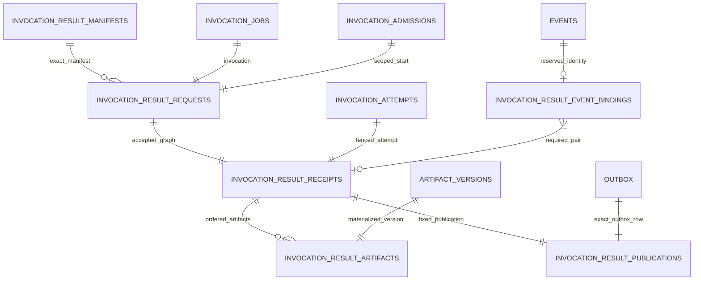

# Inactive Invocation Results Schema V1

- Status: design frozen for an inactive migration-7 candidate
- Date: 2026-08-29
- Activation: **disabled**
- Public writer/reader: **absent**
- Active legacy migration registry: versions `1..6` only
- Related ADR: [`ADR_0005_ATOMIC_RESULT_AUTHORITY.md`](../production/ADR_0005_ATOMIC_RESULT_AUTHORITY.md)

## 1. Purpose and stop line

This schema is the future durable graph for one scoped, pure invocation result. It exists in M4 so
the SQL, migration descriptor, Artifact foreign keys, event coordinates, fixed publication identity
and backup topology can be reviewed before a writer exists.

The candidate must not be appended to `migrations.MIGRATIONS`, loaded by legacy store bootstrap,
accepted by bridge-only planning, or made reachable from a public API. Explicit tests may use a
private candidate rehearsal on an isolated database. A rehearsal is not activation and is not the
future native migration executor.

M4 does not create `ObservedV2` or `AcceptedV2`, update job/attempt/task state, send an outbox
message, or authorize a worker. A database merely containing these tables has no accepted-result
authority. A later writer must create and verify the complete graph in one owner transaction and
receive an unambiguous COMMIT acknowledgement.

## 2. Frozen migration coordinate

The candidate uses the coordinate frozen by ADR 0005:

```text
migration_id: 7
filename: 0007_invocation_results.up.sql
domain: invocation_results
domain_version: 1
kind: native
dependencies: [1, 2, 4]
enabled: false
```

Migration 1 owns jobs/attempts, migration 2 owns Artifact blobs/versions and migration 4 owns scoped
invocation admission. `events` and `outbox` are EventStore core objects, not migration-3 objects;
their exact topology is a separate component precondition. Migration 7 does not depend on migration
3.

The private candidate manifest records `enabled=false` and the EventStore component precondition.
The existing `DomainMigrationDescriptor` deliberately has neither field, so the descriptor alone
must never be treated as activation permission.

## 3. Durable graph



SQL foreign keys prevent accepted receipts and their materialized children from becoming structural
orphans; an event reservation without a receipt is deliberately treated as an incomplete graph.
Migration dependencies grant read access, not ownership, so migration 7 creates no index, trigger or
other object on a dependency table. The existing parent keys cannot prove that separately valid event
coordinates identify one row, that legacy parent rows carry every tenant/workspace binding, or that
child counts equal the receipt count. The future writer and reader must load fixed raw projections in
one snapshot and reject any missing, extra, reordered, advanced, mixed-coordinate or cross-scope row.

## 4. `invocation_result_manifests`

One canonical manifest preimage per scoped digest:

- composite primary key `(tenant_id, workspace_id, manifest_digest)`;
- exact `schema_version = 2`;
- canonical bytes as SQLite BLOB, exact byte size and bounded creation timestamp;
- maximum canonical size 1 MiB.

Readback must decode the bytes with exact `ScopedInvocationResultManifestV2`, require byte-for-byte
canonical re-encoding, recompute the domain-separated digest and verify every scope field. The row
never stores Artifact content or a capability.

## 5. `invocation_result_requests`

One deterministic acceptance-request identity per scoped invocation:

- scoped composite primary key `(tenant_id, workspace_id, request_digest)`;
- schema version, acceptance idempotency key and exact canonical request-identity bytes;
- invocation/session/plan/task/agent and job idempotency scope;
- start-receipt, execution-manifest and result-manifest digests;
- expected stream version plus running/terminal task revisions;
- correlation, causation and runtime revisions;
- pure effect class and canonical empty action-receipt-set digest;
- result reference, optional primary Artifact ID and exact Artifact count;
- foreign keys to the owning job, admission and scoped manifest.

Uniqueness covers the globally unique invocation plus scoped session/task, acceptance idempotency and
result reference. The future readback still verifies the complete job/admission payload because the
legacy parent tables do not contain tenant/workspace columns.

## 6. `invocation_result_receipts`

One capability-free receipt graph per request:

- scoped receipt and request identity;
- exact attempt ID/number, lease epoch, worker and lease-token digest;
- accepted timestamp, result reference, Artifact count and evidence/transition/receipt digests;
- result and terminal event IDs, types, timestamps, stream sequences, global positions and envelope
  digests;
- foreign keys to the request, globally unique job attempt, both event IDs, both stream/sequence pairs
  and both global positions;
- deferred composite foreign keys to the exact scoped result and terminal event bindings.

The independent event foreign keys reject orphans but cannot prove that all coordinates came from the
same row. M5 therefore re-reads a fixed raw event projection and uses the M3 envelope adapter before
acceptance continues. SQL additionally requires the result event to be
`task.invocation.result.accepted`, the terminal event to be `task.status.changed`, immediately follow
it in stream/global order and share `accepted_at`.

Receipt uniqueness covers the global invocation, attempt, event IDs and global positions plus scoped
acceptance idempotency and result reference. The receipt stores no plaintext lease token, `fresh`
flag, accepted boolean or other durable capability.

### 6.1 `invocation_result_event_bindings`

Two normalized identity reservations exist for every durable receipt, one `result` and one
`terminal`. A role/type CHECK binds those roles to
`task.invocation.result.accepted` and `task.status.changed`. A single table-wide unique domain for
`event_id` and `global_position` prevents an identity reserved in either role from being reused in
the other role or by another scoped result graph. The receipt's two non-null composite foreign keys
make both reservations mandatory and bind scope, receipt, ID, type and global position together.

The binding table intentionally has no reverse foreign key to the receipt, avoiding a cyclic schema
dependency. Therefore an orphan reservation remains a partial graph that M5 fixed raw-row readback
must reject. Migration down also refuses to proceed while any reservation remains. Independent
foreign keys from a binding to event ID/global position still cannot prove those coordinates came
from one raw event row; M5 verifies that equality with the envelope adapter before COMMIT.

## 7. `invocation_result_artifacts`

One row per ordered Artifact descriptor/candidate:

- scoped primary key `(tenant_id, workspace_id, receipt_id, ordinal)`, with ordinal `0..255`;
- exact Artifact ID/name/version/parent/media type/blob digest/byte size;
- metadata, Artifact request and in-process candidate digests;
- created-by and Artifact idempotency identities;
- foreign keys to the receipt and globally unique `artifact_versions.artifact_id`.

Each Artifact ID is globally unique in the current parent schema and may belong to only one result
receipt. Tenant/workspace/version cannot be part of the SQL foreign key without modifying the
dependency domain, so continuous ordinals, exact child count, primary Artifact binding and equality
with both manifest descriptors and raw Artifact rows remain mandatory whole-graph readback checks.

## 8. `invocation_result_publications`

Publication is a closed, fixed one-to-one graph edge, not an optional set:

- one row per receipt, with exact `publication_kind = 'result_terminal_outbox_v1'`;
- scoped receipt identity, outbox message ID, destination and idempotency key;
- canonical payload/header digests, triggering terminal event ID/global position and creation time;
- a composite foreign key to the exact terminal identity of the same receipt and a foreign key to the
  globally unique outbox message.

Message ID and triggering event ID/global position are globally unique in the result graph. The
composite receipt foreign key prevents a publication from borrowing another graph's event or even the
same receipt's result event. The receipt codec does not currently self-digest publication identity,
and the independent outbox foreign key does not prove one exact outbox row, so a receipt row alone
must never prove the complete graph. M5 must derive the fixed publication deterministically and
final-read both the publication and raw outbox row before COMMIT. Missing or extra publication is a
partial graph, not success. Actual publishing remains disabled.

## 9. SQL and codec invariants

- all identifiers are non-empty bounded SQLite TEXT with exact storage class checks;
- every SHA-256 field is exactly 64 lowercase hexadecimal characters; blob digests use canonical
  `sha256:<hex>`;
- schema versions are exact `2`; Artifact count is `0..256`;
- coordinates and revisions are exact positive signed-64 integers at the Python boundary;
- canonical JSON/preimage columns are bounded SQLite BLOB; Artifact content exists only in
  `artifact_blobs`;
- timestamps are canonical UTC microseconds at the Python/write boundary and stored as 27-byte
  SQLite TEXT;
- no permanent trigger is introduced;
- all candidate foreign keys use `ON UPDATE RESTRICT ON DELETE RESTRICT`;
- migration 7 never creates an object on a dependency-owned table;
- global attempt/event/message/Artifact identities cannot be reused by another scoped result graph;
  result and terminal event roles share one normalized uniqueness domain;
- the down script first uses a temporary CHECK guard to reject any non-empty candidate graph, then
  rejects any future sidecar migration that depends on 7, drops only candidate-owned objects and
  removes 7's outgoing dependency rows, metadata and ledger row in that order. It cannot delete
  accepted rows silently or run without the exact sidecar prerequisite.

## 10. Registration and compatibility fences

- active `MIGRATIONS`, `LEGACY_DOMAIN_MIGRATIONS`, `DOMAIN_MIGRATION_REGISTRY`, active backup
  topology and backup-v1 core tables remain byte-for-byte unchanged;
- default `SQLiteEventStore` installs schema 1–6 only and creates no result table;
- the independent known-candidate registry is metadata, not an executor;
- existing bridge planner/applier cannot receive the candidate;
- an old binary opening a rehearsed v7 database fails closed before mutation;
- generic result-event and standalone scoped-completion fences remain unchanged;
- no package-root export, public writer, connection parameter or transaction escape hatch is added.

## 11. Activation gates

Migration 7 remains inactive until all are retained:

1. exact descriptor, DDL and topology Golden evidence;
2. empty/non-empty candidate rehearsal, rollback/down guard and foreign-key evidence;
3. default-deny sparse/native executor with sidecar metadata, dependency and fleet-floor checks;
4. backup-v2 snapshot, restore, tamper and reconcile support for every new object;
5. Artifact same-transaction primitives and rollback/orphan/crash evidence;
6. M5 atomic writer with final whole-graph readback and fault injection;
7. M6 replay/reopen/ACK-loss recovery returning only `ObservedV2`;
8. an isolated migration-registration commit after compatibility review.

Registering migration 7, opening a writer or enabling worker dispatch in the same commit is
forbidden.
