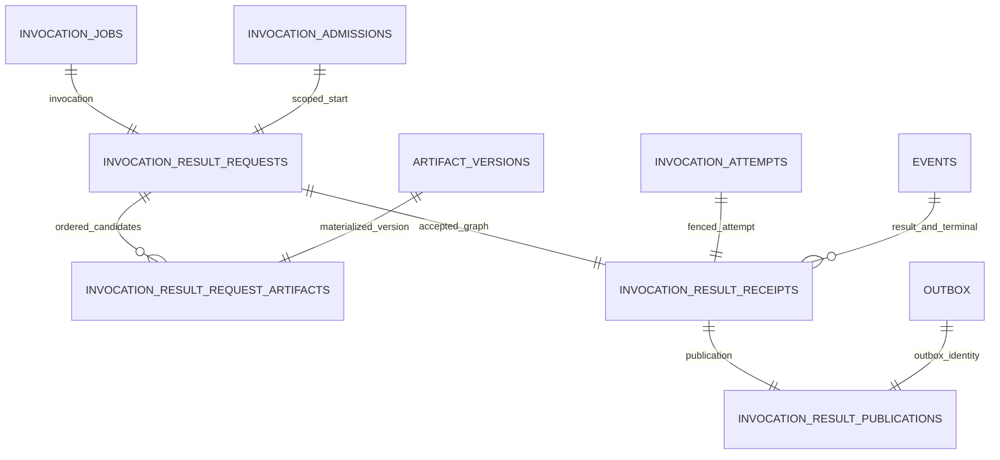

# Inactive Result Authority Schema V1

- Status: design frozen for an inactive migration-7 candidate
- Date: 2026-08-29
- Activation: **disabled**
- Public writer/reader: **absent**
- Active legacy migration registry: versions `1..6` only
- Related ADR: [`ADR_0005_ATOMIC_RESULT_AUTHORITY.md`](../production/ADR_0005_ATOMIC_RESULT_AUTHORITY.md)

## 1. Purpose and stop line

This schema is the future durable graph for one scoped, pure invocation result. It exists in M4 so
the SQL, migration descriptor, Artifact foreign keys, event coordinates, publication identity and
backup topology can be reviewed before a writer exists.

The candidate must not be appended to `migrations.MIGRATIONS`, loaded by legacy store bootstrap,
accepted by bridge-only planning, or made reachable from a public API. Explicit tests may apply a
separate candidate registry to an isolated database. That rehearsal is not activation.

M4 does not create `ObservedV2` or `AcceptedV2`, does not update job/attempt/task state, does not
send an outbox message, and does not authorize a worker. A database merely containing these tables
does not contain accepted result authority unless a later writer creates and verifies the complete
graph in one transaction and receives an unambiguous COMMIT acknowledgement.

## 2. Dependency coordinate

The candidate uses global migration ID `7`, domain `result_authority`, domain version `1`, kind
`native`, and exact dependencies:

```text
1 invocation jobs/attempts
2 Artifact blobs/versions
4 scoped invocation admission
```

It also owns one composite event-coordinate index over the pre-migration `events` table. The
`events` and `outbox` tables are event-store core objects rather than legacy migration objects, so
their presence remains an explicit composition prerequisite and is covered by the candidate
topology profile.

## 3. Durable graph



The cardinalities above describe the complete future graph. SQL foreign keys prevent orphans, but
the future writer/readback must also reject a missing Artifact/publication row, unexpected count,
wrong order, wrong event envelope digest or any cross-scope mismatch.

## 4. `invocation_result_requests`

One deterministic request identity per invocation. It stores no Artifact content and no secret
preimage.

Required identity:

- `request_digest` primary key and `acceptance_idempotency_key`;
- schema version, tenant/workspace/invocation/session/plan/task/agent scope;
- job idempotency, start-receipt digest and execution-manifest digest;
- canonical result-manifest JSON and digest;
- expected stream version and running/terminal task revisions;
- correlation, causation and runtime revision;
- pure effect class plus the canonical empty action-receipt-set digest;
- result reference, optional primary Artifact ID and exact Artifact count.

Uniqueness is enforced for invocation, scoped session/task and scoped acceptance idempotency. The
row references both `invocation_jobs` and `invocation_admissions`; an attempt-only or unscoped job
cannot own a request row.

## 5. `invocation_result_request_artifacts`

One row per ordered Artifact descriptor/candidate identity:

- `(request_digest, ordinal)` primary key with `0 <= ordinal < 256`;
- exact Artifact ID/name/version/parent/media type/blob digest/byte size;
- metadata, Artifact request and in-process candidate digests;
- created-by and Artifact idempotency identities;
- foreign keys to the request and the materialized `artifact_versions` row.

Artifact ID, name and idempotency key are unique within one request. Version lineage is exact. The
future Artifact transaction primitive must derive this row from the same frozen candidate used for
the blob/version INSERT, then re-read both tables before result acceptance continues.

## 6. `invocation_result_receipts`

One capability-free durable receipt graph per request:

- receipt/request/scope identities;
- exact attempt number, lease epoch, worker and lease-token digest;
- accepted timestamp, result reference and Artifact count;
- canonical evidence JSON/digest and terminal-transition JSON/digest;
- result and terminal event IDs, types, timestamps, stream sequence, global position and envelope
  digests;
- final receipt digest.

Both event foreign keys use one owned composite unique index over
`(event_id, stream_id, sequence, global_position, event_type, timestamp)`. This prevents a receipt
from combining individually valid coordinates taken from different rows. SQL also requires the
terminal event to immediately follow the result event and both timestamps to equal `accepted_at`.
The envelope digests are recomputed from exact raw event rows by M3; they are not trusted because
they appear in this receipt table.

## 7. `invocation_result_publications`

One explicit publication binding per receipt:

- receipt ID primary key;
- tenant/workspace/invocation scope;
- outbox message ID and idempotency key;
- payload digest, triggering terminal event ID and creation timestamp.

The row references both the receipt and `outbox.message_id`. A later writer must verify destination,
payload bytes, headers, idempotency and triggering-event fields from the raw outbox row. Missing
publication is a partial graph, not a successful result.

## 8. SQL and codec invariants

- all identifiers are non-empty and bounded; no caller adapter or implicit JSON conversion runs in
  SQLite binding;
- every SHA-256 field is exactly 64 lowercase hexadecimal characters; blob digests use canonical
  `sha256:<hex>`;
- schema versions are exact `2`; Artifact count is `0..256`;
- all coordinates are positive signed-64 integers and never booleans at the Python boundary;
- canonical JSON columns are bounded SQLite TEXT; Artifact content remains only in
  `artifact_blobs`;
- accepted timestamps use canonical UTC microseconds at the Python/write boundary;
- no trigger is introduced; M3 rejects trigger side effects;
- foreign keys use `ON UPDATE RESTRICT ON DELETE RESTRICT`;
- downgrade drops only candidate-owned objects and never deletes accepted production data without
  an explicit, separately reviewed rollback decision.

## 9. Activation gates

Migration 7 remains inactive until all are retained:

1. exact descriptor/DDL/topology Golden evidence;
2. empty and non-empty upgrade, downgrade rehearsal and foreign-key check;
3. sparse/domain migration executor with fleet floor and old-binary behavior;
4. backup-v2 snapshot, restore, tamper and reconcile support for every new object;
5. Artifact same-transaction primitives and rollback/orphan evidence;
6. M5 atomic writer with final whole-graph readback and fault injection;
7. M6 replay/reopen/ACK-loss recovery returning only `ObservedV2`;
8. an isolated migration-registration commit after compatibility review.

Registering migration 7, opening a writer or enabling worker dispatch in the same commit is
forbidden.
