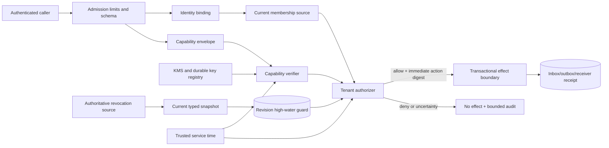

# Tenant authorization production runbook

Status: implemented security slice; **not a system-wide production-readiness claim**

Applies to: tenant/workspace scoped RBAC, attenuated capabilities, key rotation semantics,
revocation snapshots, and the SQLite revocation revision guard introduced by `49f3858` and
exported as public API by `bd29665`; typed authorization collections were bounded by
`345be30`.

Last verified: 2026-08-20

This runbook defines how the authorization slice must be composed, operated, recovered,
and verified. It is deliberately fail-closed. If an operator cannot prove that identity,
membership, key state, revocation state, and service time are current, the correct result is
denial and containment—not a permissive fallback.

## 1. Release meaning and hard boundary

The code now provides a strong authorization primitive. It does **not** by itself make the
whole Quantum Entanglement repository safe for public Internet exposure or mutually
untrusted tenants.

### 1.1 Implemented and directly tested

| Capability | Implemented behavior |
|---|---|
| Tenant/workspace scope | Typed tenant and workspace identifiers; role and capability scope cannot cross tenants |
| Default-deny RBAC | Active membership plus an in-scope role grant is required; request actions cannot contain wildcards |
| Capability trust boundary | Parsed claims are untrusted; every decision re-verifies the canonical signed envelope with the authorizer-owned verifier |
| Proof binding | Protocol, trust domain, policy version, proof type, claims, `kid`, algorithm, and each parent-child edge are bound into proof verification |
| Delegation attenuation | Child action, resource, tenant, workspace, audience, issuer, activation, expiry, and parent fingerprint may only preserve or narrow authority |
| Root authority | A root key must have `ROOT` usage and explicit authority for the claims' tenant |
| Delegation authority | Delegation keys are separately typed and must belong to the delegating parent subject |
| Key lifecycle | Within one `RotatingHMACKeyRing`, key identity is immutable, status moves only `active -> verify_only -> revoked`, and removed `kid` values are tombstoned |
| Revocation | Revocation identity is tenant + issuer + nonce; every ancestor is checked; same-revision state conflicts and revision rollback fail closed |
| Durable revision guard | `SQLiteRevocationRevisionGuard` uses `BEGIN IMMEDIATE`, compare-and-set, exact owned-schema validation, write postconditions, rollback on failure, and cross-process persistence |
| Audit value object | Decisions have consistent outcome/code pairs, canonical evidence ordering, and a deterministic content digest |
| Strict decoding | Unknown fields, type coercion, malformed timestamps, non-canonical signatures, duplicate revoked IDs, and weak nonces are rejected |
| Typed collection bounds | Role bindings, revocations, key records/tenant assignments, capability chains, capabilities per decision, decision evidence, and role grants fail closed at documented hard limits |

### 1.2 Not provided; these remain production blockers or required adapters

| Missing guarantee | Required production control |
|---|---|
| Authentication | OIDC/JWT or mTLS admission that binds an authenticated principal; never accept `subject_id` from an unauthenticated body |
| Membership freshness | Authoritative membership revision/epoch and action-time lookup; `Member` itself contains no revision or freshness timestamp |
| Production key custody | KMS/HSM-backed signing and verification plus a durable key registry and persistent retired-`kid` tombstones |
| Host-clock rollback defense | Trusted time synchronization, rollback detection, and a service-time high-water policy; `SystemClock` is wall-clock time |
| Transport and capacity limits | Compressed/decompressed body, JSON depth, rate, concurrency, and total per-tenant storage/cost quotas before domain construction and across retained state |
| One-time execution or replay defense | Transactional inbox, idempotency key, effect receipt, and receiver reconciliation; `request_id` and a capability nonce are not an effect receipt |
| Tamper-evident audit storage | Append-only authenticated audit sink/checkpoint; `decision_id` is SHA-256 content addressing, not a signature or MAC |
| Full physical tenant isolation | Tenant/workspace keys and constraints in every event, artifact, projection, cache, backup, error, and observability path |
| Multi-host revision consensus | A serializable durable database implementation of `RevocationRevisionGuard`; SQLite must not be shared over NFS/SMB |
| Data/tool constraints | Separate policy binding for data classification, destination, action digest, secret handle, tool/connector, and approval revision |

Until every applicable row is closed and retained release evidence proves the result, use
this slice only inside the pre-production boundary defined by
[`THREAT_MODEL.md`](./THREAT_MODEL.md). Never replace a missing control with
`InMemoryRevocationRevisionGuard`, an ephemeral key ring, a cached membership, or a stale
revocation snapshot.

## 2. Trust boundaries and action-time flow



The arrows are mandatory dependencies, not suggestions. The caller cannot provide the
authorization timestamp, trusted membership, key status, or revocation revision. Model
text, retrieved documents, chat history, tool output, and serialized `VerifiedCapability`
objects are data and cannot grant authority.

For every external or irreversible effect, execute this sequence:

1. Authenticate the transport and bind the authenticated principal to the request
   subject. Reject a mismatch before parsing authority-bearing material.
2. Enforce compressed/decompressed body and JSON-depth limits before decoding; require all
   typed collections to remain within their hard limits, and enforce rate, concurrency,
   storage, and tenant-budget limits.
3. Resolve the current tenant membership from the authoritative source. Do not reuse a
   membership snapshot from an earlier workflow step.
4. Load a complete, fresh revocation snapshot for that tenant. Never truncate revoked IDs
   to fit memory; deny and escalate capacity instead.
5. Parse the strict capability envelope and verify it in the configured trust domain,
   policy version, audience, TTL, clock-skew, and chain-depth boundary.
6. Evaluate the concrete action and concrete resource with `TenantAuthorizer`.
7. If and only if `decision.allowed` is true, bind the decision to the normalized effect
   request and enter a transactional idempotency/receipt boundary immediately.
8. Re-evaluate after every material change: retry, re-plan, destination change, artifact
   version change, tool-argument change, approval change, worker takeover, or resumed task.
9. Persist a redacted decision record and effect receipt. Never persist the proof,
   signature, nonce, secret, bearer token, or full envelope in ordinary logs.

An authorization decision is not a reservation. Time, membership, revocation, key status,
resource version, and action parameters can change between planning and execution.

## 3. Composition reference

All public symbols below are exported from `quantum_entanglement`. The example shows
composition, not complete admission or KMS implementation.

```python
from datetime import timedelta

from quantum_entanglement import (
    CapabilityVerifier,
    RotatingHMACKeyRing,
    SQLiteRevocationRevisionGuard,
    SystemClock,
    TenantAuthorizer,
)


def build_single_host_reference(*, key_records, guard_path):
    """Compose the reference adapter; key_records must come from a secure registry."""
    clock = SystemClock()
    key_ring = RotatingHMACKeyRing(
        trust_domain="qe-prod-cn-1",
        policy_version="authz-2026-08-20.1",
        keys=key_records,
    )
    verifier = CapabilityVerifier(
        proof_verifier=key_ring,
        trust_domain="qe-prod-cn-1",
        policy_version="authz-2026-08-20.1",
        audience="qe-runtime",
        clock=clock,
        max_ttl=timedelta(minutes=15),
        max_clock_skew=timedelta(seconds=30),
        max_chain_depth=8,
    )
    revision_guard = SQLiteRevocationRevisionGuard(
        guard_path,
        busy_timeout_ms=5_000,
    )
    authorizer = TenantAuthorizer(
        capability_verifier=verifier,
        trust_domain="qe-prod-cn-1",
        policy_version="authz-2026-08-20.1",
        revision_guard=revision_guard,
        audience="qe-runtime",
        clock=clock,
        max_clock_skew=timedelta(seconds=30),
        max_revocation_age=timedelta(minutes=1),
    )
    return authorizer, verifier, revision_guard
```

Create the guard and authorizer once per process, not once per request. During shutdown,
stop admission first, drain or fence protected effects, and then call
`revision_guard.close()`. A one-shot administrative process may instead use the guard as a
context manager.

The built-in `RotatingHMACKeyRing` is suitable for deterministic tests and a controlled
single-process reference deployment. Passing records loaded from a secure registry does
not turn this in-memory ring into a durable production key registry. HMAC places reusable
symmetric key bytes in process memory; the ring's registry and tombstones disappear on
restart. A production adapter should normally keep private material in KMS/HSM custody and
implement the `CapabilityProofSigner`/`CapabilityProofVerifier` contract without exposing
secret bytes.

### 3.1 Action-time evaluation

```python
from quantum_entanglement import CapabilityEnvelope


def authorize_effect(
    *,
    request,
    current_member,
    current_revocation_snapshot,
    serialized_envelopes,
):
    verified = tuple(
        verifier.verify(CapabilityEnvelope.from_dict(value))
        for value in serialized_envelopes
    )
    decision = authorizer.evaluate(
        request,
        current_member,
        current_revocation_snapshot,
        verified,
    )
    if not decision.allowed:
        # Return a stable public code. Keep detailed context in a redacted audit sink.
        raise PermissionError(decision.code.value)
    return decision
```

Do not accept a serialized `VerifiedCapability`. It is a cache hint/value type, not a
portable attestation. The authorizer deliberately verifies its envelope again for every
decision.

### 3.2 Configuration invariants

| Setting | Rule |
|---|---|
| `trust_domain` | Environment/service boundary; exact match across signer, verifier, envelope, and authorizer |
| `policy_version` | Exact semantic policy boundary; changing it invalidates envelopes from another version |
| `audience` | Exact receiving service, not a broad company-wide string |
| `max_ttl` | Shortest interval compatible with the effect; long-lived grants require explicit review |
| `max_clock_skew` | Positive, monitored, and no larger than the infrastructure time-error budget |
| `max_chain_depth` | 1-64 in code; use a smaller capacity-tested deployment value |
| `max_revocation_age` | No longer than the incident containment objective and revocation-source SLO |
| `busy_timeout_ms` | 1-300000; timeout causes denial, never fallback |
| `role_actions` | Versioned configuration reviewed like code; omitted roles grant nothing |

Changing trust domain, policy version, audience, default role grants, TTL, or revocation
age is a security change. It requires threat-model review, compatibility planning,
negative tests, and its own release evidence.

## 4. Identity and membership freshness

`AccessRequest.subject_id` is an identifier, not authentication. The admission layer must
derive or verify it from an authenticated session or service credential. A body field,
model output, forwarded header, or unsigned protocol claim is insufficient.

`Member` proves only the data passed into its constructor. It carries neither a membership
revision nor `captured_at`. Therefore production composition must:

- read current status and role bindings at every effect boundary;
- bind the lookup to the authenticated subject and requested tenant;
- reject suspended, removed, missing, cross-tenant, or subject-mismatched membership;
- deny when the membership source is unavailable or its freshness cannot be proven;
- invalidate caches by authoritative revision/epoch before using them;
- record the membership/policy revision beside the decision in the external audit sink.

Long workflows must not inherit the membership that existed when planning began. Removal
or suspension must take effect before the next tool call, connector send, artifact write,
approval, or other protected operation.

The current authorizer also requires an active tenant member for capability-based access.
A service principal therefore needs an explicit current tenant membership or a separately
designed and reviewed service-principal admission path; do not bypass the member check.

## 5. Production key registry and rotation

### 5.1 Mandatory KMS/registry properties

Production promotion is blocked until the key adapter and registry prove all of these:

1. Private/symmetric material is generated and retained in KMS/HSM custody and never
   enters source, reports, events, prompts, artifacts, logs, traces, or error responses.
2. `kid` maps immutably to algorithm, principal, usages, tenant root authority, validity,
   and cryptographic identity.
3. Status is monotonic: `active -> verify_only -> revoked`. No rollback is accepted.
4. Removing a key creates a durable retired-`kid` tombstone that survives process,
   machine, database, region, backup, and restore transitions.
5. Root and delegation usage are separate. Root authority lists exact tenants; a
   delegation-only key cannot sign a root proof.
6. All changes are authenticated, attributable, reviewed, versioned, and exported to an
   immutable security audit channel.
7. Sign/verify and registry failure deny authorization. There is no cached permissive mode.
8. Backup/restore preserves the newest key status and tombstone state; restoring an older
   active state is forbidden.

The in-memory key ring enforces items 2-5 only during one ring instance. Restarting it is
not evidence of persistent anti-rollback semantics.

### 5.2 Planned rotation

1. Create a unique new `kid`; never recycle a removed or revoked identifier.
2. Add the new key as `active` while the old key remains verifiable.
3. Deploy verifier/authority metadata everywhere and prove all instances agree on key
   identity, usage, tenant scope, trust domain, and policy version.
4. Switch issuers to the new key and verify newly issued envelopes use it.
5. Move the old key to `verify_only`; signing with it must fail while existing proofs may
   verify during their bounded lifetime.
6. Wait at least the maximum issued TTL plus maximum clock skew and reconcile outstanding
   effects.
7. Mark the old key `revoked`, retain its immutable registry record/tombstone, and verify
   old proofs fail closed.

An accidental omission from `replace_keys` retires that `kid` for the current ring. Build
and validate the complete replacement set before the atomic call. Do not “repair” an
omission by restarting the process; that would exploit the reference adapter's missing
durability rather than preserve security.

### 5.3 Compromise response

For suspected key compromise:

1. stop protected effect admission for affected trust domains/tenants;
2. revoke the key in the authoritative registry immediately;
3. advance affected tenant revocation state and invalidate descendants;
4. rotate any key material that shared custody or exposure paths;
5. reconcile effects executed during the exposure window from durable receipts;
6. retain the `kid` tombstone permanently and preserve forensic evidence;
7. resume only after every verifier reads the new state and negative probes pass.

Availability loss is preferable to accepting a proof under uncertain key state.

## 6. Service time and rollback containment

Authorization uses `ServerClock`; requests contain no evaluation time. This prevents a
caller from backdating a request, but `SystemClock` still follows the host wall clock.
A host/NTP rollback can move an expired capability or key back into its validity interval.
The current slice has no durable authorization-time high-water mark.

Production requirements are therefore:

- authenticated time synchronization and an infrastructure clock-offset SLO;
- monitoring for offset, large forward steps, and every backward step;
- a service-owned clock adapter that raises/fails closed when rollback exceeds policy;
- durable time/epoch design for environments where host time is not a trusted boundary;
- short capability TTL and key validity windows as defense in depth, not the sole control.

On detected rollback, stop admission and outbound effects, preserve security-state files,
repair time, reload keys/membership/revocations, and rotate or revoke grants whose validity
cannot be proven. Do not increase `max_clock_skew` to hide the incident.

## 7. Revocation state protocol

### 7.1 Snapshot rules

A `RevocationSnapshot` is tenant-specific and contains:

- a monotonically increasing integer revision;
- a trusted capture timestamp;
- the complete set of revoked `(tenant, issuer, nonce)` identities;
- a canonical state digest derived from tenant, revision, and the sorted revoked set.

Refreshing only `captured_at` may keep the same revision if and only if the revoked set is
identical. Every state change must advance the revision. The same revision with a different
digest is split-brain or tampering and must stop that tenant's authorization path.

The snapshot producer—not a request or agent—owns revision assignment and capture time.
Transport integrity/authentication and source availability are external requirements.

### 7.2 First seed and new-tenant bootstrap

An empty high-water database accepts the first valid `(revision, digest)` it sees. That is
safe only when admission is closed and the first value comes from the authoritative source.

Bootstrap procedure:

1. keep the tenant and every effect worker in non-emitting maintenance mode;
2. authenticate and load the authoritative tenant snapshot;
3. verify its provenance, completeness, revision, capture time, and digest;
4. compare it with an external immutable checkpoint if the tenant existed previously;
5. call the durable guard once to seed the value;
6. read back `high_water()` and `state_digest()` and require exact equality;
7. run stale, lower-revision, and same-revision/different-state negative probes;
8. enable admission only after membership, key, time, and receipt reconciliation also pass.

Never allow ordinary user traffic to race the first seed.

### 7.3 Startup and runtime

At startup, open the durable guard before accepting traffic. Initialization validates its
owned schema and all existing rows. For every known tenant, compare the stored high-water
state with an authenticated current snapshot or checkpoint. At runtime, refresh snapshots
well before `max_revocation_age`; do not wait for requests to discover staleness.

Lower revisions and same-revision/different-digest states return denial. Higher revisions
advance atomically. Database error, lock timeout, malformed row, trigger, custom index,
schema mismatch, lost postcondition, or commit failure is an authorization outage—not a
reason to switch to an in-memory guard.

## 8. SQLite guard deployment

### 8.1 Supported topology

Use `SQLiteRevocationRevisionGuard` only when all authorizer processes that share tenants
run on one host and open the same local-filesystem path. Each process may use its own guard
instance; SQLite locking serializes `BEGIN IMMEDIATE` transactions.

Do not place the database on NFS, SMB, object-store mounts, replicated volumes with weak
locking, or independently copied per-process paths. For multi-host/region deployment,
implement `RevocationRevisionGuard` on a database that proves serializable or equivalent
per-tenant compare-and-set behavior and durable restore semantics.

Use a dedicated security database and directory. Do not combine it with application tables
or add indexes, triggers, views, or migrations to its owned table. The guard intentionally
rejects an altered schema.

### 8.2 Filesystem and process controls

The implementation creates a new database with mode `0600`. It does not repair or reject
an already existing file with weaker permissions. Operators must verify all of the
following before startup:

- parent directory is owned by the service account and mode `0700` (or an equivalently
  reviewed ACL);
- database is a regular local file, not a symlink;
- existing database mode is `0600` and owner/group are correct;
- WAL/SHM files, backups, manifests, and temporary restore paths inherit equivalent
  protection;
- only the service and backup identity can read or write the directory;
- disk-full, inode, latency, lock contention, and corruption alerts are enabled.

macOS inspection example:

```bash
test ! -L /var/lib/quantum-entanglement/security/revocation-high-water.sqlite3
stat -f '%HT %Lp %Su:%Sg %N' \
  /var/lib/quantum-entanglement/security \
  /var/lib/quantum-entanglement/security/revocation-high-water.sqlite3
```

Linux inspection example:

```bash
test ! -L /var/lib/quantum-entanglement/security/revocation-high-water.sqlite3
stat -c '%F %a %U:%G %n' \
  /var/lib/quantum-entanglement/security \
  /var/lib/quantum-entanglement/security/revocation-high-water.sqlite3
```

Do not print table contents in ordinary diagnostics. Tenant IDs and revision patterns are
security metadata even though the state digest is not a credential.

### 8.3 Backup

The guard database is security control state. A main application backup without the
corresponding newest revocation high-water and key registry state is not authorization-safe.

1. Record an authenticated external checkpoint of each tenant's revision/digest and the
   key-registry epoch before backup.
2. Use SQLite's online backup API or a coordinated checkpoint/stop procedure. Never copy
   only the main file while uncheckpointed WAL data may exist.
3. Encrypt the backup, restrict access, calculate an integrity digest, and retain source
   commit/schema metadata.
4. Verify the copy by opening it with `SQLiteRevocationRevisionGuard`; schema and every row
   must validate.
5. Compare all restored rows with the external checkpoint and authoritative revocation
   source.
6. Exercise restore in a non-emitting environment and retain the result in phase release
   evidence.

The general Quantum Entanglement backup helper validates the application's migration
ledger; do not assume it supports this independent, component-owned security database.
Use a separately reviewed backup procedure until explicit integration tests prove support.

### 8.4 Restore and disaster recovery

Restoring an older guard database can erase a revocation high-water mark and revive stale
authority. Therefore:

1. start in reconciliation mode with admission, workers, connectors, and tools disabled;
2. restore the database to a quarantine path and validate it without replacing the live
   file;
3. fetch the newest authenticated revocation state and key registry/tombstones from their
   authoritative systems;
4. compare restored high-water values with external pre-incident checkpoints;
5. if any tenant may have rolled back, keep it denied and advance from the authoritative
   state to a strictly safe revision; never accept a lower revision because it came from a
   backup;
6. if key or revocation history is uncertain, revoke/rotate affected authority and
   reconcile every effect in the uncertainty window;
7. run negative authorization, stale lease, pending outbox, and duplicate-effect probes;
8. atomically promote the validated file and enable admission in controlled stages.

Do not delete the guard database, edit rows, disable constraints, lower a revision, or
restart with an in-memory guard to recover availability.

## 9. Input, count, and capacity bounds

The authorization value objects now fail closed at these absolute collection limits:

| Typed collection | Hard limit |
|---|---:|
| Role bindings per `Member` | 256 |
| Revoked IDs per `RevocationSnapshot` | 10000 |
| Signing-key records per `RotatingHMACKeyRing` replacement | 4096 |
| Root-tenant assignments per signing key | 4096 |
| Claims per capability chain | 64 |
| Delegation proofs per chain | 63 |
| Verified capabilities per authorization decision | 64 |
| Evidence entries per `AuthorizationDecision` | 256 |
| Action grants per configured role | 256 |

Iterable inputs are consumed only up to limit + 1, so an unbounded generator fails after a
bounded prefix. List-backed JSON, however, has already consumed parser memory before the
domain limit sees its length. Strict field and collection validation therefore does not
replace transport, parser, rate, concurrency, or retained-state protection. Public
admission must reject oversized input before `from_dict`, verification, sorting, or set
construction.

At minimum, additionally define, test, and measure limits for:

| Dimension | Enforcement point |
|---|---|
| Compressed and decompressed request bytes | Reverse proxy and application before JSON decoding |
| JSON depth, string length, and object/array members | Streaming/preflight decoder before materializing lists |
| Capability envelope bytes and envelopes per transport request | Admission schema before domain construction |
| Claims/proofs per envelope | Admission preflight plus the hard limit and configured `max_chain_depth` |
| Role bindings and role grants | Membership/config source plus the hard domain limits |
| Revoked IDs and total revocation history per tenant | Revocation service/capacity policy plus the 10000-entry snapshot limit; never silently truncate |
| Requests per subject/tenant/IP | Authenticated rate limiter with bounded labels |
| Concurrent verification/evaluation | Worker pool and tenant quota |
| Key records, tenant assignments, and total registry history | Key registry policy plus hard in-process limits |
| Total retained data, work, and cost per tenant | Storage, scheduler, model, and connector quota layers |
| Audit/effect evidence size and retention | Audit schema and storage quota |

Transport/rate/concurrency/quota values must come from capacity and abuse testing and be
recorded in release evidence; they are not supplied by this module. If a complete
revocation set exceeds 10000 entries or another approved capacity envelope, authorization
must fail while operators move to a capacity-safe exact state representation. Dropping
older revocations is never an acceptable truncation strategy.

## 10. Replay, idempotency, and effect binding

A valid capability is reusable until it expires or is revoked. Its nonce provides identity
and collision resistance; it does not make the capability one-shot. `AccessRequest.request_id`
is included in the decision digest but is not a durable deduplication record.

Every side effect must additionally use:

- a canonical action digest covering tenant, workspace, subject, destination, operation,
  material parameters, resource/artifact version, policy version, and approval revision;
- a transactional inbox/idempotency record before accepting the command;
- a fenced outbox/attempt owner for execution;
- receiver idempotency or a durable acceptance receipt;
- reconciliation for ambiguous transport outcomes;
- a new authorization decision after retries or material changes.

`decision_id` is useful for correlation and accidental-change detection. Anyone who can
rewrite a decision can recompute it, so it is not proof against a malicious writer. Store
decisions in an append-only, access-controlled, authenticated audit system with immutable
checkpoints and retention policy.

## 11. Decision handling and incident triage

| Decision/error | Caller behavior | Operator response |
|---|---|---|
| `allow_rbac`, `allow_capability` | Proceed only into the immediate transactional effect boundary | Record bounded decision/effect correlation |
| `cross_tenant`, `subject_mismatch` | Deny without existence disclosure | Security alert; inspect identity/admission routing |
| `not_a_member`, `member_inactive` | Deny; do not accept body-provided membership | Confirm authoritative membership and propagation |
| `capability_invalid` | Deny; require a newly issued proof | Monitor signature/domain/policy failures and abuse rate |
| `capability_revoked` | Deny permanently for that grant | Confirm descendants and in-flight effects are contained |
| `capability_expired` | Deny; re-authorize current action | Do not extend timestamps in place |
| `capability_not_yet_valid` | Deny; do not sleep inside the request | Inspect issue pipeline and clock offset |
| `revocation_state_stale` | Deny | Refresh from authority; investigate source SLO/cache |
| `revocation_state_invalid` | Deny | Inspect tenant mismatch, future timestamp, guard/schema/DB failure |
| `revocation_revision_rollback` | Deny and isolate affected tenant | Treat as split-brain, restore rollback, or tampering |
| `outside_scope`, `default_deny` | Deny | Change policy only through reviewed configuration, never ad hoc retry |
| `RevocationGuardIntegrityError` at startup/admin read | Keep service non-ready | Quarantine, validate backup/checkpoint, investigate filesystem/schema mutation |
| SQLite lock timeout, disk-full, I/O, or commit failure | Deny | Protect the database; repair capacity/locking, then revalidate before readiness |

Detailed internal reasons can aid operators but may disclose policy or resource existence.
Return stable public codes at the API boundary and keep redacted details in the restricted
audit channel.

### 11.1 Fail-closed readiness

The service must report **not ready** when any mandatory dependency is uncertain:

- KMS/key registry unavailable or inconsistent;
- trusted time outside policy or rollback detected;
- membership source unavailable/stale;
- revocation source stale, split-brain, or unauthenticated;
- revision guard cannot open, validate, lock, commit, or match authoritative state;
- admission limit configuration missing;
- audit/effect receipt store unavailable for an operation requiring durable proof.

Do not map dependency failure to `viewer`, “last known allow,” cached capability acceptance,
or `InMemoryRevocationRevisionGuard`.

## 12. Observability and alerting

Allowed bounded fields include trace/request/decision IDs, stable decision code, policy
version, fixed adapter name, latency, snapshot age, revision lag, and key alias/status.
Hash or otherwise protect tenant correlation according to retention policy.

Never record:

- HMAC/private key material or KMS plaintext;
- full capability envelope, proof, signature, nonce, bearer token, or cookie;
- arbitrary request/resource/member text as metric labels;
- raw prompt, chat body, artifact body, tool arguments, or revocation set.

Required dashboards and alerts:

- authorization allow/deny rate by fixed code and service boundary;
- verification latency and error class;
- revocation snapshot age, source lag, revision rollback, and digest conflict;
- SQLite busy/locked latency, transaction failures, disk/inode capacity, and integrity
  errors;
- KMS/registry latency, unavailable keys, status changes, and upcoming expiry;
- membership lookup freshness/failure and policy revision skew;
- host clock offset/rollback/step events;
- anomalous cross-tenant, subject mismatch, invalid proof, and denial bursts;
- effect receipt ambiguity or duplicate receiver acceptance.

Alert labels must use a fixed vocabulary. Do not label metrics with raw tenant, subject,
resource, action parameters, exception messages, or user-controlled text.

## 13. Upgrade, policy transition, and rollback

### 13.1 Pre-deployment

1. Record source commit, package digest, Python/SQLite/platform versions, and configuration
   digest with secrets excluded.
2. Back up and verify revocation high-water state and durable key registry/tombstones.
3. Prove all instances have identical trust domain, policy version, audience, role grants,
   TTL/skew/depth, and revocation-age settings.
4. Seed/reconcile every existing tenant while effects are disabled.
5. Run forgery, cross-tenant, expiry, ancestor-revocation, rollback, schema-tamper, lock,
   backup/restore, and fake-effect tests.
6. Deploy dark, then canary, then staged traffic while monitoring denial anomalies.

### 13.2 Rolling upgrade constraints

`policy_version` is an exact proof boundary. A verifier for version B rejects envelopes
from version A. Do not change it casually during an ordinary mixed-version rolling deploy.
Either drain all A envelopes/effects before switching, or design and test an explicit
dual-version transition adapter with a bounded compatibility window.

Key rotation and policy transition are separate operations. First distribute trusted key
metadata while keeping policy stable; then rotate issuance. Change policy only after the
key transition is healthy and independently evidenced.

The SQLite table is component-owned and exact-schema validated. A future schema change
requires a planned migration/compatibility bridge. Adding a “harmless” index or trigger
causes intentional fail-closed startup/runtime behavior.

### 13.3 Rollback

Application rollback must not roll back security state:

- preserve the newest revocation revision/digest;
- preserve key status advances and all retired-`kid` tombstones;
- never reactivate a verify-only/revoked/removed key;
- never deploy a version that bypasses action-time authorization for protected effects;
- keep connectors/workers disabled if the old binary cannot consume the current policy or
  security-state schema;
- prefer a forward fix after an irreversible security-state transition.

After rollback, rerun startup reconciliation and all authorization smoke/negative probes
before readiness. “The process starts” is not rollback evidence.

## 14. Verification and release gates

Run the dedicated slice gates from the repository root:

```bash
PYTHONPATH=src /usr/bin/python3 -m unittest tests.test_tenancy -v
ruff check src/quantum_entanglement/tenancy.py tests/test_tenancy.py
mypy --strict --python-version 3.9 --follow-imports=skip \
  src/quantum_entanglement/tenancy.py
python3 -m compileall -q \
  src/quantum_entanglement/tenancy.py tests/test_tenancy.py
git diff --check
```

Then run the full gates in [`RELEASE_GATES.md`](./RELEASE_GATES.md), including tests from a
clean `git archive`/wheel rather than relying only on a dirty shared worktree. A phase
release also needs a retained file under `docs/production/evidence/` with backup/restore,
migration, platform, failure-injection, security, performance, rollback, reviewer, and
promotion evidence.

### 14.1 Current directly observed evidence

| Evidence | Result on 2026-08-20 |
|---|---|
| Implementation commit | `49f3858` (`feat: add tenant-scoped authorization boundary`) |
| Public API commit | `bd29665` (`feat: export tenant authorization API`) |
| Collection-bound commit | `345be30` (`fix: bound tenant authorization collections`) |
| Dedicated unittest | 38 tests passed |
| Ruff | Passed for tenancy implementation and tests |
| Mypy | Strict mode, Python 3.9 target, source passed with imports skipped as documented |
| Compile/import | `compileall` and package-root public export test passed |
| Cross-process guard | Independent SQLite connections serialized and restart persistence tested |
| Adversarial cases | Forged/missing proofs, wrong key/domain/policy/audience, key rollback/reuse, reflective mutation, revocation rollback/conflict, weak schema/custom trigger/bad row, cross-tenant/scope amplification, and excessive typed collections denied |

These tests prove the implemented slice behavior and listed typed collection limits. They
do not prove production KMS,
durable tombstones across restart, authenticated identity, membership revision/freshness,
host-clock rollback protection, raw body/decompression/JSON-depth limits, rate/concurrency
or total tenant quotas, full repository tenant isolation, tamper-evident audit, effect
idempotency, multi-host consensus, endurance, or disaster recovery. Those remain explicit
blockers, not “operational follow-up.”

### 14.2 Promotion checklist

- [ ] No unresolved P0/P1 threat-model finding applies to the protected operation.
- [ ] Authenticated subject-to-tenant binding and current membership revision are proven.
- [ ] KMS registry, monotonic key state, and persistent `kid` tombstones survive restore.
- [ ] Trusted time and rollback detection pass fault injection.
- [ ] Revocation bootstrap, freshness, rollback, split-brain, backup, and restore pass.
- [ ] Typed collection limits plus raw body/decompression/JSON-depth, rate, concurrency,
      and total tenant quota limits pass abuse and capacity tests.
- [ ] Every storage and API path proves tenant/workspace physical and logical isolation.
- [ ] Every external effect proves transactional dedupe, fencing, receipt, and ambiguity
      reconciliation.
- [ ] Audit records are redacted, append-only, authenticated, retained, and recoverable.
- [ ] Multi-host deployments replace SQLite with a proven durable CAS implementation.
- [ ] Upgrade, mixed-version transition, rollback, and restore are rehearsed from retained
      artifacts.
- [ ] Full clean-source release gates, wheel smoke, SBOM/vulnerability policy, performance,
      endurance, fake-connector, and secret-canary scans pass.
- [ ] Promotion evidence names the reviewer and records an explicit decision.

If any box is unproven, the authorization slice remains pre-production for that deployment.

## 15. Operator quick checklist

Before enabling a protected effect, answer **yes** to every question:

1. Is the subject authenticated, and does current membership bind it to this exact tenant?
2. Is the concrete action/resource free of caller-controlled wildcards?
3. Are typed collection, raw body/decompression/JSON-depth, rate, concurrency, storage,
   and tenant-budget limits already enforced?
4. Is service time trusted, within offset policy, and free of rollback?
5. Are trust domain, policy version, audience, and role configuration identical fleet-wide?
6. Are production keys in KMS with immutable identity, correct usage, and durable tombstones?
7. Is the complete tenant revocation snapshot fresh and authenticated?
8. Is its revision/digest at or above the durable high-water checkpoint?
9. Is the SQLite guard on a secured local path—or replaced by proven multi-host CAS?
10. Will the decision be re-evaluated immediately before the concrete effect?
11. Will transactional idempotency, fencing, and receiver receipt prevent duplicate effect?
12. Will redacted authenticated audit evidence survive backup and restore?

Any “no,” “unknown,” timeout, parse ambiguity, state conflict, or dependency error means:
deny, emit no external effect, preserve evidence, and follow incident containment.
