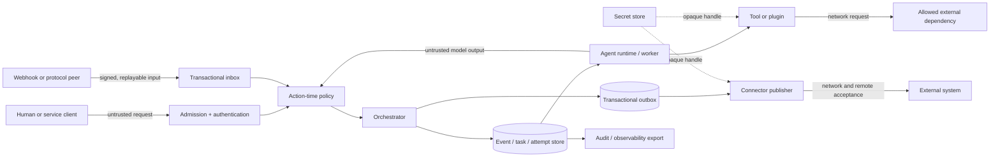

# Threat model

Status: pre-production baseline

Reviewed against: `0.1.x` and the `0.2.0` roadmap

Last updated: 2026-08-20

This document defines the security boundaries that implementation and release reviews
must preserve. It is intentionally stricter than the current code: a listed control is
not considered present unless a test or retained release artifact proves it.

## Scope

In scope:

- commands, chat messages, task plans, events, artifacts, approvals, capabilities, inbox
  receipts, outbox messages, attempts, and external-action receipts;
- API, webhook, protocol adapter, model/runtime, plugin, storage, worker, operator, and
  connector boundaries planned by the production roadmap;
- confidentiality and integrity between tenants, workspaces, users, agents, and services;
- unauthorized or duplicated external effects, including messages, files, tool calls, and
  irreversible business actions;
- availability attacks that can exhaust storage, model budget, workers, streams, or retry
  capacity.

Out of scope for the current `0.1.x` runnable boundary:

- a claim that the service is safe for the public internet or untrusted tenants;
- a claim that model reasoning is correct or deterministic;
- protection of a host already fully controlled by an administrator;
- real Feishu or WeCom sending. This repository may use fake connectors and read-only
  fixtures only, unless a later, separate authorization explicitly changes that boundary.

## Assets and impact

| Asset | Required property | Failure impact |
|---|---|---|
| Tenant and workspace data | isolation, correct retention | tenant escape, privacy breach |
| Actor identity and membership | authenticity, freshness | impersonation, privilege escalation |
| Capabilities and approvals | non-forgeability, attenuation | unauthorized external effect |
| Event and audit history | append integrity, causality | unverifiable decisions, repudiation |
| Task and attempt ownership | fencing, bounded lease | duplicate work, stale completion |
| Inbox/outbox receipts | idempotency, atomicity | lost accepted command or duplicate effect |
| Artifacts and result references | integrity, version CAS | corruption, lost update, wrong approval |
| Secret handles | confidentiality, least privilege | provider or customer compromise |
| Model/tool budget | bounded use, attribution | denial of service, unbounded cost |
| Release and migration artifacts | provenance, reproducibility | supply-chain or upgrade compromise |

Any compromise that exposes a credential, crosses a tenant boundary, loses accepted data,
or causes an unauthorized irreversible effect is P0.

## Actors

- **End user** — authenticated human operating inside assigned tenant/workspace roles.
- **Organization administrator** — manages membership and policy but must not escape their
  organization or silently rewrite immutable audit history.
- **Service principal** — non-human authenticated caller with narrower, explicit scope.
- **Agent runtime** — executes model or deterministic logic. Its output is untrusted input
  to policy, storage, protocol, and connector layers.
- **Tool or plugin** — code with declared permissions; may be buggy or malicious.
- **Connector** — remote side-effect boundary. A transport success is not necessarily an
  accepted business effect.
- **Operator** — deploys and restores the service; privileged actions remain attributable.
- **External attacker** — may control inputs, URLs, webhooks, protocol peers, timing, and
  connection failure patterns but not the trusted host initially.
- **Compromised dependency or model provider** — can return adversarial data or code and
  must not inherit ambient authority.

## Trust boundaries and data flow

The current repository implements only part of this flow. Missing boxes are requirements,
not implied controls. In particular, `0.1.x` has no public admission/authentication service,
secret store, complete action receipt layer, or production connector. A process-local
`RequestContextIssuer` now distinguishes caller scope claims from one configured
authenticator result and blocks cross-request/scope handle reuse, but there is no real
authenticator, authenticated transport, current membership refresh, or mandatory runtime/
authorizer composition. That primitive does not complete the `Admission + authentication`
box.

### Boundary rules

1. Everything entering from a user, protocol peer, webhook, model, plugin, or connector is
   untrusted regardless of whether it is syntactically valid.
2. Identity and current time used for authorization come from trusted service context, not
   request claims. `ActorRef`, envelope sender/authority, `CallerRequestContext`, and a
   free-standing authentication result or reauthorization basis remain untrusted data.
3. Tenant, workspace, actor, audience, action, resource, and expiry are checked again at
   the moment of each effect.
4. Model text never directly grants authority. A prompt, artifact, or tool result cannot
   widen a capability.
5. A connector receives only the minimum scoped action and a fencing/idempotency token;
   it does not receive a general session credential when a narrower handle is possible.
6. Observability exporters receive redacted, bounded, tenant-safe fields rather than raw
   prompts, tokens, authorization headers, or arbitrary artifact bodies.
7. Worker process topology is established before connection, issuer, provider, runtime and
   secret initialization. An inherited live instance must reject on PID + process epoch
   before touching a lock or dependency; a fresh child wrapper cannot legitimize inherited
   authority.

## Security invariants

The following are release-blocking invariants:

- default deny when identity, membership, tenant, workspace, action, resource, audience,
  time, delegation, or revocation evidence is absent or invalid;
- a protected request uses the same issuer's unchanged live context, exact
  request/subject/tenant/workspace binding, and current identity/membership revision;
- no caller-supplied timestamp determines capability validity;
- only a verifier-produced capability type can enter the authorization evaluator;
- delegation narrows every scope dimension and validates the full ancestor chain;
- revoking a parent invalidates every descendant before another action is accepted;
- every durable owner mutation uses a current lease epoch/token CAS;
- an expired or superseded worker cannot heartbeat, complete, fail, or acknowledge work;
- successful transport does not mark an action complete until receiver acceptance is
  durably confirmed, or the state is explicitly `accepted_unconfirmed`;
- retry can duplicate attempts but cannot duplicate an accepted external effect;
- secrets are referenced by opaque handles and never serialized into events or prompts;
- public input has type, size, count, rate, time, redirect, and concurrency bounds;
- security decisions are attributable and append-only, with sensitive evidence redacted.

## Abuse cases and required controls

| ID | Attack or failure | Impact | Required controls | Current state |
|---|---|---|---|---|
| TM-01 | Guess another tenant's resource ID | tenant escape, P0 | mandatory tenant key, repository filter, policy check, property tests | gap |
| TM-02 | Construct an unsigned self-asserted capability | privilege escalation, P0 | verified-capability type, signature/MAC verifier, issuer/audience binding | in progress |
| TM-03 | Backdate request time to revive an expired grant | unauthorized effect, P0 | injected trusted UTC clock, max TTL, bounded skew | partial: request-context issuer has a process-local monotonic high-water; persistent capability/key decisions still lack trusted durable time |
| TM-04 | Forge a child or omit a revoked ancestor | authority escalation, P0 | full chain validation, ancestor revocation/epoch | in progress |
| TM-05 | Reuse a capability against another service | confused deputy, P0 | audience and service binding, action/resource exactness | in progress |
| TM-06 | Prompt-inject an agent into invoking a tool | data/effect compromise, P0 | data/authority separation, consent, action-time policy, allowlist | gap |
| TM-07 | Replay an accepted command or webhook | duplicate effect, P0 | signed freshness, inbox dedupe, action receipt, receiver idempotency | partial |
| TM-08 | Stale publisher ACKs after lease takeover | lost or duplicated delivery, P0 | epoch/token fencing through connector and store CAS | in progress |
| TM-09 | Worker crashes after `invocation.started` | permanent RUNNING or duplicate work, P1/P0 | atomic attempt snapshot, fail-closed matrix and quarantine implemented; fenced worker, receipt reconciliation and fault evidence remain | partial |
| TM-10 | Callback ignores cancellation | shutdown hang, capacity loss, P1 | hard containment, async-only production callback, leak metrics | in progress |
| TM-11 | Retry poison message forever | queue starvation, cost DoS, P1 | bounded backoff/jitter, dead letter, operator workflow | in progress |
| TM-12 | URL tool reaches metadata or private network | credential theft, P0 | URL policy, DNS/IP revalidation, redirect limits, egress deny | gap |
| TM-13 | Secret enters prompt, event, log, or error | credential exposure, P0 | secret handles, redaction, canary scan, safe exceptions | gap |
| TM-14 | Concurrent artifact writers choose same version | corruption/lost update, P1 | database unique key, transactional CAS, digest verification | gap |
| TM-15 | Event/projection schema is ambiguous | incorrect replay, P1 | versioned schema, strict decoder, upcaster, rebuild test | gap |
| TM-16 | Tamper with or truncate audit data | repudiation, P1 | append privileges, hash/checkpoint verification, backups | gap |
| TM-17 | Malformed protocol extension changes meaning | auth/status confusion, P1 | strict core fields, preserved unknowns, pinned contract tests | partial |
| TM-18 | Forged or replayed webhook | unauthorized command, P0 | signature, timestamp, nonce, raw-body verification, dedupe | gap |
| TM-19 | Unbounded body/stream/fan-out | memory, worker, or cost DoS, P1 | quotas, rate/size limits, backpressure, cancellation | gap |
| TM-20 | Malicious plugin or dependency executes broadly | host/supply-chain compromise, P0/P1 | isolation, manifest permissions, lock, scan, SBOM, provenance | partial |
| TM-21 | Operator reads or mutates another tenant silently | privacy/integrity breach, P0 | least privilege, break-glass, immutable attribution, alerting | gap |
| TM-22 | Accidental real Feishu/WeCom write in research/tests | unauthorized communication, P0 | no write connector, fake-only tests, explicit separate authorization | enforced by scope |
| TM-23 | Restore replays obsolete owners or grants | unauthorized stale action, P0 | restored epochs/revocations, recovery mode, reconciliation gate | gap |
| TM-24 | Metrics label accepts arbitrary tenant/prompt text | secret leak/cardinality DoS, P1 | fixed label vocabulary, hashing/redaction, bounds | gap |
| TM-25 | Caller chooses subject/tenant/workspace or reuses an issued context across scope | impersonation/tenant escape, P0 | authenticated subject mapping, exact process-local issuance, action-time identity/membership refresh, mandatory authorizer composition | partial |
| TM-26 | Fork child reuses an inherited store, issuer, key, secret, runtime or connector | duplicate/unauthorized effect, deadlock, corruption or credential exposure, P0 | fork-before-init topology, PID + opaque epoch pre-lock guards, fresh child composition and spawn/exec-before-secret-load evidence | partial: shared identity foundation only; no existing component migrated |

`partial` and `in progress` do not satisfy a release gate. Only a linked implementation,
adversarial test, and retained evidence may change a row to `verified`.

## Capability and approval model

A production capability must bind at least:

- capability ID, issuer, audience/service, tenant, workspace, subject;
- concrete or deliberately supported action set;
- resource type and exact/attenuated resource scope;
- issued-at, not-before, expiry, maximum TTL, and revocation identity;
- parent/root identifiers and a verifier-supported delegation chain;
- data classification and connector/tool constraints when relevant.

Raw claims and verified capabilities are separate types. Deserialization cannot create a
verified type. Verification rejects unknown critical fields, wrong JSON types, weak nonce,
future issue time beyond skew, excessive TTL, wrong audience, invalid signature, missing
ancestor, and any revoked ancestor.

Approval is not a timeless boolean. It binds the action preview, resource version/digest,
actor, capability, expiry, and material parameters. Any material change requires a new
approval. Approval cannot authorize an action after the approver loses authority.

## Model, prompt, and tool controls

- Treat retrieved pages, chat history, attachments, model output, and tool output as data,
  even when they contain imperative language or claim to be system instructions.
- Compile prompts from allowlisted fields with origin/classification metadata and bounded
  size. Do not concatenate secrets or ambient credentials.
- Validate tool arguments against a strict schema after model generation and before policy.
- Apply policy to the normalized action, resolved destination, current artifact digest, and
  current actor—not to the model's textual description of them.
- Sandboxed runtimes receive filesystem/network/process permissions explicitly. Timeout
  alone is not isolation.
- Record model/provider/version, policy decision ID, tool schema version, and sanitized
  action receipt for incident reconstruction.

## Storage, backup, and restore controls

- Database constraints enforce tenant/workspace ownership and uniqueness; application
  filters are defense in depth, not the only boundary.
- Migrations have checksums, forward compatibility notes, and tested rollback or
  restore-and-forward procedures.
- Backups are encrypted, access-controlled, integrity-checked, and restore-tested.
- Restore starts connectors and workers in a non-emitting reconciliation mode until lease,
  revocation, receipt, and outbox state is validated.
- Artifact bodies are content-digested; metadata commits and referenced blobs have an
  explicit atomicity or repair protocol.
- Retention and deletion cover primary data, projections, artifacts, exports, backups, and
  observability stores, while preserving legally required audit evidence.

## Logging and telemetry controls

Allowed by default:

- opaque request/event/task/attempt identifiers;
- fixed status, error class, adapter, model alias, duration, count, and size fields;
- tenant-safe correlation identifiers with documented retention.

Denied by default:

- API keys, cookies, bearer/signature headers, secret environment values;
- raw prompts, chat bodies, artifact bodies, tool arguments, webhook bodies;
- arbitrary user-controlled text as metric labels or trace attributes;
- full capability tokens, nonces, signatures, or reusable approval material.

Errors cross trust boundaries through stable public codes. Detailed causes remain in a
redacted, access-controlled audit channel.

## Verification plan

Every affected release runs and retains:

1. cross-tenant generative tests over every repository and API operation;
2. capability forgery, expiry, audience, delegation, ancestor-revocation, and replay tests;
3. crash injection before/after durable writes, remote acceptance, ACK, and terminal CAS;
4. SSRF tests covering IPv4/IPv6, alternative encodings, redirects, and DNS rebinding;
5. malformed/fuzzed input with strict time, memory, body, nesting, and fan-out limits;
6. secret canaries scanned across events, logs, traces, errors, artifacts, and build output;
7. dependency, license, static-analysis, artifact-signing, SBOM, and provenance checks;
8. backup/restore with revoked grants, expired leases, pending outbox, and partial attempts;
9. fake-connector verification proving no Feishu/WeCom network write path is exercised;
10. manual abuse-case review with no unresolved P0/P1 finding.

## Change review triggers

Update this model before merging a change that adds or changes:

- identity, membership, policy, capability, approval, or delegation semantics;
- a public endpoint, webhook, stream, protocol adapter, tool, plugin, or connector;
- a durable table, migration, backup, restore, retention, or deletion path;
- model context, retrieval, secret access, network access, or sandbox permissions;
- logging, tracing, metrics, analytics, export, or support access;
- deployment topology, worker ownership, retry, reconciliation, or disaster recovery.

The reviewer must identify affected threat IDs, new trust boundaries, negative tests,
operator-visible failure behavior, and rollback/containment steps.

## Immediate containment priorities

Until the controls above are verified:

1. keep deployments local/single-user with synthetic or explicitly approved data;
2. expose no unauthenticated network service;
3. use no real outbound Feishu/WeCom connector;
4. keep provider credentials outside events, prompts, artifacts, commits, and reports;
5. treat agent/plugin output as untrusted and require human confirmation outside the
   repository for any real irreversible action;
6. do not describe `0.1.x` as production-ready or multi-tenant secure.
