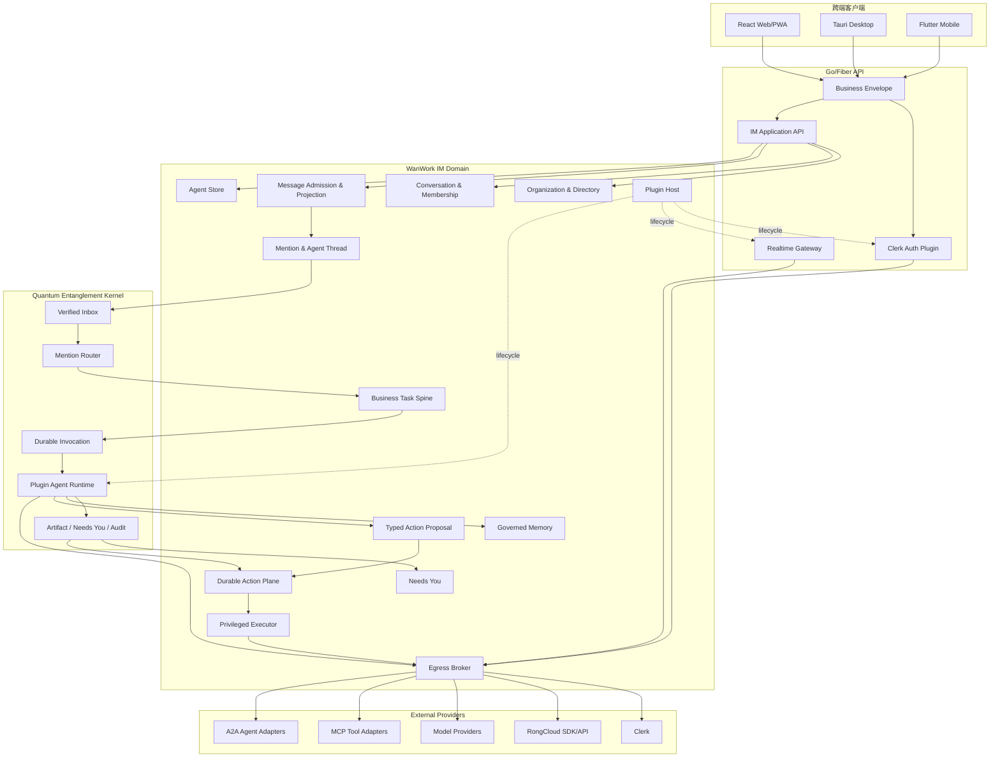
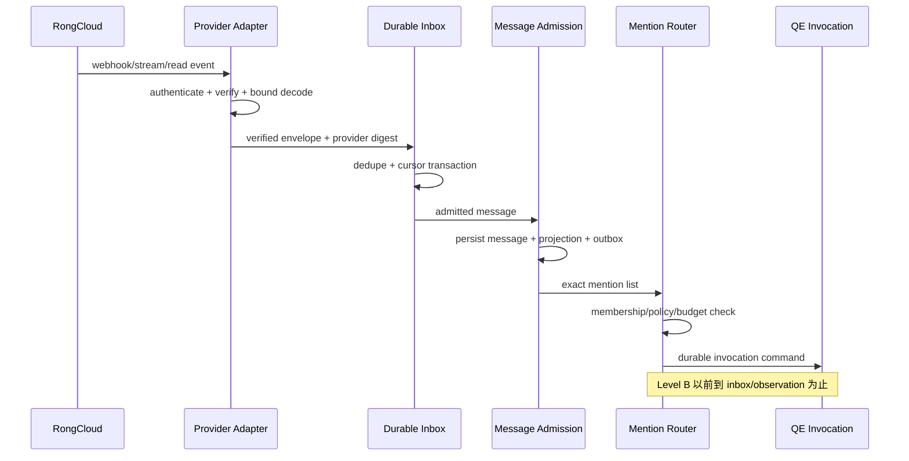
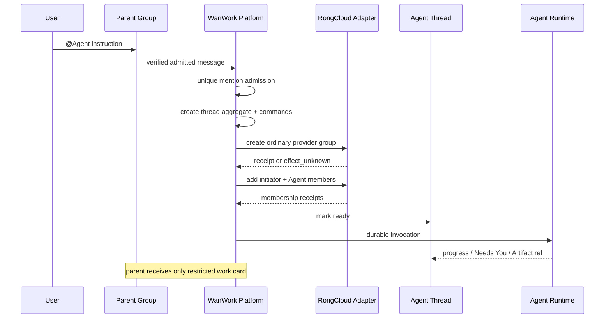

# 原生 IM 架构 V1

## 1. 架构原则

1. **平台持有事实**：组织、主体、群、成员、消息接纳、Agent installation、Task、invocation、
   Artifact、审批和 Action Receipt 由平台的权威存储持有；“平台”包含 IM 与 QE bounded context，
   不是指某个 provider，也不要求所有对象物理上塞进同一张库表。
2. **融云负责传输，不拥有业务**：融云 SDK 提供实时传输、多端同步和 provider message identity；
   provider 记录不能替代平台事务和审计。
3. **Clerk 负责认证，不拥有授权**：Clerk JWT 证明外部身份；组织成员、角色、群 ACL、Agent 调用
   权限和 action-time authorization 由平台计算。
4. **一切皆插件，但插件不拥有真相**：provider、auth、search、notification、Agent runtime、模型、
   工具和存储通过显式 lifecycle/port 装配；插件只能返回值或命令，不能暗改核心数据库。
5. **消息与任务分离**：聊天是事件投影；正式结果进入 versioned Artifact，Agent 自报“完成”不
   能推进业务终态。
6. **外部副作用可对账**：send/create-group/invite/edit/delete/reaction 都需要 durable command、
   idempotency、fence、receiver receipt 和 unknown reconcile。
7. **Task 而不是群或 session 是业务脊柱**：child group、RongCloud message、runtime session、MCP/A2A
   Task 都是投影或执行句柄；只有 Business Task 承载 mandate、budget、acceptance 和 closure。
8. **协议互通不等于信任互通**：MCP/A2A/Agent Client Protocol 只进入 adapter；身份委托、策略、
   Action Ledger、Artifact 验收和 Evidence Graph 始终使用平台 canonical model。
9. **Planner 不持有执行权**：模型/runtime 只能产生 typed proposal；policy/approval、privileged executor、
   egress broker 和 receipt verification 位于独立平台边界，不能由 prompt 绕过。
10. **Action Plane 与 Egress Broker 分责**：Action Plane 决定副作用是否获权并保证 durable 状态；
    Egress Broker 强制所有 HTTP/SSE/MCP/provider 网络路径的目标、credential、数据与响应预算。认证、
    实时和模型调用也必须经过 Egress，不能因为“不是写操作”就直连外部 provider。

## 2. 组件图



## 3. 仓库布局

```text
apps/
  im-api/                 Go/Fiber API、domain composition、migrations
  im-web/                 React/Vite Web/PWA
  im-desktop/             Tauri 2 壳，共用 im-web UI packages
  im-mobile/              Flutter App
packages/
  im-contracts/           OpenAPI、JSON Schema、生成前的 canonical contracts
  im-design/              tokens、icons、跨端语义规范
src/quantum_entanglement/
  native_im*.py           provider-neutral wire contract、inbox、QE bridge
docs/wanwork_im/          产品、架构、运行和审计文档
```

Go 和 TypeScript 可以有语言内 value types，但 canonical JSON Schema 是跨语言 wire 真相源。
Python 的冻结 `NATIVE_IM_CONTRACT_V1.md` 继续约束 Quantum Entanglement 边界；任何字段差异通过
versioned adapter 映射，不能各语言独立漂移。

Canonical contracts 至少区分：

- `BusinessTask` 与 `Attempt/RuntimeSession/ProtocolTaskRef`；
- `WorkConversation` 与 `RongCloudGroupRef`；
- `ArtifactVersion` 与聊天中的 `ArtifactReference`；
- `TaskStatus`、`DeliveryStatus`、`ActionStatus` 与 `AcceptanceStatus`；
- `HumanPrincipal`、`WorkloadPrincipal`、`AgentIdentity` 与 `DelegationGrant`。

## 4. Go 后端分层

```text
internal/
  domain/        纯值、状态机、错误与 ports；不导入 Fiber/Clerk/融云/SQL
  application/   use case、事务边界、idempotency、policy、outbox
  platform/      PostgreSQL、clock、IDs、observability、secret provider
  adapters/
    http/        Fiber handlers 与统一 response envelope
    auth/clerk/  JWT/JWKS verification
    im/fake/     零网络、确定性 fault script
    im/rongcloud/融云 server API/SDK adapter
  bootstrap/     插件注册、config、health、graceful shutdown
```

Domain port 不暴露 SDK client、HTTP session、数据库 connection、JWT library 或 raw webhook。

### 4.1 领域聚合与唯一权威

| 聚合 | 关键字段/子对象 | 唯一权威 |
|---|---|---|
| Organization | membership、role、policy、retention、region | IM domain PostgreSQL schema |
| Actor/Agent | external link、definition、release、installation、status | identity/store schema |
| AgentPresence | lease/incarnation、working/waiting/takeover、runtime liveness projection | coordination/presence schema |
| Conversation | membership、ACL、parent/root、provider projection | IM domain schema |
| ConversationRepresentation | mandate、audience/purpose、disclosure、speech act/commitment limits | identity/policy schema |
| BusinessTask | mandate、capability、budget、context、plan、closure | QE task/event store |
| Attempt | runtime/profile/model/plugin revisions、environment revision、effective config 与 Run capability/egress snapshot digest、lease、checkpoint | QE runtime store |
| NeedsYou | frozen action、parameter hash、risk、assignee、decision | QE attention store |
| Artifact | immutable version、hash、lineage、scan、acceptance | QE metadata + object store |
| Action | intent、approval、attempt、external ref、receipt、reconcile | platform Action Ledger |
| Memory | provenance、scope、TTL、conflict、use lineage、deletion | QE governed-memory store |
| ContentAuthority | observation、provenance edge、taint、authority、declassification | QE evidence/policy store |
| Promotion | source Artifact、validation、target revision、receipt/rollback | QE artifact/action store |
| Routine | definition、timezone、trigger/missed-run policy、occurrence key、budget | scheduler/domain schema |

这些“store”可以在 modular monolith 中由同一个 PostgreSQL 集群的不同 schema/transactional outbox
实现，但每个对象只有上表一个 owner。其他 bounded context 只保存 versioned reference/projection，
不能双主写。

### 4.2 Business Task 状态

```text
draft -> planned -> authorized -> running
      -> waiting_human | waiting_external
      -> delivering -> verifying -> compensating
      -> closed(accepted | rejected | cancelled)
```

`InvocationAttempt.succeeded` 只允许推进到 `delivering`；Artifact 经 verifier/human decision 后才可进入
accepted。Thread provisioning、runtime liveness 和 provider delivery 各有独立状态机，不能用 Task
状态掩盖。

### 4.3 Environment 与 Run compilation

长期 `EnvironmentRevision` 和一次 `Attempt` 分离。每次 Run 由 projection compiler 冻结：

```text
identity + task/mandate + environmentRevision
  + effectiveConfigurationDigest + model/runtime revisions
  + RunCapabilitySnapshot + ProjectedContextManifest
  -> immutable Attempt compilation receipt
```

Hot prompt、warm checkpoint、cold canonical state 是不同数据层；换模型或 runtime 时从受界限的
canonical state 恢复，不能把全量 transcript 当 Environment。任何输入/Artifact/Memory/Skill 只有经过
promotion boundary 才能进入长期 authored/adaptive state，避免一次 prompt injection 永久污染环境。

### 4.4 Content authority 与 Promotion Transaction

输入内容的来源和 authority 与其语义内容分开存储：

```text
ContentObservation(source, digest, authority, taint)
  -> ProvenanceEdge(copy | quote | summarize | tool_result | agent_handoff)
  -> Plan / ActionProposal / Artifact
  -> explicit DeclassificationDecision（可选、最小范围）
```

复制、摘要或通过 MCP/Agent 转发不会自动清除 taint；缺少来源元数据的高风险动作失败关闭。Runtime
完成只创建候选 Artifact。晋升到文档、知识、Skill、Memory 或外部系统必须创建独立
`PromotionIntent`，经过 validation、目标 base revision/CAS、授权和 durable receipt 后才成为权威；
任何失败/rollback 都保留原 Artifact digest 与 evidence。

## 5. Everything-is-a-plugin

插件不是一个任意 `map[string]any` 回调集合，而是有版本、依赖、能力和生命周期的组件：

```text
discovered -> validated -> configured -> started -> ready -> draining -> stopped
```

每个插件声明：

- stable ID、semantic version、host API range；
- capability manifest 和依赖插件；
- config schema 与 secret reference names；
- start/health/drain/stop timeout；
- 网络、文件、数据库和外部 action 范围。

插件 manifest 只是 capability claim；artifact digest、provenance、SBOM、组织 approval 与 revocation
由 host-owned package/admission record 保存并核对，插件不能自证可信。Host 对完整 normalized manifest
计算独立摘要；package record 必须以 `ApprovedManifestDigest + AdmissionRevision` 绑定本次批准，不能让
相同 ID/version 或 artifact 静默复用不同运行行为的旧批准。

Registry 先作为 builder 接收 schema、broker 和 package/factory，随后必须显式 Freeze。Freeze 在写锁内
重算 schema/broker/manifest digest、复核完整 definition graph，并克隆成不可变 runtime snapshot；
Resolve/Compose/Secret claim/NewHost 在 Freeze 前全部拒绝，Freeze 后任何 late registration 失败。动态
Secret claim/revocation 使用独立状态，不允许借“定义不可变”取消运行期撤权。

插件装配沿用 DeepSeek Harness 值得保留的三层思想，但冻结平台自己的语义：

```text
Plugin definition -> Provider binding -> Consumer port
profile -> ordered bundles -> tenant overlay -> EffectiveConfiguration
```

相同 row ID 由后层整行替换，不做 deep merge；删除必须使用显式 tombstone；同层重复 row、跨租户
overlay、prompt/CLI/home patch 一律拒绝。启动前生成 immutable effective snapshot。P0-4 已把 raw Secret
locator 限制在 trusted broker admission；配置只携带 claim digest/revision，Compose 重新校验 tenant、row、
plugin、artifact、manifest、admission、schema、logical name、broker、purpose 和 audience，canonical/Factory
只保存不可取 Secret 的 binding view/fingerprint。Snapshot 生成 source/digest、capability/egress/secret/
artifact/schema/binding/manifest/admission diff 和依赖 DAG；Attempt 保存最终 digest。Effective v3 的 row
同时绑定 manifest digest、admission revision 和 Secret binding view；Host 构造时
冻结选中 factory/config/timeout 的 activation snapshot，启动不回读 Registry。未批准扩权、依赖循环、
host API/schema 不兼容、manifest/admission/revocation 或其他 digest 漂移直接拒绝。

当前 binding view 明确不是 bearer，也没有 material resolver。真实凭据使用必须在 W2/W4 Action Plane
建立后，经 action-time policy、JIT short-lived lease/token exchange、trusted executor 和 provider receipt
单独闭环；不得由 P0-4 的准入引用冒充。

所有 required plugins 都 ready 后才开放组合 readiness/route；draining 立即拒绝新工作，对 in-flight 按
deadline 收敛。启动或 ready 失败按逆依赖 drain→stop→host-owned effect cleanup，终态统一为 `stopped`
或 `failed`，不再另造含义不清的 `dispose` 状态；任何阶段失败都不能残留 route、listener、timer、
lease 或 provider handle。

Effect scope 在 shutdown 的第一个 Drain 前统一从 `open` 转为 `closing`，此后任何 `Defer` 失败；
cleanup 失败只保留失败项并允许精确重试，全部成功后进入 `closed`。插件不能在 Drain/Stop/callback
期间注册逃出本轮 cleanup snapshot 的新资源。

Host mutex 只用于校验和发布 `new/starting/ready/stopping/stopped/failed` 与 started snapshot，不在锁内
调用 Configure/Start/Ready/Drain/Stop/effect cleanup。`starting`/`stopping` 同时是唯一 lifecycle owner
claim；callback 内查询 State 不死锁，误重入或并发 Start/Stop 立即失败，不能抢占 rollback/cleanup。
这只解决可信内建插件的进程内锁纪律，不替代第三方代码隔离，也不能强杀忽略 context 的 callback。

当前 goroutine 内的 Configure/Start/Ready/Drain/Stop/effect cleanup panic 统一转换为固定
`ErrLifecyclePanic`，不格式化或返回可能含 Secret/消息的 panic payload。Start/Ready panic 仍进入逆序
rollback；Drain/Stop/cleanup 单项 panic 只形成 joined error，不跳过其他插件和后续清理。这个 recover
不覆盖插件自行创建的 goroutine、fatal runtime error、进程退出或忽略 context 的无限阻塞。

V1 预留插件种类：

- `auth.clerk.v1`、`auth.fake.v1`；
- `im.rongcloud.v1`、`im.fake.v1`；
- `agent-runtime.quantum-entanglement.v1`；
- `search.postgres.v1`；
- `notification.local.v1`；
- `object-store.local.v1`，后续增加 S3 兼容实现。

插件不能：从 prompt 选择 credential/endpoint；直接发布 IM；持有可序列化 authority；绕过
application service 写 domain tables；把消息正文、token 或 attachment URL 写入普通日志。

插件可替换的是实现，不可替换的是 `DomainCommand`、event envelope、authorization、Task/Action/
Artifact invariants。Agent Store 中“可安装”也不等于可信：代码插件、Skill、MCP server、Agent
definition 分别进入 `CapabilityBOM + provenance + digest + scan + verdict + revocation` 准入链。

W1 Plugin Host 只加载随 host 编译并由平台 admission 固定的可信内建插件。`SKILL.md`、Tool definition
和真正执行任意代码的 App/Extension/Plugin package 是不同信任类；第三方可执行包不得进入 API/
Gateway/Plugin Host 主进程。后续生态使用独立 `ExecutionIsolationProfile` 与 process/UID/container/
microVM 边界，安装 lifecycle script 同样按可执行代码处理。

### 5.1 Skill package 与 Tool execution binding

插件装配 seam 不等于 Tool 授权 seam。平台分别持有：

```text
SkillPackageVersion
  -> catalog projection (name/description/version only)
  -> complete SKILL.md read
  -> ActivationReceipt(packageVersion, objectVersion, contentDigest)
  -> MaterializationManifest(required files and digests)
  -> immutable Run snapshot

CapabilityDefinitionVersion
  -> AgentCapabilityAssignmentRevision
  -> ExecutionBinding(routeDigest, credentialRef, policyRevision)
  -> action-time authorization
  -> ActionIntent / Receipt
```

Active Skill 只能从 receipt 指向的不可变对象读取；部分 tree、摘要漂移或未审核包一律不进入可执行
上下文。模型看见 catalog entry 不代表激活，完整读取主文件不代表其脚本自动获权，激活 Skill 也不
提升当前 Run 的 capability snapshot。

Capability definition 定义 schema/effect/data class；assignment 决定某 Agent 在 tenant/workspace 的
显式可用范围；execution binding 冻结本次 route 与 opaque credential ref。执行器在每个 action 前
重新读取 assignment revision、membership、policy、credential 和 route，任何 stale/disabled/drift
都拒绝。长期 secret 只由 broker 在执行边界 JIT 解析，不进入 checkpoint/event/model/IM metadata。

## 6. Identity 与 `ext_info`

### 6.1 平台主体

```text
Actor
  tenantId
  actorId
  subjectType = human | agent | system | service
  externalIdentityRef
  displayProfile
  status
  revision
```

Clerk `sub` 先映射为平台 human actor，再读取组织 membership。Agent actor 由安装记录创建，不
复用操作者的 Clerk identity。

Actor 是可见业务主体；执行授权还必须另外保存：

```text
HumanPrincipal -> DelegationGrant(task, purpose, audience, capability, expiry)
               -> AgentIdentity -> WorkloadPrincipal(instance/device/process)
               -> CredentialLease(tool/resource, short TTL, proof binding)
```

委托链只能缩权。Task 取消、human 离职、Agent installation 撤销、policy revision 变化都会阻断
新 lease；已发生动作仍通过原 actor/subject/task chain 追责。融云 `ext_info` 的 `subjectType` 仅是
显示投影，伪造它不能改变 authorization。

`AgentPresenceLease`、execution-host `RuntimeLiveness` 与融云 online status 独立。presence lease 过期
或 runtime `unverifiable` 时停止新 admission，但没有当前 incarnation 的正面退出证据就不能启动第二
实例。human takeover 会推进 fencing generation，旧 runtime 即使恢复连接也不能提交终态/副作用。

### 6.2 融云用户 `ext_info`

string 内容是 canonical JSON：

```json
{
  "schemaVersion": 1,
  "subjectType": "agent",
  "platformActorId": "agt_...",
  "agentDefinitionId": "agd_...",
  "agentVersion": "1.0.0"
}
```

真人使用 `subjectType=human`，不包含 Agent 字段。解码时拒绝 unknown field、duplicate key、错误
类型、超限、非 NFC、控制字符和秘密字段。`ext_info` 只能辅助 provider 显示和 mapping；收到
事件后必须按 provider user ID 回查平台绑定，不能信任 payload 自报主体类型。

### 6.3 融云群 `ext_info`

```json
{
  "schemaVersion": 1,
  "conversationType": "agent_thread",
  "platformConversationId": "cnv_...",
  "parentConversationId": "cnv_parent",
  "rootMessageId": "msg_...",
  "agentInvocationId": "inv_..."
}
```

普通群不携带 parent/root/invocation 字段。组织 ID、ACL、真实消息正文、token 和永久文件 URL 不
放入 `ext_info`。

## 7. 入站消息时序



未认证 raw webhook 不能直接进入 Mention Router。入站事件中出现 `@Agent` 也不代表已经授权。

### 7.1 Durable Event Spine

所有会影响模型、Task、权限、Artifact 或外部动作的事实进入版本化事件流：

```text
EventEnvelope
  eventId / streamId / sequence / schemaVersion
  tenantId / actorId / causationId / correlationId
  eventType / occurredAt / payloadRef / payloadDigest
```

- 同一 stream 的 sequence 严格单调，append 与当前 aggregate revision 在同一事务提交；
- projection 可以从持久事件重建，SSE 使用 cursor 做 backfill + live 拼接；
- typing、presence heartbeat 和高频临时进度是 ephemeral event，不冒充 durable history；
- “model-visible”输入必须能定位到有权限的 source event/reference，但不代表把正文、token、PII 或
  隐藏思维链全量入库；
- unknown event/version 原样保留并停止有副作用的投影，禁止静默丢弃；
- 普通 telemetry、业务审计和 tamper-evident evidence 分开保存，采样 trace 不能造成证据断链。

W1 只冻结 `EventToAppend`/`StoredEvent`、`EventStore` port、opaque cursor 和确定性 in-memory fake；fake
只证明 exact retry/conflict/paging/replay/projection contract，不宣称 durability。W2 交付 PostgreSQL
stream/event/projection-checkpoint migrations、expected revision 事务和 crash/reopen/kill-9 恢复；从空
projection 重建的来源必须是该 durable store。调用方不能提供 sequence/global position/recordedAt。

## 8. `@Agent` 子群时序



线程 provisioning 失败不启动 Agent；Agent 运行失败不删除线程；provider 结果未知不创建第二个
group。恢复按 durable command 和 acceptance query 继续。

### 8.1 Mention admission 与幂等键

固定顺序：authenticated principal → durable inbox/dedupe → conversation membership/object auth →
Agent installation/status → mandate/policy/budget → create-or-get Task/Invocation/WorkConversation → enqueue
Attempt。唯一键至少为：

```text
(tenantId, parentConversationId, rootMessageId, agentInstallationId)
```

重复 webhook、cursor resume、客户端重发和 worker 重启都返回同一 Task、Invocation 与 child group
projection。RongCloud group 创建成功但 ACK 丢失时先按 platform group key 查询/对账，不生成新 ID。

### 8.2 Durable Action Plane

```text
prepared -> approved -> dispatched
         -> succeeded | failed | effect_unknown
effect_unknown -> reconciled_succeeded | reconciled_not_accepted | manual_review
succeeded -> compensating -> compensated | compensation_failed
```

每个现实写操作保存 `ActionIntent(intentId, canonicalHash, target, expectedPostcondition,
compensationRef)`、稳定 idempotency key、attempt/fencing token、provider operation reference、实际参数
digest 和 receiver receipt。审批只绑定 canonical payload、policy revision、audience、TTL 与 nonce；
目标、参数、预算或 route 变化必须重新审批。

外部系统通常只能提供 at-least-once delivery，平台不得宣传 exactly-once。timeout、5xx、连接中断、
ACK loss 都可能是 `effect_unknown`；没有 authoritative negative finality 时禁止盲重试。取消只是一项
请求，已发生的副作用单独 reconcile/compensate，UI 不得把 cancelled 显示为“全部撤销”。

Runtime/Planner 只提交 `ActionProposal`。Policy/Approval 成功并 durable append intent 后，独立 Executor
才可通过 Egress Broker dispatch；Runtime 不读取长期 provider secret。Broker 对 DNS/IP、redirect、
SSE endpoint、origin/auth header、domain/port、response bytes/time/schema 做统一约束，并按 capability
声明的 `effect/dataClass/approval/retry/idempotency/reconcile` 执行，不能把所有 MCP 一刀切为安全读或
默认可重试写。高风险 action 的 policy、approval、intent 或审计事件写入失败时绝不 dispatch。

Action Plane 只控制有副作用的授权与一致性；Egress Broker 控制所有网络。Clerk JWKS/session、融云
realtime、模型推理、只读 Tool、SSE 和 connector read 同样经 broker，绑定 `DataRouteDescriptor`、
credential lease、DNS/IP/connection target、response bytes/time/schema 和审计。二者不能合并成一个
“HTTP client”，也不能让 `Runtime -> Models`、`Auth -> Clerk` 或 `Realtime -> RongCloud` 旁路。

### 8.3 Needs You、Artifact 与 Evidence

- Needs You 保存风险、损失上限、截止、可逆性、参数 hash/diff、选择、assignee、SLA 与 decision
  receipt；低风险批量处理和高风险四眼审批由 policy 决定；
- Artifact 保存 immutable version、hash、producer、environment、lineage、scan 与 acceptance；HTML、
  URL、压缩包和附件在隔离预览/AV/DLP 后才能显示；
- 证据图使用可见事实：`mandate -> plan/version -> policy -> credential lease -> action -> receipt ->
  artifact/hash -> verifier -> human decision -> final receipt`；不以隐藏思维链作审计基础；
- accepted Artifact 只以 reference/card 发布回父群，发布本身也是新的 ActionIntent。

### 8.4 Governed Memory

`MemoryRecord` 至少包含 source event/hash、writer、tenant/user/task/group scope、purpose、confidence、
sensitivity、validity/TTL、conflict/supersession 和 retention。写前执行 provenance/PII/conflict/admission，
读时执行 principal/task/purpose/freshness policy，并记录 memory-to-decision citation。

群消息不会默认永久进入跨群 Memory；临时上下文晋升为组织经验需要候选、eval、人审、版本和回滚。
删除必须传播到 canonical store、index、cache、summary 与 backup expiry，并生成 deletion proof。Derived
index 必须可以从 canonical source 重建。

## 9. 数据所有权

| 数据 | 权威源 | Provider 投影 |
|---|---|---|
| Clerk external identity | Clerk | 平台保存稳定 mapping 与必要 claims digest |
| 组织、部门、成员、角色 | PostgreSQL | 融云只获得聊天所需用户/群投影 |
| 会话、成员、ACL、父子关系 | PostgreSQL | 融云 group + `ext_info` |
| 消息接纳和 provider mapping | PostgreSQL | 融云负责 transport/history copy |
| 未读/已读 | 平台聚合 + provider evidence | SDK 实时体验 |
| Agent definition/installation/version | PostgreSQL | 融云普通用户 display projection |
| Agent presence/runtime liveness | coordination/presence store | 融云 online 只作不可信观察证据 |
| Data route/approval/notice | identity/store + organization policy/personal acknowledgement receipt | 成员卡/安装页只读披露 |
| BusinessTask/invocation/Artifact/Needs You/Memory | QE authoritative stores（同属平台，可与 IM 共用 PostgreSQL 集群但不双主） | IM 工作卡/引用消息/受限 projection |
| Routine/ScheduleOccurrence | scheduler/domain store | IM 通知/任务卡只读投影 |
| action command/receipt/unknown | PostgreSQL durable action tables | provider receipt evidence |
| credential | secret provider | 从不进入 domain/event/Notion/Git |

## 10. API envelope

应用可达时统一返回 HTTP 200：

```json
{
  "code": 200,
  "data": {},
  "message": "ok",
  "requestId": "req_..."
}
```

业务错误使用稳定非 200 `code`，例如 `40101`（未认证）、`40301`（组织权限不足）、`40901`
（revision conflict）、`42201`（validation）、`50301`（provider unavailable）。HTTP status 仍为
200。代理未连接、TLS 失败、响应中断等网络层问题不会产生这个 envelope。

以下状态永不折叠：

- HTTP/transport 是否送达；
- API envelope 的业务命令是否接纳；
- provider delivery/action 是否成功或未知；
- Attempt 是否 succeeded；
- Artifact 是否 accepted；
- Task 是否 closed。

因此“HTTP 200 + `code=200`”最多表示平台接纳/完成了当前 API 命令，不能单独证明消息已送达、
Agent 已完成、Artifact 已验收或外部副作用已经发生。

## 11. 可观测性与隐私

- 结构化日志只记录 ID、类型、状态、耗时、大小和 digest；
- message body、附件 URL、JWT、secret、签名材料和模型上下文默认不记录；
- trace 使用 `requestId/correlationId/causationId/traceparent`；
- 指标必须分 tenant/provider/operation/result，但 tenant 使用内部低基数 ID；
- audit 记录 who/what/why/policy/revision/digest，不记录不必要正文；
- telemetry 默认关闭；启用前经过本地分类、脱敏、采样和 DLP。

每个 tenant 还需要可审阅的 Data Flow/Nutrition Label：Clerk、融云、模型、embedding、MCP/A2A、
object store、telemetry 和 backup 各自处理何种数据、地区、保留、训练/再利用口径与删除路径。
“本地存储”“self-hosted”或“sandbox”都不能自动推导为离线、平台不可见或隔离成立。

每个 Agent release/installation 另有版本化 `DataRouteDescriptor`、`OrganizationProcessingApproval`
和适用场景下的 `PersonalAcknowledgement`，声明 operator、host、region、model/embedding provider、
retention/training/telemetry/third-party forwarding。路线 revision 进入 installation/Attempt/evidence；
任何扩大或未知路线默认阻断升级/首次交互，重新经过组织 policy，并按场景更新个人告知/确认；不能
从消息或 provider metadata 猜测同意。

## 12. 部署演进

V1 从 modular monolith 开始：一个 Go API、一个 worker、PostgreSQL、fake/rongcloud adapter、Web
客户端。Domain 和 ports 从第一天保持可拆分；在真实负载证据出现前不提前拆微服务。

演进顺序：

1. fake provider 单进程 M0 垂直切片（Task/Needs You/Artifact/receipt 闭环）；
2. PostgreSQL + durable inbox/outbox/action；
3. 融云 sandbox inbound-only；
4. Agent thread + fake runtime；
5. QE runtime + Artifact/Needs You；
6. 单 allowlisted sandbox conversation 受控 outbound；
7. Desktop/Mobile 分发、容量、HA、灾备和生产 Gate。

生产 Gate 至少包含：tenant isolation、offboarding/revocation、secret canary、plugin supply-chain
admission、dispatch 四窗口故障注入、unknown reconcile、evidence tamper detection、backup/restore、
RPO/RTO、data-flow 抓包核对和 provider sandbox allowlist。任何一个失败都不能用功能演示覆盖。
