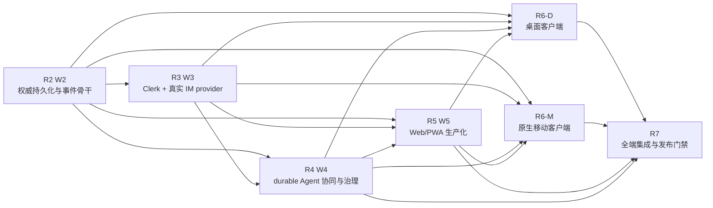

# Quantum Entanglement v0版全端最终完成路线图

更新时间：2026-08-31  
基线分支：`dev_wanwork_quantum_entanglement`  
基线提交：`a50d8b5`  
范围：Web/PWA、macOS、Windows、Linux、iPhone/iPad、Android、鸿蒙，以及它们共同依赖的 IM/Agent 后端。

## 1. 先给结论：还剩多少

主计划的阶段族为 W0–W7，共 8 个阶段族。当前状态不是“只差几个页面”，而是：

- W0 研究/需求/架构冻结：已关闭；
- W1 Go 基础、插件/事件/身份值合同：已关闭；
- W2 IM Domain/PostgreSQL：已交付一部分权威持久化与运行时安全底座，生产闭环未关闭；
- W3 Clerk/真实 IM provider：目前只有 fake/sandbox 形态，生产 adapter 未关闭；
- W4 Agent Store、`@Agent` 子群和协同内核：本地零网络 vertical slice 已关闭，durable/生产闭环未关闭；
- W5 Web/PWA：当前可浏览器验收的 Web-first slice 已关闭，生产 Web 产品未关闭；
- W6 桌面：未开始可安装客户端交付；
- W6 移动：未开始原生客户端交付；
- W7 受控集成、发布和运营：未关闭。

因此，从当前 `a50d8b5` 到“全端生产可交付”还剩 **7 个交付包**：

| 编号 | 交付包 | 当前状态 | 是否可以与其他包并行 |
| --- | --- | --- | --- |
| R2 | W2 生产 IM Domain、PostgreSQL authority、恢复与事件骨干收口 | 部分完成 | 不能跳过；是后续主依赖 |
| R3 | W3 Clerk + 真实 IM provider adapter | 未关闭 | 需依赖 R2 trusted context；部分合同测试可并行 |
| R4 | W4 durable Agent 协同、模型/工具治理和生产生命周期 | 本地 fake 已完成，生产未关闭 | 依赖 R2；可与 R3 部分并行 |
| R5 | W5 Web/PWA 生产化 | 本地 Web-first 已完成，生产未关闭 | 可与 R3/R4 的合同工作并行，真实接入需等待其出口 |
| R6-D | W6 macOS/Windows/Linux 桌面客户端 | 未开始 | API 合同冻结后可并行开发，生产接入需等待 R2–R5 出口 |
| R6-M | W6 iPhone/iPad、Android、鸿蒙原生客户端 | 未开始 | 与 R6-D 并行，生产接入需等待 R2–R5 出口 |
| R7 | W7 全端集成、发布、备份、观测、合规和运营门禁 | 未关闭 | 必须最后汇合 |

“7 个交付包”不是 7 个 commit，而是 7 组可以继续拆成数十到数百个小提交的可验收里程碑。每个子任务都必须保持已有门禁可运行，并在进入下一组前留下 commit、测试和文档证据。

## 2. 当前已经可以验收什么

当前真正可运行的是 Web-first 本地验收切片：

- 桌面浏览器通过 `scripts/start_web_client.sh` 访问 React/Vite 页面；
- iPhone/iPad/Android/鸿蒙可以通过同一 Wi-Fi 的 `--lan` 模式访问同一 Web/PWA 页面；
- Go/Fiber loopback API、fake Clerk-shaped auth、fake RongCloud-shaped provider；
- 普通群、单聊、消息发送/编辑/撤回/搜索；
- Agent Store definition/release/Trust Passport/installation 投影；
- Agent 最小能力安装、邀请、幂等、停用和撤权；
- 任意自定义协作指令创建父群关联的 Agent 子群；
- Agent 回复只进子群，父群只有受限 work-card；
- Workboard 的 Task → Artifact(draft) → Needs You → accepted/rejected；
- 接受后的 Artifact digest 引用发布回父群；
- synthetic 零网络 runtime，以及显式 OpenAI-compatible 文本 runtime 试用。

这部分的体验方法见 [当前阶段 Web IM 体验教程](./CURRENT_WEB_IM_TRIAL_GUIDE_20260831.md)。它证明本地合同和交互闭环，不证明真实生产 IM、原生 App 或生产多租户已经完成。

## 3. 依赖关系：哪些能并行，哪些不能跳过

允许提前并行的是 UI 壳、contract fixture、模拟器和构建流水线；不允许提前宣称的是生产接入。所有端都必须使用同一套服务端 cursor、idempotency、错误 envelope、身份/成员解析和 Task/Artifact/Acceptance 语义，不能在客户端自行发明一套消息真相。

## 4. R2：收口 W2 生产 IM Domain、PostgreSQL 与事件骨干

### 已有基础

当前已有 migration ledger、exact access、strict connection policy、attested runtime、tenant-bound repository/UoW、inbox→canonical event atomic bridge，以及 provider-effect worker seam。这些是底座，不是 W2 完成证明。

### 剩余工作

1. **生产 topology/IaC 与 authority cutover**
   - 固化 cluster/cell identity、owner/migrator/runtime role 和完整 ACL manifest；
   - 完成 provisioner preflight、ownership/grant executor、receipt、drift validator；
   - 接入 secret provider、远程 authenticated TLS、credential rotation 和旧 session drain；
   - 把 rollback、unknown commit、readback 和 revoke 责任写成可演练 runbook。

2. **可信请求上下文与 action-time resolver**
   - Clerk verified claim 只能作为外部主体证明；
   - 每个请求重新解析 realm、tenant、workspace、Actor、active membership 和 permission；
   - invoke、publish、offboard、provider effect 叠加 installation、release、capability、budget、mandate 和 Artifact/Acceptance 校验；
   - 任何 claim/membership/provider mapping 漂移都 fail closed。

3. **完整 IM 领域持久化**
   - 补齐 `direct/group/agent_thread` aggregate、message、reaction、read state、附件元数据、通知和搜索索引；
   - 补齐 Agent definition/release/installation、thread、BusinessTask、Attempt、Budget、NeedsYou、Artifact、Acceptance、Action/Evidence；
   - 保持 membership 与 access 分离，禁止 FK/head 存在被误当作 active membership；
   - 所有 mutation 具备 tenant、revision、dedupe 和 typed result readback。

4. **durable event/outbox/projection**
   - PostgreSQL EventStore expected-revision transaction；
   - inbox/outbox/checkpoint、backfill+live、projection 清库重建；
   - DB/process restart、kill-9、网络中断、commit-unknown、旧 binary/future schema、role restoration；
   - provider-effect worker 的 lease/fence、receipt/failed/unknown/readback/reconcile 接入正式 UoW。

5. **R2 出口门禁**
   - 空库和非空库 migration、rollback/restore、RLS/ACL、并发 CAS、dedupe、crash recovery 全部有证据；
   - 两个 tenant、两个真人、跨租户访问、过期 session、offboard 后访问均按预期失败；
   - 没有把 HTTP 200、provider receipt 或 Attempt succeeded 当作业务 accepted。

## 5. R3：Clerk 与真实 IM provider

### Clerk adapter

- JWKS、issuer、audience、key rotation、session revoke、过期 token 和 webhook 验证；
- external subject → realm → platform principal 的稳定映射；
- 多租户 membership 不从客户端字段读取；
- 认证成功不自动等于群权限或 Agent 权限。

### IM provider adapter

- 完成真实 provider profile/capability matrix，实测稳定 ID、size limit、`ext_info` 原样保存和回传；
- callback signature、timestamp/nonce/replay、防重放、限流、分页 cursor、resume 和 mapping drift；
- provider commit-unknown 的 readback/reconcile，不根据网络超时自动重复发送；
- sandbox/inbound-only、allowlist、kill switch 和 outbound permit；
- provider 只做传输，不成为 Task、Artifact、Acceptance 或授权事实源。

### R3 出口门禁

- fake、sandbox、provider contract fixtures 和负向矩阵全绿；
- 所有 secret 只通过 secret reference，绝不进入 Git、日志、事件、截图、报告或 Notion；
- 真实 outbound 只有在具体 sandbox、具体目标和具体动作获得额外授权后才可测试；
- 伪造或篡改 `ext_info` 不会改变平台 authorization。

## 6. R4：durable Agent 协同、模型/工具治理与协议层

### 当前已完成的本地语义

Agent 以普通成员式 actor 进入群，`@Agent` 按父群、根消息、安装、release 和 Agent actor 做幂等 admission，创建独立子群；回复只写子群；父群只收受限 work-card；Workboard 负责 Artifact 审阅和发布引用。

### 剩余工作

1. **durable thread/invocation**
   - thread plan、invocation admission、attempt、budget、heartbeat、recovery、lease/fence；
   - duplicate、out-of-order、ACK loss、worker crash、old approval、release revoke 和 budget exceeded；
   - provider-effect unknown 必须进入 reconcile，不能静默重试。

2. **模型 runtime**
   - 保留 Quantum Entanglement provider-neutral port；
   - 吸收 DeepSeek Harness 的 everything-is-a-plugin、显式 admission、可观测生命周期和失败隔离思想；
   - 以 LangGraph 级别的底层状态/边/检查点组合协作流，避免把高层 Agent 框架直接当作授权层；
   - 模型只生成 typed ActionProposal/文本结果，不拥有 IM、凭据、租户或 provider 权限；
   - OpenAI-compatible、DeepSeek 等 provider 都必须经过统一 timeout、预算、输出边界、错误和审计合同。

3. **Agent 间协议**
   - 固化版本化 Agent-to-Agent message envelope、capability advertisement、task handoff、artifact reference、ack/retry、cancel、error 和 trace context；
   - 明确哪些信息可跨 Agent 传递，哪些必须经过 human approval、taint/declassification 和 data-route policy；
   - 支持内部协议与 A2A/MCP 等外部协议的 adapter，但外部协议不能绕过本地 admission/authorization。

4. **工具执行与出口控制**
   - Runtime/Planner 只提出 typed proposal；独立 Executor/Egress Broker 做 action-time 再授权；
   - SSRF、redirect、credential forwarding、文件路径、命令参数、网络出口和第三方包隔离；
   - tool receipt、unknown/reconcile、quarantine、审计和撤权；
   - 首次真实数据处理前完成 data-route revision、组织批准和个人告知/确认。

5. **Artifact、Acceptance 与 Promotion**
   - Artifact 版本、digest、独立 verifier、多人审阅并发控制、退回/撤销和恢复；
   - `accepted` 才能生成父群引用；`completed`、provider ACK 或模型输出都不能替代 acceptance；
   - M0 先支持真人发布引用，通用 promotion transaction 和第三方可执行包隔离随后交付；
   - Agent fork/transfer、跨组织 federation 暂不属于首个生产发布。

### R4 出口门禁

- 重复 mention 只生成一个 Task/Thread/Invocation；
- 子群隔离、父群最小披露、撤权和数据处置都有 durable evidence；
- 模型/provider/tool 失败不会伪装成成功；
- 参数、能力、release 或批准 digest 发生变化时原批准失效；
- action/effect unknown 都能被 operator 看见并完成 reconcile。

## 7. R5：把当前 Web/PWA 切片做成生产 Web 产品

### 当前已有

React/Vite/Zustand 响应式客户端、Web-first 启动脚本、Agent Store、群聊/子群、Workboard、PWA manifest/service worker、synthetic/GPT runtime 入口和窄屏验收。

### 剩余工作

- 接入服务端 session、组织/联系人、真实多租户导航和 action-time authorization；
- 将当前 demo client 拆成可维护的 domain/API/query/UI workspace，OpenAPI/JSON Schema 与跨语言 contract tests；
- SSE/WebSocket 实时事件、断线恢复、cursor/resume、重放、顺序和多标签页一致性；
- 消息 reaction、文件、已读、通知、附件预览、搜索索引、权限错误和 provider unknown 状态；
- Task/Artifact 版本、多用户并发审阅、审批历史和恢复；
- PWA 安装、缓存分层、更新回滚、浏览器存储边界；聊天真相不写入静态 shell cache；
- Chrome/Edge/Firefox、macOS/Windows/Linux、1440/1024/390 视口、无障碍、性能和安全测试；
- 生产域名、HTTPS、CSP、CORS、CSRF、observability、错误上报和 kill switch。

### R5 出口门禁

- Web 仍是所有端的参考实现和第一验收面；
- 真实登录、真实多租户、真实 provider 失败路径和模型失败路径均可解释；
- Playwright/E2E 能复现 login → 群聊 → mention → 子群 → Workboard → acceptance → publish → offboard；
- API 业务状态和 UI 状态不靠聊天正文推断；
- PWA 更新、回滚和缓存不会丢消息或越权。

## 8. R6-D：桌面端 macOS、Windows、Linux

建议技术路线：Tauri 2 壳复用 `im-web` UI 和 TypeScript API/domain client；Rust 原生能力只通过窄端口暴露，不能直接写数据库或绕过 API 授权。

### macOS

- `.app`、`.dmg` 构建，签名、公证、自动更新、失败回滚；
- Keychain 安全存储、通知、文件选择、deep link、代理网络和多窗口；
- Intel/Apple Silicon 支持矩阵和干净机安装验证。

### Windows

- `.msix` 或签名 `.exe`，安装/升级/卸载和回滚；
- Windows Credential Manager、安全通知、文件选择、代理、企业策略和杀毒误报处理；
- Windows 10/11 支持矩阵、干净机和受限权限用户验证。

### Linux

- AppImage + deb（发行版矩阵明确后再扩展 rpm）；
- X11/Wayland、系统通知、文件选择、代理和桌面集成；
- 发行版/架构矩阵、依赖缺失和升级回滚验证。

### R6-D 共同出口

- 三端使用同一 API contract fixtures、cursor/resume、错误码、幂等和 session 语义；
- 构建可重复，产物 checksum、签名、SBOM 和 provenance 齐全；
- 安全存储、deep link、通知和文件能力不扩大 Agent 权限；
- 至少完成 macOS/Windows/Linux debug build、安装、启动、升级、回滚和端到端 smoke test；
- 没有签名或回滚证据时只能标记 prototype，不能标记正式桌面版。

## 9. R6-M：iPhone/iPad、Android、鸿蒙

移动端与桌面端共享业务合同，但系统能力分别适配。当前浏览器/PWA 体验不能计入原生 App 完成。

### iPhone/iPad（iOS/iPadOS）

- Xcode target、签名、Keychain、APNs、后台生命周期、Universal Links/deep link；
- iPhone/iPad 响应式布局、横竖屏、多窗口/分屏、文件/照片选择；
- TestFlight、干净设备、断网恢复、推送点击回到正确会话；
- `.ipa` 或 TestFlight build、版本号、checksum、崩溃日志和回滚方案。

### Android

- Gradle mobile 工程、Keystore、FCM、后台限制、WorkManager/恢复策略；
- APK/AAB、内部测试轨道、不同屏幕/厂商 ROM、代理网络和权限提示；
- 断网、进程被杀、通知点击、升级迁移和回滚；
- release signing、checksum、SBOM 和 Play 内测证据。

### 鸿蒙

- ArkTS/ArkUI（或经过正式兼容性验证的跨端方案）工程、应用签名、`.hap`；
- Push、后台生命周期、分布式/多设备能力的最小授权；
- DevEco 构建、真机/模拟器、断网恢复、通知 deep link、升级和回滚；
- HarmonyOS API 版本矩阵、权限审计和产物 checksum。

### R6-M 共同出口

- 所有移动端以服务端 cursor/resume 和 canonical event 为准，不能把 optimistic UI 当作消息已提交；
- APNs/FCM/鸿蒙 Push 的送达只作为通知事实，不作为业务状态事实；
- secure storage、相册/文件、后台任务、deep link 和通知都必须经过 capability/tenant policy；
- 至少有真实设备或模拟器的登录、群聊、mention、子群、Workboard、断线恢复和撤权测试；
- 没有签名、内测渠道和升级回滚证据时只能标记 prototype。

## 10. R7：全端汇合、生产发布和运营

R7 是最后一个汇合门，不能用“每个端都能编译”替代。

### 集成与质量

- Web、macOS、Windows、Linux、iPhone/iPad、Android、鸿蒙跑同一套 contract/e2e fixture；
- 跨端消息顺序、已读、通知、附件、搜索、断线恢复、幂等、撤权和 provider unknown 一致；
- 两个 tenant、多个真人、多个 Agent、不同 capability/release、并发审阅和跨设备登录；
- 负向矩阵：过期 token、跨租户、成员已移除、Agent offboard、预算超限、重复 webhook、ACK loss、模型断流、数据库故障、provider 映射漂移。

### 生产工程

- CI/CD、环境隔离、IaC、secret broker、rotation、TLS、feature flag、kill switch；
- 指标、日志、trace、审计、SLO、告警、on-call、故障演练和容量压测；
- PostgreSQL backup/restore、RPO/RTO、跨可用区、灾备、数据删除和保留策略；
- SBOM、依赖扫描、威胁模型、渗透/隐私审计、供应链签名和发布 provenance；
- staged rollout、灰度、回滚、旧客户端兼容、数据迁移和 operator runbook。

### 文档与交付

- 每个平台都有启动/安装/升级/回滚/卸载教程；
- 每个发布物有版本、commit、构建环境、checksum、签名和测试证据；
- Web、桌面、手机的能力差异和已知限制公开记录；
- 本地 Markdown、GitHub 私有仓库和私人 Notion 内容互相可追溯；
- 所有 fake/sandbox/real/production 边界明确，禁止把本地绿色测试写成生产承诺。

## 11. 最终完成定义（Definition of Done）

只有同时满足以下条件，才把版本标记为“全端生产可交付”：

1. R2–R7 全部出口门禁关闭，且每个门禁都有可回放的代码、测试、日志/截图和文档证据；
2. Web、macOS、Windows、Linux、iPhone/iPad、Android、鸿蒙均有可安装或可访问的正式产物；
3. 所有端共享同一套身份、权限、消息、事件、幂等、cursor/resume、Agent 子群和 Workboard 语义；
4. 真实 Clerk、真实 IM provider、模型 runtime、工具执行、PostgreSQL、备份恢复和观测均经过专用环境验收；
5. 任何 provider/模型/数据库失败都能进入明确的 failed/unknown/reconcile 状态，不丢失或伪造成功；
6. Agent 没有隐式的外部发送权，真实 outbound、敏感工具和数据路线都有 action-time policy、审批、审计和撤权；
7. 所有安装包有签名、checksum、SBOM、升级/回滚路径和支持矩阵；
8. 发布前不向飞书、企微或任何未授权真实聊天目标发送消息；
9. 用户可以从文档在干净机器上重现启动、验收、升级、回滚和停止流程；
10. `main` 是否合并由用户人工决定；开发分支、备份分支和发布标签均有清晰命名与远端留档。

## 12. 推荐执行顺序

1. 先用当前 Web-first 教程验收 `a50d8b5`，确认产品交互和 Workboard 语义；
2. R2 收口 trusted context、resolver、durable event/outbox、恢复和完整 IM Domain；
3. R3 接入 Clerk/真实 provider 的 sandbox 读链路与 callback/reconcile；
4. R4 把本地 Agent 子群/Workboard 语义接到 durable invocation、模型/工具和 Agent 间协议；
5. R5 将 Web/PWA 从 fake client 提升为真实多租户、实时恢复和生产部署；
6. R6-D 与 R6-M 并行开发各端壳、系统能力、签名和内测渠道；
7. R7 做全端同合同 E2E、灾备、安全、观测、灰度和发布；
8. 全部通过后再由用户决定是否合并 `main` 或创建正式 release tag。

## 13. 当前不应误判的边界

- Web/PWA 可体验不等于桌面或手机原生 App 已完成；
- fake provider 的绿色测试不等于真实 IM 消息已送达；
- HTTP 200 envelope 不等于业务成功；
- Agent 回复、Attempt succeeded、provider receipt 不等于 Artifact accepted；
- 当前 GPT 试用只证明显式文本 adapter，不等于生产级模型治理或工具执行；
- 当前 PostgreSQL worker seam 不等于生产 HA、完整 reconcile、secret rotation 或灾备；
- 当前任何阶段都不会向飞书、企微或其他真实聊天目标发送消息。

## 14. 关联文档

- [实施计划（W0–W7 原始阶段定义）](./IMPLEMENTATION_PLAN.md)
- [多端状态矩阵](./MULTI_PLATFORM_STATUS.md)
- [当前 Web IM 体验教程](./CURRENT_WEB_IM_TRIAL_GUIDE_20260831.md)
- [Web-first 阶段检查点](./WEB_STAGE_CHECKPOINT_20260830.md)
- [Workboard 检查点](./WEB_TASK_WORKBOARD_CHECKPOINT_20260830.md)
- [本地 IM API/安全合同](./LOCAL_IM_ACCEPTANCE_GUIDE.md)
