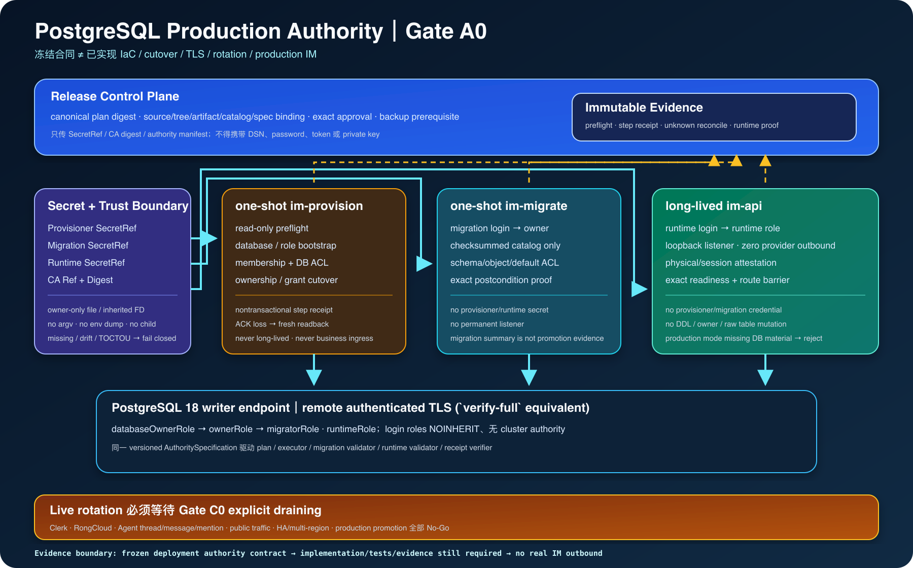

# PostgreSQL Production Authority 与部署合同 v1

> 状态：Gate A0 冻结合同；实现与生产证据未完成
>
> 适用分支：`dev_wanwork_quantum_entanglement`，不合并 `main`
>
> 唯一串行顺序源：[`IMPLEMENTATION_PLAN.md`](IMPLEMENTATION_PLAN.md)
>
> 当前代码证据基线：`53dd38b4224003a415605074f25470405ebe799e`

## 1. 结论与边界

本文冻结 WanWork 原生 IM 第一个可审计 PostgreSQL deployment authority 单元。它把已有 strict connection
policy、exact authority validator、attested runtime pool 和 one-shot migrator 接到一个可实现、可失败关闭、
可产生 receipt 的 production contract 上。

本文不是 production IaC、运行记录、HA 证明、恢复证明或真实 IM 放行单。当前事实必须按下表表达：

| 标记 | 当前结论 |
|---|---|
| `[F]` | 代码已有 PostgreSQL 18 migration catalog、exact access validator、runtime attestation、API readiness/route barrier 与独立 `im-migrate`。 |
| `[C]` | 本文冻结 Gate A0 的支持拓扑、责任、plan/receipt/secret/cutover/rollback 合同。实现只有通过本文验收矩阵后才可升级为事实。 |
| `[A]` | 先完成一个受控 deployment cell，再扩到 HA/多 cell，可减少在身份、provider 与恢复都未闭合时同时扩大故障面。 |
| `[U]` | clean Linux 安装、production artifact/IaC、remote TLS、cutover executor、secret file injection、rotation、恢复和 HA 均未完成。 |

本文只打开数据库 deployment authority 的实现工作，不打开：

- Clerk trusted request context；
- conversation/action-time authorization；
- PostgreSQL production EventStore/outbox/projection；
- Agent Store、`agent_thread`、message、mention 或 Agent invocation；
- RongCloud inbound/outbound、群创建、邀请或发消息；
- 公网 ingress、客户数据或 production promotion。

## 2. 研究输入与产品约束

### 2.1 一级研究输入

本文直接吸收下列本机研究快照，不把研究主张改写成已实现能力：

- `execute/infinite/data/arc.md`：冻结跨端组件选型；它只说明逻辑组件，不证明 network zone、TLS、secret、
  failure domain、HA 或 rollback；
- `automation/2026/05_08/1/2output/more/sandbase-harness/research_report.md`：有 Vault/加密不等于 runtime
  wiring；rotation 需要双版本、consumer acknowledgement 与 rollback；数据库、secret key、artifact 和日志
  需要独立备份/恢复责任；没有正式 deployment artifact contract 不能宣称 production topology；
- `automation/2026/05_08/1/2output/more/tech-agent-security-governance/research_report.md`：credential 应由
  trusted boundary 注入，model 不得看到 refresh token/主密钥；更新必须经过 capability/security diff、
  sandbox canary、monitor 与 rollback；事故恢复先 revoke/rotate、reconcile，再从 known-good 小流量恢复；
- `automation/2026/05_08/1/2output/more/protocol-acp-dual/research_report.md`：version pin、canary、rollback、
  evidence 是跨版本 adapter/deployment 的硬门禁。

### 2.2 已有代码约束

Gate A0 必须复用而不是旁路：

- `migrations.AuthorityAccessManifest` 的 exact role/login identity；
- `ValidateAuthorityAccess` 与 `ValidateRuntimeAuthorityAccess`；
- migration catalog 的版本、checksum、schema digest 与 postcondition；
- `connectionpolicy` 的 canonical parse、remote `verify-full` 等价约束和 ambient override 拒绝；
- `runtimepool` 的 physical/session attestation；
- API 对 migration/provisioner credential inheritance 的 presence-based 拒绝；
- 业务 route 的 dependency-before-effect fail-closed。

production executor 不得从 integration test helper 复制角色、object 或 ACL 清单。validator、plan、executor 和
receipt 必须消费同一个 versioned authority specification；否则一方新增对象而另一方漏授权会形成隐式漂移。

## 3. 受支持部署单元

### 3.1 Gate A0 支持范围

第一个支持单元定义为 `postgres-authority-cell/v1`：

- 一台受管 Linux host 上一个非 root、单活 `im-api` 进程；
- 同一 release artifact 提供独立 one-shot `im-provision` 与 `im-migrate`；
- 一个 PostgreSQL 18 writer endpoint；可以是受管服务，但必须有稳定 DNS、remote authenticated TLS、备份与
  session termination 管理面；
- API 只监听 numeric loopback，由同机受信代理承接未来 ingress；Gate A0 不开放公网或业务流量；
- 默认全出站拒绝，只允许 PostgreSQL endpoint 和已批准的 observability sink；Clerk/RongCloud 仍关闭；
- 单一 region、单一 deployment cell、单一 active API generation；不宣称 HA、zero downtime 或 multi-region。

这个单元是后续 HA cell 的可验证基元，不是最终商用范围的替代品。进入一般可用性前仍必须完成：

- 至少两个 API failure domain、受控 rolling drain 与负载均衡；
- PostgreSQL HA/failover、备份恢复、RPO/RTO 实测；
- Gate B/C/D、W3、跨端客户端和完整 W2 领域对象；
- 真实 provider sandbox 及用户对具体 outbound 的单独授权。

### 3.2 逻辑与网络拓扑



### 3.3 连接矩阵

| Source | Destination | Port/transport | 身份与 TLS | 当前 Gate A0 policy | Owner |
|---|---|---|---|---|---|
| operator | deployment controller | local/approved control API | human SSO + approval receipt | 只提交 plan digest，不接触 DB secret value | Release owner |
| secret manager | exact process | owner-only file/FD | workload identity；material 不进 argv/log | 每个 phase 独立 secret ref；禁止共享全量 bundle | Security owner |
| `im-provision` | PostgreSQL | TCP 5432 | provisioner login + `verify-full` | one-shot；无业务 ingress；执行后 material 销毁 | DBA owner |
| `im-migrate` | PostgreSQL | TCP 5432 | migration login → owner role + `verify-full` | one-shot；只执行 checksummed catalog | Schema owner |
| `im-api` | PostgreSQL | TCP 5432 | runtime login → runtime role + `verify-full` | long-lived；只经 attested pool；无 DDL/owner authority | IM runtime owner |
| local proxy | `im-api` | loopback TCP | same-host trust；Gate B 后再加 verified user context | Gate A0 只允许 health/readiness 验收 | Platform owner |
| any IM process | Clerk/RongCloud/Internet | none | none | 默认拒绝；不得以连通性测试为由临时放开 | Security owner |

任何新增 source、destination、port、egress domain、proxy、sidecar 或 credential consumer 都必须变更 topology
format version 或产生 reviewable capability diff；不能只改防火墙或 Helm value。

## 4. Linux 进程与 artifact 合同

### 4.1 进程身份

| 进程 | Linux identity | 生命周期 | 允许读取 | 明确禁止 |
|---|---|---|---|---|
| `im-provision` | dedicated one-shot service identity | plan 一次执行/对账后退出 | plan、authority spec、provisioner secret、CA bundle | runtime/migration/provider secret、业务流量、常驻监听 |
| `im-migrate` | dedicated one-shot service identity | migration 一次执行后退出 | manifest、migration secret、CA bundle | provisioner/runtime/provider secret、常驻监听 |
| `im-api` | dedicated non-root service identity | long-lived | runtime secret、authority manifest、CA bundle | provisioner/migration secret、Docker socket、host home、cloud CLI state |

production unit 必须证明：

- binary/artifact digest、source commit、Go toolchain、dependency locks、SBOM 和 signature/provenance 可回读；
- 使用绝对路径、固定 working directory、只读 binary/config，写目录最小化；
- `NoNewPrivileges`、private temporary directory、受限 filesystem/device/capability、受控 resource limit；
- 不继承 login shell、`PG*`、proxy、cloud、SSH、home、package manager 或 debug 环境；
- 缺 production mode、plan、manifest、secret ref 或 CA trust 时在监听前拒绝；
- `SIGTERM` 有界退出；退出不能被写成旧 credential 已 revoke 的证据。

### 4.2 IaC 布局与所有权

Gate A0 的实现应只维护一个 canonical target，避免 Terraform、Helm、Compose 与手工 shell 四套真相源：

```text
deploy/postgres-authority-cell-v1/
  topology.json
  authority-cutover-plan.json
  systemd/
  firewall/
  secret-refs/
  verification/
```

IaC 必须：

- 从 clean Linux VM/host 可重复安装；
- 只引用 secret identity，不嵌入 value、DSN、token 或 private key；
- plan/diff 默认无写入，apply 需要 exact digest approval；
- 产出 machine-readable inventory，与本文连接矩阵和 cutover plan diff 为零；
- destroy 不自动删除数据库、backup、receipt 或审计证据；数据处置需要单独批准；
- rollback artifact 与当前 artifact 同时可取，且 rollback 不自动执行不可逆 schema down。

## 5. PostgreSQL authority specification

### 5.1 身份类型

v1 authority graph 有且只有：

- `databaseOwnerRole`：NOLOGIN authority root；数据库 owner 和 membership grantor；
- `ownerRole`：NOLOGIN schema/object owner；
- `migratorRole`：NOLOGIN role，只允许 migration login `SET ROLE` 链路；
- `runtimeRole`：NOLOGIN least-privilege role，只允许 runtime login `SET ROLE` 链路；
- `migrationLoginRoles[]`：LOGIN、NOINHERIT、无 superuser/create role/create DB/replication/bypass RLS；
- `runtimeLoginRoles[]`：LOGIN、NOINHERIT、同样无 cluster authority。

角色不得有未声明 membership、role/database setting、valid-until 特例、connection limit 特例、PUBLIC
grant、grant option 或额外对象权限。login role 必须按 credential generation 唯一命名；rotation 不覆盖同名
password。

### 5.2 单一 specification

实现必须公开一个 immutable、可 canonicalize 的内部 `AuthoritySpecification`，内容至少绑定：

- format/version；
- PostgreSQL major；
- database/schema/relation/function/default privilege inventory；
- owner、grantee、grantor、privilege、grantable、membership options；
- migration catalog digest 与 authority manifest digest；
- executor/validator compatibility version。

`ValidateAuthorityAccess`、`ValidateRuntimeAuthorityAccess`、cutover plan builder、executor 与 receipt verifier
必须引用同一个 specification。specification 语义变化必须改变 digest；不得在 executor 中维护第二份 SQL
字符串清单。

## 6. Secret 与 trust lifecycle

### 6.1 Secret inventory

| Secret class | Consumer | 权限 | 存活范围 | Backup/DR | Rotation owner |
|---|---|---|---|---|---|
| provisioner credential | `im-provision` only | database/role/bootstrap authority | one-shot window | 不进入应用备份；DR 由 DBA 控制面恢复 | DBA/Security |
| migration credential | `im-migrate` only | `SET ROLE owner`，无 cluster authority | migration window | 独立于数据库备份 | Schema/Security |
| runtime credential generation N | `im-api` only | `SET ROLE runtime` | active service generation | 独立于数据库备份 | SRE/Security |
| PostgreSQL CA bundle | all DB clients | trust anchor，不是 credential | approved trust generation | 可备份公开证书；digest 必须验证 | Platform Security |

Clerk、RongCloud、model 和 tool secrets 不属于 Gate A0，必须保持 absent；不得为了“预留”把空值或测试 key
注入进 production unit。

### 6.2 注入合同

production mode 禁止完整 credential-bearing DSN 作为普通环境变量。首个实现使用 hardened owner-only file
provider 或 inherited FD：

- 配置只保存 `SecretRef`、endpoint identity、CA ref/digest 和非秘密 authority manifest；
- secret path 必须绝对、非 symlink、非 hardlink、regular file、owner/mode 精确、大小有界；
- open 后核对 inode/device/owner/mode，读取有界字节，再从同一已打开 handle 使用；
- secret material 不进入 argv、process title、environment dump、public snapshot、error、log、metric、trace、
  event、plan、receipt、evidence、HTML、截图、Notion 或 Git；
- process 不向 child process 继承 secret FD/material；
- 读取失败、空值、尾随 JSON/URL、未知字段、permission/owner 漂移全部 fail closed；
- 本地测试 raw env 兼容路径必须由显式 non-production mode 开启，不能成为 production fallback。

### 6.3 Rotation contract

Gate A0 只冻结 rotation contract；live rotation 必须等 Gate C0 explicit draining 完成后执行。状态机固定为：

```text
planned
  -> new_login_provisioned
  -> new_secret_available
  -> new_pool_attested
  -> new_generation_ready
  -> admission_draining
  -> old_pool_drained_or_bounded_abort
  -> old_backends_terminated
  -> old_membership_and_login_revoked
  -> old_reconnect_negative_proof
  -> committed
```

每一步绑定 plan digest、old/new generation、actor、started/completed time、before/after readback digest 和 receipt。
任何 unknown result 进入 `reconcile_required`，只允许 readback，不得盲目重放。新 generation 失败时可以在旧
credential 尚未 revoke 前回滚；一旦 revoke，恢复只能生成新 generation，禁止恢复旧 password。

HTTP graceful shutdown 只证明 listener drain，不证明 DB pool 已替换、旧 backend 已 terminate、旧 membership
已撤销或旧 credential 不能重连。

## 7. Authority cutover plan v1

### 7.1 Plan 必须绑定

canonical plan 至少包含：

- `format` 与 `planId`；
- source commit/tree、release artifact digest、migration catalog digest；
- authority specification digest 与 authority manifest；
- deployment/cell/database/server identity、PostgreSQL major、TLS profile、CA ref/digest；
- secret refs 和 credential generation metadata，不含 material；
- from/to schema version 和 non-empty classification；
- ordered steps、transaction class、required executor identity、pre/postcondition digest；
- backup prerequisite、rollback boundary、abort condition、evidence destination；
- expiry、approval identity/ref 与 exact plan digest。

JSON decoder 必须拒绝未知字段、duplicate key、trailing value、非 UTF-8、非 canonical identity、隐式默认、
nil/empty 混淆和超限输入。字段顺序或无语义集合顺序变化不改变 canonical bytes；任一语义变化必须改变 digest。

### 7.2 Phase 分离

| Phase | Executor | 事务性 | 允许动作 | Receipt |
|---|---|---|---|---|
| preflight | provisioner read-only | read-only repeatable read + cluster readback | identity/version/database/role/object/backup/plan drift 检查 | `PreflightReport` |
| bootstrap | provisioner | 逐步；部分 cluster 动作非事务 | database、roles、membership、database ACL | per-step receipt + reconcile |
| migrate | migration login → owner | migration transaction/ledger rules | checksummed migration、schema/object/default ACL | migration state digest |
| cutover | provisioner + owner，职责分离 | 可事务动作成组；非事务逐步 | ownership/grant exact convergence | transactional + step receipts |
| runtime proof | runtime login → runtime | read-only | attested `Open/Ready`、route barrier | readiness evidence |

executor 不得自动删除 unexpected object/role/grant 以“修复”环境。发现 plan 外状态固定 fail closed，保留证据并
要求新的 disposition plan。

### 7.3 Cutover 状态机

```text
draft
  -> canonically_validated
  -> approved
  -> preflight_passed
  -> backup_attested
  -> bootstrap_reconciled
  -> migrations_applied
  -> transactional_cutover_committed
  -> nontransactional_steps_reconciled
  -> migration_exact_validated
  -> runtime_attested
  -> completed
```

`failed_known_rollback`、`result_unknown`、`reconcile_required`、`aborted_drift` 是终止/暂停状态，不得压成一个
generic error。receipt 证明系统观察到的 boundary，不证明外部平台状态或人类审批合法性。

## 8. Receipt 与 unknown-result 规则

每张 receipt 必须：

- 使用固定 format/version 和 step ID；
- 绑定 plan/spec/catalog/source/artifact digest；
- 绑定 deployment/database/server identity 和 executor role identity；
- 记录 before/after readback digest、known/unknown、started/completed time；
- 只包含 secret ref/fingerprint，不含 DSN、password、token、private key 或 raw environment；
- 可独立 canonicalize、hash、验证，并进入 append-only evidence destination。

对事务外 `CREATE/ALTER ROLE`、database ownership、backend termination、NOLOGIN/revoke 等步骤：

1. 先写 intent/step identity；
2. 执行一次；
3. 连接/ACK 丢失时标记 unknown；
4. 用全新只读连接按 exact postcondition readback；
5. 只有 readback 证明完成才补完成 receipt；
6. readback 证明未执行才允许同 step ID 重试；
7. 仍不确定时冻结 cutover，不生成新 plan ID 逃避冲突。

## 9. Rollback、backup 与恢复责任

### 9.1 Rollback 不变量

- code rollback 与 schema down 是两个批准动作；old binary 不支持 current schema 时不得强启；
- 已提交非空数据不能靠重建空库冒充 rollback；
- ownership/ACL rollback 必须读取 exact before state，不能恢复为“常见默认”；
- secret revoke 后不恢复旧 value；生成新 generation；
- 数据库 rollback 不等于 RongCloud、Clerk 或未来 tool side effect rollback；外部 effect 需要 receipt、
  reconcile/compensation；
- plan/artifact/receipt/evidence 永远保留，不因 application rollback 删除。

### 9.2 责任矩阵

| 资产/动作 | Accountable | Responsible | Reviewer | 必需证据 |
|---|---|---|---|---|
| topology/IaC | Platform owner | Release engineering | Security/SRE | clean-host plan/apply inventory |
| role/database bootstrap | DBA owner | one-shot provisioner | Security/Schema owner | preflight + per-step receipts |
| schema migration | Schema owner | one-shot migrator | DBA/IM owner | catalog/checksum/postcondition |
| runtime readiness | IM runtime owner | `im-api`/SRE | DBA | attested pool + route barrier |
| secret storage/injection | Security owner | platform secret manager | SRE/DBA | access audit + canary scan |
| CA/trust bundle | Platform Security | PKI/platform | DBA/SRE | cert chain/digest/expiry tests |
| backup/restore | DBA/SRE | managed DB/platform | Security/IM owner | dump/restore and RPO/RTO drill |
| cutover approval | Release owner | deployment controller | DBA/Security/IM owner | exact plan digest approval |
| rollback decision | Incident/Release owner | SRE/DBA | Security/Product | abort signal + reconciliation |

无 owner、无 backup proof、无 exact plan approval 或 receipt destination 不可用时，cutover 必须在写入前失败。

## 10. Gate A0 验收矩阵

> 2026-08-29 本地实现进度：authority specification/digest、canonical plan、自绑定 digest 和 strict decoder
> 已由 production Go code 交付并通过全包 normal/race/vet、PG18 integration zero-skip。详细证据见
> [W2_POSTGRES_CUTOVER_PLAN_CHECKPOINT.md](W2_POSTGRES_CUTOVER_PLAN_CHECKPOINT.md)。preflight、executor、
> receipt/reconcile、secret provider、remote TLS 与 clean-host IaC 仍为 No-Go。

### 10.1 合同与单元测试

- plan strict decode、canonical bytes、golden digest；
- key/array 重排、未知字段、duplicate key、截断、trailing value、Unicode、大小上限；
- source/tree/artifact/catalog/spec/manifest/DB/server/TLS/secret generation 任一漂移；
- role 交叉复用、duplicate membership、错误 grantor/options、PUBLIC/column/default ACL、额外 object；
- plan/receipt/error/string/repr/JSON 的 secret canary 为零。

### 10.2 PostgreSQL 18 integration

- empty database：preflight → bootstrap → migrate → cutover → migration validator → runtime `Open/Ready`；
- non-empty `0004 → 0005`：保留 tenant/conversation/membership/access/receipt 数据并 typed readback；
- repeated/concurrent same-plan 只有一个 owner；different digest 冲突；
- 每个事务和事务外 boundary 的 rollback、disconnect、commit/ACK unknown 与 fresh readback reconcile；
- rogue role/setting/membership、wrong grantor、PUBLIC/TEMP/MAINTAIN、column/default ACL、额外 relation/function；
- future schema、old binary、wrong database/server identity；
- runtime login 无 DDL、owner、migration、raw table mutation authority。

### 10.3 Remote authenticated TLS

- 私有 CA + 正确 DNS hostname 正向握手；
- wrong hostname、wrong root、expired/not-yet-valid、incomplete chain、server downgrade；
- ambient `PG*`、`SSL_CERT_FILE`、`SSL_CERT_DIR` 和 default client cert/passfile override；
- CA generation 切换的 old/new overlap、consumer acknowledgement 和 rollback；
- numeric loopback `sslmode=disable` 只算本地测试，不算 remote TLS 证据。

### 10.4 Secret provider

- regular file、owner、mode、absolute path、size、newline/encoding；
- symlink、hardlink、FIFO/device、world/group-readable、owner mismatch、replace/read TOCTOU；
- process argv/env/status/log/error/receipt/evidence 的 canary 为零；
- child process/diagnostic endpoint 不继承 material；
- production mode 缺 secret/manifest/CA 时监听前拒绝，且不回退 raw env。

### 10.5 Clean-host 与供应链

- clean Linux VM 安装、非 root、只读 filesystem、默认 deny egress；
- Go normal/race/vet、PG18 zero-skip、`go mod verify`；
- binary checksum、SBOM、dependency/license inventory、source/artifact binding；
- `SIGTERM` 有界退出、disk full、receipt destination unavailable、DB unavailable；
- 原始 machine-readable test evidence 绑定 exact Git SHA，明确本地/CI/production evidence 等级。

## 11. 完成定义与 No-Go

只有以下全部成立，Gate A0 才可完成：

1. topology/IaC inventory 在 clean host 可复现，和 canonical topology diff 为零；
2. authority specification、plan、digest、preflight、executor、receipt/reconcile 都使用生产代码；
3. empty/non-empty、drift、unknown-result 与 remote TLS 矩阵全部零 skip 通过；
4. production secret 只经 hardened provider 注入，API 永不继承 provisioner/migration material；
5. runtime exact readiness 通过，旧/错误 authority 全部 fail closed；
6. 文档、HTML、图、测试日志、JSON evidence、Git SHA 和远端分支互相可追溯；
7. 独立审计未发现 P0/P1 未处置缺口。

即使 Gate A0 完成，仍然是：

- production IM：No-Go；
- Clerk trusted tenant：No-Go；
- RongCloud inbound/outbound：No-Go；
- Agent Store/mention/child group：No-Go；
- live credential rotation：No-Go，直到 explicit draining 完成；
- HA/多 region/GA：No-Go，直到后续 deployment/recovery gate 有实测证据。
